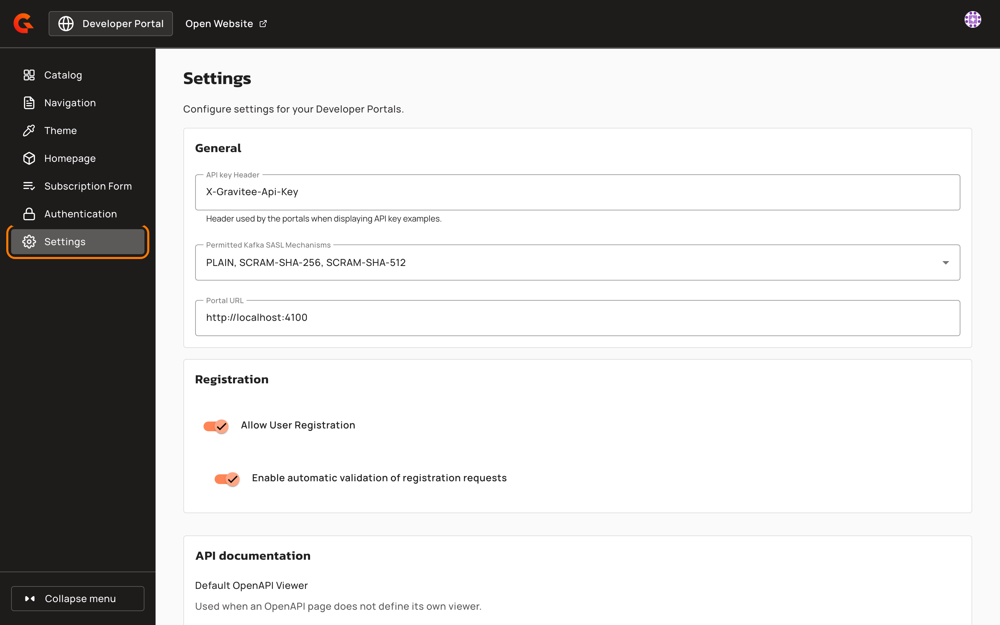
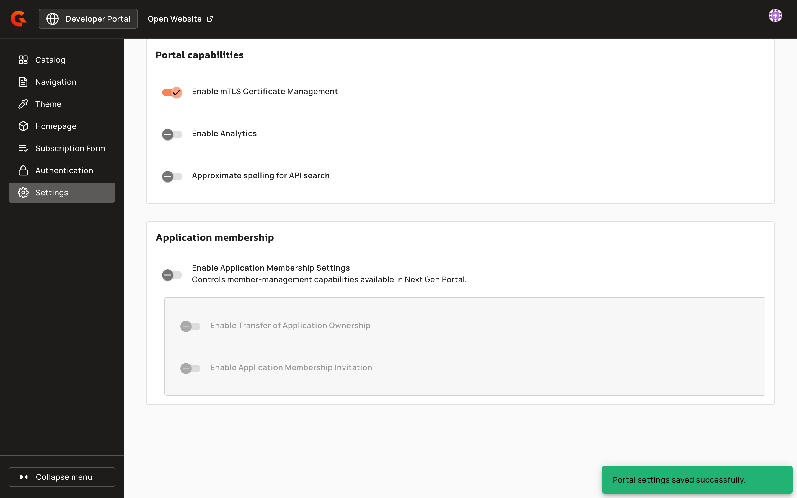

# Configure New Developer Portal settings

## Overview

The **Settings** page of the Portal Settings holds the settings of your Developer Portals for the current environment, so you configure the New Developer Portal from the Portal Settings.

The API key header, the Portal URL, the two registration settings, and the default OpenAPI viewer are also on the **Settings** page of the Console, in its **Portal** section. Both pages change the same values, so a change that you save on one page shows on the other the next time you open it.

## Prerequisites

* The New Developer Portal is enabled for the environment. The **Portal Settings** entry of the Console sidebar appears only when it is. For more information, see [Enable the New Developer Portal](configure-the-new-portal.md).
* Your role has read access to the environment settings to open the page, and update access to change a setting. With read access only, the page is read-only.

## Change the settings

1.  In the Console sidebar, click **Portal Settings**. The Portal Settings open in a new browser tab.

    <figure><figcaption>
Portal Settings in the Console sidebar
</figcaption></figure>
2.  Click **Settings**.

    <figure><figcaption>
The Settings page of the Portal Settings
</figcaption></figure>
3. Change the settings you need. For details about each section, see [Settings reference](#settings-reference).
4. Click **Save**.

The **Open Settings** button in the **New Developer Portal** section of the Console **Settings** page opens this page too.

## Settings reference

The page groups its settings into the following sections:

<table>
    <thead>
        <tr>
            <th width="200">Section</th>
            <th>Details</th>
        </tr>
    </thead>
    <tbody>
        <tr>
            <td><strong>General</strong></td>
            <td><strong>API key Header</strong> changes the header name in the API key examples of the Developer Portals. It doesn't change the header that the Gateway reads. <strong>Permitted Kafka SASL Mechanisms</strong> sets the SASL mechanisms that the New Developer Portal offers under <strong>Review Kafka Properties</strong> for an API Key plan of a native Kafka API. By default, it offers <code>PLAIN</code>, <code>SCRAM-SHA-256</code>, and <code>SCRAM-SHA-512</code>.</td>
        </tr>
        <tr>
            <td><strong>Registration</strong></td>
            <td>With <strong>Enable automatic validation of registration requests</strong> turned off, a new account stays pending until an administrator accepts or rejects the registration request.</td>
        </tr>
        <tr>
            <td><strong>API documentation</strong></td>
            <td>A viewer that's turned off in the <strong>OpenAPI viewers</strong> settings of the Console <strong>Settings</strong> page can't be selected as <strong>Default OpenAPI Viewer</strong>. To make it the default, turn it on there first.</td>
        </tr>
        <tr>
            <td><strong>Portal capabilities</strong></td>
            <td>Appears only with an Enterprise license. For more information, see <a href="configuring-mtls-certificate-management-administrator-guide.md">Configure mTLS certificate management (administrator guide)</a>, <a href="portal-analytics-configuration-reference.md">Portal analytics configuration reference</a>, and <a href="../typo-tolerant-api-search.md">Typo-tolerant API search</a>.</td>
        </tr>
        <tr>
            <td><strong>Application membership</strong></td>
            <td>Appears only with an Enterprise license, and stays read-only until you enable the New Developer Portal. <strong>Enable Transfer of Application Ownership</strong> and <strong>Enable Application Membership Invitation</strong> are available only while <strong>Enable Application Membership Settings</strong> is on, and they keep their values while it's off. For more information, see <a href="../../secure-and-expose-apis/applications/user-and-group-access.md">User and Group Access</a>.</td>
        </tr>
    </tbody>
</table>

A setting that your installation's configuration defines can't be changed from this page or from the Console **Settings** page. Its tooltip reads **Configuration provided by the system**.

## Verification

To verify your settings are saved, follow these steps:

1.  After you click **Save**, check that the **Portal settings saved successfully.** message appears.

    <figure><figcaption>
The confirmation after a save
</figcaption></figure>
2. Reload the page, and then check that each setting you changed shows its new value.
