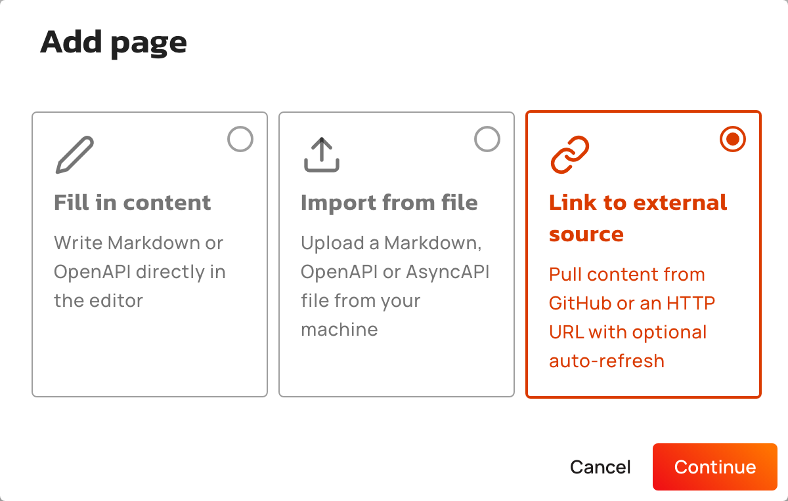
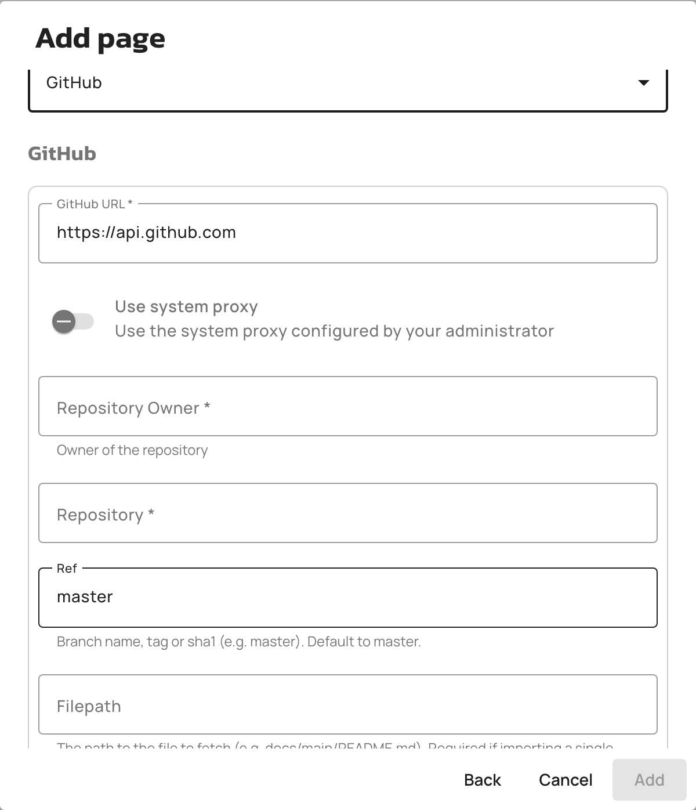
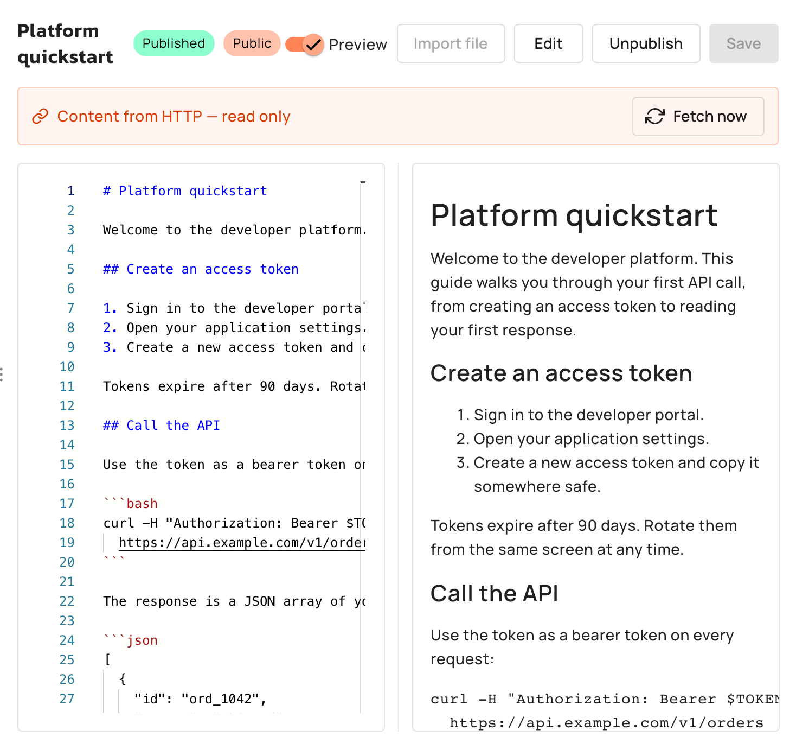
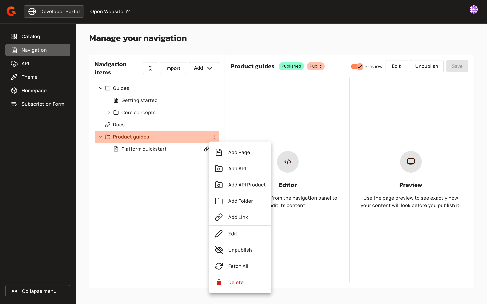
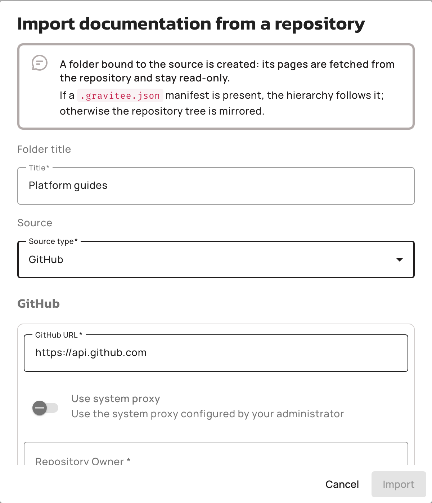
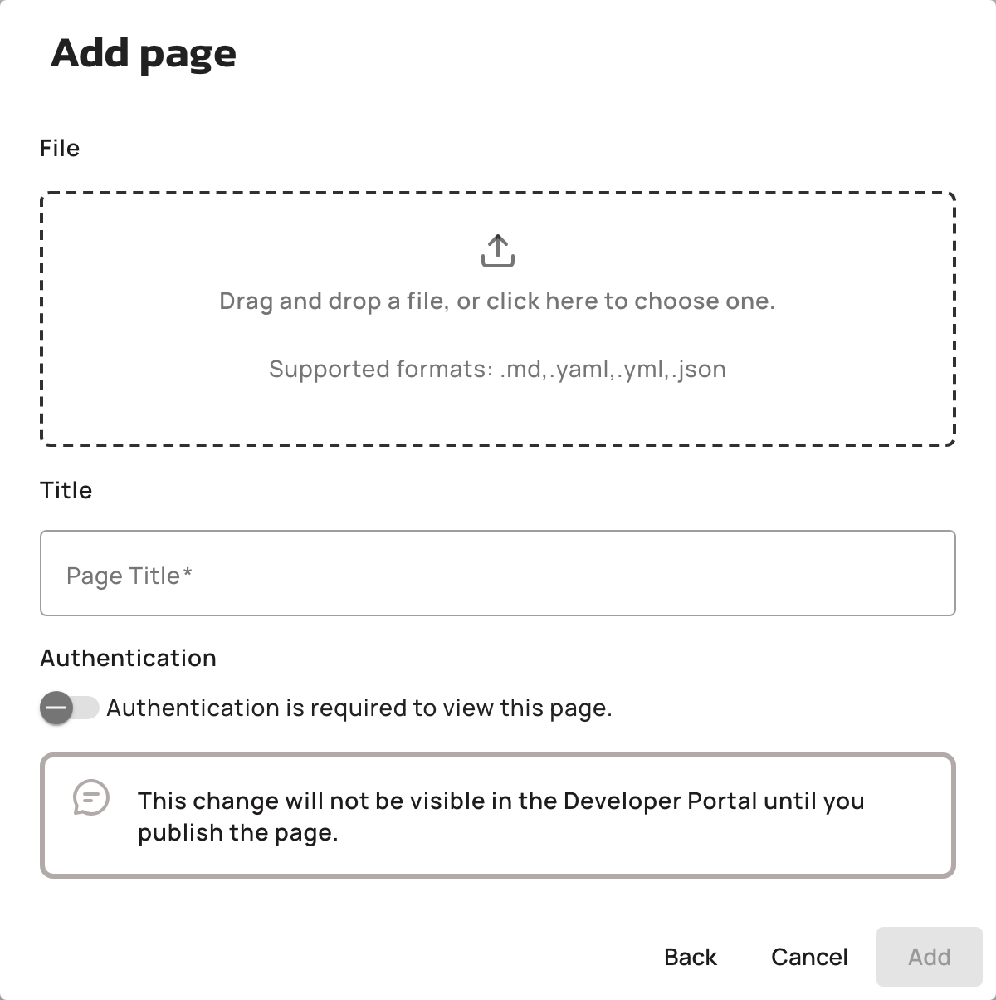
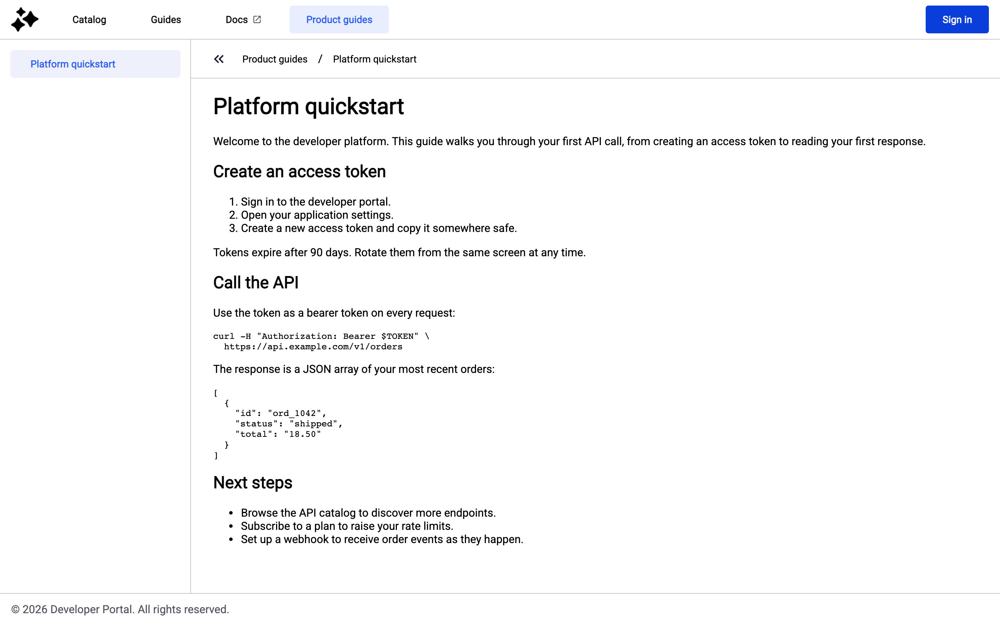

# Import content from external sources

## Overview

In the New Developer Portal, a navigation page doesn't need its content written in the built-in editor. You link a page to an external source, and APIM fetches the content from that source instead. This keeps your portal documentation tied to the repository or URL where it already lives.

Linking content to external sources gives you the following capabilities:

* Link a page to an external source, so its content comes from a Git repository or an HTTP URL instead of the editor.
* Re-fetch the content on demand with **Fetch now** and **Fetch All**, or on a schedule with auto-fetch.
* Import a whole documentation tree from a remote repository into a folder that stays in sync with it.
* Import the content of a single page from a local file, as a one-time operation with no link to a source.

The available source types are the fetcher plugins deployed with your Management API. APIM bundles the GitHub, GitLab, Git, Bitbucket, and HTTP fetchers. The GitHub and GitLab fetchers also list repository directories, which makes them usable for the repository import and required for it.

A page that's linked to a source is read-only in the Console. Remove the source to edit the content again.

## Prerequisites

Complete the following steps before you link portal content to external sources:

* Enable the New Developer Portal. For more information, see [configure-the-new-portal.md](../configure-the-new-portal.md "mention").
* Open the **Navigation items** screen of the New Developer Portal settings. For the full path, see [customize-the-navigation.md](../customize-the-navigation.md "mention").

## Link a page to an external source

You link a page to a source when you create the page, or later by editing it. In both cases, the source configuration is the same.

### Link a new page to an external source

1. Click **Add**, and then click **Add Page**.
2.  In the **Add page** pop-up screen, select **Link to external source**.<br>

    <figure><figcaption><p>Content source choice when adding a page</p></figcaption></figure>
3. Click **Continue**.
4. Select a page type: **Markdown**, **OpenAPI**, or **AsyncAPI**.
5. In the **Page Title** field, type a title for the page.
6. In the **Source type** drop-down menu, select a fetcher.
7.  Fill in the configuration form of the fetcher you selected. Each fetcher has its own fields, for example the repository, branch, and file path for the GitHub fetcher.<br>

    <figure><figcaption><p>External source configuration</p></figcaption></figure>
8. Optional: Turn on the `Auto-fetch` toggle, and then set the **Update frequency** cron expression. For more information, see [#keep-content-in-sync-with-auto-fetch](import-content-from-external-sources.md#keep-content-in-sync-with-auto-fetch "mention").
9. Optional: Turn on the **Authentication is required to view this page.** toggle.
10. Click **Add**. APIM fetches the content from the source and creates the page with it.

### Link an existing page to an external source

1. Select the page in the **Navigation items** panel.
2. Click **Edit**.
3. Turn on the **Link to external source** toggle.
4. In the **Source type** drop-down menu, select a fetcher, and then fill in its configuration form.
5. Optional: Turn on the `Auto-fetch` toggle, and then set the **Update frequency** cron expression.
6. Click **Save**. The page becomes read-only and keeps its current content until the first fetch.
7. Click **Fetch now** in the banner above the editor to replace the content with the fetched content immediately.

### What changes for a sourced page

Once a page is linked to a source, the source owns its content:

*   The content editor becomes read-only, and a banner above it names the source, for example GitHub or HTTP.<br>

    <figure><figcaption><p>Read-only banner on a sourced page</p></figcaption></figure>
* The page keeps its title and its place in the navigation. Renaming or moving the page is rejected while the source is attached. The **Page Title** field in the edit dialog is disabled, with a hint that explains why.
* Deleting the page is rejected while the source is attached. Remove the source first, and then delete the page.
* Sensitive fields of the source configuration, for example a personal access token, are stored but never returned. The Console displays them as `********`. Saving the configuration with the masked value unchanged keeps the stored secret. If you change the source type, enter the secrets again.
* When a fetch fails, the page keeps its last fetched content, and a **Last fetch failed** banner displays the error. The date of the last successful fetch appears in the source editor.

## Remove an external source

Removing the source makes the page editable again. To remove the source from a page, complete the following steps:

1. Select the page in the **Navigation items** panel.
2. Click **Edit**.
3. Turn off the **Link to external source** toggle. A warning confirms that the content stops being fetched and becomes editable again.
4. Click **Save**.

The page keeps its current content, and you edit it in the content editor from then on.

## Fetch content manually

A manual fetch re-reads the source and updates the content immediately. Trigger it from a page or from any level of the tree above it:

* On a sourced page, click **Fetch now** in the read-only banner.
*   On a folder, an API, or an API Product, click the **ellipses** in the **Navigation items** panel, and then click **Fetch All**. This fetches every sourced page below that item. The menu entry appears only when there's a sourced page below the item, or when the folder was created by the repository import.<br>

    <figure><figcaption><p>Fetch All in the context menu</p></figcaption></figure>

A page that fails to fetch doesn't block the others. The result message reports how many pages were fetched and which ones failed, and each failing page records its error in its own **Last fetch failed** banner.

## Keep content in sync with auto-fetch

With auto-fetch, APIM re-fetches a sourced page on a schedule, without any manual action.

To enable it, turn on the `Auto-fetch` toggle in the source configuration, and then set the **Update frequency** cron expression. The cron expression is required when auto-fetch is enabled. The schedule is evaluated against the page's last fetch attempt, whether that attempt succeeded or failed.

The Management API runs one background job that processes every page with auto-fetch enabled, across all environments. This job paces all auto-fetch schedules: a page whose own cron expression is finer than the job's cron expression is only refreshed at the pace of the job. Configure the job in the Management API `gravitee.yml` file:

```yaml
services:
  portal_navigation_auto_fetch:
    enabled: true
    cron: "0 */5 * * * *"
```

<table>
    <thead>
        <tr>
            <th width="380">Property</th>
            <th>Description</th>
            <th>Default</th>
        </tr>
    </thead>
    <tbody>
        <tr>
            <td><code>services.portal_navigation_auto_fetch.enabled</code></td>
            <td>Enables the auto-fetch job for New Developer Portal navigation pages</td>
            <td><code>true</code></td>
        </tr>
        <tr>
            <td><code>services.portal_navigation_auto_fetch.cron</code></td>
            <td>Cron expression that paces the auto-fetch job</td>
            <td><code>0 */5 * * * *</code> (every 5 minutes)</td>
        </tr>
    </tbody>
</table>

This job is separate from the `services.auto_fetch` job that re-fetches Classic Developer Portal and API documentation pages. Each job has its own enablement flag and cron expression.

## Import a documentation tree from a repository

The repository import creates a folder that mirrors a documentation tree from a remote repository. The folder carries the source, its pages are fetched from the repository, and the whole subtree stays read-only.

### Run the import

1. In the **Navigation items** panel, click **Import**.
2.  In the **Import documentation from a repository** dialog, type a title for the folder in the **Title** field.<br>

    <figure><figcaption><p>Import documentation from a repository</p></figcaption></figure>
3. In the **Source type** drop-down menu, select a fetcher. The list offers only the fetchers that list repository directories. Of the fetchers bundled with APIM, these are the GitHub and GitLab fetchers.
4. Fill in the configuration form of the fetcher. Point the file path at the directory to import, for example `/` for the repository root. A configuration without a directory path lists no files, and the import fails.
5. Optional: Turn on the **Auto-fetch** toggle, and then set the **Update frequency** cron expression. Auto-fetch re-runs the import on that schedule.
6. Click **Import**. The result message reports how many pages were imported and which ones failed.

The folder is created at the root of the navigation, unpublished and with private visibility. Publish it to make the imported content visible in the New Developer Portal.

### How the hierarchy is built

The import builds the folder hierarchy in one of two ways:

* If the repository carries a `.gravitee.json` descriptor file, the descriptor drives the hierarchy. Each page entry names a source file, an optional page name, and an optional destination path. When the name is omitted, the file name without its extension is used. When the destination is omitted, the file's own directory path is used. The descriptor format is the same as for Classic Developer Portal documentation imports. For more information, see [api-documentation.md](../../classic-developer-portal/api-documentation.md "mention").
* Without a descriptor, the repository tree is mirrored as it's listed by the fetcher. Each directory becomes a folder, and each importable file becomes a page.

The import handles the listed files as follows:

* A `.md` file becomes a Markdown page.
* A `.yaml`, `.yml`, or `.json` file whose root object declares an `openapi` or `swagger` property becomes an OpenAPI page.
* A `.yaml`, `.yml`, or `.json` file whose root object declares an `asyncapi` property becomes an AsyncAPI page.
* When the tree is mirrored, a file with any other extension is ignored, and a `.yaml`, `.yml`, or `.json` file that's not a specification, for example a CI workflow, is skipped.
* When the descriptor names a file that's not one of the supported documents, that entry is reported as a failure.
* When two entries land on the same destination and title, the second entry is reported as a failure, so neither silently overwrites the other.

### Keep the folder in sync with the repository

Fetching the imported folder re-runs the import. Trigger it with **Fetch now** on the folder, with **Fetch All**, or on a schedule with auto-fetch. A re-run updates the pages that match by title, creates the pages added to the repository, and removes the previously imported items that no longer exist remotely.

The re-import protects your content in the following cases:

* Items are removed only when every entry of the run imported successfully. After a partial failure, items that weren't matched are kept until a run completes without failures.
* When the source lists no files, or none of the listed files is an importable document, the import run fails and the subtree is left untouched.

The imported subtree is read-only: creating, renaming, moving, or editing items below the folder is rejected while the folder keeps its source. Deleting the folder is also rejected while it keeps its source. Editing the folder lets you update or remove its source. Removing the source turns the folder and its pages into regular editable items. A directory-listing source is only ever attached to a folder by the import. Attaching one to an existing folder by editing it is rejected.

## Import page content from a local file

The file import fills a page's content from a file on your machine. It's a one-time operation: the page keeps no link to the file, and the content is editable afterward.

The supported file types are `.md`, `.yaml`, `.yml`, and `.json`, up to 10 MB. The page type is detected from the file: a `.md` file imports as Markdown, and a `.yaml`, `.yml`, or `.json` file imports as OpenAPI or AsyncAPI depending on the property its root object declares.

To import a file when you create a page, complete the following steps:

1. Click **Add**, and then click **Add Page**.
2. In the **Add page** pop-up screen, select **Import from file**.
3. Click **Continue**.
4.  Drag and drop the file into the file picker, or click the file picker to choose one. A banner confirms the detected page type.<br>

    <figure><figcaption><p>Import from file when adding a page</p></figcaption></figure>
5. In the **Page Title** field, type a title for the page.
6. Click **Add**.

To replace the content of an existing page, complete the following steps:

1. Select the page in the **Navigation items** panel.
2. Click **Import file**.
3. Choose the file on your machine.
4. In the **Replace page content** dialog, click **Replace content**. This replaces the saved content of the page and is irreversible.

## Verification

To verify that your external source works as expected, follow these steps:

1. Select the sourced page in the **Navigation items** panel. The content fetched from the source appears in the read-only editor.
2. Click **Fetch now**. A message confirms that the content was fetched from the external source.
3. Publish the page, and then click **Open Website**.

The fetched content appears on the page in the New Developer Portal.


<figure><figcaption><p>Fetched content in the New Developer Portal</p></figcaption></figure>
