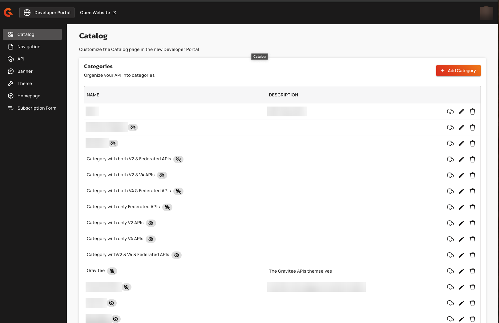
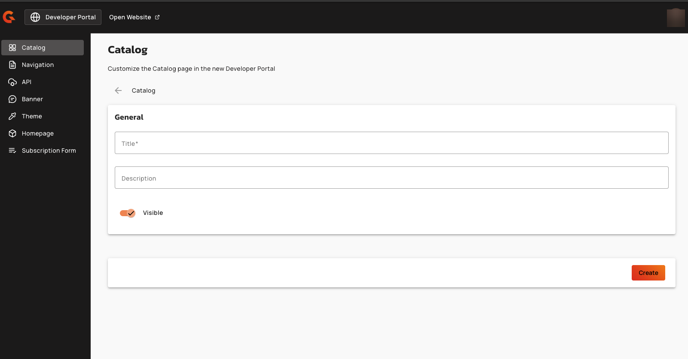
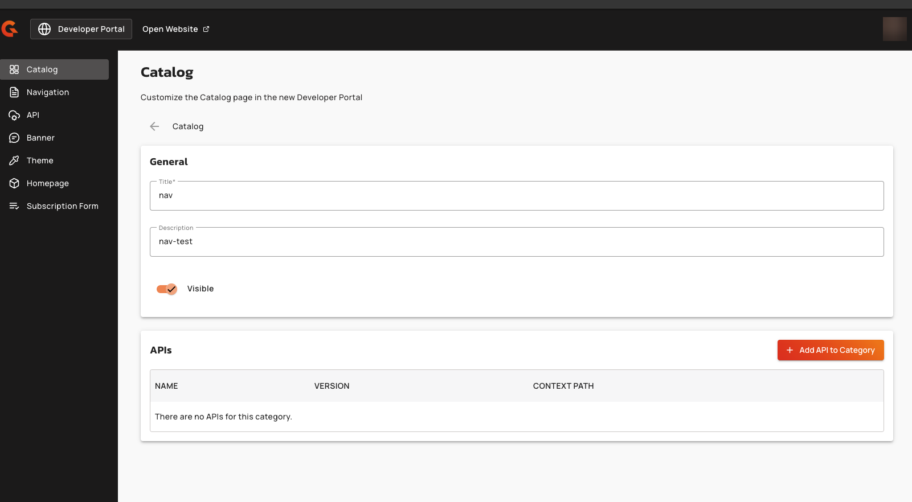
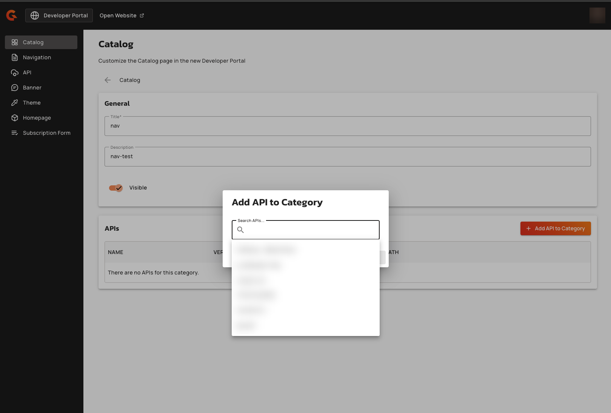
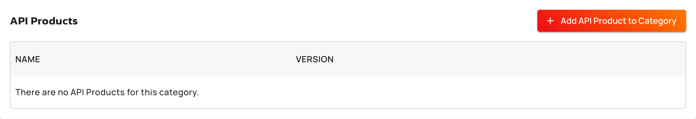
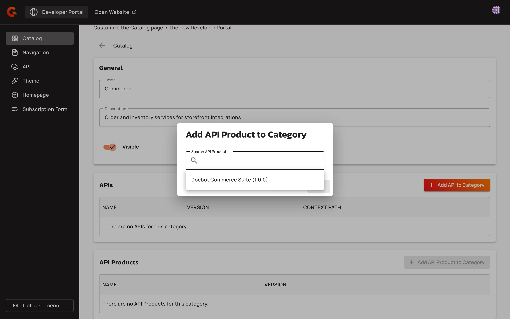
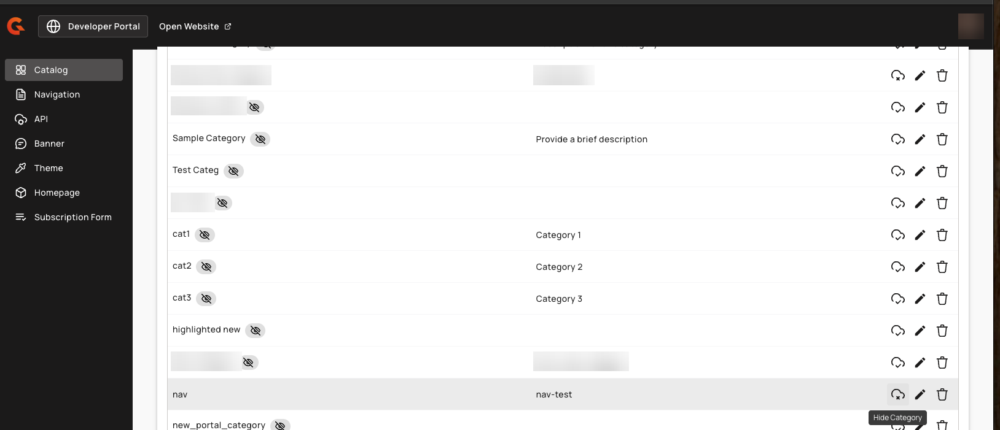
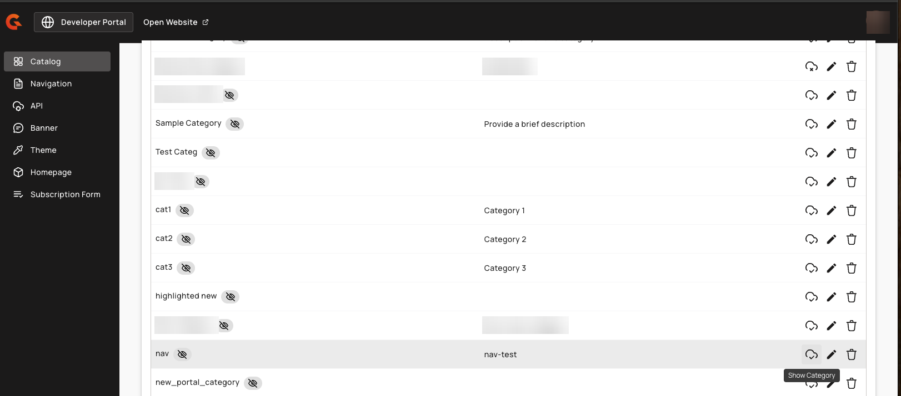

# Manage New Developer Portal categories

## Overview

A category groups related APIs and API Products in the New Developer Portal catalog. You create categories in the APIM Console, assign published APIs and API Products to them, and consumers then filter the catalog to one category at a time. An API or an API Product belongs to as many categories as you assign it to.

Categories are scoped to an environment. Each environment has its own set of categories.

The categories on this page drive the New Developer Portal catalog. They're stored and managed apart from the categories under **Categories** in the environment **Settings**. When you create, rename, hide, or delete a category on one screen, the other set is unchanged.

For the consumer-facing filter these categories drive, see [catalog.md](catalog.md "mention").

## Prerequisites

* Enable the New Developer Portal. For more information about enabling the New Developer Portal, see [configure-the-new-portal.md](configure-the-new-portal.md "mention").
* Add the APIs you want to categorize to the portal navigation and publish them. For more information, see [#customizing-your-navigation](customize-the-navigation.md#customizing-your-navigation "mention").
* Add the API Products you want to categorize to the portal navigation and publish them. For more information, see [#api-product](customize-the-navigation.md#api-product "mention").

## Create a category

1. Open **Portal Settings**.
2.  Click **Catalog**. The **Categories** list opens. 

    <!-- TODO: one screenshot per task — see style-guide/05-formatting-and-document-structure/images-and-figures.md -->
    <figure><figcaption>
Categories list under Catalog
</figcaption></figure>
3. Click **Add Category**.
4. In the **Title** field, type a title for the category. The title is required, and it can't match the title of a category that already exists in this environment. The check ignores case, so `Payments` doesn't pass when `payments` exists.
5. Optional: In the **Description** field, type a description.
6. Optional: Turn off the **Visible** toggle to keep the category out of the New Developer Portal. New categories are visible by default.
7.  Click **Create**. 

    <figure><figcaption>
Category details
</figcaption></figure>

The category opens for editing so you can add APIs to it.

## Add an API to a category

Only published API navigation items appear in the picker. An API that isn't published in the portal navigation can't be added to a category, and an API you already added to this category isn't offered again.

1. Open **Portal Settings**.
2. Click **Catalog**.
3. Click the **Edit** icon on the category row.
4.  In the **APIs** section, click **Add API to Category**. 

    <figure><figcaption>
APIs section of a category
</figcaption></figure>
5.  In the **Add API to Category** dialog, type part of the API title in the `Search APIs...` field, and then select the API from the list. 

    <figure><figcaption>
Add API to Category dialog
</figcaption></figure>
6. Click **Add**.

The API appears in the **APIs** table with its name, version, and context path.

## Remove an API from a category

The **APIs** table lists the APIs assigned to the category, including any that were unpublished after they were assigned, so you can see and undo an assignment.

1. Open **Portal Settings**.
2. Click **Catalog**.
3. Click the **Edit** icon on the category row.
4. In the **APIs** table, click the **Remove API** icon on the API row.
5. In the **Remove API** confirmation dialog, click **Remove**.

When you remove an API from a category, the API stays published. It remains in the catalog and loses only that category assignment.

## Add an API Product to a category

Only API Products published in the portal navigation appear in the picker. An API Product that isn't published in the portal navigation can't be added to a category, and an API Product you already added to this category isn't offered again.

1. Open **Portal Settings**.
2. Click **Catalog**.
3. Click the **Edit** icon on the category row.
4.  In the **API Products** section, click **Add API Product to Category**. 

    <figure><figcaption>
API Products section of a category
</figcaption></figure>
5.  In the **Add API Product to Category** dialog, type part of the API Product name in the `Search API Products...` field, and then select the API Product from the list. Each entry shows the name and the version of the API Product. 

    <figure><figcaption>
Add API Product to Category dialog
</figcaption></figure>
6. Click **Add**.

The API Product appears in the **API Products** table with its name and version.

## Remove an API Product from a category

1. Open **Portal Settings**.
2. Click **Catalog**.
3. Click the **Edit** icon on the category row.
4. In the **API Products** table, click the **Remove API Product** icon on the API Product row.
5. In the **Remove API Product** confirmation dialog, click **Remove**.

When you remove an API Product from a category, the API Product stays published. It remains in the catalog and loses only that category assignment.

## Hide a category from consumers

A hidden category doesn't appear in the New Developer Portal, so consumers can't filter on it. The APIs assigned to it stay in the catalog. A hidden category can be made visible again, and hiding it leaves every API assignment unchanged.

1. Open **Portal Settings**.
2. Click **Catalog**.
3.  Click the **Hide Category** icon on the category row. A crossed-out eye badge appears next to the category title, labeled **Hidden** on hover. 

    <!-- TODO: one screenshot per task — see style-guide/05-formatting-and-document-structure/images-and-figures.md -->
    <figure><figcaption>
Hide Category on a category row
</figcaption></figure>

To make the category available again, click the **Show Category** icon on the category row.

<figure><figcaption>
Show Category on a hidden category row
</figcaption></figure>

## Delete a category

1. Open **Portal Settings**.
2. Click **Catalog**.
3. Click the **Delete** icon on the category row.
4. In the **Delete Category** confirmation dialog, click **Delete**.

The category stops appearing in the New Developer Portal catalog filter. The APIs that were assigned to it stay in the catalog.

## Categories migrated from the Classic Developer Portal

The first time a Management API node starts on APIM 4.13, Gravitee copies the categories of the Classic Developer Portal into New Developer Portal categories, once per environment. Each Classic category becomes a New Developer Portal category that takes the Classic category's name as its title and keeps its description. Every API assigned to the Classic category is assigned to the new category.

The migration is a one-time copy, and the two sets are independent from that point on. When you edit a Classic category later, the New Developer Portal category it produced is unchanged. When you edit the New Developer Portal category, the Classic one is unchanged.

Two Classic category fields have no New Developer Portal equivalent and aren't copied: the category picture and the linked documentation page. Migrated categories are always created visible, whatever the Classic category's hidden setting was.

If a category or an API assignment can't be copied, the migration reports a failure and runs again on the next Management API startup. The rerun matches categories by title, so it completes the copy instead of creating duplicates.

## Verification

To verify that categories work as expected, complete the following steps:

1. Open **Portal Settings**.
2. Click **Catalog**.
3. Confirm the category appears in the list, without the crossed-out eye badge.
4. Click the **Edit** icon on the category row, and confirm the API appears in the **APIs** table.
5. Open the New Developer Portal.
6. Click **Catalog** in the portal navigation bar.
7. Open the **Category** dropdown in the catalog header, and then select the category. The catalog lists only the APIs and API Products assigned to that category.
