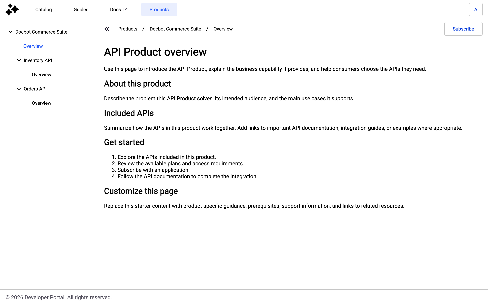
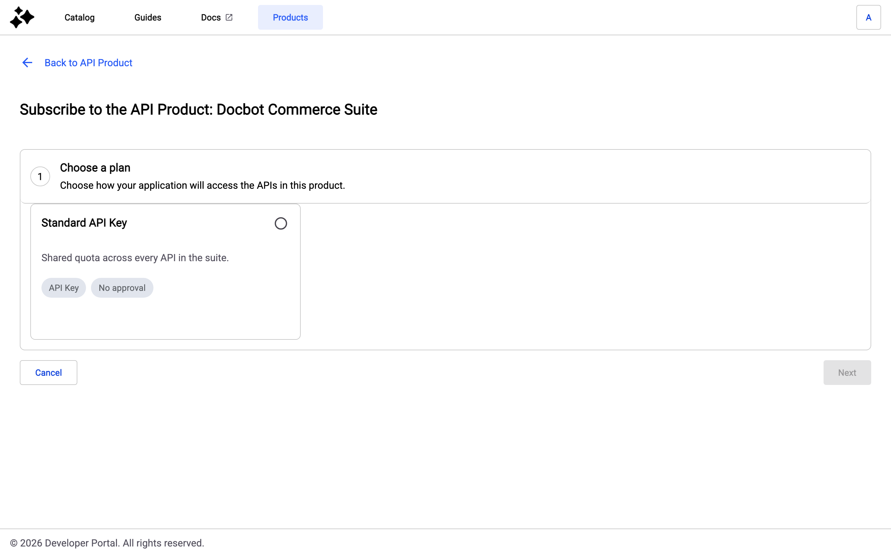
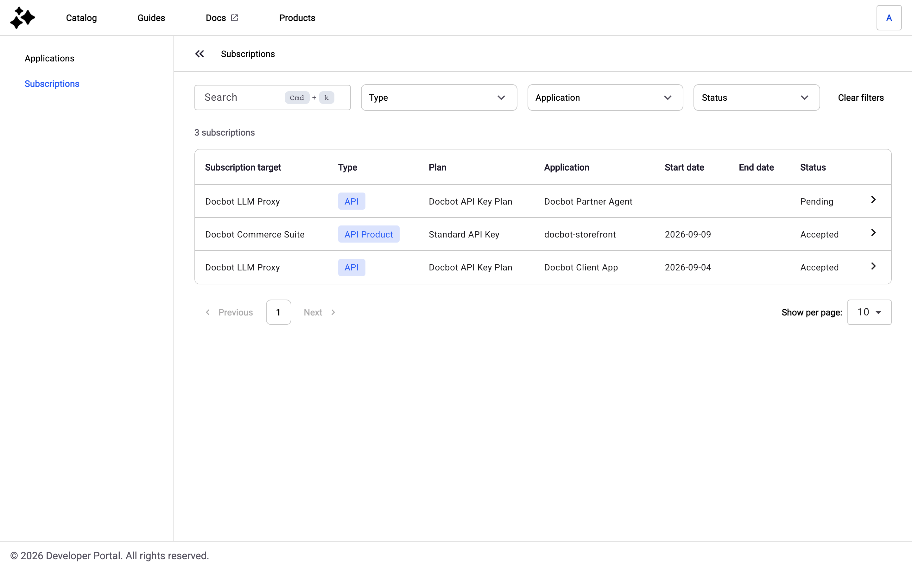
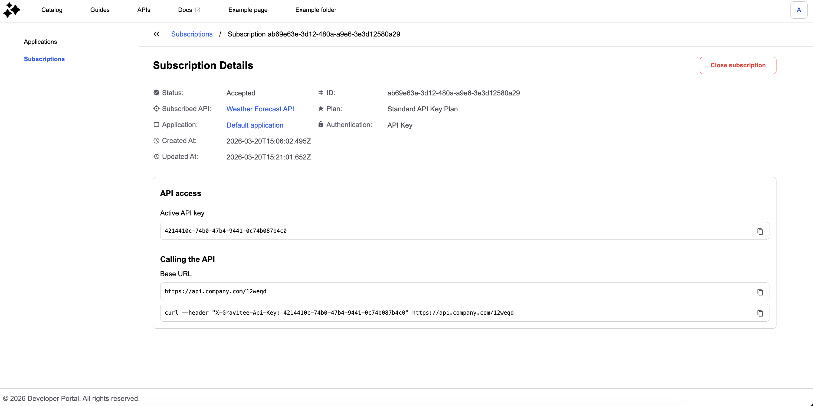
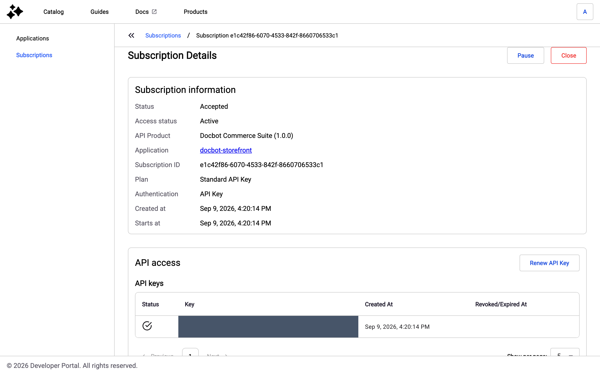
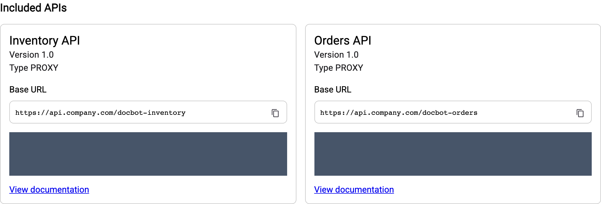

# Manage Subscriptions

### Overview 

You can subscribe to APIs and API Products and manage your subscriptions with the New Developer Portal. Unless the API has a keyless plan, a consumer must create an application and subscribe to a published API plan to access an API. Applications act on behalf of the user.

An API Product bundles several APIs under one subscription. When you subscribe to an API Product, the Gateway checks the API Product plan on every API the API Product includes, so one subscription covers all of them. For more information about API Products, see [api-products](../../secure-and-expose-apis/api-products/ "mention").

### Prerequisites 

* Enable the New Developer Portal. For more information about enabling the New Developer Portal, see [Enable the New Developer Portal](configure-the-new-portal.md).
* Create an application in the New Developer Portal. For more information about creating applications in the New Developer Portal, see [create-an-application.md](create-an-application.md "mention")

### Subscribe to an API 

To subscribe to an API, complete the following steps:

1. Navigate to the Catalog.
2. Choose an API and navigate its documentation page

<figure><figcaption></figcaption></figure>

2. Click Subscribe to navigate to the Subscription page

<figure><figcaption></figcaption></figure>

3. Select a Plan

<figure><figcaption></figcaption></figure>

4. Select an application

<figure><figcaption></figcaption></figure>

5. Confirm the subscription

<figure><figcaption></figcaption></figure>

6. You will be redirected to the [#subscription-details](manage-subscriptions.md#subscription-details "mention")

<figure><figcaption></figcaption></figure>

### Subscribe to an API Product

To subscribe to an API Product, complete the following steps:

1. Navigate to the Catalog.
2. Click the card of the API Product. The documentation of the API Product opens, with its pages and its APIs in the side navigation.
3.  Click **Subscribe**. The button appears on the pages of the API Product itself. The pages of an API nested under the API Product don't carry the button, because you access those APIs through the API Product subscription. When you aren't signed in, the button reads **Sign in to subscribe**. 

    <figure><figcaption>
Subscribe button on an API Product page
</figcaption></figure>
4.  On the **Subscribe to the API Product** page, in the **Choose a plan** step, select a plan, and then click **Next**. Each plan card shows the plan name and description, the authentication type, whether the plan requires approval, and its quota and rate limit when the plan sets them. Only the published plans of the API Product that your groups aren't excluded from are listed. 

    <figure><figcaption>
Choose a plan step for an API Product
</figcaption></figure>
5. In the **Choose an application** step, select an application, and then click **Next**. An application that can't be selected shows the reason on its row:
   * **A subscription already exists for this plan**: the application already holds a pending, accepted, or paused subscription to the selected plan.
   * **This application uses shared API keys and already has an active API Key subscription**: the plan is an API Key plan, the application uses the shared API key mode, and it already holds an API Key subscription to this API Product.
   * **Already subscribed to an OAuth2 or JWT plan for this API Product**: the plan is a JWT or OAuth2 plan and the application already holds a JWT or OAuth2 subscription to this API Product.
   * **Missing Client ID**: the plan is a JWT or OAuth2 plan and the application has no client ID.
   * **Already subscribed to an mTLS plan for this API Product**: the plan is an mTLS plan and the application already holds an mTLS subscription to this API Product.
   * **Missing TLS Client Certificate**: the plan is an mTLS plan and the application has no client certificate.
6. In the **Review** step, check the API Product, plan, and application, and then click **Subscribe**. When the plan requires a comment, a dialog asks for it before the subscription is sent.

The **Subscription created** banner confirms the subscription. When the plan doesn't require approval, the banner reads **Your application is now subscribed to this API Product.** When the plan requires approval, it reads **Your subscription request has been sent and is awaiting approval.** Click **Return to documentation** to go back to the API Product.

General conditions and the subscription form don't apply to API Product plans. A consumer isn't asked to accept them when subscribing to an API Product.

### View existing subscriptions

You can manage all existing subscriptions from the subscriptions dashboard.

1. Click your avatar in the top right corner of the screen, and then click **Subscriptions**.

The **Subscriptions** page lists your subscriptions to APIs and API Products across all applications. Use the search bar to find subscriptions by the API or API Product they target, and filter by **Type** (**API** or **API Product**), **Application**, and **Status**. Click **Clear filters** to reset the filters. Each row shows the subscription target, its type, the plan, the application, the start and end dates, and the status.

<figure><figcaption>
Subscriptions page with API and API Product subscriptions
</figcaption></figure>

2. Click on a subscription in the subscription list, and you will be redirected to [#subscription-details](manage-subscriptions.md#subscription-details "mention")

<figure><figcaption></figcaption></figure>

### Subscription details

This page allows you to manage an individual subscription.

* View subscription properties
* Navigate to the API Page
* Navigate to the Application page
* Close subscription

<figure><figcaption></figcaption></figure>

#### Close subscription

To close a subscription, click on Close subscription button at the top right corner of the screen.

<figure><figcaption></figcaption></figure>

Once closed, the subscription status is updated and access information is no longer visible.

<figure><figcaption></figcaption></figure>

### API Product subscription details

The **Subscription Details** page of an API Product subscription shows the following sections:

* **Subscription information**: the status, the access status, the API Product with its version, the application, the subscription ID, the plan, the authentication type, the creation, start, and end dates, and the quota and rate limit when the plan sets them.
* **API access**: the credentials of the subscription. For an API Key plan, the API keys of the subscription. For a JWT or OAuth2 plan, the client ID and client secret of the application. While the subscription isn't accepted, this section explains the status instead.
* **Included APIs**: one card per API of the API Product, with the API name, version, and type, the base URL of the API, and a cURL example. When the API exposes several base URLs, a **Base URLs** dropdown lets you pick one. The **View documentation** link opens the page of the API under the API Product.

<figure><figcaption>
API Product subscription details
</figcaption></figure>

<figure><figcaption>
Included APIs section of an API Product subscription
</figcaption></figure>

The following messages replace the access details of an API when it isn't consumable:

* **This API is no longer published.**: the API is in the created or unpublished lifecycle state in APIM.
* **This API is no longer available.**: the API was archived or deleted.
* **This API Product is no longer available in the Developer Portal.**: the API Product was deleted. The subscription information stays visible.

#### Manage an API Product subscription

The buttons at the top of the page depend on the subscription status and on your permissions on the application:

* **Pause**: stops the access of an accepted subscription. The access status becomes **Paused**, and the API cards read **API access is not available for the current subscription status.**
* **Resume**: restores the access of a paused subscription.
* **Retry subscription**: appears when the subscription consumer failed, and retries it.
* **Close**: closes an accepted or paused subscription. The **Close this subscription?** dialog warns that you lose access to all APIs in the API Product. Click **Yes, close** to confirm.

For an API Key plan, click **Renew API Key** in the **API access** section to rotate the key of the subscription. For more information, see [manage-api-keys-in-the-developer-portal.md](manage-api-keys-in-the-developer-portal.md "mention").
