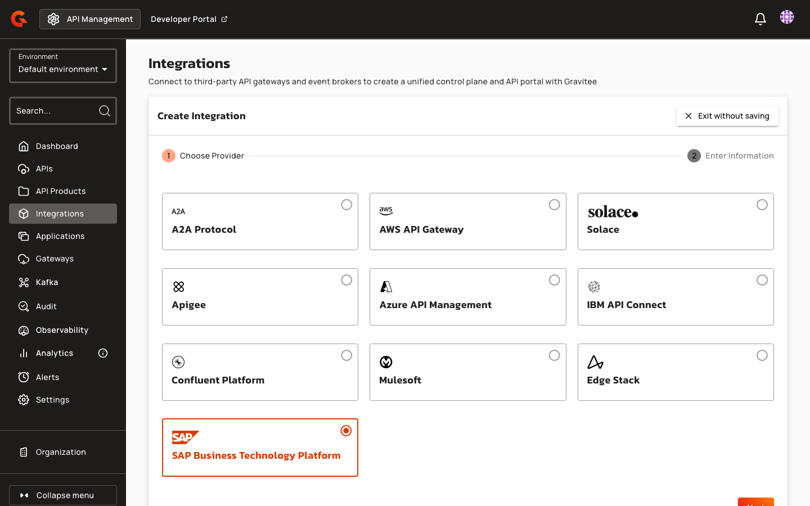
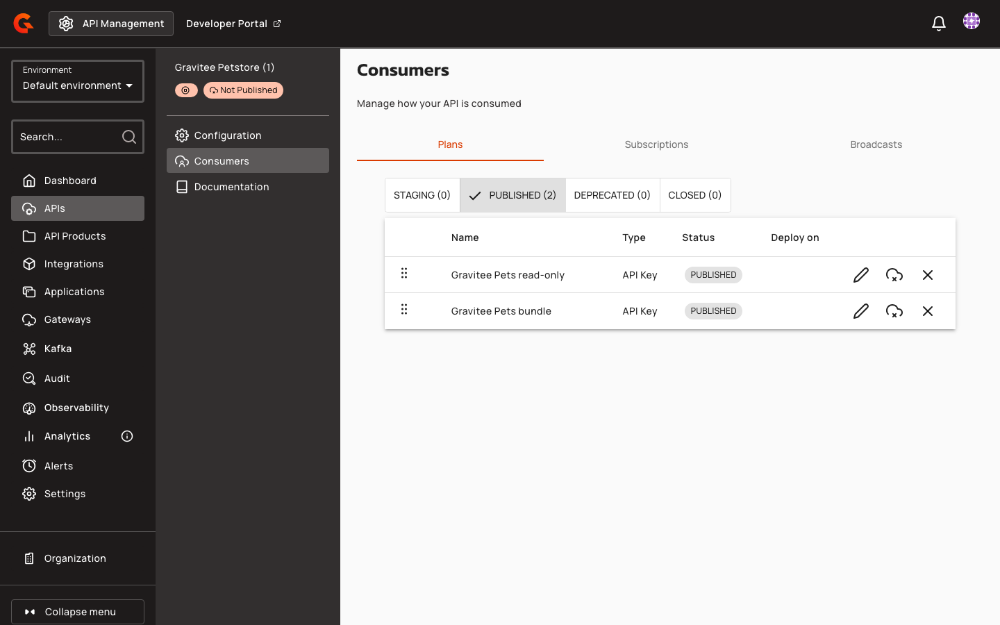
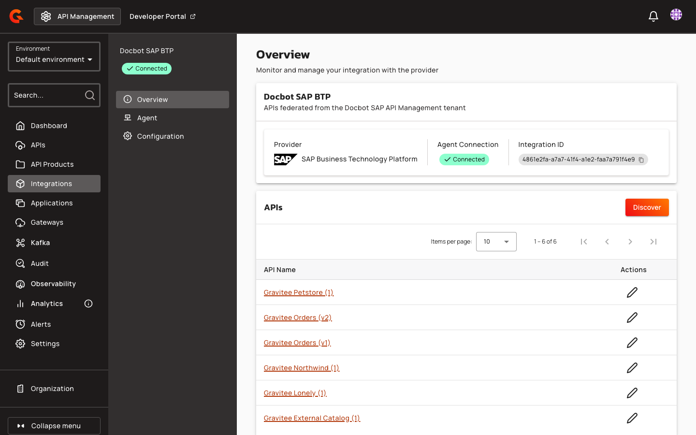

# SAP Business Technology Platform

## Overview

SAP API Management, part of SAP Integration Suite on SAP Business Technology Platform (SAP BTP), exposes two management APIs: the API portal and the Developer Hub. The SAP Business Technology Platform agent connects them to Gravitee:

* Every API proxy of the API portal becomes a federated API, with its OpenAPI specification and a page of its SAP documentation when SAP has them.
* Every SAP product that the Developer Hub marks as subscribable becomes a plan on each API it contains.
* A subscription to one of these plans, once it's approved in Gravitee, is created in the SAP Developer Hub. For an API Key plan, the consumer receives the SAP application key as the API key.

## Prerequisites

Before you install the SAP Business Technology Platform agent, complete the following steps:

* Install Gravitee API Management 4.13 or later, with Federation enabled. For more information, see [Federation](../README.md).
* Ensure that you have an access token for the agent. For more information, see [Federation Agent Service Account](../federation-agent-service-account.md).
*   In SAP BTP, create a service key for each SAP API Management API that the agent calls. Use client-secret service keys. The agent doesn't support X.509 service keys.

    | SAP API       | Service and plan                                             | Role                  | What the agent does with it                                                                 |
    | ------------- | ------------------------------------------------------------ | --------------------- | ------------------------------------------------------------------------------------------- |
    | API portal    | API Management, API portal, plan `apiportal-apiaccess`       | `APIPortal.Guest`     | Reads the API proxies, products, specifications, and documentation. It never changes them  |
    | Developer Hub | API Management, Developer Hub, plan `devportal-apiaccess`    | `AuthGroup.API.Admin` | Reads which products are subscribable, and creates the applications and product subscriptions of Gravitee subscriptions |

    Copy the `url`, `tokenUrl`, `clientId`, and `clientSecret` of each service key.
* Choose a developer registered in the SAP Developer Hub to own the applications that Gravitee creates. Gravitee recommends a technical developer dedicated to Gravitee rather than a person's account. At startup, the agent looks this developer up through the API portal, and the integration fails to start when the developer isn't found.
* In the Developer Hub governance settings, set the approval of subscriptions to **Auto Approval**. When SAP waits for its own approval of a subscription, the agent rejects the Gravitee subscription and withdraws the request from SAP.

## Integrate SAP Business Technology Platform with Gravitee APIM

To integrate SAP Business Technology Platform with Gravitee APIM, complete the following steps:

1. [Create an SAP Business Technology Platform integration in the Gravitee APIM Console](#create-an-sap-business-technology-platform-integration-in-the-gravitee-apim-console)
2. [Run the SAP Business Technology Platform federation agent](#run-the-sap-business-technology-platform-federation-agent)

### Create an SAP Business Technology Platform integration in the Gravitee APIM Console

1. From the APIM Console, click **Integrations**.
2. Click **Create Integration**.
3.  Click **SAP Business Technology Platform**.

    <figure><figcaption></figcaption></figure>
4. Click **Next**.
5. In **Name**, type a name for the integration.
6. (Optional) In **Description**, type a description of the integration.
7. Click **Create Integration**.

The **Overview** page of the integration opens. Copy its **Integration ID** to configure the agent.

### Run the SAP Business Technology Platform federation agent

The agent's configuration holds the two SAP service keys and the developer. Run the agent with either of the following methods:

* [Docker Compose](#docker-compose)
* [Helm](#helm)

#### Docker Compose

1.  In your `docker-compose.yml` file, add the following service:

    ```yaml
    services:
      integration-agent:
        image: ${APIM_REGISTRY:-graviteeio}/federation-agent-sap-api-management:${AGENT_VERSION:-latest}
        restart: always
        environment:
          - gravitee_integration_connector_ws_endpoints_0=${WS_ENDPOINTS}
          - gravitee_integration_connector_ws_headers_0_name=Authorization
          - gravitee_integration_connector_ws_headers_0_value=Bearer ${WS_AUTH_TOKEN}
          - gravitee_integration_providers_0_integrationId=${INTEGRATION_ID}
          - gravitee_integration_providers_0_type=sap-api-management
          - gravitee_integration_providers_0_configuration_apiPortal_url=${API_PORTAL_URL}
          - gravitee_integration_providers_0_configuration_apiPortal_tokenUrl=${API_PORTAL_TOKEN_URL}
          - gravitee_integration_providers_0_configuration_apiPortal_clientId=${API_PORTAL_CLIENT_ID}
          - gravitee_integration_providers_0_configuration_apiPortal_clientSecret=${API_PORTAL_CLIENT_SECRET}
          - gravitee_integration_providers_0_configuration_developerHub_url=${DEVELOPER_HUB_URL}
          - gravitee_integration_providers_0_configuration_developerHub_tokenUrl=${DEVELOPER_HUB_TOKEN_URL}
          - gravitee_integration_providers_0_configuration_developerHub_clientId=${DEVELOPER_HUB_CLIENT_ID}
          - gravitee_integration_providers_0_configuration_developerHub_clientSecret=${DEVELOPER_HUB_CLIENT_SECRET}
          - gravitee_integration_providers_0_configuration_developerHub_developerId=${DEVELOPER_HUB_DEVELOPER_ID}
    ```
2.  In your `.env` file, add the following variables:

    ```bash
    ## GRAVITEE PARAMETERS ##

    # APIM integration controller, as the agent reaches it
    WS_ENDPOINTS=<integration-controller-url>

    # APIM token used by the agent
    WS_AUTH_TOKEN='<your-token>'

    # ID of the APIM integration you created for this agent
    INTEGRATION_ID=<your-integration-id>

    # Optionally, a specific version of the agent. The default is latest
    # AGENT_VERSION=<agent-version>

    ## SAP PARAMETERS ##

    # API portal service key
    API_PORTAL_URL='<api-portal-url>'
    API_PORTAL_TOKEN_URL='<api-portal-token-url>'
    API_PORTAL_CLIENT_ID='<api-portal-client-id>'
    API_PORTAL_CLIENT_SECRET='<api-portal-client-secret>'

    # Developer Hub service key
    DEVELOPER_HUB_URL='<developer-hub-url>'
    DEVELOPER_HUB_TOKEN_URL='<developer-hub-token-url>'
    DEVELOPER_HUB_CLIENT_ID='<developer-hub-client-id>'
    DEVELOPER_HUB_CLIENT_SECRET='<developer-hub-client-secret>'

    # Registered Developer Hub developer who owns the applications Gravitee creates
    DEVELOPER_HUB_DEVELOPER_ID='<developer-id>'
    ```

    * Replace `<integration-controller-url>` with the URL of the APIM integration controller. By default, the controller listens on port `8072` of the Management API.
    * Replace `<your-token>` with the APIM token that you want the agent to use.
    * Replace `<your-integration-id>` with the ID of the APIM integration.
    * Replace the `<api-portal-...>` values with the `url`, `tokenUrl`, `clientId`, and `clientSecret` of the API portal service key.
    * Replace the `<developer-hub-...>` values with the `url`, `tokenUrl`, `clientId`, and `clientSecret` of the Developer Hub service key.
    * Replace `<developer-id>` with the ID of the registered Developer Hub developer.

    Keep the token and the SAP values in single quotes. SAP client secrets usually contain `$`, which Docker Compose expands in unquoted and double-quoted values. A truncated secret makes the integration fail at startup with a `401` `invalid_client` error, and APIM shows the integration as disconnected. Alternatively, write each `$` as `$$`.
3.  Pull the latest Docker image with the following command:

    ```bash
    docker compose pull
    ```
4.  Start the agent with the following command:

    ```bash
    docker compose up -d
    ```

#### Helm

1.  In your `values.yaml` file, add the following configuration:

    ```yaml
    config:
      graviteeYml:
        secrets:
          kubernetes:
            enabled: true
        integration:
          connector:
            ws:
              headers:
                - name: Authorization
                  value: secret://kubernetes/agent-secret:apimAuthorizationHeader
              endpoints:
                - <integration-controller-url>
          providers:
            - integrationId: "<your-integration-id>"
              type: sap-api-management
              configuration:
                apiPortal:
                  url: "<api-portal-url>"
                  tokenUrl: "<api-portal-token-url>"
                  clientId: "<api-portal-client-id>"
                  clientSecret: secret://kubernetes/agent-secret:apiPortalClientSecret
                developerHub:
                  url: "<developer-hub-url>"
                  tokenUrl: "<developer-hub-token-url>"
                  clientId: "<developer-hub-client-id>"
                  clientSecret: secret://kubernetes/agent-secret:developerHubClientSecret
                  developerId: "<developer-id>"

    kubernetes:
      extraObjects:
        - apiVersion: v1
          kind: Secret
          metadata:
            name: agent-secret
          type: Opaque
          data:
            apimAuthorizationHeader: <base64-encoded-value>
            apiPortalClientSecret: <base64-encoded-value>
            developerHubClientSecret: <base64-encoded-value>
    ```

    * Replace `<integration-controller-url>` with the URL of the APIM integration controller.
    * Replace `<your-integration-id>` with the ID of the APIM integration.
    * Replace the `<api-portal-...>` and `<developer-hub-...>` values with the fields of the matching service key, and `<developer-id>` with the ID of the registered Developer Hub developer.
    * Replace each `<base64-encoded-value>` with the base64-encoded value of the secret: `Bearer <your-token>` for `apimAuthorizationHeader`, and the client secret of each service key for the other two.
2.  Add the Gravitee Helm Chart repository with the following command:

    ```bash
    helm repo add graviteeio https://helm.gravitee.io
    ```
3.  Install the agent with the following command:

    ```bash
    helm install sap-federation-agent -f values.yaml graviteeio/federation-agent-sap-api-management
    ```

#### Configuration reference

The agent reads the following properties under `integration.providers[].configuration`. In Docker Compose, write each one as `gravitee_integration_providers_0_configuration_<property>`, with `_` in place of `.`.

| Property                     | Description                                                                                                             | Default   | Required |
| ---------------------------- | ----------------------------------------------------------------------------------------------------------------------- | --------- | -------- |
| `apiPortal.url`              | `url` of the API portal service key                                                                                     | -         | Yes      |
| `apiPortal.tokenUrl`         | `tokenUrl` of the API portal service key                                                                                | -         | Yes      |
| `apiPortal.clientId`         | `clientId` of the API portal service key                                                                                | -         | Yes      |
| `apiPortal.clientSecret`     | `clientSecret` of the API portal service key                                                                            | -         | Yes      |
| `developerHub.url`           | `url` of the Developer Hub service key                                                                                  | -         | Yes      |
| `developerHub.tokenUrl`      | `tokenUrl` of the Developer Hub service key                                                                             | -         | Yes      |
| `developerHub.clientId`      | `clientId` of the Developer Hub service key                                                                             | -         | Yes      |
| `developerHub.clientSecret`  | `clientSecret` of the Developer Hub service key                                                                         | -         | Yes      |
| `developerHub.developerId`   | Registered Developer Hub developer who owns the applications Gravitee creates                                          | -         | Yes      |
| `discoveryLimit`             | Maximum number of APIs a discovery returns                                                                              | `100`     | No       |
| `discoveryTimeout`           | Maximum duration of a discovery, in milliseconds                                                                        | `55000`   | No       |
| `maxOasLength`               | Largest OpenAPI specification ingested, in bytes. A larger specification is skipped                                     | `1000000` | No       |
| `subscriptionTimeout`        | Maximum duration of a subscription in SAP, retries included, in milliseconds                                            | `55000`   | No       |

A missing required property, a URL that isn't an absolute `http` or `https` URL, a wrong credential, or an unreachable SAP URL makes the integration fail at startup. The agent log names the missing property, or says whether the API portal or the Developer Hub failed and why. APIM shows the integration as disconnected.

## How SAP API proxies become federated APIs

Each discovery lists every API proxy of the API portal, including proxies in no product and externally managed APIs. Each version of an SAP API is a proxy of its own, so a federated API of its own.

An ingested API takes its name, version, and description from the proxy, with the HTML of the description reduced to text. It gets the following pages:

* `<proxy name>-oas.json`, the OpenAPI specification SAP generates for the proxy. An API whose specification is missing, belongs to a SOAP API, can't be read, or is larger than `maxOasLength` is ingested without it, and the agent logs a warning naming the proxy and the reason.
* `<proxy name>-sap-documentation.md`, with the SAP description of the proxy, the documentation of each resource converted from HTML, and the products that grant access to it. Documentation that SAP stores in a binary format is listed but not imported, and the agent logs a warning. An API with no resource and no product gets no documentation page.

The SAP release status, service code, version and versioning fields, externally managed flag, and provider name of the proxy are kept as API metadata, when SAP sets them.

Ingesting the APIs again updates them instead of creating new ones. Pages that you add to an ingested API in Gravitee are kept, and so are the visibility and publication settings that you change on its ingested pages. A page that SAP no longer provides is removed.

## How SAP products become plans

SAP consumers subscribe to products. Each product that the Developer Hub marks as subscribable becomes a plan on every API it contains, so an API in two products gets two plans. The plan takes the title of the product as its name. Its description gives the product's summary, the other APIs the product grants access to, its resource restriction, and its quota and scope when SAP sets them.

<figure><figcaption></figcaption></figure>

* A product of External OAuth APIs becomes an OAuth2 plan, and its description names the identity provider, and its issuer when SAP provides it. Every other product becomes an API Key plan.
* An API with no subscribable product gets no plan, and its description ends with the reason.
* Every plan is published with manual validation, so a subscription waits for its approval in Gravitee before the agent creates it in SAP.
* A product removed in SAP loses its plan at the next ingestion, and APIM closes and deletes the subscriptions to that plan.
* When the agent can't read the SAP products, the whole ingestion fails and no API is updated, so their plans and subscriptions stay unchanged. The agent log names the SAP API that failed.

## How subscriptions work in SAP

Once a subscription to an API Key plan is approved in Gravitee, the agent creates it in the SAP Developer Hub:

* The Gravitee application gets one SAP application with the same ID, the application's name as its title, and the configured developer as its owner. All the subscriptions of the Gravitee application share the key of its SAP application.
* The subscription adds the plan's SAP product to that application.
* The agent returns the SAP application key as the API key once SAP has approved and deployed the application and the product subscription is active.

A subscription to an OAuth2 plan registers the client ID of the Gravitee application on an SAP application of its own, one for each Gravitee application and identity provider. The consumer gets no SAP key, because tokens come from the identity provider. A Gravitee application without a client ID can't subscribe to these plans, and its other subscriptions to the same provider's products use the same client ID.

When SAP can't create the subscription, the agent rejects the Gravitee subscription and removes what it created in SAP. The rejection gives the reason, such as a missing Developer Hub role, SAP refusing the product, an approval SAP waits for, or a timeout. The agent retries SAP throttling, server errors, and timeouts within `subscriptionTimeout`.

Closing a subscription removes only its own access. The SAP product subscription ends unless another Gravitee subscription of the same application uses that product, and the SAP application is deleted once it has no subscription left. Closing a subscription twice, or closing one already removed in SAP, succeeds. When SAP refuses the change or can't be reached, closing fails with the reason, and APIM keeps the subscription open. Close it again once the problem is fixed.

## Limitations

The SAP Business Technology Platform integration has the following limitations:

* SAP applies key changes to its gateway asynchronously. A new API key isn't always accepted right after the subscription is accepted, and a key isn't always refused right after the subscription is closed.
* When an SAP product changes its authentication after its plan was created, ingesting the API again keeps the plan's security type. For example, a product that becomes External OAuth keeps an API Key plan.
* APIs and documentation that the agent can't ingest are reported in the agent log, not in APIM.

## Verification

To verify the SAP Business Technology Platform integration is working as expected, follow these steps:

1. From the APIM Console, click **Integrations**. The **Agent** column of your SAP Business Technology Platform integration shows **Connected**.
2. Click the name of the integration.
3. Click **Discover**.
4. Click **Proceed**.

The **APIs** list of the integration shows the ingested SAP APIs.

<figure><figcaption></figcaption></figure>
