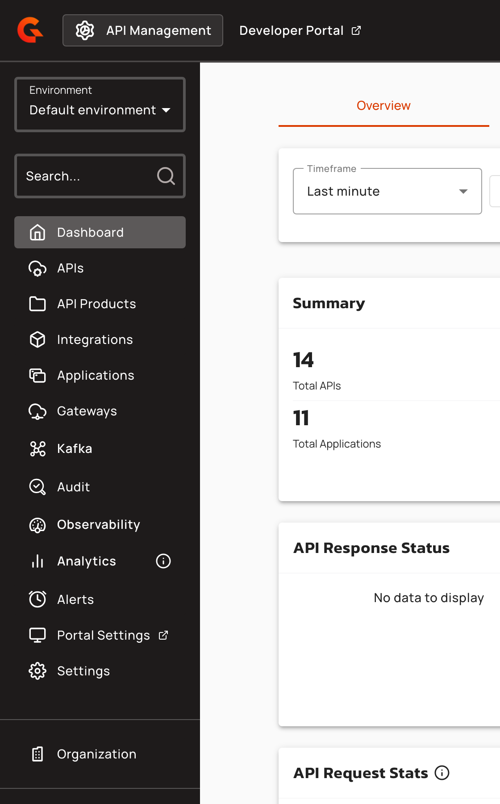
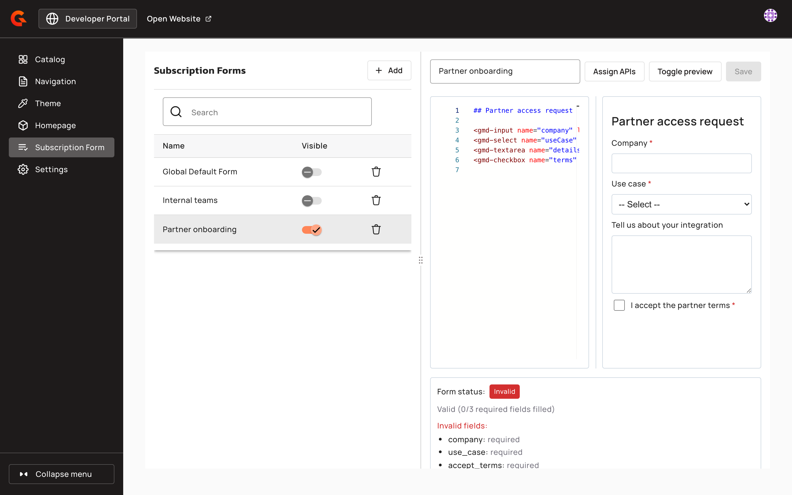
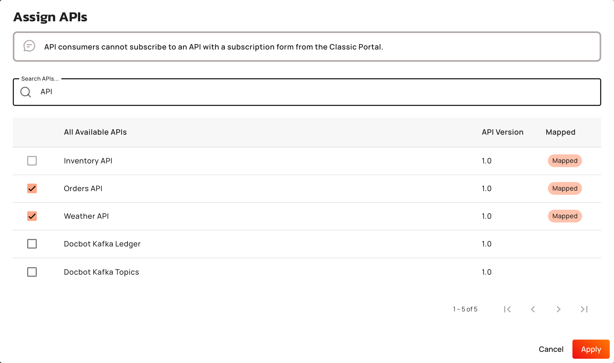
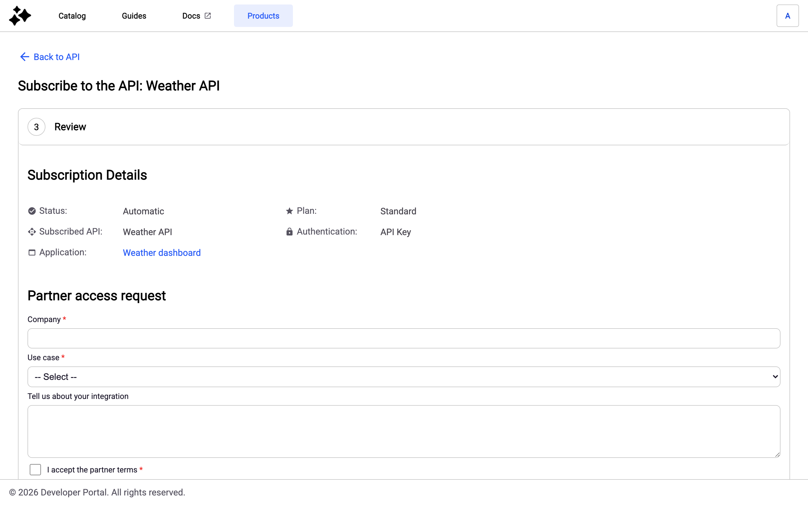

# Creating and managing subscription forms

An environment holds a list of subscription forms. Each form applies only to the APIs you assign to it, and an API belongs to one form at most. When a consumer subscribes to an API in the New Developer Portal, the portal shows the form assigned to that API if the form is visible. An API with no assigned form, or whose form is hidden, has no subscription form.

## Prerequisites

- The New Developer Portal is enabled for the environment. The **Portal Settings** entry of the Console sidebar appears only when it is.
- Your role in the Environment scope has the `METADATA` permission with the rights you need: **Read** to view subscription forms, **Create** to add one, **Update** to edit, assign APIs to, show, or hide one, and **Delete** to delete one. **Create** and **Delete** are needed from 4.13, so a custom role might need them added.

## Create a subscription form

1. In the Console sidebar, click **Portal Settings**. The portal settings open in a new browser tab.

    <figure><figcaption><p>Portal Settings in the Console sidebar</p></figcaption></figure>

2. Click **Subscription Form**. The **Subscription Forms** list shows every form of the environment, with a **Visible** toggle for each one.

    <figure><figcaption><p>The Subscription Forms list and the form editor</p></figcaption></figure>

3. Click **Add**. The editor opens with a starter form that you can edit or replace.
4. Enter a **Name**. The name is required, can't exceed 255 characters, and must be unique in the environment. Names that differ only in letter case count as the same name.
5. Write the form content in Gravitee Markdown (GMD). The preview next to the editor shows the rendered form. To hide or show the preview, click **Toggle preview**.
6. Click **Assign APIs**, and then select the APIs this form applies to. You can search the list. An API that's already assigned to another form can't be selected, and hovering over its checkbox shows which form it's assigned to. An assigned API that the list doesn't show you, for example an API outside the APIs you can access, stays assigned, and the dialog shows how many assigned APIs aren't listed.

    <figure><figcaption><p>Assign the APIs a form applies to</p></figcaption></figure>

7. Click **Apply**. The selection applies to the form you're editing and is saved with it in the next step.
8. Click **Create**.

A new form is hidden. Consumers don't see it until you turn on its **Visible** toggle.

A form can have up to 25 fields. Saving is blocked while the editor reports a configuration error, including:

- **Missing EL fallback** (`missingElFallback`): an EL expression in `options` must include a fallback list after the `}:` separator.
- **Invalid EL syntax** (`invalidElSyntax`): an expression in `options` must start with `{#`.

If you leave the page or select another form with unsaved changes, the Console asks you to confirm before it discards them.


Subscription forms aren't displayed for Keyless plans. The form only appears when the consumer subscribes to a plan that requires authentication.


## Manage subscription forms

The following procedures cover the changes you make to an existing form. Select the form in the **Subscription Forms** list to open it in the editor.

### Edit a form or its APIs

1. Change the **Name** or the form content, or click **Assign APIs** to change the APIs the form applies to, and then click **Apply**.
2. Click **Save**.

An API you remove from a form has no subscription form until you assign it to another one.

### Show or hide a form

1. Turn the form's **Visible** toggle on or off.
2. In the confirmation dialog, click **Show** or **Hide**.

The change applies right away and doesn't need **Save**. When a form is hidden, the APIs assigned to it have no subscription form until you show it again. The APIs stay assigned to the hidden form, so no other form can take them in the meantime.

### Delete a form

1. Click the delete icon on the form's row.
2. In the confirmation dialog, click **Delete**.

The APIs the form was assigned to have no subscription form afterward. Deleting a form can't be undone.

### Deleting an API

When an API is deleted, it's removed from the form it was assigned to.

## Subscribing from the Classic Developer Portal

The Classic Developer Portal doesn't display subscription forms. When the form assigned to an API is visible and has a required field, a subscription request from the Classic Developer Portal to that API is rejected.

## Subscription metadata

When an API consumer submits a subscription form, the form field values are stored as key-value pairs in the subscription's `metadata` property. Checkbox group selections are serialized as comma-separated strings (for example, `"Authentication,Analytics"`). Empty values (null, empty strings, whitespace-only) are filtered before storage.

Every submitted subscription form is validated on the backend before the subscription is created, not only in the browser, so the constraints defined on the form (`required`, `minLength`, `maxLength`, `pattern`, and allowed options for `gmd-select`, `gmd-radio`, and `gmd-checkbox-group`) can't be bypassed by a misbehaving client. Invalid submissions are rejected with field-level error messages.

Subscription metadata is displayed in the subscription details pages (both API subscriptions and application subscriptions) using a read-only viewer.

## GMD form components

Use the following GMD components to build subscription forms:

- **`gmd-input`**: Single-line text input. Supports `minLength`, `maxLength`, and `pattern` validation.
- **`gmd-textarea`**: Multi-line text input. Supports `minLength`, `maxLength`, and configurable `rows`.
- **`gmd-select`**: Dropdown selection. Define choices with the `options` attribute.
- **`gmd-checkbox`**: Checkbox field.
- **`gmd-checkbox-group`**: Checkbox group field. Define choices with the `options` attribute using either a comma-separated list (for example, `"Authentication,Rate Limiting,Analytics"`) or an EL expression with a fallback list (for example, `"{#api.metadata['features']}:Authentication,Rate Limiting"`). Set `required="true"` to require at least one selection.
- **`gmd-radio`**: Radio button selection. Define choices with the `options` attribute.

All components support `fieldKey`, `name`, `label`, `value`, `required`, and `disabled` attributes. The `fieldKey` attribute determines the metadata key stored with the subscription.


`minLength` and `maxLength` validation is only available on `gmd-input` and `gmd-textarea`. Dropdown, checkbox, checkbox group, and radio components don't support length validation.


For the full list of component attributes, see [Subscription form feature overview](subscription-form-feature-overview.md). For backend validation rules, hard length limits, and field-count restrictions, see [Subscription form technical implementation](../../developer-portal/new-developer-portal/subscription-form-technical-implementation.md).

## Verification

To verify the subscription form is working as expected, follow these steps:

1. Turn on the form's **Visible** toggle, and confirm with **Show**.
2. In the New Developer Portal, open an API assigned to the form and click **Subscribe**.
3. Choose a plan that requires authentication, choose an application, and then go to the **Review** step. The form appears below the subscription details.

    <figure><figcaption><p>The assigned form on the Review step in the New Developer Portal</p></figcaption></figure>

## Management API v2 reference

Every path below is relative to `/management/v2/environments/{envId}`. A subscription form object has the following fields:

```json
{
  "id": "string",
  "name": "string",
  "gmdContent": "string",
  "enabled": false,
  "apiIds": ["string"]
}
```

`enabled` is the **Visible** toggle. `apiIds` lists the APIs the form is assigned to.

### GET `/subscription-forms`

Lists the subscription forms of the environment, including hidden ones.

### POST `/subscription-forms`

Creates a subscription form. The new form is hidden.

**Request body:**

```json
{
  "name": "string",
  "gmdContent": "string",
  "apiIds": ["string"]
}
```

`name` and `gmdContent` are required, and `apiIds` is optional. Every API in `apiIds` must belong to the environment. An API that doesn't exist in the environment is rejected with `400` and the message `Unknown APIs in this environment`. The request is rejected with `409` when another form of the environment uses the same name, or when another form is already assigned one of the APIs.

### GET `/subscription-forms/_template`

Returns the starter content the Console uses for a new form, as `{ "gmdContent": "string" }`.

### GET `/subscription-forms/{subscriptionFormId}`

Retrieves one subscription form.

### PUT `/subscription-forms/{subscriptionFormId}`

Updates the name, the content, and the assigned APIs of a subscription form. It doesn't change whether the form is visible.

**Request body:**

```json
{
  "name": "string",
  "gmdContent": "string",
  "apiIds": ["string"]
}
```

All three fields are required. `apiIds` replaces the APIs assigned to the form, so an empty list removes every API from it. The same `400` and `409` rules as for creating a form apply.

### DELETE `/subscription-forms/{subscriptionFormId}`

Deletes a subscription form.

### POST `/subscription-forms/{subscriptionFormId}/_enable`

Shows the subscription form to API consumers.

### POST `/subscription-forms/{subscriptionFormId}/_disable`

Hides the subscription form from API consumers.

### Portal API

#### GET `/apis/{apiId}/subscription-form`

Retrieves the subscription form assigned to an API, including resolved dynamic options. It returns `404` when no form is assigned to the API or when the assigned form is hidden. The response includes the GMD content and a `resolvedOptions` map containing the effective option lists for fields with EL expressions. The New Developer Portal merges resolved options into the GMD content before rendering, replacing static or fallback options with values resolved from API and environment metadata.

When an EL expression's API metadata key is missing, the fallback list is used instead. In the Console subscription form editor, EL expressions aren't resolved, and only the fallback values are shown as a preview during form design.

**Response:**

```json
{
  "gmdContent": "string",
  "resolvedOptions": {
    "fieldKey": ["option1", "option2"]
  }
}
```

**Authentication:** Anonymous requests are rejected only when the Developer Portal requires users to log in.
