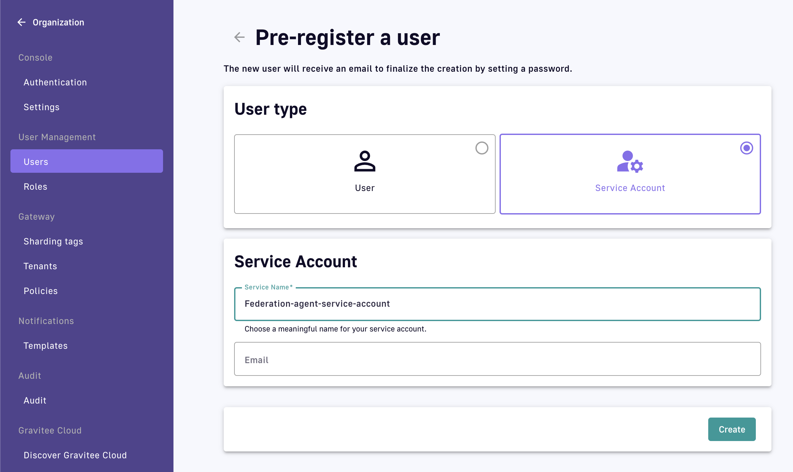
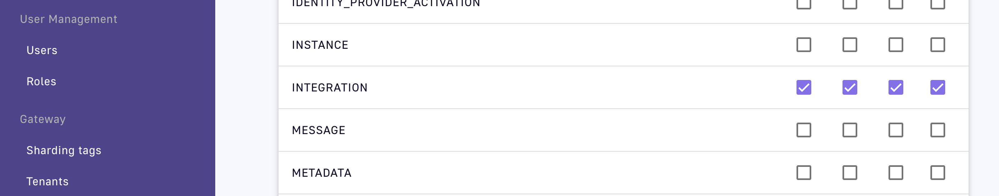
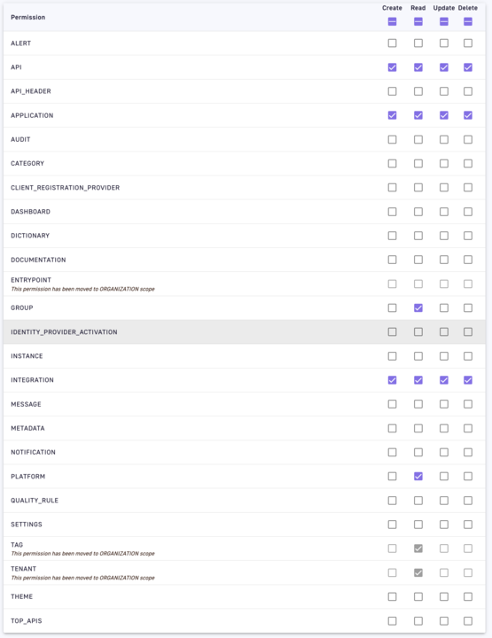
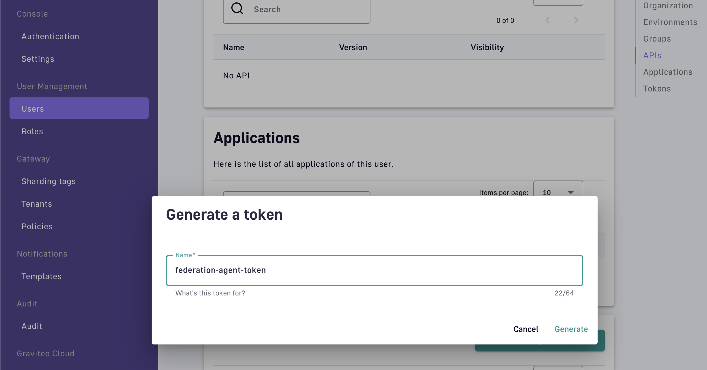

# Create a service account for the federation agent

The best way to provide credentials for the federation agent to connect to your APIM installation is to create a service account in the Gravitee API Management console dedicated to the agent.

To do this, head to the organisation settings in APIM, create a new user, and choose **Service Account**.

<figure><figcaption></figcaption></figure>

The service account email is optional. It is used to send notifications pertaining to the account and its related activities.

Next, ensure that this service account has the right permissions for the federation agent to be able to fulfil its duties. It requires CRUD permissions on the Integration object at environment-level:

<figure><figcaption></figcaption></figure>

You can create a new dedicated Federation Agent role just for this purpose, which will enable you to give the agent the minimum necessary permissions.

Alternatively, you can give the agent the API\_PUBLISHER role at environment level.

The screenshot below shows the environment-level permissions included in the API\_PUBLISHER role by default:

<figure><figcaption></figcaption></figure>

From the newly created service account, scroll to the **Tokens** section at the bottom of the page and create a new token:

<figure><figcaption></figcaption></figure>


Make sure to immediately copy your new personal access token as you won’t be able to see it again.


You can now use this token as part of your agent's configuration.
