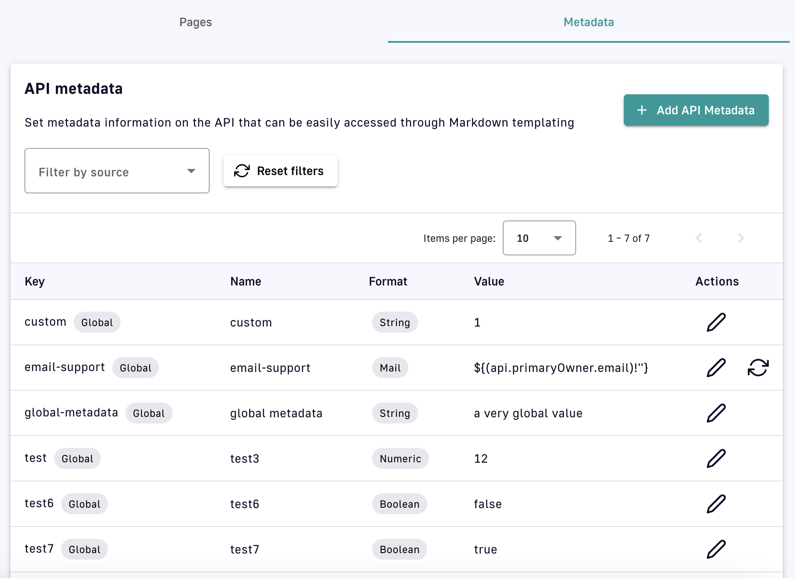

# Documentation


As of Gravitee 4.3, the APIM Documentation feature is only available for v4 APIs.


## Overview

Documentation can be added via the APIM Management Console to inform API consumers how to use an API. If the API and documentation are both published to the Developer Portal, the documentation will appear in the Portal for consumers to discover.

The sections below describe how to:

* [Add documentation](documentation.md#add-documentation)
* [Add metadata](documentation.md#add-metadata)
* [Edit documentation](documentation.md#editing)
* [Link pages](documentation.md#link-pages)
* [View documentation](documentation.md#view-documentation)
* [Send messages](documentation.md#send-messages)

## Add documentation

To add documentation to an API:

1. Select **APIs** from the left sidebar of the Management Console
2. Select the API you want to document
3. Select **Documentation** from the inner left sidebar
4. Select the **Pages** header tab
5. Click on **Add new page** or **Add new folder** to start structuring your documentation content

<figure><figcaption><p>Add pages and/or folders to your API documentation</p></figcaption></figure>

### Add folders

Folders allow you to organize your documentation by grouping pages. To configure your first folder:

1. From the top-level **Home** directory, click **Add new folder**
2. Specify the following:
   * **Name:** This field is required
   * **Visibility:** Select whether the folder visibility is **Public** or **Private**
     * **Public:** This is the default visibility. The contents of the folder can be viewed in the Developer Portal by all users.
     * **Private:** Users must be authenticated to view the contents of the folder in the Developer Portal

<figure><figcaption><p>Add a folder</p></figcaption></figure>

Once you click **Add folder**, the folder will appear at the top-level **Home** directory in **Documentation**. The directory will show the folder's publication status, visibility, the time the folder was last updated, and a badge indicating that the entry is a folder.


A folder will be **Hidden**, or not visible in the Developer Portal, until it contains published pages.


<figure><figcaption></figcaption></figure>

**Documentation** supports a nested structure. Once you've added a folder to the **Home** directory, you can click into it to create additional folders or pages.

### Add pages

Pages allow you to document your API using Markdown. The process of adding a page consists of the following steps:

#### Step 1: Configure a page

When you click **Add new page**, a drop-down menu will appear. Choose between **Markdown**, **OpenAPI**, and **AsyncAPI** as the page type.

After selecting the page type, name the page and select whether the page is **Public** or **Private**:

* **Name:** This field is required
* **Visibility:** Select whether the folder visibility is **Public** or **Private**
  * **Public:** This is the default visibility. The page can be viewed in the Developer Portal by anonymous users.
  * **Private:** Users must be authenticated to view the page in the Developer Portal

<figure><figcaption><p>Markdown page configuration</p></figcaption></figure>

#### Step 2: Add content

Choose how you want to add content: **Fill in the content myself** or **Import from file**

<figure><figcaption><p>Choose how to add content to a Markdown page</p></figcaption></figure>



This method uses the text editor to generate content based on your selected documentation type. In addition, APIM supports templating with API properties.

**Direct text entry**

Enter the page content in the text editor as Markdown, or enter YAML or JSON to create an API docs page from either an OpenAPI or AsyncAPI spec.


To automate the process of creating OpenAPI or AsyncAPI docs pages for v4 APIs, you can make a Management API endpoint REST call to create a docs page from an OpenAPI or AsyncAPI spec.


**Toggle preview** enables a side-by-side view of the content you enter and the rendered page.

<figure><figcaption><p>Add content to a Markdown page</p></figcaption></figure>

**Templating with API properties**

Use the following syntax to access the API data in your API documentation: `${api.name} or ${api.metadata['foo-bar']}`.

The sample script below creates a documentation template based on the Apache [FreeMarker template engine](https://freemarker.apache.org/):


```ftl
<#if api.picture??>

</#if>

# Welcome to the API ${api.name}(${api.version})!

The API is <span style="text-transform: lowercase;color: <#if api.state=='STARTED'>green<#else>red</#if>">${api.state}</span>.

This API has been created on ${api.createdAt?datetime} and updated on ${api.updatedAt?datetime}.

<#if api.deployedAt??>
This API has been deployed on ${api.deployedAt?datetime}.
<#else>
This API has not yet been deployed.
</#if>

<#if api.visibility=='PUBLIC'>
This API is publicly exposed.
<#else>
This API is not publicly exposed.
</#if>

<#if api.tags?has_content>
Sharding tags: ${api.tags?join(", ")}
</#if>

## Description

${api.description}

## Rating

You can rate and put a comment for this API <a href='/#!/apis/${api.id}/ratings'>here</a>.

## Contact

<#if api.metadata['email-support']??>
The support contact is <a href="mailto:${api.metadata['email-support']}">${api.metadata['email-support']}</a>.
</#if>

The API owner is <#if api.primaryOwner.email??><a href="mailto:${api.primaryOwner.email}">${api.primaryOwner.displayName}</a><#else>${api.primaryOwner.displayName}</#if>.
```


The available API properties are listed in the following table:

<table data-full-width="false"><thead><tr><th>Field name</th><th>Field type</th><th>Example</th></tr></thead><tbody><tr><td>id</td><td>String</td><td>70e72a24-59ac-4bad-a72a-2459acbbad39</td></tr><tr><td>name</td><td>String</td><td>My first API</td></tr><tr><td>description</td><td>String</td><td>My first API</td></tr><tr><td>version</td><td>String</td><td>1</td></tr><tr><td>metadata</td><td>Map</td><td>{"email-support": "support.contact@company.com"}</td></tr><tr><td>createdAt</td><td>Date</td><td>Jul 14, 2018 2:44:00 PM</td></tr><tr><td>updatedAt</td><td>Date</td><td>Jul 14, 2018 2:46:00 PM</td></tr><tr><td>deployedAt</td><td>Date</td><td>Jul 14, 2018 2:49:00 PM</td></tr><tr><td>picture</td><td>String</td><td>data:image/png;base64,iVBO…​</td></tr><tr><td>state</td><td>String</td><td>STARTED/STOPPED</td></tr><tr><td>visibility</td><td>String</td><td>PUBLIC/PRIVATE</td></tr><tr><td>tags</td><td>Array</td><td>["internal", "sales"]</td></tr><tr><td>primaryOwner.displayName</td><td>String</td><td>Firstname Lastname</td></tr><tr><td>primaryOwner.email</td><td>String</td><td>firstname.lastname@company.com</td></tr></tbody></table>



Upload a Markdown, OpenAPI, or AsyncAPI file as a documentation page. Only one file can be uploaded at a time.

<figure><figcaption><p>Import a Markdown file</p></figcaption></figure>



You have the option to save the page with or without publishing it to the Developer Portal. Once the content is saved, the page can be viewed from whichever directory it was added to. The directory will show the page's status, visibility, the time the page was last updated, a badge indicating that the entry is a page, and a badge indicating the page type.

<figure><figcaption><p>Test page added to test folder</p></figcaption></figure>

## Add metadata

Dynamic v4 API documentation pages can be created by adding metadata. To view metadata keys and values for v4 API documentation, select the **Metadata** header.

<figure><figcaption><p>View API metadata</p></figcaption></figure>

To create metadata for v4 API documentation, click **+** **Add API Metadata** and specify the following:

<div align="left"><figure><figcaption><p>Add API metadata</p></figcaption></figure></div>

* **Name:** Enter a name for the metadata
* **Format:** Select a metadata format from the drop-down menu. Available options are **string**, **numeric**, **boolean**, **date**, **mail**, or **url**.
* **Value:** Enter a value for the metadata

Changes to metadata values are reflected on the Developer Portal.

## Referencing Metadata

To reference metadata in the markdown entry, use the following syntax:

```
${api.metadata['<value>']}
```

* Replace \<value> with the metadata entry that you want to reference.

Here is an example that references a metadata entry named **custom**:

```
${api.metadata['custom']}
```

## Editing

To edit or delete folders or pages, or to change the documentation structure, select the **Pages** header and use the icons in the **Actions** section of an entry. All edits are immediately shown in the Developer Portal.

<figure><figcaption><p>Select from Actions to edit a page</p></figcaption></figure>

**Edit folders:** To edit a folder's name or visibility, click on the pencil icon in the folder's entry, change the name and/or visibility, then click **Save**. The changes made to a folder's visibility will impact who can see it in the Developer Portal.

**Edit pages:** To edit an existing page, click on the pencil icon in the page's entry, and change the name, visibility, and/or content, where both user-created and imported content can be edited via the Markdown editor. By enabling **Toggle preview**, you can view the content you enter and the rendered page side-by-side. Next, if the page is already published, click **Publish changes**. If the page is not published, you will have the option to **Save** or **Save and publish** your changes.

**Publish/unpublish:** To publish or unpublish a page, click the cloud icon.

**Reorder:** To change the order of pages and folders in a directory, use the up and down arrows.

**Delete:** To delete a page or folder, click the associated trash icon. Only empty folders can be deleted.

## Link pages

Page referencing allows documentation to be reused and easily exported between environments. Within an API's documentation, you can link to one page from another via special syntax.


If the referenced page is private, the user will see a 404 after clicking on the link.



Pages cannot be shared across APIs.


Page references are passed to the target folder relative to the root directory of the API documentation using the syntax `[link](/#!/documentation/api/path/to%20a/document/document%20name#MARKDOWN)`.

Syntax requirements:

* For the API-scoped path to an API's documentation page, the link must start with `/#!/documentation/api/`.
* The user needs to provide the names of the folders in the path and the name of the document with the correct extension (MARKDOWN, ASCIIDOC, ASYNCAPI, SWAGGER).
* All spaces in folder or page names must be replaced with `%20`, as is done in a navigator. This is the only symbol/character that needs to be encoded by the user.
* The names of the folder or page are not case-sensitive. No two folders or no two pages with the same extension can have the same spelling, regardless of capitalization.

## View documentation

Markdown, OpenAPI spec, and AsyncAPI spec documentation pages will be rendered in the Developer Portal if both the API and documentation have been published. In order for a folder to be visible in the Portal, it must contain at least one published page. Otherwise, the folder will be tagged as **Hidden**.

To view the documentation in the Developer Portal:

1.  Click **Open API in Developer Portal**

    <figure><figcaption><p>Open API in Developer Portal</p></figcaption></figure>
2.  Click on **Documentation** in the header options

    <figure><figcaption><p>API documentation</p></figcaption></figure>

## Send messages

In addition to making API documentation available via the Developer Portal, you can send messages to parties interested in your API to advertise updates, warn of upcoming changes, etc.

To configure message delivery mechanism, recipients, and content:

1. Select **APIs** from the left sidebar of the Management Console
2. Select the API you want to send a message about
3. Select **Consumers** from the inner left sidebar
4.  Select the **Broadcasts** tab

    <figure><figcaption><p>Configure messages</p></figcaption></figure>
5. Specify the following:
   * **Channel:** Choose to send your message via **Email**, **Portal notifications**, or **POST HTTP message**
   * **Recipients:** From the drop-down menu, select message recipients based on member role and scope
   * **Title:** Enter a title for your message
   * **Text:** Enter the text of your message
6. Click **Send**
