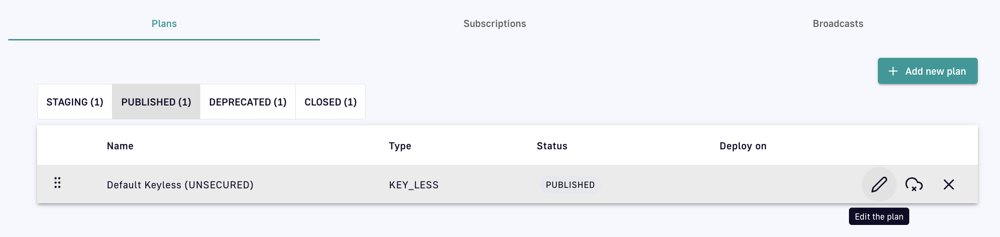

# Plans

## Introduction

To expose your API to internal or external consumers, it must have at least one plan. A plan provides a service and access layer on top of your API that specifies access limits, subscription validation modes, and other configurations to tailor it to an application. Gravitee offers the following types of plans: Keyless, API Key, OAuth2, JWT, Push, and mTLS.

Example access scenarios APIM can manage with plans include:

* Read-only access and limited request traffic for potential customers to discover and try out your APIs
* Premium access with public resources and access limits for your partners
* Unlimited access to your internal enterprise applications

<figure><figcaption>
High-level plan diagram
</figcaption></figure>

Each plan must include at least one security type by which subscribers can be authenticated. A security type is a policy integrated directly into a plan. Once a plan is created, the security type can not be changed. However, you can add additional security at the API or plan level with policies.

The sections below describe:

* [How to create a plan](./#create-a-plan)
* [Plan stages](./#plan-stages)
* [Plan selection rules](./#plan-selection-rules)

## Create a plan

To create a plan:

1. Log in to your APIM Console
2. Select **APIs** from the left nav
3. Select your API
4. Select **Consumers** from the inner left nav
5.  Under the **Plans** header tab, click **+ Add new plan** and select your plan security type:

    <figure><figcaption>
Add a new plan
</figcaption></figure>
6.  Configure the general plan settings:

    <figure><figcaption>
Configure general plan settings
</figcaption></figure>

    * **Name:** Enter a name for your plan
    * **Description:** Enter a description of your plan
    * **Characteristics:** Define labels used to tag your plan
    * **Page of General Conditions:** Select a published [Documentation](broken-reference/) page whose terms must be accepted by the user to finalize the subscription process
    * Toggle **Auto validate subscription** ON to accept all subscriptions to a plan without the API publisher's approval
    * Toggle **Consumer must provide a comment when subscribing to the plan** ON to require an explanation for the subscription request, with the option to leave a **Custom message to display to consumer**
    * **Sharding tags:** Selectively deploy the plan to particular APIs using available [sharding tags](../../gravitee-gateway/sharding-tags.md)
    * **Groups excluded:** Prevent specified [user groups](../../administration/user-management.md) from accessing your plan
7. Click **Next**
8.  Define the security configuration details appropriate to and required by your selected security type, e.g., OAuth2. See [OAuth2](oauth2.md), [JWT](jwt.md), [API Key](api-key.md), [Keyless](keyless.md), or [Push](push.md) for more information.

    <figure><figcaption>
OAuth2 configuration
</figcaption></figure>
9.  Select any plan restrictions:

    <figure><figcaption>
Select plan restrictions
</figcaption></figure>

    * **Rate limiting:** Intended to help avoid unmanageable spikes in traffic by limiting the number of requests an application can make in a given time period.
    * **Quota:** Limits the number of requests an application can make in a given time period. Generally used to tier access to APIs based on subscription level.
    * **Resource Filtering:** Limits access to API resources according to whitelist and/or blacklist rules.
10. Click **Create**

## Plan stages

A plan can exist in one of four stages: **STAGING**, **PUBLISHED**, **DEPRECATED**, and **CLOSED**:



This is the draft mode of a plan, where it can be configured but won’t be accessible to users.



API consumers can view a published plan on the Developer Portal. Once subscribed, they can use it to consume the API. A published plan can still be edited.



A deprecated plan won’t be available on the Developer Portal and API consumers won’t be able to subscribe to it. This cannot be undone. Existing subscriptions are not impacted, giving current API consumers time to migrate without breaking their application.



Once a plan is closed, all associated subscriptions are closed. API consumers subscribed to this plan won’t be able to use the API. This cannot be undone.



Depending on the stage it's in, a plan can be edited, published, deprecated, or closed via the icons associated with it:



To edit a plan, click on the pencil icon:

<figure><figcaption>
Edit a plan
</figcaption></figure>



To publish a plan, click on the icon of a cloud with an arrow:

<figure><figcaption>
Publish a plan
</figcaption></figure>

Once a plan has been published, it must be redeployed.



To deprecate a plan, click on the icon of a cloud with an 'x':

<figure><figcaption>
Deprecate a plan
</figcaption></figure>



To close a plan, click on the 'x' icon:

<figure><figcaption>
Close a plan
</figcaption></figure>



## Plan selection rules

APIM automatically routes each API request to the correct plan. The plan selection workflow parses all published plans in the following order: **JWT**, **OAuth2**, **API Key**, **Keyless**.


This workflow only applies to [v4 APIs and v2 APIs in emulation mode](../../overview/execution-engine.md#v2-gateway-api-emulation-mode).


The parsing rules for each plan type are detailed below:



* Retrieve JWT from the `Authorization` header or query parameters
* Ignore an empty `Authorization` header or any type other than Bearer
* An empty Bearer token is considered invalid



* Retrieve OAuth2 from the `Authorization` header or query parameters
* Ignore an empty `Authorization` header or any type other than Bearer
* An empty Bearer token is considered invalid



* Retrieve the API key from the request header or query parameters (default header: `X-Gravitee-Api-Key`; default query parameter: `api-key`)
* An empty Bearer token is considered invalid



* Will ignore any type of security (API key, Bearer token, etc.)
* If another plan has detected a security token, valid or invalid, all flows assigned to the Keyless plan will be ignored
  * If an API has multiple plans of different types and the incoming request contains a token or an API key that does not match any of the existing plans, then the Keyless plan will not be activated and the user will receive a generic `401` response without any details



The parsed plan is selected for execution if all the following conditions are met:

* The request contains a token corresponding to the plan type (e.g., an `X-Gravitee-Api-Key` header for an API Key plan)
* The plan condition rule is valid or not set
* There is an active subscription matching the incoming request
