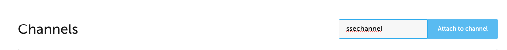

# Connect to an endpoint using SSE

## Overview

This guide describes how to establish a Server-Sent Events (SSE) channel connection and consume messages through Gravitee. This works by creating a one-way connection to an endpoint using Server-Sent Events.

## Prerequisites


The SSE entrypoint is part of the Event-native [Enterprise Edition](../../overview/enterprise-edition.md) package. To learn more about the Enterprise Edition and get the SSE plugin, contact us at [contact@graviteesource.com](mailto:contact@graviteesource.com).


Ensure that the SSE plugin is installed in your Gateway.

<figure><figcaption></figcaption></figure>

## Identify an endpoint

Identify the endpoint from which you are going to consume messages. For testing purposes, you can set up an account on Ably to create an endpoint.

1. Sign up for a free account at [https://ably.com/](https://ably.com/).
2. Follow the prompts to create an application.
3.  Click the name of your application to configure it. In this example, the application is named "gevents."

    <figure><figcaption></figcaption></figure>
4.  Select **API Keys** from the header menu, then click **Create API Key**.

    <figure><figcaption></figcaption></figure>
5.  In the **New API Key** modal, configure your API Key.

    

      
You must select at least 1 capability to create an API Key. Naming your key and selecting resource restrictions, revocable tokens options, or additional capabilities are optional.

    

    <figure><figcaption></figcaption></figure>
6. Click **Create key**.
7. Find and save the endpoint URL. You will enter this as the target URL when you configure your Gravitee API.
   1. Select **API Keys** from the header menu and click **How to use API Keys**.
   2. Enter a name for your channel. For example, "ssechannel."
   3. In the **Your Ably Credentials** modal, click the **SSE/HTTP Streaming** button.
   4.  Select the **Curl** tab to get the URL of your endpoint.

       <figure><figcaption></figcaption></figure>

## Create an HTTP proxy API

1. Log in to your Gravitee APIM Console.
2.  Select **APIs** from the nav and click **+ Add API**.

    <figure><figcaption></figcaption></figure>
3.  In the **Create New API** section, click **Create V4 API.**

    

      
v2 APIs are also compliant with SSE.

    

    <figure><figcaption></figcaption></figure>
4.  Enter your API's name and version number, then click **Validate my API details**.

    <figure><figcaption></figcaption></figure>
5.  Select **Proxy Generic Protocol** and click **Select my API architecture**.

    <figure><figcaption></figcaption></figure>
6.  Select **HTTP Proxy** and click **Select my entrypoints**.

    <figure><figcaption></figcaption></figure>
7.  Set a unique **Context-path**, for example, `/sseconsumer`, then click **Validate my entrypoints**.

    

      
To avoid potential communication issues, do not use characters separated by multiple forward slashes "/" for your context-path.

    

    <figure><figcaption></figcaption></figure>

    8\. Configure the API endpoint:
8. For the target URL for the HTTP proxy, enter the URL to your message provider. For example, `https://rest.ably.io/sse?channel=ssechannel&v=1.1`.
9.  Ensure the `Enable keep-alive` toggle is activated.

    <figure><figcaption></figcaption></figure>
10. Ensure the `Idle timeout` value is greater than the keep-alive frequency of your endpoint. [https://ably.com/](https://ably.com/) sets the keep-alive frequency to 60000ms, so this example uses 70000ms to be on the safe side.

    <figure><figcaption></figcaption></figure>
11. Click **Validate my endpoints**.
12. By default, Gravitee adds a **Default keyless plan (UNSECURED)** to your API. Click **Validate my plans**.
13. Click **Save & Deploy**.

## Test the SSE connection

To test the SSE connection with Postman, you need to construct the value to use with an HTTP GET call.

1. Find the URL of your APIM Gateway.
   1. In your APIM Console, click on Organization at the bottom of the nav.
   2. In the Organization menu, click on Settings.
   3.  In the Management pane, find the Management URL field.

       <figure><figcaption></figcaption></figure>
   4. Your Gateway URL is the value of the Management URL field, after "console" has been replaced by "gateway." For example, if your Management URL is `https://apim-master-console.team-apim.gravitee.dev`, then your Gateway URL is `https://apim-master-gateway.team-apim.gravitee.dev`.
2. Create a key-value pair using "Channel" as the key and the name of the channel you linked to your Ably application as the value. For example, `Channel=ssechannel`.
3. Concatenate your Gateway URL, the context-path of your Gravitee API, and the key-value pair using the syntax `your-gateway-url/context-path?key=value`, e.g., `https://apim-master-gateway.team-apim.gravitee.dev/sseconsumer?Channel=ssechannel`.
4. Save this as the value you will use for an HTTP GET call in Postman.

Next, find the API Key username and password for your Ably application.

1. Go to the application you created in Ably.
2. Select **API Keys** from the header menu.
3.  Click **Show** on the API Key you're using to authenticate with your application. The string before the colon is the username. The string following the colon is the password.

    <figure><figcaption></figcaption></figure>

    The API Key used for this example can be broken down into the username `Yz3R3w.Kkgrig` and a password that is obscured by asterisks "\*" until you click **Show**.

Now you have all the information you need to configure Postman to call your API.

1.  In Postman, select **GET** as the command and enter your Gateway URL as the value.

    <figure><figcaption></figcaption></figure>
2. Select **Authorization** from the header menu. From the **Auth Type** drop-down menu, select **Basic Auth**.
3.  Enter your API Key username and password in the adjoining **Username** and **Password** fields.

    <figure><figcaption></figcaption></figure>
4.  Click on **Send** to establish the channel. You should receive a keep-alive message at the keep-alive frequency defined for your endpoint.

    <figure><figcaption></figcaption></figure>
5.  You can now go back to Ably to send a message. Go to your application in [https://ably.com/](https://ably.com/) and select **Dev console** from the header menu.

    <figure><figcaption></figcaption></figure>
6.  Where it says **Enter a channel name**, enter the name of the channel you used in Postman as the value for the key-value pair, e.g., `ssechannel`.

    <figure><figcaption></figcaption></figure>
7.  Enter a message in the **Message data** field for your channel.

    <figure><figcaption></figcaption></figure>

    <figure><figcaption></figcaption></figure>
8. Click **Publish message** to publish the message to your channel.
9.  You can now go back to Postman, where you should see the message in the **Body** section.

    <figure><figcaption></figcaption></figure>
