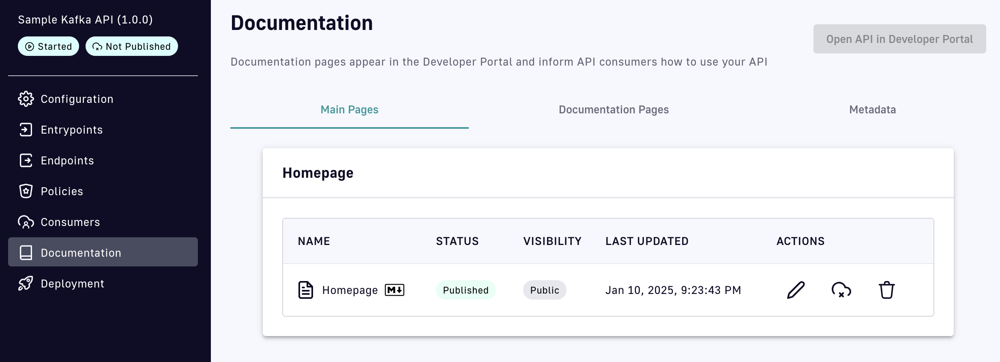
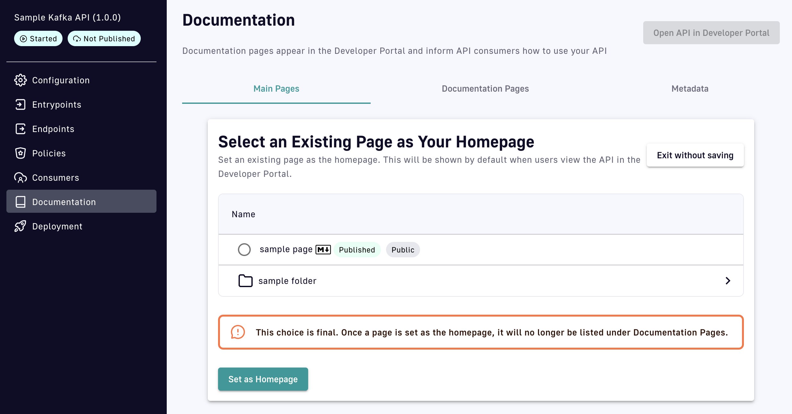

# Documentation

## Overview

In the **Documentation** section, you can click on the following headers to create pages that will appear in the Developer Portal and inform API consumers how to use your API:

* [Main Pages](documentation.md#main-pages)
* [Documentation Pages](documentation.md#documentation-pages)
* [Metadata](documentation.md#metadata)

## Main Pages

Under the **Main Pages** header, you can set up a homepage for your API in the Developer Portal. You can either create a new page or choose from existing pages.

To create a homepage:

1. Click **Create New Page**.
2.  Select the format of the page content. You can choose between Markdown, an OpenAPI definition, or an AsyncAPI definition. The next steps in the page creation process are identical regardless of which format you choose.

    <figure><figcaption></figcaption></figure>
3.  Choose whether to set your page visibility to **Public** or **Private**.

    <figure><figcaption></figcaption></figure>

    If you select **Private**, you have the option to choose which groups can view your page. You can also exclude the selected groups, in which case the groups that are not selected will be able to view your page. If you do not select any groups, all groups will be able to view your page.

    <figure><figcaption></figcaption></figure>
4.  Choose how to create the content. You can fill in the content yourself, import a file, or link to an external source.

    <figure><figcaption></figcaption></figure>

    The format you chose for the page content may impact how you create page content:

    *   If you choose to fill in the content yourself, you'll need to write the content in Markdown, provide an OpenAPI definition, or provide an AsyncAPI definition.

        <figure><figcaption></figcaption></figure>
    *   If you choose to import content from a file in your local directory, you'll need to import a Markdown or text file if you chose the Markdown format, or import a JSON or YAML file if you chose either the OpenAPI or AsyncAPI format.

        <figure><figcaption></figcaption></figure>
    *   If you choose to link to an external source, you'll be presented with the same set of options, regardless of format.

        <figure><figcaption></figcaption></figure>
5.  After you've provided your page content, click **Save** to generate an unpublished page, or **Save and publish** to publish the page to the Developer Portal.

    <figure><figcaption></figcaption></figure>

    Your page will appear with its name, publication status, and visibility, as well as the time it was last updated. Under ACTIONS, you can click the pencil icon to edit your page, the cloud to publish/unpublish it, and the trash can to delete it.

Instead of creating a new homepage, you can choose one from your existing documentation pages by clicking **Choose Existing Page**. You can select any page within your documentation page directory.


Once you select an existing page as your homepage, it will be removed from your documentation pages. This action is irreversible.


<figure><figcaption></figcaption></figure>

## Documentation Pages

Click the **Documentation Pages** header to view a directory of the pages you've created to document your API. All published pages will appear in the Developer Portal.

The process for creating a documentation page is identical to that for creating a homepage, except a documentation page requires a name.

<figure><figcaption></figcaption></figure>

In addition, **Documentation Pages** supports the creation of folders. To create a folder, click **Add new folder**.

<figure><figcaption></figcaption></figure>

When prompted, give your folder a name and select either **Public** or **Private** visibility. A folder will be hidden, or not visible in the Developer Portal, until it contains published pages.

<figure><figcaption></figcaption></figure>

**Documentation Pages** supports a nested structure. Once you've added a folder, you can click into it to create additional folders or pages.


The ACTIONS of a documentation page include arrows. If more than one page or folder is present, you can use arrows to move the entry up or down in the directory structure.


## Metadata

Dynamic API documentation pages can be created by adding metadata. To view and filter metadata, select the **Metadata** header.

<figure><figcaption></figcaption></figure>

To create metadata for your documentation, click **+** **Add API Metadata**:

<figure><figcaption>
Add API metadata
</figcaption></figure>

Enter a name and value for the metadata, and select a metadata format from the drop-down menu. Available options are **string**, **numeric**, **boolean**, **date**, **mail**, or **url**.

You can edit existing metadata by clicking on the pencil icon. Changes to metadata values are reflected on the Developer Portal.
