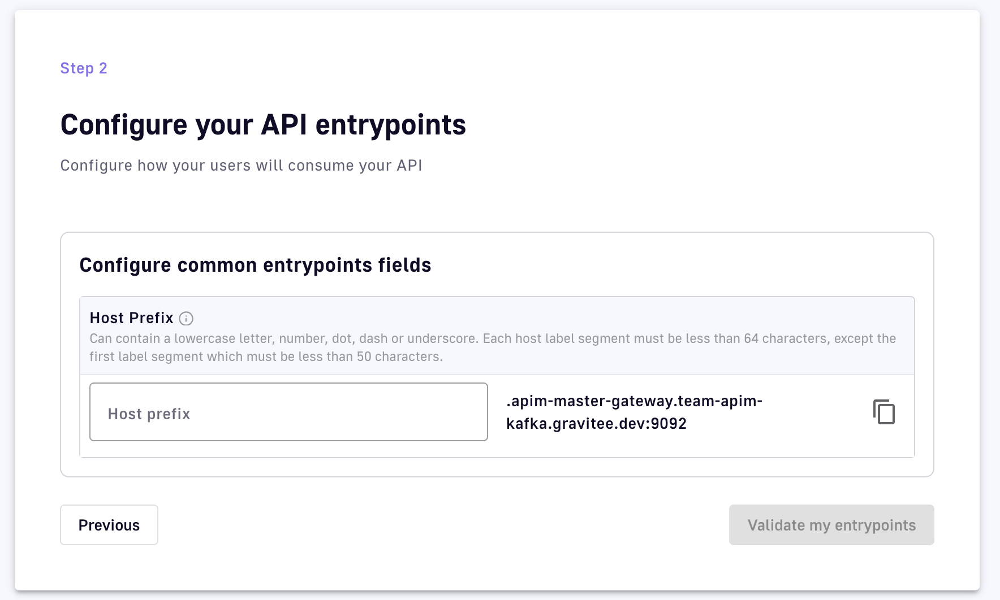

# Create Kafka APIs

## Introduction

Gravitee Kafka APIs apply Gravitee API Management (APIM) capabilities directly to the Kafka protocol. Kafka APIs are based on the Gravitee [v4 API definition](../create-apis/overview.md#gravitee-v4-apis). A Gravitee API definition is a JSON representation of everything that the APIM Gateway needs to know for it to proxy, apply policies to, and to create plans for your Gravitee APIs and their transactions. You can create Kafka APIs through the API creation wizard UI, or via the [management API](https://app.gitbook.com/o/8qli0UVuPJ39JJdq9ebZ/s/ySqSVpDHfKA0fNml1fVO/).


API consumers call or subscribe to Gateway APIs to retrieve data or functionality exposed by backend services. Gravitee defines three different types of Gateway APIs: proxy APIs, message APIs, and native APIs. These are differentiated by whether they proxy REST or event-driven APIs, and whether the Gravitee Gateway performs [protocol mediation](../create-apis/overview.md#protocol-mediation) or proxies the native protocol.


## The creation wizard

The API definitions for Kafka APIs can be generated using the APIM Console's API creation wizard, which is a UI-based tool that makes it easy to create Kafka APIs from scratch. To access the API creation wizard:

1. Log in to your APIM Console
2. Click on **APIs** in the left nav
3. In the Create New API , click on **Create V4 API**.

<figure><figcaption></figcaption></figure>

The API creation wizard comprises several steps, each of which requires you to define certain sets of information:

* [API details](create-kafka-apis.md#step-1-api-details)
* [Entrypoints](create-kafka-apis.md#step-2-entrypoints)
* [Endpoints](create-kafka-apis.md#step-3-endpoints)
* [Security](create-kafka-apis.md#step-4-security)
* [Documentation](create-kafka-apis.md#step-5-documentation)
* [Summary](create-kafka-apis.md#step-6-summary)

## API details

Define a name, version number, and description for your API.&#x20;

The name and version number are required, but we also recommend giving your API a description so that it is more easily understood and managed by internal users.

<figure><figcaption></figcaption></figure>

## Entrypoints

When choosing how you want to expose your backend, you will be presented with three options: Proxy Generic Protocol, Protocol Mediation, and Kafka Protocol.&#x20;

Select Kafka Protocol to create a Kafka API. Kafka APIs proxy the native Kafka protocol, with the Gravitee Gateway acting as a Kafka broker to Kafka clients.&#x20;

<figure><figcaption></figcaption></figure>

The only field to configure for the Kafka API entrypoint is the **Host prefix**, for which you should enter the host name. If the default hostname is set, you only need to enter the prefix. This is used to uniquely identify your API server on the gateway.

<figure><figcaption></figcaption></figure>

## Endpoints

The Kafka endpoint configuration is the Kafka cluster being proxied by your API. Configure the bootstrap server list and security protocol to talk to the cluster.

<figure><figcaption></figcaption></figure>

Of the following configuration settings, only entering a host/port pair is required. Modifying any other configuration parameters is optional.

1. Define the comma-separated list of host/port pairs to use for establishing the initial connection to the Kafka cluster.
2. Select **PLAINTEXT**, **SASL\_PLAINTEXT**, **SASL\_SSL**, or **SSL** from the drop-down menu to define your Kafka-specific authentication flow:
   * **PLAINTEXT:** No further security config necessary.
   * **SASL\_PLAINTEXT:** Choose NON&#x45;**,** GSSAPI, OAUTHBEARER, OAUTHBEARER\_TOKEN, PLAIN, SCRAM\_SHA-256, or SCRAM-SHA-512
     * **NONE:** No further security config necessary.
     * **AWS\_MSK\_IAM:** Enter the JAAS login context parameters.&#x20;
     * **GSSAPI:** Enter the JAAS login context parameters.&#x20;
     * **OAUTHBEARER:** Enter the OAuth token URL, client ID, client secret, and scopes to request when issuing a new token.
     * **OAUTHBEARER\_TOKEN:** Provide your custom token value.
     * **PLAIN:** Enter the username and password to connect to the broker.
     * **SCRAM\_SHA256:** Enter the username and password to connect to the broker.
     * **SCRAM\_SHA512:** Enter the username and password to connect to the broker.
   *   **SSL:** Choose whether to enable host name verification, then use the drop-down menu to configure a truststore type

       * **None**
       * **JKS with content:** Enter binary content as base64 and the truststore password.
       * **JKS with path:** Enter the truststore file path and password.
       * **PKCS#12 / PFX with content:** Enter binary content as base64 and the truststore password.
       * **PKCS#12 / PFX with path:** Enter the truststore file path and password.
       * **PEM with content:** Enter binary content as base64 and the truststore password.
       * **PEM with path:** Enter the truststore file path and password.

       and a keystore type

       * **None**
       * **JKS with content:** Enter the keystore password, the key's alias, the key password, and the binary content as base64.
       * **JKS with path:** Enter the keystore password, the key's alias, the key password, and the keystore file path.
       * **PKCS#12 / PFX with content:** Enter the keystore password, the key's alias, the key password, and the binary content as base64.
       * **PKCS#12 / PFX with path:** Enter the keystore password, the key's alias, the key password, and the keystore file path.
       * **PEM with content:** Enter the certificate and private key.
       * **PEM with path:** Enter the certificate path and private key path.
   * **SASL\_SSL:** Configure for both **SASL\_PLAINTEXT** and **SSL**.

## Security

Define a plan to secure, monitor, and transparently communicate information on how to access your Kafka API. The plan types presented are the same as the plan types used for regular HTTP APIs in Gravitee, but map to a Kafka authentication equivalent.

<figure><figcaption></figcaption></figure>

Gravitee automatically assigns each API a Default Keyless plan, which grants public access. Click **+ Add plan** to create additional plans.&#x20;


Kafka APIs cannot have published plans with conflicting authentication. In order to automatically deploy your API, add either a Keyless plan, which grants public access, or remove the Default Keyless plan and add one or more plans with authentication.


The Gravitee plans supported by Kafka APIs are summarized below, in increasing order of security

<table><thead><tr><th width="201">Plan</th><th>Description</th></tr></thead><tbody><tr><td>Keyless (public)</td><td>When configured, this plan does not add security. It is considered an "open" plan.</td></tr><tr><td>API Key</td><td>The gateway only accepts connections from clients that pass an API key corresponding to a valid subscription to the proxy in the client properties. The API key is used as the password, and the md5 hash of the API key is used as the username, as part of the SASL/SSL with SASL PLAIN authentication method.</td></tr><tr><td>JWT</td><td>The gateway only accepts connections from clients that pass a valid JWT with a client ID claim corresponding to a valid subscription to the proxy in the client properties. This is equivalent to SASL/SSL with SASL OAUTHBEARER authentication, where the JWT is used as the OAuth token.</td></tr><tr><td>OAuth2</td><td>The gateway only accepts connections from clients that pass a valid OAuth token with a client ID corresponding to a valid subscription to the proxy in the client properties. This is equivalent to SASL/SSL with SASL OAUTHBEARER authentication.</td></tr></tbody></table>


To learn more about how plans function in Gravitee, refer to the [plans](../expose-apis/plans/) documentation. mTLS plans are not yet supported for Kafka APIs.


Individual plan configurations as they pertain to Kafka APIs are described in detail below.

Keyless

Select **Keyless (public)** from the **+ Add plan** drop-down menu, then define general details and restrictions.

### General

You must enter a value in the **Name** field. Modifying the other configuration parameters is optional.

1. **Name**
2. **Description**
3. **Characteristics**
4. **Access control:** Select any Groups within APIM that you do not want to have access to this API.

API Key

Select **API Key** from the **+ Add plan** drop-down menu, then define general details, configuration settings, and restrictions.

### General

You must enter a value in the **Name** field. Modifying the other configuration parameters is optional.

1. **Name**
2. **Description**
3. **Characteristics**
4. **Subscriptions:** Choose whether to auto-validate subscriptions, require a message from a consumer during subscription, and/or present a message to the consumer upon subscription.
5. **Access control:** Select any Groups within APIM that you do not want to have access to this API.

### Configuration

* (Optional) Choose whether to propagate your API key to upstream APIs.
* (Optional) Use the [Gravitee Expression Language](../getting-started/gravitee-expression-language.md) to define additional selection rules. If you are managing multiple plans that share the same type, this will help the plan selection process.&#x20;

JWT

Select **JWT** from the **+ Add plan** drop-down menu, then define general details, configuration settings, and restrictions.

### General

You must enter a value in the **Name** field. Modifying the other configuration parameters is optional.

1. **Name**
2. **Description**
3. **Characteristics**
4. **Subscriptions:** Choose whether to auto-validate subscriptions, require a message from a consumer during subscription, and/or present a message to the consumer upon subscription.
5. **Access control:** Select any Groups within APIM that you do not want to have access to this API.

### Configuration

Only the **Signature** and **JWKS resolver** selections are required. Modifying the other configuration parameters is optional.

1. Choose a **Signature** to define how your JWT token must be signed. The options are:
   * RSA\_RS256
   * RSA\_RS384
   * RSA\_RS512
   * HMAC\_HS512
   * HMAC\_HS384
   * HMAC\_HS384
2. Define your **JWKS resolver**. This defines how your JSON Web Key Set is retrieved. The options are:
   * GIVEN\_KEY
   * GATEWAY\_KEYS
   * JWSK\_URL
3. Define your Resolver parameter. This field supports the [Gravitee Expression Language](../getting-started/gravitee-expression-language.md).
4. If your resolver is **JWKS\_URL**, set the **JWKS URL connect timeout**.
5. If your resolver is **JWKS\_URL**, set the **JWKS URL request timeout**.
6. Choose whether to use a system proxy.
7. Choose whether to extract JWT claims.
8. Choose whether to propagate authorization headers.
9. Define the user claim where users can be extracted.
10. Define the client Id claim where the client can be extracted.
11. Choose whether to ignore CNF validation if the token doesn't contain any CNF information.
12. Choose whether to validate the certificate thumbprint extracted from the access\_token with the one provided by the client.
13. Choose whether to extract the client certificate from the request header.
14. If the client certificate is extracted from the request header, enter the name of the header under which to find the client certificate.
15. Choose whether to validate the token type extracted from the access\_token with the one provided by the client.
16. Choose whether to ignore token type validation if the token doesn't contain any token type information.
17. Enter a list of expected token types. JWT is included by default.
18. Choose whether to ignore the case of the token type when comparing the expected values.
19. Use the Gravitee Expression Language to define additional selection rules. If you are managing multiple plans that share the same type, this will help the plan selection process.

OAuth2

Select **OAuth2** from the **+ Add plan** drop-down menu, then define general details, configuration settings, and restrictions.

### General

You must enter a value in the **Name** field. Modifying the other configuration parameters is optional.

1. **Name**
2. **Description**
3. **Characteristics**
4. **Subscriptions:** Choose whether to auto-validate subscriptions, require a message from a consumer during subscription, and/or present a message to the consumer upon subscription.
5. **Access control:** Select any Groups within APIM that you do not want to have access to this API.

### Configuration

Only the **OAuth2 resource** and **Cache resource** fields are required. Modifying the other configuration parameters is optional.

1. Define your OAuth2 resource in the **OAuth2 resource** field. This is the resource that you'll use to validate the token.
2. Define your cache resource in the **Cache resource** field. This is the cache resource that you will use to store the tokens.
3. Choose whether to push the token endpoint payload into the oauth.payload context attribute.
4. Choose whether to instruct your authentication method to check required scopes in order to access the resource. If you choose to check scopes, you must define your list of required scopes using the **Required scopes** module.
5. Choose whether strict mode is enabled or disabled. If you choose **Strict**, scopes will be checked against the exact list you provided in the **Required scopes** section.
6. Choose whether to permit authorization headers to target endpoints.&#x20;
7. Use the [Gravitee Expression Language](../getting-started/gravitee-expression-language.md) to define additional selection rules. If you are managing multiple plans that share the same type, this will help the plan selection process.

## Documentation

See [Documentation](../configure-v4-apis/documentation.md) to learn how to create documentation for a v4 API. You can add Markdown, OpenAPI, or AsyncAPI docs pages for v4 APIs.

## Summary

Review your API configuration and choose between the following:

* **Save API:** Creates your API as a Gravitee artifact, but does not deploy it to the Gateway.&#x20;
* **Save & Deploy API:** Creates your API as a Gravitee artifact and deploys it to the Gateway.
