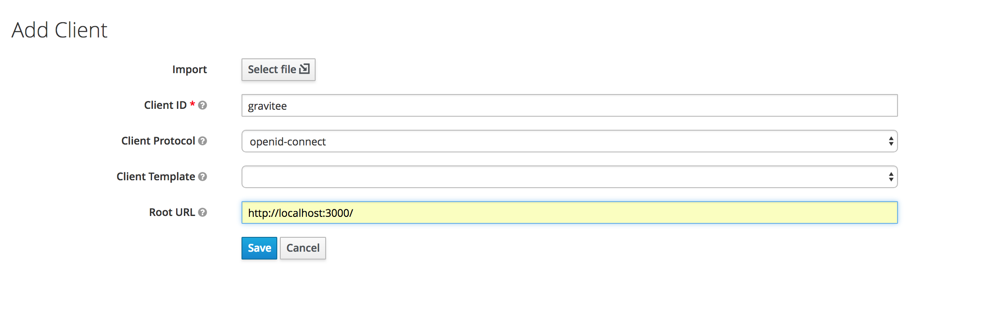
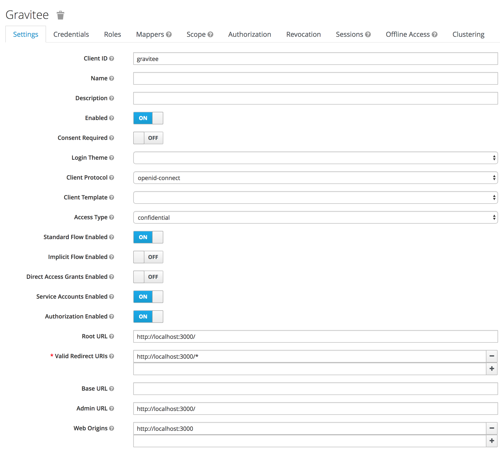
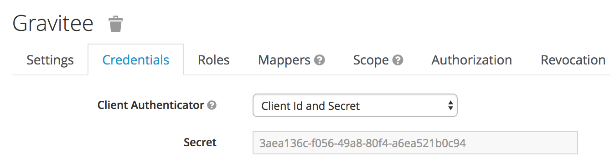
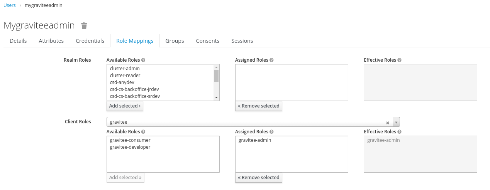

# OpenID Connect

## Overview

OpenID Connect (OIDC) is an authentication protocol built on top of the OAuth 2.0 framework that provides identity verification capabilities for web and mobile applications. It enables users to authenticate with an identity provider and obtain an identity token, which can be used to access protected resources on a web application.

Gravitee offers support for OpenID Connect authentication. This article includes set up instructions for general OIDC authentication and using Keycloak for OIDC.

## OpenID Connect authentication

Ensure all prerequisites are satisfied before attempting to configure your OpenID Connect IdP in Gravitee.

<details>

<summary>Prerequisites</summary>

* Create your OpenID Connect client
* Retrieve the following information for your client:
  * Client ID
  * Client Secret
  * Token endpoint
  * Token introspection Endpoint (optional)
  * Authorize Endpoint
  * UserInfo Endpoint
  * UserInfo Logout Endpoint (optional)
* (Optional) Decide:
  * Scopes
  * Authentication button color
* Decide proper user profile mappings:
  * ID
  * First name (optional)
  * Last name (optional)
  * Email (optional)
  * Picture (optional)

</details>

### Configuration

You can set up your OpenID Connect authentication using the `gravitee.yaml` file or the API Management (APIM) Console.



To configure an OpenID Connect authentication provider using the `gravitee.yaml` configuration file, you'll need to update to the file with your client information. You'll need to enter in this information where we have **(enter in client information)** called out in the code block. Depending on your client, this information will be different. To see a real-life example, check out the [Configure Keycloak authentication](openid-connect.md#example-keycloak-authentication) section below.


```yaml
security:
  providers:
    - type: (enter in client information)
      id: (enter in client information; not required if not present and the type will be used)
      clientId: (enter in client information)
      clientSecret: (enter in client information)
      tokenIntrospectionEndpoint: (enter in client information)
      tokenEndpoint: (enter in client information)
      authorizeEndpoint: (enter in client information)
      userInfoEndpoint: (enter in client information)
      userLogoutEndpoint: (enter in client information)
      color: "(enter in client information)"
      syncMappings: false
      scopes:
        - (enter in client information)
      userMapping:
        id: (enter in client information)
        email: (enter in client information)
        lastname: (enter in client information)
        firstname: (enter in client information)
        picture: (enter in client information)
      groupMapping:
        - condition: (enter in client information)
          groups:
            - (enter in client information) 1
            - (enter in client information) 2
      roleMapping:
        - condition: (enter in client information)
          roles:
            - (enter in client information)
            - (enter in client information)                  #applied to the DEFAULT environment
            - (enter in client information)          #applied to the DEFAULT environment
            - (enter in client information) #applied to environment whose id is <ENVIRONMENT_ID>
```




To configure OpenID Connect authentication using the APIM Console, follow these steps:

1. Log in to Gravitee's APIM Console, and then select **Organization** from the navigation menu.
2. Under **Console,** select **Authentication.**
3. Select **+ Add an identity provider.**
4. On the **Create a new identity provider** page, select OpenID Connect as your **Provider type.** Then you will need to:
   * Define **General** settings
     * Name
     * Description (optional)
     * Whether or not to allow portal authentication to use this provider
     * Whether or not to require a public email for authentication
     * Define Group and role mappings: this defines the level to which Platform administrators cam still override mappings. You have two options:
       * Computed only during first user authentication
       * Computed during each user authentication
   * Define **Configuration** settings
     * Client Id
     * Client Secret
     * Token Endpoint
     * Token Introspection Endpoint (optional)
     * Authorize Endpoint
     * UserInfo Endpoint
     * UserInfo Logout Endpoint (optional)
     * Scopes (optional)
     * Authentication button color (optional)
   * **User profile mapping**: this will be used to define a user's Gravitee user profile based on the values provided by the Identity Provider upon registration:
     * ID
     * First name (optional)
     * Last name (optional)
     * Email (optional)
     * Picture (optional)

When you are done, select **Create.** Then, go back to the IdP page, and toggle **Activate Identity Provider** ON for your new IdP.



### If you're using a custom PKI

When using custom a Public Key Infrastructure (PKI) for your OAuth2 authentication provider, you may have to specify the certificate authority chain of your provider in APIM. To do this, you can either:

*   Export an environment variable for your current session. For example:

    ```bash
    export JAVA_OPTS="
      -Djavax.net.ssl.trustStore=/opt/graviteeio-management-api/security/truststore.jks
      -Djavax.net.ssl.trustStorePassword=<MYPWD>"
    ```
*   Add an environment variable to your Docker Compose file to ensure that this configuration persists across settings. For example:

    ```yaml
    local_managementapi:
        extends:
          file: common.yml
          service: managementapi
        ports:
          - "8005:8083"
        volumes:
          - ./conf/ssl/truststore.jks:/opt/graviteeio-management-api/security/truststore.jks:ro
          - ./logs/management-api:/home/gravitee/logs
        links:
          - "local_mongodb:demo-mongodb"
          - "local_elasticsearch:demo-elasticsearch"
        environment:
          - JAVA_OPTS=-Djavax.net.ssl.trustStore=/opt/graviteeio-management-api/security/truststore.jks -Djavax.net.ssl.trustStorePassword=<MYPWD>
          - gravitee_management_mongodb_uri=mongodb://demo-mongodb:27017/gravitee?serverSelectionTimeoutMS=5000&connectTimeoutMS=5000&socketTimeoutMS=5000
          - gravitee_analytics_elasticsearch_endpoints_0=http://demo-elasticsearch:9200
    ```

## Keycloak authentication

To better illustrate how the OpenID Connect configuration works (and to assist users who are using Keycloak as their authentication provider), this section describes how to set up Keycloak as an OpenID Connect authentication provider.

### Create a Keycloak client

Before you can connect to Gravitee's portal using Keycloak, you need to create a new client. To do so, follow these steps:

1.  Log-in to Keycloak and create a new client.

    <figure><figcaption><p>Add a Gravitee client in Keycloak</p></figcaption></figure>
2.  Enter in your client details for Gravitee. The `Valid Redirect URIs` value must exactly match the domain which is hosting APIM Portal.

    <figure><figcaption><p>Enter Gravitee client details in Keycloak</p></figcaption></figure>
3.  Once you're done and create the client, retrieve the client credentials that you will need to give to Gravitee.

    <figure><figcaption><p>Keycloak client credentials that will need to be given to Gravitee</p></figcaption></figure>

### Create and configure Keycloak Client scope

1. In your realm, go to the `Client scopes` page.
2.  Set a special gravitee-client-groups [Scope](https://oauth.net/2/scope/) that will contain users' roles.

    
3.  In the new client scope, set a mapper with Claim name "groups".

    
4. In your realm, go to the `Client` page, and select your Client.
5.  Add the new configured scope in the `Client Scopes` tab.

    

### Create Keycloak Client roles

Optionally, you can configure Keycloak client roles. These roles can be defined later in Gravitee either using the `gravitee.yaml` file or Gravitee's APIM Console. To configure Client roles in Keycloak, follow these steps:

1.  In your client, create roles by organization, as needed.

    <figure><figcaption><p>Add roles in Keycloak</p></figcaption></figure>
2.  To configure Keycloak users with appropriate roles, select **Role Mappings** and define roles as is appropriate.

    <figure><figcaption><p>Define role mappings</p></figcaption></figure>

Gravitee role mapping uses Spring Expression Language ([SpEL](https://docs.spring.io/spring-framework/docs/3.0.x/reference/expressions.html)) for writing conditions. The only available object in context is #profile set from [userInfoEndpoint](https://www.oauth.com/oauth2-servers/signing-in-with-google/verifying-the-user-info/). For example:

```
security:
  providers:
    - type: oidc
      ...
      roleMapping:
        - condition: "{(#jsonPath(#profile, '$.groups') matches 'gravitee-admin' )}"
          roles:
            - "ORGANIZATION:ADMIN"
            - "ENVIRONMENT:ADMIN"

```

### Configure Keycloak authentication in Gravitee

You can configure Keycloak settings in Gravitee either using Gravitee's APIM Console or the `gravitee.yaml` file. Either way, the configuration is stored in the database, meaning that APIM starts using your new configuration as soon as you select **Save** (if configuring in APIM Console) or restart the APIM API (if configuring in the configuration file).

See the tabs below for how to configure Keycloak authentication via the APIM UI and the `gravitee.yaml` file.



To configure Keycloak as an OpenID Connect authentication provider using the `gravitee.yaml` configuration file, you'll need to update to the file with your Keycloak client information as shown below:


```yaml
security:
  providers:
    - type: oidc
      id: keycloak # not required if not present, the type is used
      clientId: gravitee
      clientSecret: 3aea136c-f056-49a8-80f4-a6ea521b0c94
      tokenIntrospectionEndpoint: http://localhost:8080/auth/realms/master/protocol/openid-connect/token/introspect
      tokenEndpoint: http://localhost:8080/auth/realms/master/protocol/openid-connect/token
      authorizeEndpoint: http://localhost:8080/auth/realms/master/protocol/openid-connect/auth
      userInfoEndpoint: http://localhost:8080/auth/realms/master/protocol/openid-connect/userinfo
      userLogoutEndpoint: http://localhost:8080/auth/realms/master/protocol/openid-connect/logout
      color: "#0076b4"
      syncMappings: false
      scopes:
        - openid
        - profile
      userMapping:
        id: sub
        email: email
        lastname: family_name
        firstname: given_name
        picture: picture
      groupMapping:
        - condition: "{#jsonPath(#profile, '$.identity_provider_id') == 'PARTNERS' && #jsonPath(#profile, '$.job_id') != 'API_MANAGER'}"
          groups:
            - Group 1
            - Group 2
      roleMapping:
        - condition: "{#jsonPath(#profile, '$.job_id') != 'API_MANAGER'}"
          roles:
            - "ORGANIZATION:USER"
            - "ENVIRONMENT:API_CONSUMER"                  #applied to the DEFAULT environment
            - "ENVIRONMENT:DEFAULT:API_CONSUMER"          #applied to the DEFAULT environment
            - "ENVIRONMENT:<ENVIRONMENT_ID>:API_CONSUMER" #applied to environment whose id is <ENVIRONMENT_ID>
```




To configure OpenID Connect authentication using the APIM UI, follow these steps:

1. Log-in to Gravitee's APIM Console, and select **Organization** from the left-hand nav.
2. Under **Console,** select **Authentication.**
3. Select **+ Add an identity provider.**
4. On the **Create a new identity provider** page, select OpenID Connect as your **Provider type.** Then you will need to:
   * Define **General** settings
     * Name
     * Description (optional)
     * Whether or not to allow portal authentication to use this provider
     * Whether or not to require a public email for authentication
     * Define Group and role mappings: this defines the level to which Platform administrators cam still override mappings. You have two options:
       * Computed only during first user authentication
       * Computed during each user authentication
   * Define **Configuration** settings
     * Client Id
     * Client Secret
     * Token Endpoint
     * Token Introspection Endpoint (optional)
     * Authorize Endpoint
     * UserInfo Endpoint
     * UserInfo Logout Endpoint (optional)
     * Scopes (optional)
     * Authentication button color (optional)
   * **User profile mapping**: this will be used to define a user's Gravitee user profile based on the values provided by the Identity Provider upon registration:
     * ID
     * First name (optional)
     * Last name (optional)
     * Email (optional)
     * Picture (optional)

When you are done, select **Create.** Then, go back to the IdP page, and toggle **Activate Identity Provider** ON for your new IdP.



### Test your Keycloak authentication

You can easily test your Keycloak configuration by logging out of the Management Console, clearing your cookies, and logging back in. Once on the login screen, you should see a **Sign in with Keycloak** option. Upon entering in your Keycloak credentials, you should be successfully logged in.

1. This example uses bcrypt to hash passwords.
2. Define the password.
3. Here, you can define information, passwords, roles, etc. for specific user types, such as user or admin.
4. Define the roles.
