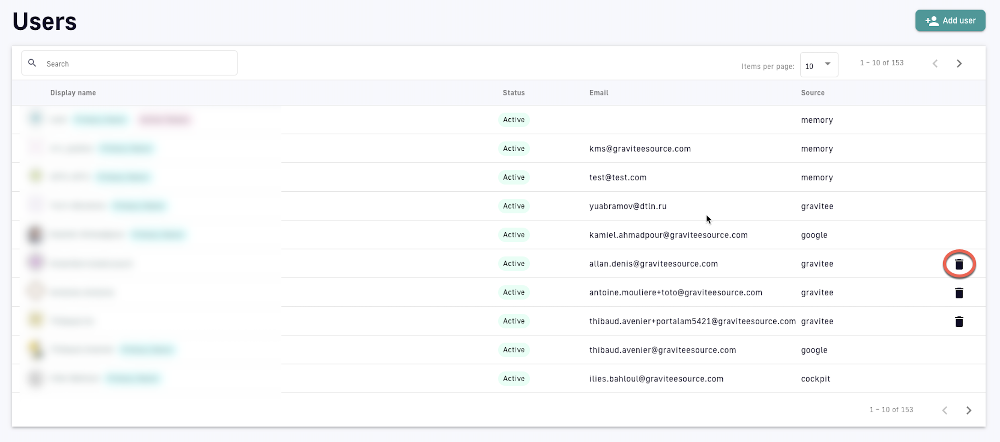

# User Management

## Overview

This article describes how to set up and manage Gravitee roles, scopes, permissions, users, and user groups.

## Roles

A role is a functional group of permissions and can be defined at the Organization, Environment, API, and/or Application level. Gravitee includes pre-built default roles and also allows you to create an unlimited number of custom user roles. Each role:

* Is associated with a group of permissions
* Has a scope, which encompasses the API Management resources available to the user. Gravitee scopes comprise the Organization, Environment, API, and Application levels.
* Defines what you can do with APIM UI components and the APIM Management API


By default, only a System Admin (a role created by Gravitee) can create and edit roles, including custom roles.


The APIM Console allows you to add, see members within, and delete roles in the Organization, Environment, API, and Application scopes. To set up roles:

1. Log in to your APIM Console
2. Select **Organization** from the left nav
3. Select **Roles** from the **User Management** section
4. Click **+ Add a role** at your desired scope&#x20;
   * Give the role a name
   * Give the role a description (optional)
   * Enable the role as a default role for new users by toggling **Default tole** ON or OFF
   * Set create, read, update, and delete permissions for the role
5. Click **Create**

Example: Custom "Writer" role

To create a custom "Writer" role:

1. Log in to the API Management Console
2. Select **Organizations** from the left-hand nav
3. Click **Roles** under **User Management**
4. At the **API** scope, click **+ Add a role**
5. Enter "Writer" in the **Role name** text field
6. Give the role a description, such as "These users can create, update, read, and delete API documentation."
7. (Optional) To make this the default role for new users, toggle **Default role** ON
8. Define the following permissions:\
   \- **`Read`** permissions on **`DEFINITION`** and **`GATEWAY_DEFINITION`**: Allows the user to see the API in the API list\
   \- **`CRUD`** permissions on **`DOCUMENTATION`**: Allows the user to write new API documentation
9. Click **Create**

The "Writer" role now appears in the API scope section.

## Permissions

The set of permissions a role has is defined by its scope. The following tables list permissions per scope.&#x20;



<table><thead><tr><th width="220.31578947368422">Name</th><th>Description</th></tr></thead><tbody><tr><td>ENTRYPOINT</td><td>Manages environment entrypoint configuration</td></tr><tr><td>ENVIRONMENT</td><td>Manages environments</td></tr><tr><td>ROLE</td><td>Manages roles</td></tr><tr><td>TAG</td><td>Manages sharding tags</td></tr><tr><td>TENANT</td><td>Manages tenants</td></tr><tr><td>USER</td><td>Manages users</td></tr></tbody></table>



<table><thead><tr><th width="324">Name</th><th>Description</th></tr></thead><tbody><tr><td>ALERT</td><td>Manages environment alerting</td></tr><tr><td>API</td><td>Manages APIs in general. The <code>CREATE</code> action is used to establish if the user is allowed to create an API or not, and the <code>READ</code> permission is used to allow the user to request the policies and resources lists.</td></tr><tr><td>API_HEADERS</td><td>Manages environment API headers</td></tr><tr><td>APPLICATION</td><td>Manages applications in general. <code>CREATE</code> allows the user to create an application, <code>READ</code> allows the user to list applications.</td></tr><tr><td>AUDIT</td><td>Gets APIM audit. Only <code>READ</code> permission is used.</td></tr><tr><td>CATEGORY</td><td>Manages categories</td></tr><tr><td>CLIENT_REGISTRATION_PROVIDER</td><td>Manages environment client registration configuration</td></tr><tr><td>DASHBOARD</td><td>Manages environment dashboards</td></tr><tr><td>DICTIONARY</td><td>Manages environment dictionaries</td></tr><tr><td>DOCUMENTATION</td><td>Manages APIM Dev Portal documentation</td></tr><tr><td>GROUP</td><td>Manages user groups</td></tr><tr><td>IDENTITY_PROVIDER</td><td>Manages Identity Providers for authentication</td></tr><tr><td>INSTANCE</td><td>Access to API Gateway instance information. Only <code>READ</code> permission is used.</td></tr><tr><td>MESSAGE</td><td>Manages messaging</td></tr><tr><td>METADATA</td><td>Manages APIM metadata</td></tr><tr><td>NOTIFICATION</td><td>Manages global notifications</td></tr><tr><td>PLATFORM</td><td>Gets APIM monitoring metrics. Only <code>READ</code> permission is used.</td></tr><tr><td>QUALITY_RULE</td><td>Manages environment quality rules</td></tr><tr><td>SETTINGS</td><td>Manages environment settings</td></tr><tr><td>THEME</td><td>Manages APIM Portal themes</td></tr><tr><td>TOP_APIS</td><td>Manages top APIs</td></tr></tbody></table>



| Name                | Description                                                                                                                                 |
| ------------------- | ------------------------------------------------------------------------------------------------------------------------------------------- |
| ALERT               | Manages API alerting                                                                                                                        |
| ANALYTICS           | Manages API analytics. Only the `READ` permission is used.                                                                                  |
| AUDIT               | Manages API audits. Only the `READ` permission is used.                                                                                     |
| DEFINITION          | Manages the API definition                                                                                                                  |
| DISCOVERY           | Manages service discovery                                                                                                                   |
| DOCUMENTATION       | Manages API documentation                                                                                                                   |
| EVENT               | Manages API events. Only the `READ` permission is used.                                                                                     |
| GATEWAY\_DEFINITION | A specific permission used to update the context-path (`UPDATE`) and to give access to sensitive data (`READ`) such as endpoints and paths. |
| HEALTH              | Manages API health checks                                                                                                                   |
| LOG                 | Manages API logs. Only the `READ` permission is used.                                                                                       |
| MEMBER              | Manages API members                                                                                                                         |
| METADATA            | Manages API metadata                                                                                                                        |
| MESSAGE             | Manages messaging                                                                                                                           |
| NOTIFICATION        | Manages API notifications                                                                                                                   |
| PLAN                | Manages API plans                                                                                                                           |
| QUALITY\_RULE       | Manages API quality rules                                                                                                                   |
| RATING              | Manages API rating                                                                                                                          |
| RATING\_ANSWERS     | Manages API rating answers                                                                                                                  |
| RESPONSE\_TEMPLATES | Manages API response templates                                                                                                              |
| REVIEWS             | Manages API reviews                                                                                                                         |
| SUBSCRIPTION        | Manages API subscriptions                                                                                                                   |



| Name         | Description                                                        |
| ------------ | ------------------------------------------------------------------ |
| ALERT        | Manages application alerting                                       |
| ANALYTICS    | Manages application analytics. Only the `READ` permission is used. |
| DEFINITION   | Manages the application definition                                 |
| LOG          | Manages application logs. Only the `READ` permission is used.      |
| MEMBER       | Manages application members                                        |
| NOTIFICATION | Manages application notifications                                  |
| SUBSCRIPTION | Manages application subscriptions                                  |




**Enterprise only**

Custom Roles is an [Enterprise Edition](../overview/enterprise-edition.md) capability. To learn more about Gravitee Enterprise and what's included in various enterprise packages:

* [Book a demo](https://app.gitbook.com/o/8qli0UVuPJ39JJdq9ebZ/s/rYZ7tzkLjFVST6ex6Jid/)
* [Check out the pricing page](https://www.gravitee.io/pricing)


### Users and user groups

In Gravitee, a user is the profile of an individual who uses the platform. User groups are groupings of users that share the same role(s) for the Environment, Organization, API, and/or Application scopes.



### Create users

Users are created in one of two ways:

* [System Administrators](user-management.md#system-administrator-flow) can create users
* Users can self-register via a registration form

#### System Administrator flow

To pre-register a user:

1. Log in to your APIM Console
2. Select **Organization** from the left nav
3. Select **Users** under **User Management**
4. Click **+ Add user**&#x20;
5.  Select **User type:** Choose between **User** and **Service Account**

    **Pre-register a user**

    <figure><figcaption>
Add a User user type
</figcaption></figure>

    * Enter the user's info: **First Name**, **Last Name**, **Email**
    * Using the drop-down menu, select the **Identity Provider** name. See [IdP configuration](organizations-and-environments.md#defining-organization-authentication-and-access-settings) for more details.

    **Pre-register a service account:** Setting up a user as a service account enables somebody from a Gravitee servicer (e.g., partner, consultant) to subscribe to Gravitee email notifications&#x20;

    <figure><figcaption>
Add a Service Account user type
</figcaption></figure>

    * Enter a **Service Name** for the service account
    * Enter the service account's email
6. Click **Create**

### **Manage users**

To delete a user from your Organization, select the **Delete user** icon from the table on the **Users** page:

<figure><figcaption>
Delete a user
</figcaption></figure>



### Create user groups

To create a user group:

1. Log in to your APIM Console
2. Select **Settings** from the left nav
3. Under **User Management**, select **Groups**
4. Click the plus icon at the bottom of the page
5.  Configure the user group &#x20;

    <figure><figcaption>
Create a user group
</figcaption></figure>

    * **General:** Enter a name for the user group
    * **Roles & Members:** define the maximum number of members and choose whether or not to allow:
      * Invitations via user search
      * Email invitations
      * The group admin to change the API role
      * The group admin to change the application role
      * Notifications when members are added to this group
    * **Associations**: choose whether or not to associate this group to every new API and/or application
    * **Actions:** **CREATE** the user group or **RESET** to the default settings

Once a user group is created, you will be able to:

* Define a default API role by selecting the role from the **Default API Role** drop-down menu
* Define a default application roles by selecting the role from the **Default Application Role** drop-down menu
* Choose to associate the user group with existing APIs or Applications by selecting **Associate to existing APIs** and/or **Associate to existing applications**
* View all members, associated APIs, and associated applications in the **Dependents** section

### **Manage user groups**

To manage a user group:

1. Log in to your APIM Console
2. Select **Settings** from the left nav
3.  Under **User Management**, select **Groups**&#x20;

    <figure><figcaption>
Manage user groups
</figcaption></figure>

    * **Edit a user group:** Click its hyperlink to make changes, then:
      * Reset the user group settings by selecting **RESET** under **Actions**
      * Update the user group to save new settings by selecting **UPDATE** under **Actions**
    * **Delete a user group:** Click the delete icon associated with the user group entry


