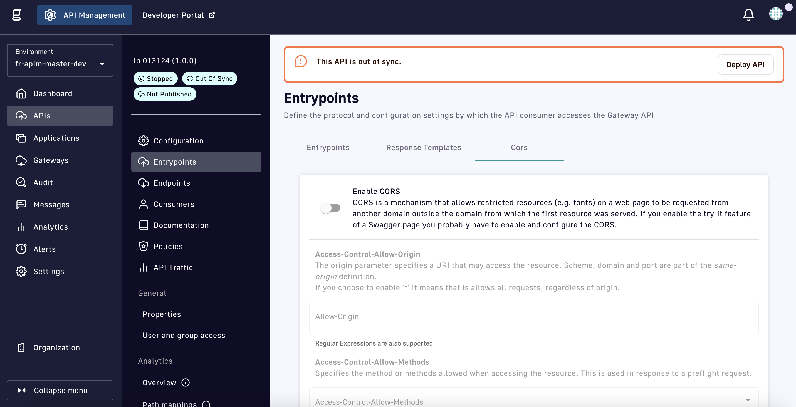

# CORS


As of Gravitee 4.0, users without the `GATEWAY_DEFINITION:UPDATE` permission cannot modify the CORS settings for a v4 API.


## Overview

CORS is a mechanism that allows resources on a web page to be requested from another domain. For background information on CORS, take a look at the [CORS specification](https://www.w3.org/TR/cors). This article will focus on how to configure CORS for your API.


WebSocket entrypoints do not support CORS. CORS will not be applied if an API does not contain at least one of the following entrypoints: HTTP GET, HTTP POST, HTTP Proxy, or SSE.


## Configuration

To configure CORS for an API, follow the steps below.

1. Log in to your Gravitee API Management Console
2. Select **APIs** from the left nav
3. Select the API for which you want to configure CORS
4.  Select the **Edit API** icon

    <figure><figcaption></figcaption></figure>
5. Select **Entrypoints** from the inner left nav
6.  Select the **Cors** tab

    <figure><figcaption></figcaption></figure>
7.  Set the following parameters:

    * **Enable CORS:** Toggle to ON to enable CORS.
    * **Access-Control-Allow-Origin:** Define a URI that can access the resource. Enter \* to allow all requests, regardless of origin.

    

      
A value of * is not recommended for production environments. By allowing cross-origin requests, a server may inadvertently expose sensitive information to unauthorized parties. For example, if a server includes sensitive data in a response that is accessible via CORS, an attacker could use a malicious website to extract that data.

    

    * **Access-Control-Allow-Methods:** Select the method(s) allowed when accessing the resource, which is used in response to a preflight request: `GET`, `DELETE`, `PATCH`, `POST`, `PUT`, `OPTIONS`, `TRACE`, and/or `HEAD`.
    * **Access-Control-Allow-Headers:** Select the HTTP header(s) that can be used when making the actual request, in response to a preflight request. Typically, your request header will include `Access-Control-Request-Headers`, which relies on the CORS configuration to allow its values.
    * **Access-Control-Allow-Credentials:** Toggle ON or OFF to indicate whether the response to the request can be exposed when the credentials flag is true.
    * **Max Age:** Specify how long (in seconds) the results of a preflight request can be cached. This is optional, and a value of `-1` indicates it is disabled.
    * **Access-Control-Expose-Headers:** Define a list of headers that browsers are allowed to access.
    * **Run policies for preflight requests:** Toggle ON for the API Gateway to execute policies for preflight-requests. By default, this is not enabled.8. Click **Save**
