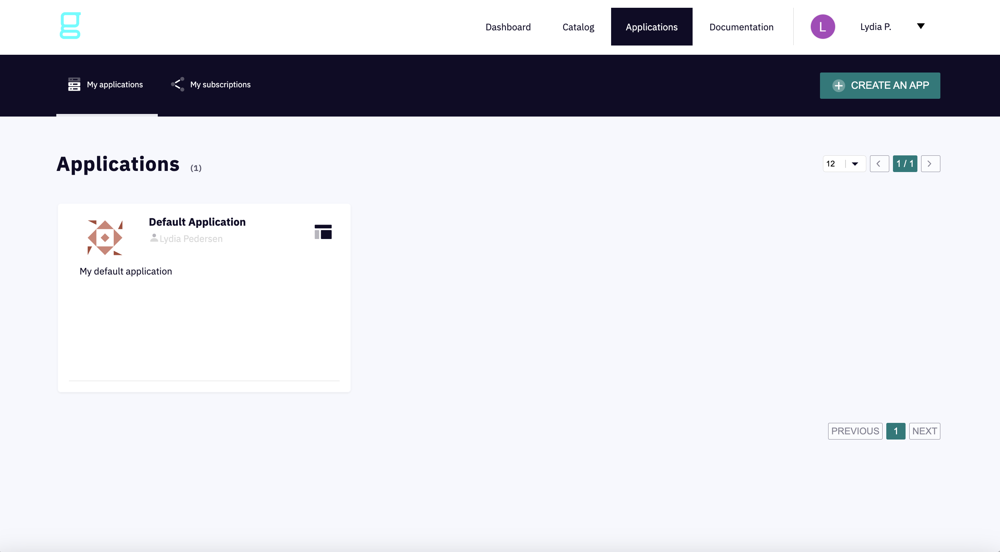
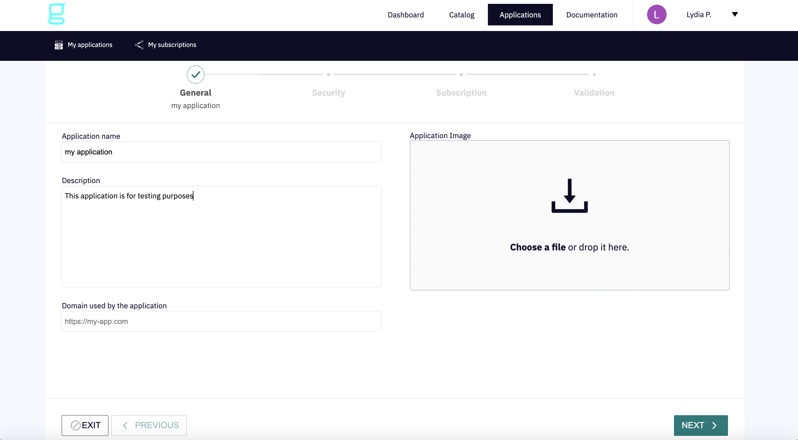
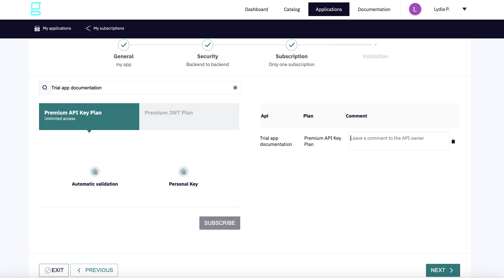
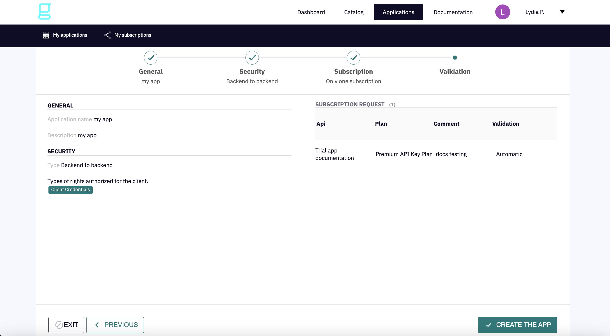
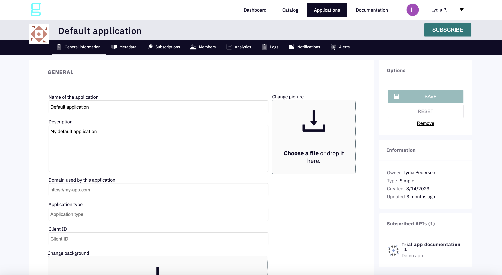
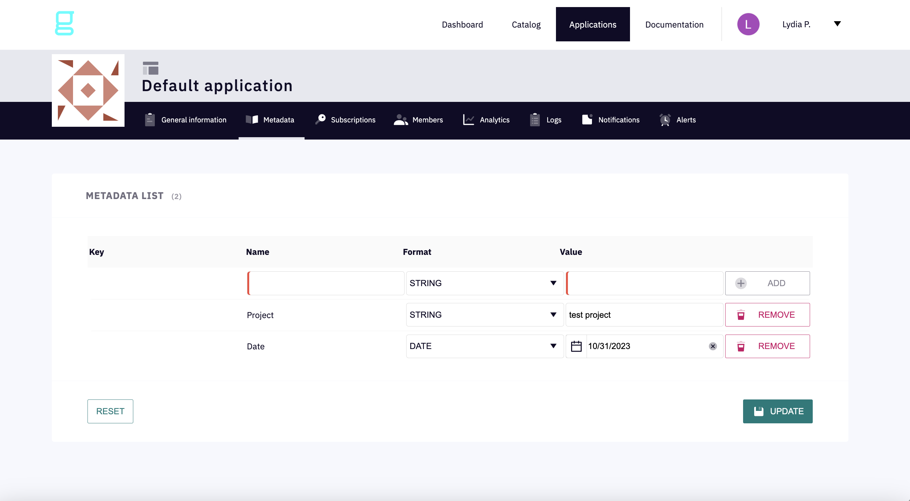
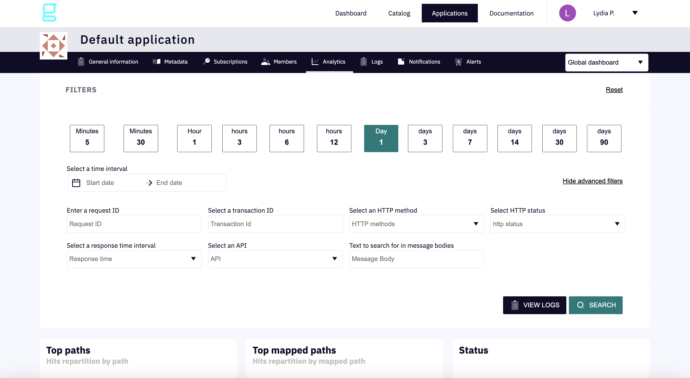
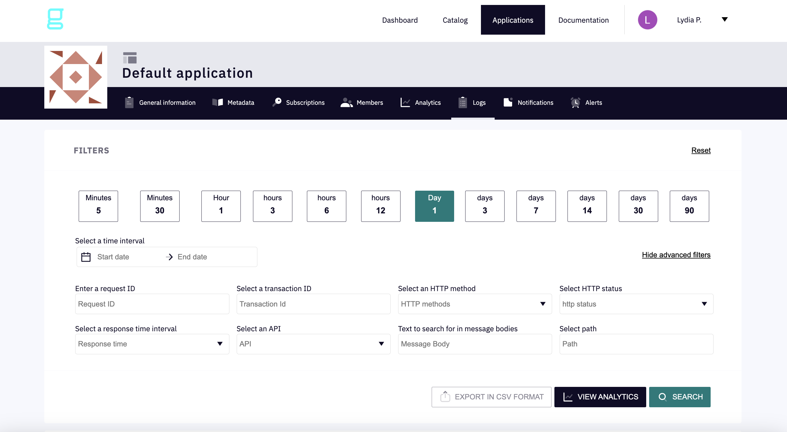
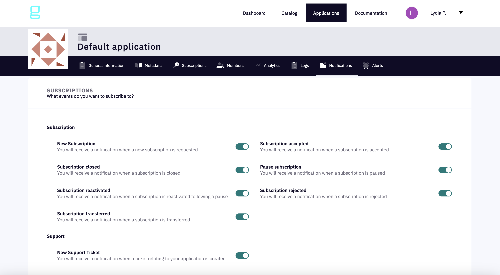

# Create an Application

## Overview

Unless the API has a keyless plan, a consumer must register an application and subscribe to a published API plan to access an API. Applications act on behalf of the user to request tokens, provide user identity information, and retrieve protected resources from remote services and APIs.&#x20;

## Create an application

1.  In the Developer Portal, click on **Applications** in the header&#x20;

    <figure><figcaption>
Create an app
</figcaption></figure>

2.  On the **General** page, specify:&#x20;

    * **Application name:** Give your application a name (required)
    * **Description:** Describe the purpose of your application (required)
    * **Domain used by the application:** Enter the domain to be used by the application or keep the pre-filled default
    * (Optional) **Application Image:** Select an image for your application

    <figure><figcaption>
General application configuration
</figcaption></figure>
3. Select the appropriate tile to configure security for the type of _software application_ you're registering your application for. Each application type requires you to set certain parameters.



A Simple application is hands-free. With this application, you have the ability to define the client ID.&#x20;

Parameters:

* **Type:** Enter the type of application (mobile, web, etc.).
* **Client ID:** Enter the client ID of the application. This field is required to subscribe to certain API plans (OAuth2, JWT).

<figure><figcaption>
Configure a Simple application
</figcaption></figure>



A **SPA**, or single-page application (Angular, React, etc.), is a web application that performs the majority of the user interface logic in a web browser and uses web APIs to communicate with the web server.&#x20;

Parameters:

* Toggle **Authorization Code** and **Implicit** to enable the types of rights authorized for the client. For security, define only the types you need.
* Use the **+** icon to add **Redirect URIs** where the authorization server will send OAuth responses.

<figure><figcaption>
Configure a SPA application
</figcaption></figure>


Until you add a **Redirect URI**, a red "x" will appear in lieu of the green checkmark above **Security**:





A traditional **Web** application (Java, .Net, etc.) performs the majority of the application logic on the server.

Parameters:

* Toggle **Authorization Code**, **Refresh Token**, and **Implicit (Hybrid)** to enable the types of rights authorized for the client. For security, define only the types you need.
* Use the **+** icon to add **Redirect URIs** where the authorization server will send OAuth responses.

<figure><figcaption>
Configure a Web application
</figcaption></figure>


Once you add a **Redirect URI**, a green checkmark will appear in lieu of the red "x" above **Security.**




A **Native** application (iOS, Android, etc.) can be installed directly on a mobile device.

Parameters:

* Toggle **Authorization Code**, **Refresh Token**, **Resource Owner Password**, and **Implicit (Hybrid)** to enable the types of rights authorized for the client. For security, define only the types you need.
* Use the **+** icon to add **Redirect URIs** where the authorization server will send OAuth responses.

<figure><figcaption>
Configure a Native application
</figcaption></figure>


Once you add a **Redirect URI**, a green checkmark will appear in lieu of the red "x" above **Security.**




A **Backend to backend** application is machine to machine and does not require a user interface.&#x20;

Parameters:

* Toggle **Client Credentials** to enable the types of rights authorized for the client. For security, define only the types you need.

<figure><figcaption>
Configure a Backend to backend application
</figcaption></figure>



4.  Use the search field to find an API for your application, then subscribe to it. Optionally, you can leave a comment for the API owner.

    <figure><figcaption>
Subscribe to an API
</figcaption></figure>
5.  Review the information you entered, then click **CREATE THE APP**:

    <figure><figcaption></figcaption></figure>


You have successfully created an application!


## Application options

Once you've created an application, you can click on it and use the header options to review and edit the details of its configuration and usage:

*   **General information:** View and/or modify the application's configuration.

    <figure><figcaption>
General information
</figcaption></figure>

*   **Metadata:** Enter a **Name** and **Value** and use the **Format** selector to define metadata for your application. Use the **ADD** and **UPDATE** buttons to modify your entries.&#x20;

    <figure><figcaption>
Metadata
</figcaption></figure>

*   **Subscriptions:** View the APIs your application is subscribed to. Use the **API** drop-down menu to choose a particular API and the **status** drop-down menu to list all APIs with the selected status.

    <figure><figcaption>
Subscriptions
</figcaption></figure>
* **Members:** View and edit member information:
  *   **MEMBERS LIST:** View the names and roles of current application members.&#x20;

      <figure><figcaption>
Members list
</figcaption></figure>
  *   **ADD A MEMBER:** Use the search field to add a member to the application and assign that member a role.

      <figure><figcaption>
Add a member
</figcaption></figure>
  *   **TRANSFER OWNERSHIP:** Transfer ownership of the application to another user and select a different role for the current primary owner.

      <figure><figcaption>
Transfer ownership
</figcaption></figure>
  *   **INHERITED MEMBERS:** View the names and roles of members inherited from other groups.

      <figure><figcaption>
Inherited members
</figcaption></figure>
*   **Analytics:** Use the available filters to refine the application logs. Scroll down to view other metrics related to the application (top paths, top APIs, response times, etc.).&#x20;

    <figure><figcaption>
Analytics
</figcaption></figure>
*   **Logs:** Use the available filters to view and optionally export refined application analytics. Scroll down to view the logs.&#x20;

    <figure><figcaption>
Logs
</figcaption></figure>

*   **Notifications:** Specify which of your application's subscription events you would like to be notified of.

    <figure><figcaption>
Notifications
</figcaption></figure>

*   **Alerts:** Use the fields and drop-down menus to define an alert. After you **ADD AN ALERT**, it will appear in the **ALERTS LIST**. Application members will be notified via email.

    <figure><figcaption>
Alerts
</figcaption></figure>
