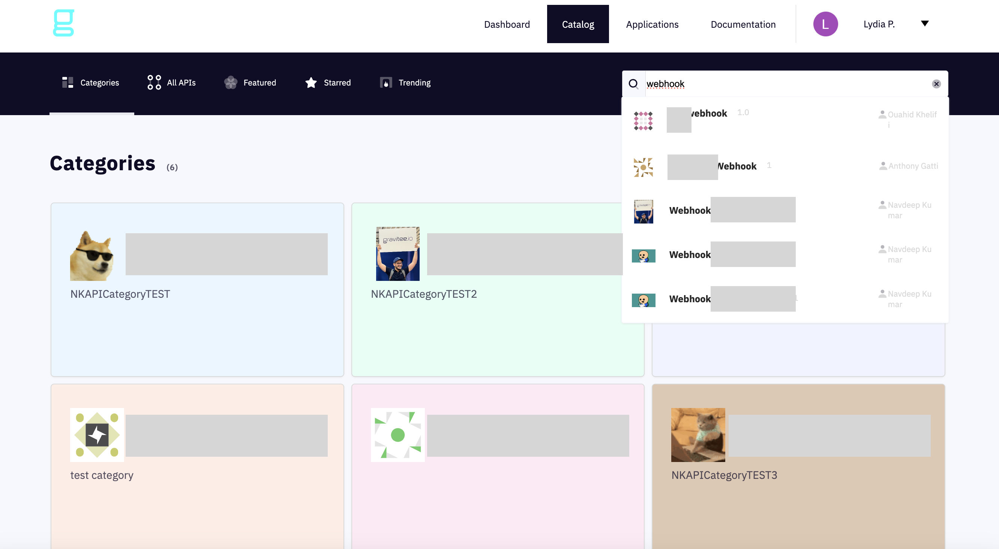
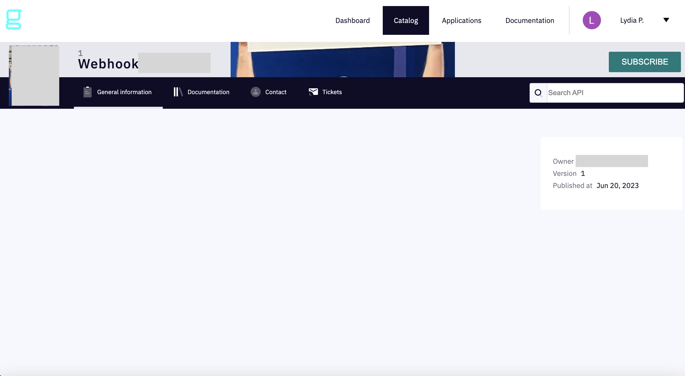

# Webhook Subscriptions

## Overview

API consumers can configure their Webhook subscriptions from the Developer Portal. Configuration involves adding a callback URL, choosing an application, and validating the request.

## Configuration

Before you can define and configure your Webhook subscription, you'll need to find it in the Developer Portal:

1. Click on **Catalog** in the header
2.  (Optional) Use the search field&#x20;

    <figure><figcaption>
Find your Webhook subscription in the Developer Portal
</figcaption></figure>
3.  Click on the subscription, then on **Subscribe**&#x20;

    <figure><figcaption>
Subscribe to your Webhook subscription
</figcaption></figure>
4.  Choose a **PUSH plan.** A PUSH plan is limited to Webhooks and enables you to subscribe to APIs that have a subscription listener (currently also limited to Webhooks).&#x20;

    <figure><figcaption>
Choose a PUSH plan
</figcaption></figure>
5. Next, select your subscription channel and Webhook entrypoint, then define:
   * Callback URL
   * HTTP headers
   * Security config
   * Security type (basic, token, or OAuth2)
   * SSL options:
     * Enable or disable **Verify Host**
     * Enable or disable **Trust all**
     * Define your **Trust store**
     * Define your **Key store**

<figure><figcaption>
Define your Webhook subscription settings
</figcaption></figure>

6.  Next, choose which application will be the subscriber and (optionally) leave a message for the API Owner.&#x20;

    <figure><figcaption>
Choose the subscriber application
</figcaption></figure>
7.  Select **Next** to validate your subscription request &#x20;

    <figure><figcaption>
Submit to validate your Webhook subscription
</figcaption></figure>
