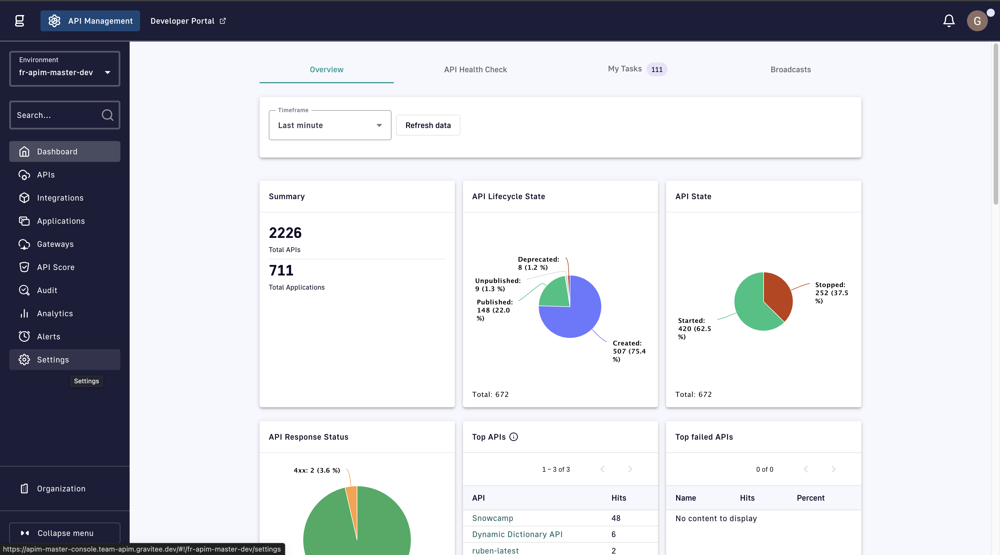
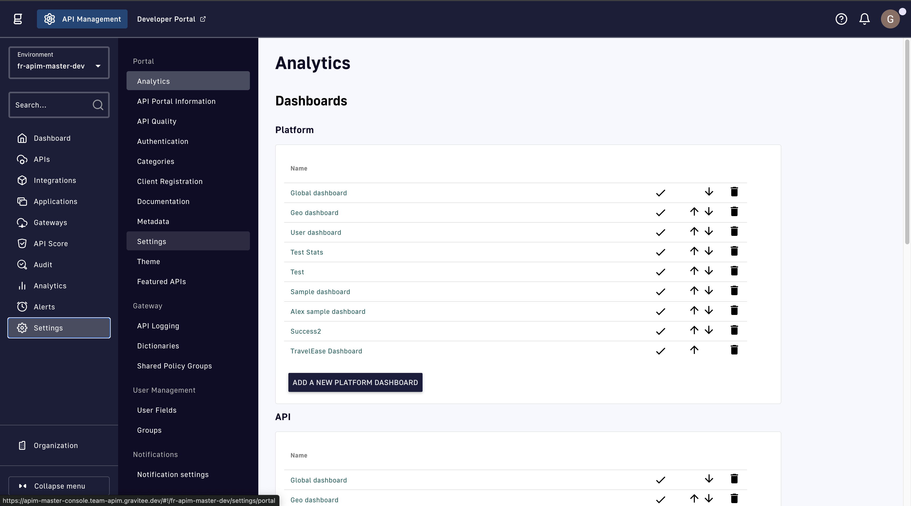

# Layout and Theme

## Category layout

In the Developer Portal catalog, you can easily find an API based on a category it belongs to. Categories can be shown as either header tabs (default) or tiles. To change how categories are displayed:

1. Log in to your APIM Console.
2.  From the home page, click **Settings**.

    <figure><figcaption></figcaption></figure>
3.  In the **Portal** section of the settings menu, click **Settings**.

    <figure><figcaption></figcaption></figure>
4.  Navigate to the **New Developer Portal** section, then click **Open Settings**.

    <figure><figcaption></figcaption></figure>
5.  Developer Portal settings open in a new browser tab. Select **Catalog** from the menu.

    <figure><figcaption></figcaption></figure>
6.  Use the **Category View Mode** drop-down menu to select **Tabs (Default)** or **Tiles**.

    <figure><figcaption></figcaption></figure>

### Verification

To verify your selection go to your Developer Portal.

If you have [set the new Developer Portal as your default Developer Portal](configure-the-new-portal.md), you can access it from the Developer Portal button in your APIM Console header. If you have not set the new Developer Portal as your default, follow the instructions to [enable the new Developer Portal](configure-the-new-portal.md).

The Developer Portal opens in a new browser tab. Select the **Catalog** header to view your categories.

Below is the view of categories as tabs:

<figure><figcaption>
Tabs category view
</figcaption></figure>

Below is the view of categories as tiles:

<figure><figcaption>
Tiles category view
</figcaption></figure>

From the tile view, click a category tile to display all of the APIs that match that category. To return to the category tile view, click the **Catalog** link above the APIs.

<figure><figcaption></figcaption></figure>
