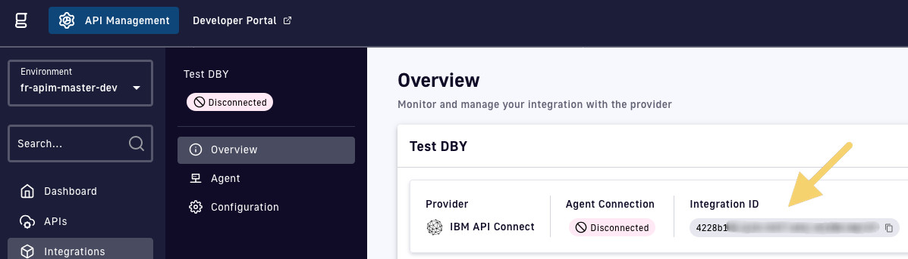

# IBM API Connect

IBM API Connect is an API Management platform for use in the API Economy.
IBM API Connect enables users to create, assemble, manage, secure and socialize web application programming interfaces (APIs).

## Prerequisites

The federation agent handle 3 types of IBM API Connect `cloud`, `cloud-reserved-instance` and `self-hosted` (default cloud).

## 1. Create a IBM API Connect integration in the Gravitee APIM Console

Head to the Gravitee APIM Console, open the Integrations section in the left menu, and create a new Solace integration.&#x20;

Once you've created the integration, copy the integration ID that will be visible on the integration overview tab, you'll use this later:

<figure><figcaption></figcaption></figure>

## 2. Configure the IBM API Connect federation agent

The IBM API Connect federation agent will need the following configuration parameters in order to connect to your instance:

* Client Id
* Client secret
* Platform API URL address

To generate API Keys for IBM API Connect, click on your profile icon and select the My API Keys option.
Alternatively, you can also add `/apikey` the path of your website address when you're at the portal home location.  
Later you click on the Add button (make sure you have the required permissions to see it) and generate a new key.
Once you create a key you should see other information required to set up the agent.

## 3. Run the IBM API Connect federation agent with Docker

In this guide, we'll run the federation agent using Docker.

Copy and save the following into a Docker Compose file called `docker-compose.yaml`:

```yaml
services:
  integration-agent:
    image: ${APIM_REGISTRY:-graviteeio}/federation-agent-ibm-api-connect:${AGENT_VERSION:-latest}
    restart: always
    volumes:
      - ./JGOlogback.xml:/opt/graviteeio-federation-agent/config/logback.xml
    environment:
      - gravitee_integration_connector_ws_endpoints_0=${WS_ENDPOINTS}
      - gravitee_integration_connector_ws_headers_0_name=Authorization
      - gravitee_integration_connector_ws_headers_0_value=bearer ${WS_AUTH_TOKEN}
      - gravitee_integration_providers_0_integrationId=${INTEGRATION_ID}
      - gravitee_integration_providers_0_type=ibm-api-connect
      # authentication
      - gravitee_integration_providers_0_configuration_apiKey=${API_KEY}
      - gravitee_integration_providers_0_configuration_clientId=${CLIENT_ID}
      - gravitee_integration_providers_0_configuration_clientSecret=${CLIENT_SECRET}
      - gravitee_integration_providers_0_configuration_ibmInstanceType=${IBM_INSTANCE_TYPE:-cloud}
      # targeting
      - gravitee_integration_providers_0_configuration_organizationName=${ORGANIZATION_NAME}
      - gravitee_integration_providers_0_configuration_platformApiUrl=${PLATFORM_API_URL}
      - gravitee_integration_providers_0_configuration_0_catalog=${IBM_0_CATALOG:-}
      - gravitee_integration_providers_0_configuration_1_catalog=${IBM_1_CATALOG:-}
```

Next, create a file named `.env` in the same directory. We'll use it to set the required Docker Compose variables. Fill the values in this file from those you obtained in [step 2](solace.md#id-2.-configure-the-azure-federation-agent).

```bash
## GRAVITEE PARAMETERS ##

# Gravitee APIM management API URL, typically suffixed with the path /integration-controller
WS_ENDPOINTS=https://[your-APIM-management-API-host]/integration-controller

# Gravitee APIM token to be used by the agent
WS_AUTH_TOKEN=[your-token]

# ID of the APIM integration you created for this agent
INTEGRATION_ID=[your-integration-id]

# APIM organization ID, example: DEFAULT
WS_ORG_ID=[organization-id]

## IBM API Connect ##

# IBM API Connect endpoint
PLATFORM_API_URL=

# IBM API Connect organisation name
ORGANIZATION_NAME=[your-organisation]

# Optionally you can filter for one or more catalog
IBM_0_CATALOG=[your-catalog]

# authentication

# Type of instance (allowed values: cloud, cloud-reserved-instance, self-hosted)
IBM_INSTANCE_TYPE=

# Client ID and Client Secret for IBM Cloud are required only for self-hosted or cloud instance type
CLIENT_ID=[client-id]
CLIENT_SECRET=[client-secret]
API_KEY=[api-key]
```

Run the following command to make sure you've got the latest available docker image:

```bash
docker compose pull
```

Then you can start the agent in the background with the following command:

```bash
docker compose up -d
```

In the Gravitee API Management console, after refreshing, you should now see the agent's status set to `Connected:`

<figure><figcaption></figcaption></figure>

If your **Agent Connection** still shows as `Disconnected`, then please inspect the agent's container logs. There you should find error logs that will help you troubleshoot.

## Limitations

The agent has a limit on the size of the OpenAPI document.
We limit the size to 1 000 000B (about 1MB).
The APIs with too big documentation are ingested without documentation, and we can find a message in the logs of the agent:

```
The length of the API: {apiId}/{ApiName} OAS document is too large {sizeB} ({sizeHumanReadable}). The limit is {sizeB} ({sizeHumanReadable}). The document will not be ingested.
```
