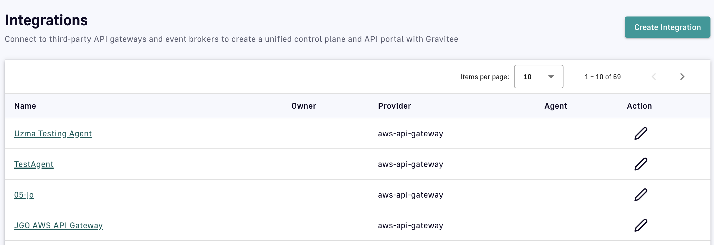
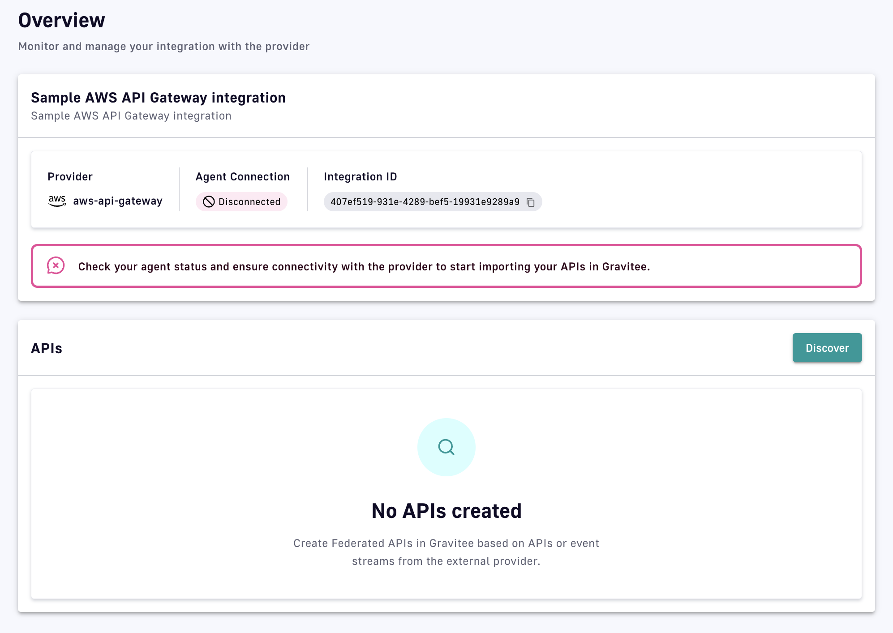

# Integrations

## Introduction

Integrations are components that allow users to connect Gravitee to 3rd-party API gateways or event brokers to discover, then import, APIs and other assets. [Integrations](integrations.md#integration-management) are managed and configured through the Gravitee APIM Console.&#x20;

Each integration is paired with a component called an [agent](integrations.md#the-federation-agent), which handles the communication between the 3rd-party provider and Gravitee.

## Integration management

### Create an integration

To create an integration, the user selects an integration type and provides basic information, such as a name and description. Once created, the integration must be connected to an agent to be fully functional.

1. Log in to your APIM Console
2. Select **Integrations** from the left nav
3.  Click **Create Integration**&#x20;

    <figure><figcaption></figcaption></figure>
4. Choose an integration provider
5.  Enter general information for the integration&#x20;

    <figure><figcaption></figcaption></figure>
6.  Click **Create Integration**&#x20;

    <figure><figcaption></figcaption></figure>

### View or edit an integration

Gravitee automatically detects which integrations were installed by the customer. Depending on the integration, parts of the UI are dynamic, such as forms for entering 3rd-party provider connection parameters. These forms adapt based on the schema provided by the integration.&#x20;

To view or edit an integration:

1. Log in to your APIM Console
2. Select **Integrations** from the left nav
3.  Click on the integration you're interested in&#x20;

    <figure><figcaption></figcaption></figure>
4.  From the inner left nav, select **Overview** to run discovery and edit discovered APIs, or select **Configuration** to edit the general information or delete the integration (if no federated APIs are linked to it)&#x20;

    <figure><figcaption></figcaption></figure>

    
    Integration status provides the user with critical information, such as if the integration is active and can reach the agent, if the agent is running and can reach the provider, and if the agent is receiving errors.
    

### Delete an integration


An integration can only be deleted if it has no associated federated APIs.&#x20;


To delete an integration:

1. Log in to your APIM Console
2. Select **Integrations** from the left nav
3. Click on the integration you're interested in&#x20;
4. Select **Configuration** from the inner left nav
5.  In the **Danger Zone** section, click **Delete Integration**&#x20;

    <figure><figcaption></figcaption></figure>

    
    If **Delete Integration** is grayed out, you must first click **Delete APIs** to delete the federated APIs associated with the integration.
    

### Permissions

You can control which user roles can manage Integrations in Gravitee.

The environment-level INTEGRATION permission corresponds to the following CRUD permissions:

* **Create:** Create a new integration
* **Read:** View an integration’s details
* **Update:** Modify an integration’s attributes, refresh agent status.
* **Delete:** Delete an integration

By default, user roles have the following permissions:

* **ADMIN:** CRUD
* **API\_PUBLISHER:** CRUD
* **USER:** \_R\_\_

## The federation agent

A federation agent is an executable (e.g., `docker-compose` and configuration files) that integrates with a 3rd-party provider and communicates with an integration defined in Gravitee. For an integration to function, its associated agent to be properly configured and deployed. Agents are necessary because the Gravitee control plane (APIM Console and Management API) may not have direct network access to the 3rd-party provider’s management API. You may also simply prefer to not provide Gravitee with credentials to access your platforms, particularly if the Gravitee control plane is SaaS.

<figure><figcaption></figcaption></figure>

Follow the steps below to set up and run a local instance of a federation agent that connects to a 3rd-party provider.
