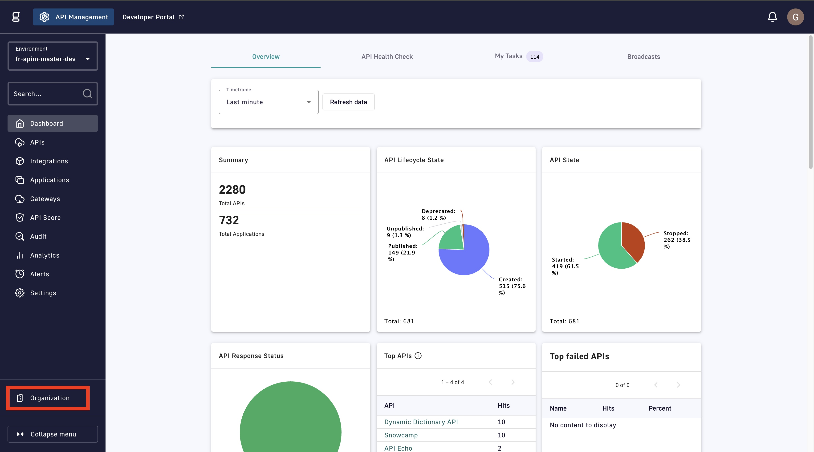
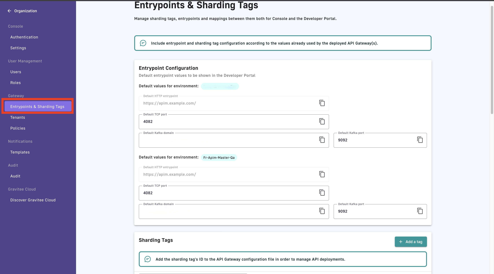
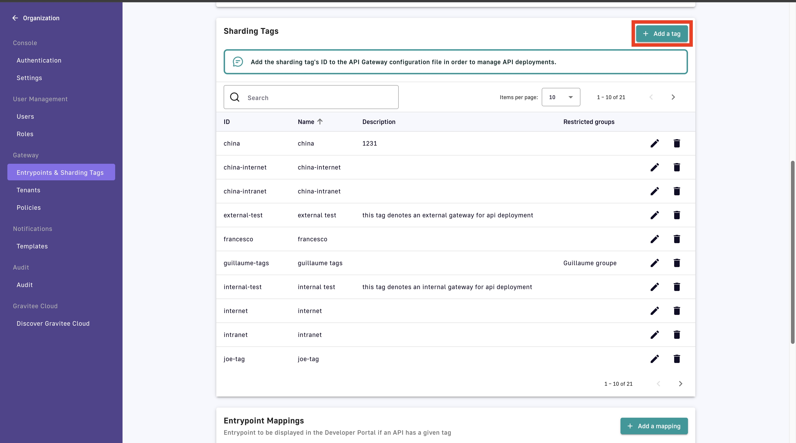
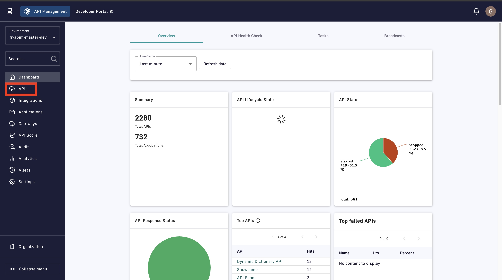
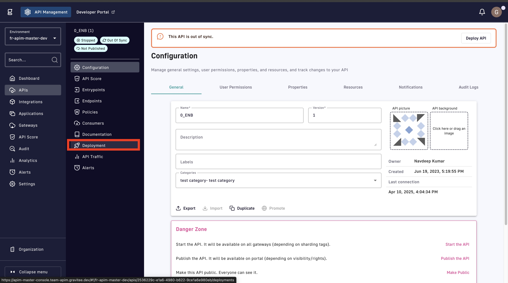
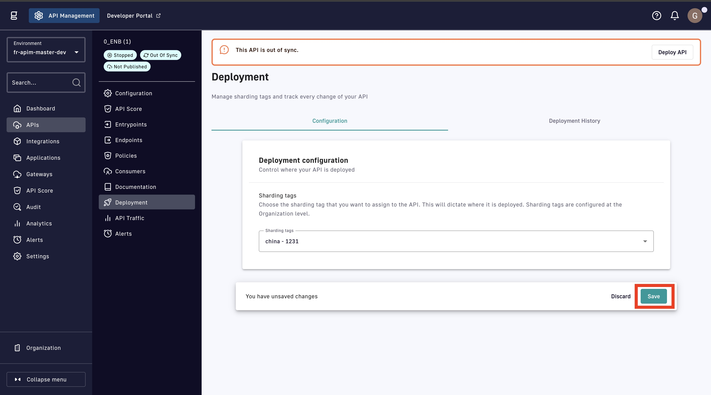
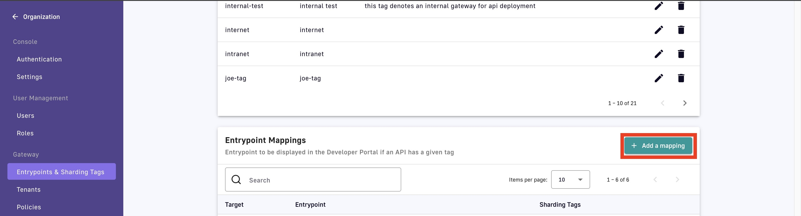

# Sharding Tags

## Overview

Sharding tags allow you to “tag” Gateways with a keyword and deploy an API to a Gateway with a certain tag. You can apply sharding on APIM Gateway instances either at the system property level or with `gravitee.yml`.

Gateways can be tagged with one or more sharding tags. Additionally, the `!` symbol can be placed before the tag name to specify exclusion rules.

To learn more about how to deploy APIs to specific Gateways based on sharding tags, refer to [Configure Deployments](../configure-v2-apis/proxy-settings.md).

## Tagged Gateway/API behavior

API deployment is impacted by how tags are applied to APIs and Gateways.

### Rules

* Tagged Gateway instances will never deploy tagless APIs.
* Tagless Gateway instances will deploy every API, regardless of how the APIs are tagged.
* An API defined with a specific tag will only be deployed on a Gateway that has been assigned that tag.

### Examples

* A tagless API will not be deployed on a Gateway tagged with `x`.
* An API tagged with `x` will be deployed on a tagless Gateway.
* A tagless API will be deployed on a tagless Gateway.
* An API defined with tag `x` will be deployed on a Gateway that has been assigned tag `x`.
* An API defined with tag `x` will be deployed on a Gateway that has been assigned tag `!y`. The tag `!y` means that the Gateway has been assigned every tag but `y`.

## Configure sharding tags for your internal and external Gateways

If you have an architecture that includes both DMZ Gateways and internal corporate Gateways, you can tag these Gateways as external-only and internal-only, as shown in the following diagram:

<figure><figcaption></figcaption></figure>

Before sharding tags can be defined in your APIM Console, you must modify `gravitee.yaml` to assign a tag to a Gateway. For example:

```
DMZ Gateways: 
tags: ‘external’
```

```
Internal Network Gateways:
tags: ‘internal’
```

You can also exclude Gateways from tags. For example, the following sharding tag definition configures a Gateway to host APIs that are not dedicated to partners:

```
tags: ‘product,store,!partner’
```

Once Gateways have been tagged, these sharding tags must be defined within API Manager.

## Configure sharding tags for your APIs

To configure sharding tags, complete the following steps:

* [#create-a-tag-in-the-apim-console](sharding-tags.md#create-a-tag-in-the-apim-console "mention")
* [#add-sharding-tags-to-your-apis](sharding-tags.md#add-sharding-tags-to-your-apis "mention")
* [#add-the-tag-id-to-gravitee.yml-or-with-environment-variables](sharding-tags.md#add-the-tag-id-to-gravitee.yml-or-with-environment-variables "mention")

### Create a tag in the APIM Console

1.  In the **Dashboard**, click **Organization**.

    <figure><figcaption></figcaption></figure>
2.  In the **Organization** menu, click **Entrypoints & Sharding Tags**.

    <figure><figcaption></figcaption></figure>
3.  Navigate to **Sharding Tags**, and then click **+ Add a tag**.

    <figure><figcaption></figcaption></figure>
4. In the **Create a tag** pop-up window, add the following information:
   1. In the **Name** field, add the name of your tag.
   2. (Optional) In the **Description** field, add a description for the tag.
   3.  (Optional) From the **Restricted groups** drop-down menu, select the groups that you want to be able to deploy to this tag.

       <figure><figcaption></figcaption></figure>
5. Click **Ok**. The sharding tag now appears in the list of **Sharding Tags**.

### Add sharding tags to your APIs

1.  From the **Dashboard**, click **APIs**.

    <figure><figcaption></figcaption></figure>
2.  In the **APIs** screen, select the API to which you want to add a sharding tag.

    <figure><figcaption></figcaption></figure>
3.  In the **APIs** menu, click **Deployment**.

    <figure><figcaption></figcaption></figure>
4. In the **Deployment** screen, navigate to the **Deployment configuration** section.
5.  From the **Sharding tags** drop-down menu, select the sharding tag that you want to add to the API.

    <figure><figcaption></figcaption></figure>
6.  In the **You have unsaved changes** pop-up, click **Save**.

    <figure><figcaption></figcaption></figure>

### Add the tag ID to `gravitee.yml` or with environment variables

1. Find the ID for your sharding tag(s). To find the ID of your sharding tag(s), complete the following substeps:
   1. From the **Dashboard**, click **Organization**.
   2. In the **Organization** menu, click **Entrypoints & Sharding Tags**.
   3. Navigate to the **Sharding Tags** section. The ID of your sharding tag is in the **ID** column.
2. Add the ID of your sharding tag(s) to either your `gravitee.yml` file or as environment variables by completing the set of following steps that matches your preference:



In your `gravitee.yml` file, add the following configuration:


```yaml
# Sharding tags configuration
# Allows to define inclusion/exclusion sharding tags to only deploy a part of APIs. To exclude just prefix the tag with '!'.
#tags: <tag 1>, <tag 2>, !<tag 3>
```


* Uncomment `#tags: <tag 1>, <tag 2>, !<tag 3>`.
* Replace `<tag 1>, <tag 2>, !<tag3>` with a comma-separated list of your sharding tag IDs.
* To exclude a tag from a Gateway configuration, add an exclamation mark (!) before the tag.



Add the following environment variable:


```bash
gravitee_tags=<tag 1>,<tag 2>,!<tag3>
```


* Replace `<tag 1>, <tag 2>, !<tag3>` with a comma-separated list of your sharding tag IDs.
* To exclude a tag from a Gateway configuration, add an exclamation mark (!) before the tag.



## Map entrypoints to sharding tags

You can also map different entrypoint URLs to specific sharding tags in the Developer Portal. The Portal displays available entrypoints based on an API's tag(s).


The following process applies to both v2 and v4 APIs.


For example, to tell Gravitee API Manager to apply the “internal test” tag to all APIs tagged with this entrypoint:

1.  In the **Dashboard**, click **Organization**.

    <figure><figcaption></figcaption></figure>
2.  In the **Organization** menu, click **Entrypoints & Sharding Tags**.

    <figure><figcaption></figcaption></figure>
3.  Navigate to **Entrypoint Mappings**, and then click **+ Add a mapping**.

    <figure><figcaption></figcaption></figure>
4. From the **+ Add a mapping** drop-down menu, select one of the following entrypoints:
   * HTTP
   * TCP
   * Kafka
5. In the **Create an entrypoint** pop-up window, enter the following information based your entrypoint:



1) From the **Sharding tags** drop-down menu, select the sharding tags that you want to map to the entrypoint.
2)  In the **Entrypoint url** field, enter your entrypoint URL.

    <div align="left"><figure><figcaption></figcaption></figure></div>
3) Click **Ok.**



1. From the **Sharding tags** drop-down menu, select the sharding tags that you want to map to this entrypoint.
2.  In the **Default TCP port** field, type the number of your TCP port.

    <div align="left"><figure><figcaption></figcaption></figure></div>
3. Click **Ok**.



1. From the **Sharding tags** drop-down menu, select the sharding tags that you want to map to this entrypoint.
2. In the **Default Kafka domain** field, type your Default Kafka domain.
3.  In the **Default Kafka port** field, type your default Kafka port.

    <div align="left"><figure><figcaption></figcaption></figure></div>
4. Click **Ok**.



Your entrypoint mapping is displayed in **Entrypoint Mappings**.


You've just learned how to configure sharding tags for your Gravitee API Gateways. To apply sharding tags to APIs to control where those APIs are deployed, refer to [this documentation](../configure-v2-apis/proxy-settings.md).


nn
