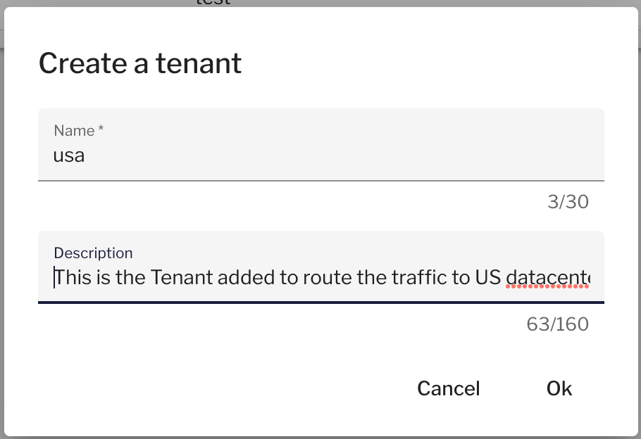
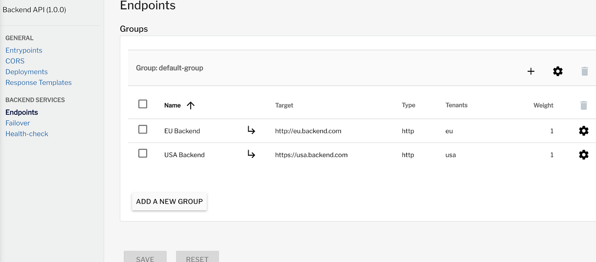

# Tenants

## Overview

Tenants are a way to leverage Gravitee's multi-endpoint capability, which is the ability to specify multiple upstream systems per single API. Gravitee allows you to assign endpoints and Gateways to specific tenants to control the endpoints to which requests are proxied.

## Tagged Gateway / API endpoint behavior

Endpoint deployment is impacted by how tags are applied to API endpoints and Gateways.

### Rules

* Tagged Gateway instances will never deploy APIs to tagless API endpoints.
* Tagless Gateway instances will deploy APIs to every API endpoint, regardless of how the API endpoints are tagged.
* A Gateway tagged with a specific tenant will only deploy APIs to API endpoints that have been tagged with that tenant.
* If neither a Gateway nor an API endpoint are tagged with tenants, the Gateway will deploy the API to the API endpoint.

## Configuring Tenants <a href="#id-9c4f" id="id-9c4f"></a>

To explain tenant usage and behavior, we will build off of our example use case for [sharding tags](sharding-tags.md#configure-sharding-tags-for-your-gravitee-api-gateways). A single API can be deployed to many different Gateways and endpoints, but by using sharding tags you can specify the target Gateway(s), and by using tenants you can specify the target endpoint(s).

Similar to sharding tags, tenant configuration is a two-step process. You must “tag” a Gateway to identify in which region it has been deployed. To demonstrate, we will add the following configuration to each Gateway’s `gravitee.yaml` file, which tags all USA-deployed Gateways with “usa" and all EU-deployed Gateways with "eu":

```yaml
# Multi-tenant configuration
# Allow only a single-value
USA Region: tenant: ‘usa’
EU Region: tenant: ‘eu’
```

Once the Gateway has been configured, the tenant definition must be added via the API Management Console:

1.  Navigate to **Organization Settings** and select **Tenants**_**.**_ Select **Add a tenant** and enter the value for each of your regions, e.g., “usa” and “eu." We also recommend giving each tenant a descriptive name.

    <div align="left"><figure><figcaption></figcaption></figure></div>
2.  Next, configure the Backend and Customer APIs by adding two different endpoints. In our example, these will point to the USA and EU upstream systems (the backend server or the Customer API, depending on which API you are configuring).

    <figure><figcaption></figcaption></figure>
3.  Specify which tenant a backend will apply to. Our two endpoints each point to different backends and are each assigned to a different tenant:

    <figure><figcaption></figcaption></figure>


Now that the two endpoints are defined, Gateways GWI1, GWI2, GWI3 and GWI4 will apply this logic:

* If a tenant configuration is “eu,” a request to Backend API is proxied to `https://eu.backend.com`
* If a tenant configuration is “usa,” a request to Backend API is proxied to `https://usa.backend.com`

Similarly, Gateways GWE1, GWE2, GWE3, GWE4 will apply the following logic when serving partner requests to the Customer API:

* If a tenant configuration is “eu,” a request to Customer API is proxied to `https://eu.customer-api.com`
* If a tenant configuration is “usa,” a request to Backend API is proxied to `https://usa.backend-api.com`

