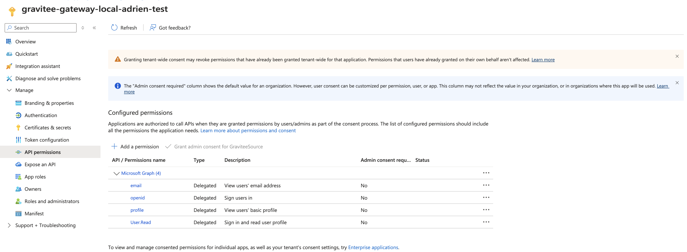

# Next-Gen Cloud - Hybrid Gateway Install on Kubernetes


**Gravitee Cloud is recommended for new installations to reduce deployment complexity.**\
Let Gravitee run the control plane and database for you. With Gravitee Cloud, you only need to run the data planes. To register for a Gravitee Cloud account, go to the [Gravitee Cloud registration page](https://cloud.gravitee.io/).


## Overview

This guide explains how to install and connect a Hybrid Gateway to Gravitee Cloud. In this context, the Hybrid Gateway is hosted on-premise.

## Prerequisites

Before you install a Hybrid Gateway, complete the following steps:

* Install `helm`.
* Install `kubectl`.
* Ensure you have access to Gravitee Cloud, with permissions to install new Gateways.
* Ensure you have access to the on-premise Kubernetes cluster where you want to install the Gateway.
* Ensure the on-premise target environment has outbound Internet connectivity to Gravitee Cloud using HTTPS/443.

## Install the Gateway

To install the Gravitee Gateway, complete the following steps:

1. [#prepare-gravitee-cloud-for-your-new-hybrid-gateway](./#prepare-gravitee-cloud-for-your-new-hybrid-gateway "mention")
2. [#install-redis](./#install-redis "mention")
3. [#prepare-your-gravitee-values.yaml-file-for-helm](./#prepare-your-gravitee-values.yaml-file-for-helm "mention")
4. [#install-with-helm](./#install-with-helm "mention")

### Prepare Gravitee Cloud for your new Hybrid Gateway

1.  Log in to [Gravitee Cloud](https://cloud.gravitee.io/).\


    <figure><figcaption></figcaption></figure>
2.  From your Gravitee Cloud Dashboard, navigate to **Gateways**, and then click **Deploy Gateway**.\


    <figure><figcaption></figcaption></figure>
3.  In the **Choose Gateway Deployment Method** pop-up window, select **Hybrid Gateway**.\


    <figure><figcaption></figcaption></figure>
4.  Select the **environment** to connect to your Hybrid Gateway.\


    <figure><figcaption></figcaption></figure>
5.  In **URLs & Domains**, enter the names of the HTTP domains through which you can access your Hybrid Gateway. By default, all URLs enforce HTTPS.\


    
    You must configure these HTTP domains/hostnames in your load balancer or ingress where you run the Gateway.
    


    <figure><figcaption></figcaption></figure>
6.  To retrieve your Cloud Token and License key, click **Generate Installation Details**.\


    <figure><figcaption></figcaption></figure>
7.  Copy your **Cloud Token** and **License Key** and store them for later.\


    <figure><figcaption></figcaption></figure>
8.  Click **Return to Overview**. In the **Gateways** section of the **Overview** page, you can see your configured Gateway.\


    <figure><figcaption></figcaption></figure>

### Install Redis

To support caching and rate-limiting, you must install Redis into your Kubernetes cluster. For more information, see [Bitnami package for Redis®](https://artifacthub.io/packages/helm/bitnami/redis).

1.  Install Redis with Helm using the following command, which also creates a new `gravitee-apim` namespace:  \


    ```bash
    helm install gravitee-apim-redis oci://registry-1.docker.io/bitnamicharts/redis --create-namespace --namespace gravitee-apim
    ```


2.  Extract the Redis hostname from the command output and save it for future use. The following sample output lists `gravitee-apim-redis-master.gravitee-apim.svc.cluster.local` as the Redis hostname:\


    ```sh
    Pulled: registry-1.docker.io/bitnamicharts/redis:21.2.1
    Digest: sha256:b667ef7d2da1a073754e0499a93bb9acc6539e57ce971da39ee5fd2c222a4024
    NAME: gravitee-apim-redis
    LAST DEPLOYED: DDD MMM DD HH:MM:SS YYYY
    NAMESPACE: gravitee-apim
    STATUS: deployed
    REVISION: 1
    TEST SUITE: None
    NOTES:
    CHART NAME: redis
    CHART VERSION: 21.2.1
    APP VERSION: 8.0.2

    ** Please be patient while the chart is being deployed **

    Redis can be accessed on the following DNS names from within your cluster:

        gravitee-apim-redis-master.gravitee-apim.svc.cluster.local for read/write operations (port 6379)
        gravitee-apim-redis-replicas.gravitee-apim.svc.cluster.local for read-only operations (port 6379)

    To get your password run:
        export REDIS_PASSWORD=$(kubectl get secret --namespace gravitee-apim gravitee-apim-redis -o jsonpath="{.data.redis-password}" | base64 -d)
    ```


3.  Use the following command to output the Redis password. Save this password for future use.\


    ```bash
    kubectl get secret --namespace gravitee-apim gravitee-apim-redis -o jsonpath="{.data.redis-password}" | base64 -d
    ```

### Prepare your Gravitee `values.yaml` file for Helm

1.  Copy the following Gravitee `values.yaml` file. This is the base configuration for your new Hybrid Gateway.\


    
    ```yaml
    #This is the license key provided in your Gravitee Cloud acount 
    #example: Ic5OXgAAACAAAAACAAAADAAAAAhhbGVydC1lbmdpbmVpbmNsdWRlZAAAABsAAAACAAAABwAAAAhjb21wYW55R3Jhdml0ZWUAAAAxAAAAAgAAAAUAAAAgZW1haWxwbGF0Zm9ybS10ZWFtQGdyYXZpdGVlc291cmNlLmNvbQAAABoAAAALAAAACmV4cGlyeURhdGUAAAGhUXU7/wAAACAAAAACAAAACAAAAAxmZWF0dXJlc2FsZXJ0LWVuZ2luZQAAACEAAAAMAAAACWxpY2Vuc2VJZJTWw5qIQT4bEYqYFx9wSH4AAAEcAAAAAQAAABAAAAEAbGljZW5zZVNpZ25hdHVyZULCHNcIqMuFwEMkSCgE4Q/42YSVluW/vvMtaHZWJ5Xoh3rsWEjCMg8Ku2cTKuSP7FzR/b8GVedDJqxf+o2n8B/LV+WwzZjOAi09EBfLmTLOzzXFNp1KRDk3G4rrKznJ1Kqz9EXjyNAiT/c7en3om6Lx0A4BscZtu6k6i1pAnfHhotJkHMIdNkDqSU4fkyAH6FS+NYcLEcudaeeRr2Th/Dvyn0py7xOUNicgXdBjEXJXMF2vxyNkm0kML4ADG12++dZyG2kgGYg5+A8UdABGxCvIfNsl9uVuP2F5ACr8Uc73HytKpIaZqz71RMxQDuJtRzmkkGxHajJJeZWQZXtLdBoAAAARAAAAAgAAAAUAAAAAcGFja3MAAAAiAAAAAgAAAA8AAAAHc2lnbmF0dXJhfgzanZXN0U0hBLTI1NgAAABgAAAACAAAABAAAAAh0aWVydW5pdmVyc2U=
    license:
        key: "<license_key>"
    #This section controls the Management API component deployment of Gravitee. 
    #It is disabled for a hybrid gateway installation
    api:
        enabled: false
    #This section controls the Developer Portal API component deployment of Gravitee. 
    #It is disabled for a hybrid gateway installation
    portal:
        enabled: false
    #This section controls the API Management Console component deployment of Gravitee. 
    #It is disabled for a hybrid gateway installation
    ui:
        enabled: false
    #This section controls the Alert Engine component deployment of Gravitee. 
    #It is disabled for a hybrid gateway installation
    alerts:
        enabled: false
    #This section controls the Analytics Database component deployment of Gravitee based on ElasticSearch. 
    #It is disabled for a hybrid gateway installation
    es:
        enabled: false
        
    #This section has multiple parameters to configure the API Gateway deployment  
    gateway:
        replicaCount: 1 #number of replicas of the pod
        image:
            repository: graviteeio/apim-gateway
            # tag: 4.7.6 #The gateway version to install. It has to align with the control plane of your Gravitee Cloud
            pullPolicy: IfNotPresent
        autoscaling:
            enabled: false
        podAnnotations:
            prometheus.io/path: /_node/metrics/prometheus
            prometheus.io/port: "18082"
            prometheus.io/scrape: "true"
        #Sets environment variables.  
        env:
            #Gravitee Cloud Token. This is the value gathered in your Gravitee Cloud Account when you install a new Hybrid Gateway.
            - name: gravitee_cloud_token
              value: "<cloud_token>"
        
        #Configure the API Gateway internal API. 
        services:
            #The following sections enables the exposure of metrics to Prometheus. 
            metrics:
                enabled: true
                prometheus:
                    enabled: true

            #This enables the Gravitee APIM Gateway internal API for monitoring and retrieving technical information about the component.
            core:
                http:
                    enabled: true
            sync:
                kubernetes:
                    enabled: false
            #disables bridge mode. unecessary for a hybrid gateway.
            bridge:
                enabled: false
        service:
            type: LoadBalancer
            externalPort: 8082
            loadBalancerIP: 127.0.0.1
        ingress:
            enabled: false
        resources:
            limits:
                cpu: 500m
                memory: 1024Mi
            requests:
                cpu: 200m
                memory: 512Mi
        deployment:
            revisionHistoryLimit: 1
            strategy:
                type: RollingUpdate
                rollingUpdate:
                    maxUnavailable: 0
        #Reporter configuration section.
        #no additional reporter enabled for the hybrid gateway outside of the default Cloud Gateway reporter
        reporters:
            file:
                enabled: false
        terminationGracePeriod: 50
        gracefulShutdown:
            delay: 20
            unit: SECONDS
        ratelimit:
            redis:
                host: "<redis_hostname>"
                port: 6379
                password: "<redis_password>"
                ssl: false
            
    ratelimit:
        type: redis
            
    # Auto-download the Gravitee Redis plugin
    redis:
        download: true
    ```
    


2. Make the following modifications to your `values.yaml` file:
   * Replace `<cloud_token>` with your Cloud Token.
   * Replace `<license_key>` with your License Key.
   * Replace `<redis_hostname>` with your extracted Redis hostname.
   * Replace `<redis_password>` with your extracted Redis password.
3. Save your Gravitee `values.yaml` file.

### Install with Helm

1.  Add the Gravitee Helm chart repo to your Kubernetes environment using the following command: \


    ```bash
    helm repo add graviteeio https://helm.gravitee.io
    ```


2.  Install the Helm chart with the Gravitee `values.yaml` file into a dedicated namespace using the following command: \


    ```bash
    helm install graviteeio-apim-gateway graviteeio/apim --namespace gravitee-apim -f ./values.yaml
    ```


3.  Verify the installation was successful. The command output should be similar to the following: \


    ```bash
    NAME: graviteeio-apim-gateway
    LAST DEPLOYED: DDD MMM DD HH:MM:SS YYYY
    NAMESPACE: gravitee-apim
    STATUS: deployed
    REVISION: 1
    TEST SUITE: None
    NOTES:
    1. Watch all containers come up.
      $ kubectl get pods --namespace=gravitee-apim -l app.kubernetes.io/instance=graviteeio-apim-gateway -w
    ```


To uninstall the Gravitee Hybrid Gateway, use the following command:

```bash
> helm uninstall graviteeio-apim-gateway --namespace gravitee-apim
```


## Verification

To verify that your Gateway is up and running, complete the following steps:

1. [#validate-the-pods](./#validate-the-pods "mention")
2. [#validate-the-gateway-logs](./#validate-the-gateway-logs "mention")
3. [#validate-the-gateway-url](./#validate-the-gateway-url "mention")

### Validate the pods

1.  To query the pod status, use the following command: \


    ```bash
    > kubectl get pods --namespace=gravitee-apim -l app.kubernetes.io/instance=graviteeio-apim-gateway
    ```


2.  Verify that the deployment was successful. The output should show that a Gravitee Gateway is ready and running with no restarts. \


    ```sh
    NAME                                               READY   STATUS    RESTARTS   AGE
    graviteeio-apim-gateway-gateway-6b77d4dd96-8k5l9   1/1     Running   0          6m17s
    ```

### Validate the Gateway logs

1.  &#x20;To list all the pods in your deployment, use the following command: \


    ```bash
    > kubectl get pods --namespace=gravitee-apim -l app.kubernetes.io/instance=graviteeio-apim-gateway
    ```


2.  In the output, find the name of the pod from which to obtain logs. For example, `graviteeio-apim-gateway-gateway-6b77d4dd96-8k5l9`. \


    ```sh
    NAME                                               READY   STATUS    RESTARTS   AGE
    graviteeio-apim-gateway-gateway-6b77d4dd96-8k5l9   1/1     Running   0          6m17s
    ```


3.  To obtain the logs from this specific pod, use the following command: \


    ```bash
    kubectl logs --namespace=gravitee-apim graviteeio-apim-gateway-gateway-6b77d4dd96-8k5l9
    ```


4.  Review the log file.  The following sample output shows the important log entries.  \


    ```sh
    =========================================================================
      Gravitee.IO Standalone Runtime Bootstrap Environment
      GRAVITEE_HOME: /opt/graviteeio-gateway
      GRAVITEE_OPTS: 
      JAVA: /opt/java/openjdk/bin/java
      JAVA_OPTS:  -Xms256m -Xmx256m -Djava.awt.headless=true -XX:+HeapDumpOnOutOfMemoryError -XX:+DisableExplicitGC -Dfile.encoding=UTF-8
      CLASSPATH: /opt/graviteeio-gateway/lib/gravitee-apim-gateway-standalone-bootstrap-<version>.jar
    =========================================================================
    14:01:39.318 [graviteeio-node] [] INFO  i.g.n.c.spring.SpringBasedContainer - Starting Boot phase.
    ...
    14:01:43.140 [graviteeio-node] [] INFO  i.g.n.license.LicenseLoaderService - License information: 
    	expiryDate: YYYY-MM-DD HH:MM:SS.mmm
    	features: alert-engine
    	tier: universe
    	alert-engine: included
    	company: Gravitee
    	signatureDigest: SHA-256
    	licenseId: [redacted]
    	packs: 
    	email: [redacted]
    	licenseSignature: [redacted]
    14:01:43.215 [graviteeio-node] [] INFO  i.g.common.service.AbstractService - Initializing service io.gravitee.plugin.core.internal.BootPluginEventListener
    14:01:43.338 [graviteeio-node] [] INFO  i.g.p.c.internal.PluginRegistryImpl - Loading plugins from /opt/graviteeio-gateway/plugins
    ...
    14:01:53.322 [graviteeio-node] [] INFO  i.g.node.container.AbstractContainer - Starting Gravitee.io - API Gateway...
    14:01:53.323 [graviteeio-node] [] INFO  i.g.node.container.AbstractNode - Gravitee.io - API Gateway is now starting...
    ...
    14:02:03.816 [graviteeio-node] [] INFO  i.g.node.container.AbstractNode - Gravitee.io - API Gateway id[95cb1eb8-ba65-42ad-8b1e-b8ba65b2adf7] version[4.7.6] pid[1] build[1093365#b33db62e676fad748d3ad09e3cbc139394b6da7a] jvm[Eclipse Adoptium/OpenJDK 64-Bit Server VM/21.0.7+6-LTS] started in 10400 ms.
    ...
    14:02:03.923 [vert.x-eventloop-thread-0] [] INFO  i.g.g.r.s.vertx.HttpProtocolVerticle - HTTP server [http] ready to accept requests on port 8082
    ...
    14:02:04.324 [gio.sync-deployer-0] [] INFO  i.g.g.p.o.m.DefaultOrganizationManager - Register organization ReactableOrganization(definition=Organization{id='[redacted]', name='Organization'}, enabled=true, deployedAt=Sat Oct 19 17:08:22 GMT 2024)
    ```

### Validate the Gateway URL

1.  To validate the Gateway URL, use `curl` to make a GET request to the Gateway URL:\


    ```bash
    curl http://{my_gateway_url:port}/
    ```


2.  Confirm that the Gateway replies with `No context-path matches the request URI.` This message informs you that an API isn't yet deployed for this URL.\


    ```sh
    No context-path matches the request URI.
    ```

## Next steps

You can now create and deploy APIs to your Hybrid Gateway. To learn how to add native Kafka capabilities to a Gravitee Gateway, see [configure-the-kafka-client-and-gateway.md](kafka-gateway/configure-the-kafka-client-and-gateway.md "mention").


To access your Gravitee Gateway from outside of your Kubernetes cluster, you must implement a load balancer or ingress.

