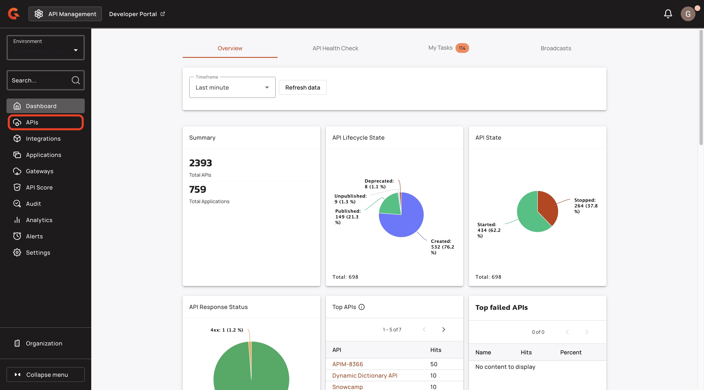
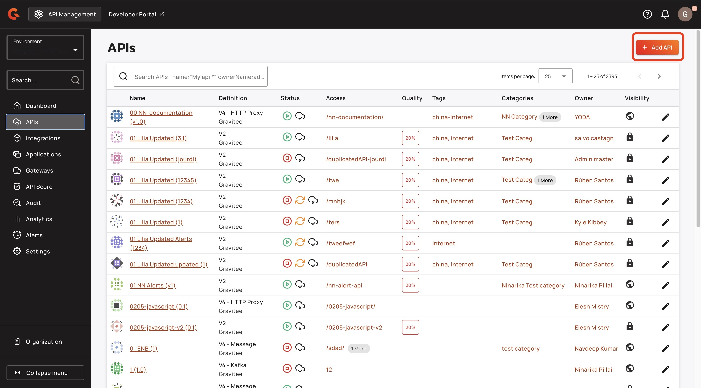
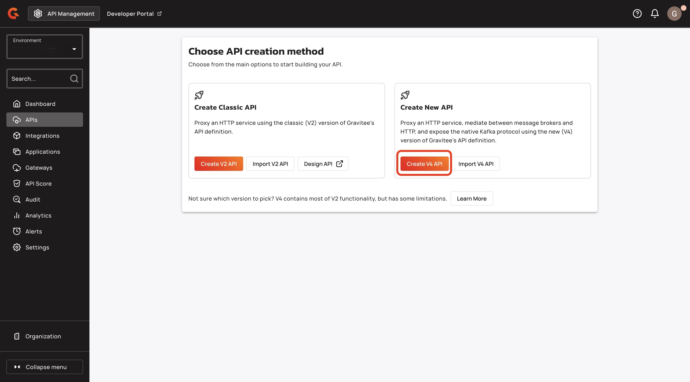
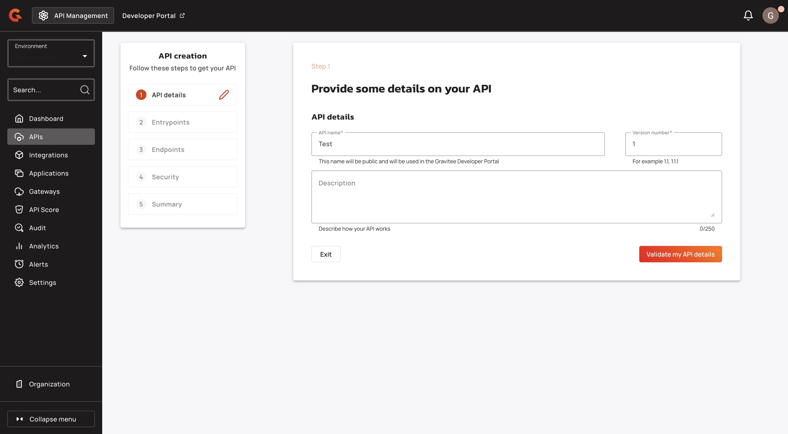
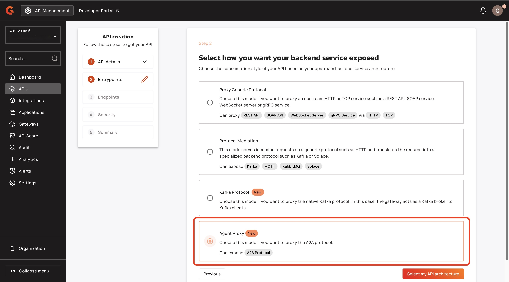
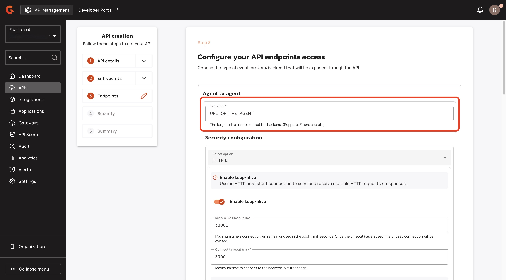
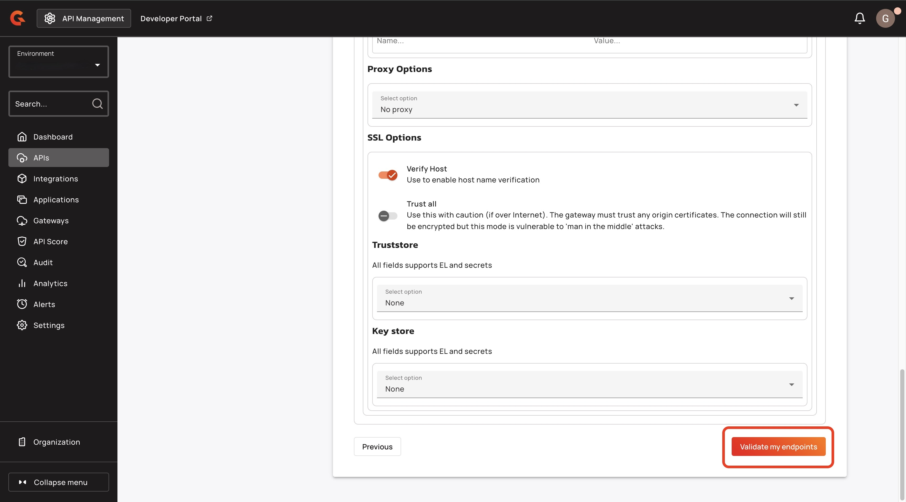
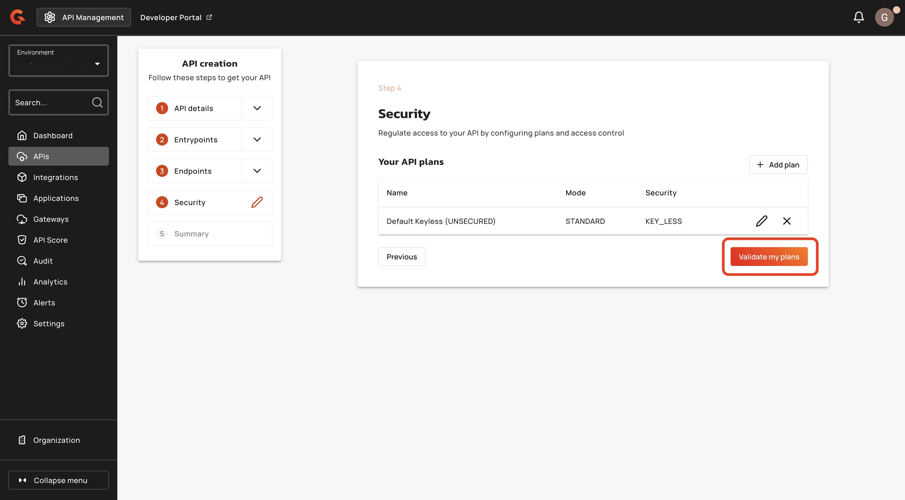
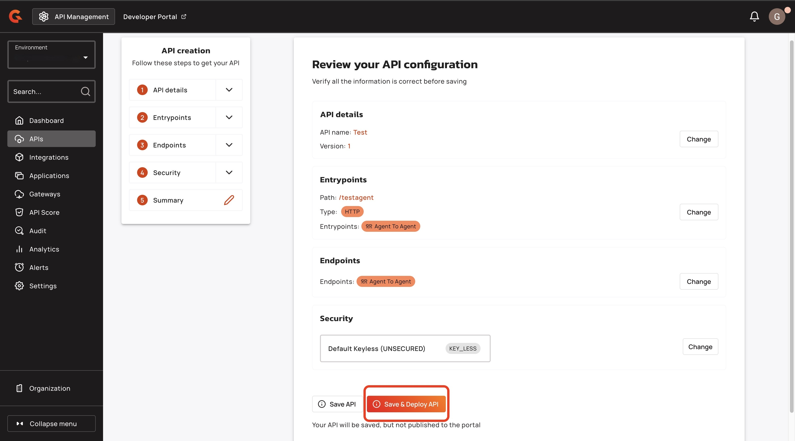

# Create an A2A Proxy


This feature only works with v4 message APIs.


## Overview

This guide explains how to create a Gravitee A2A Proxy.

## Prerequisites&#x20;

* You must have the Enterprise Edition of Gravitee. For more information about Gravitee Enterprise Edition, see [open-source-vs-enterprise-edition.md](../introduction/open-source-vs-enterprise-edition.md "mention").

## Create an A2A proxy

1.  From the **Dashboard**, click **APIs.** \

    <figure><figcaption></figcaption></figure>
2.  Click **+Add API**.\

    <figure><figcaption></figcaption></figure>
3.  Click **Create V4 API**.\

    <figure><figcaption></figcaption></figure>
4. In the **Provide some details on your API** screen, enter the following details:
   1. API name
   2. Version number&#x20;
   3.  (Optional) Description\

       <figure><figcaption></figcaption></figure>
5. In the **Select how you want your backend exposed** screen, select **Agent Proxy**.
6.  Click **Select my API architecture**. \

    <figure><figcaption></figcaption></figure>
7. In the **Configure your API entrypoints** screen, enter the following details:
   1. The **Context-path** for the entrypoint.
   2. (Optional) Define the interval at which heartbeats are sent to the client.&#x20;
8.  Click **Validate my entrypoints**. \

    <figure><figcaption></figcaption></figure>
9.  In the **Configure your API endpoints access** screen, provide the **Target URL**. The Target URL is the Agent's address. \

    <figure><figcaption></figcaption></figure>
10. Click **Validate my endpoints**. \

    <figure><figcaption></figcaption></figure>
11. In the **Security** screen, click **Validate my plans**. \

    <figure><figcaption></figcaption></figure>
12. In the **Review your API configuration** screen, click **Save & Deploy**. \

    <figure><figcaption></figcaption></figure>
