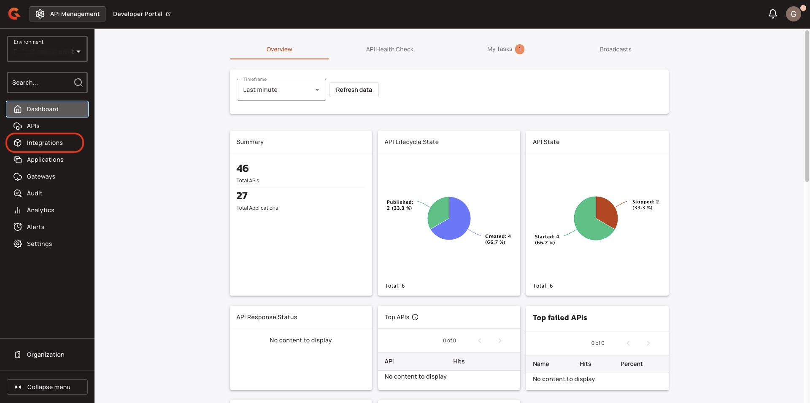
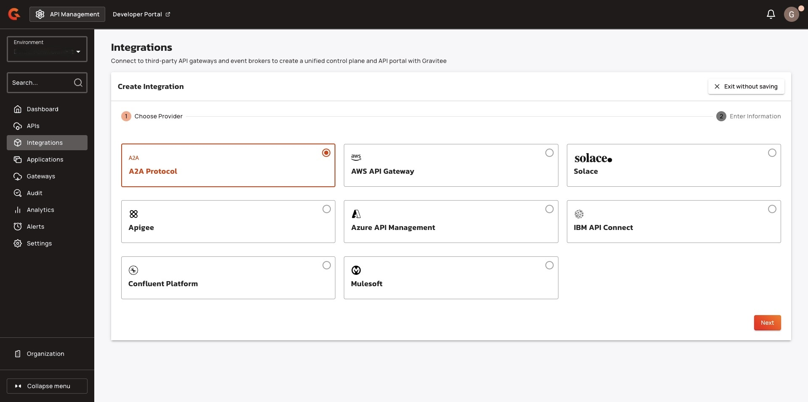
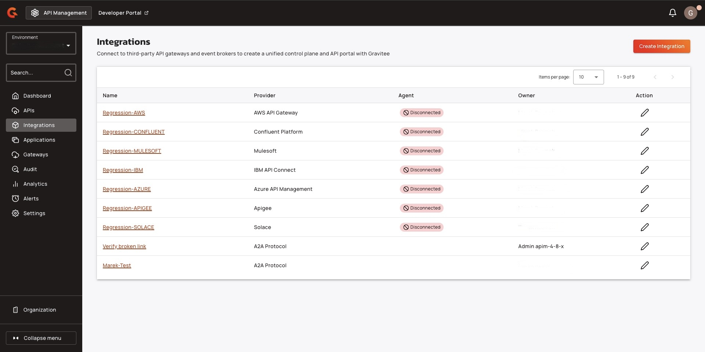
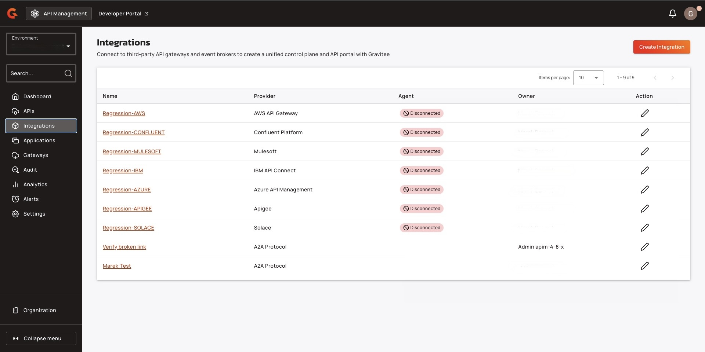
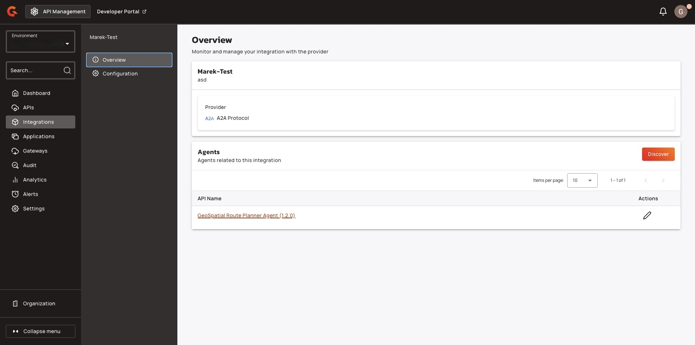
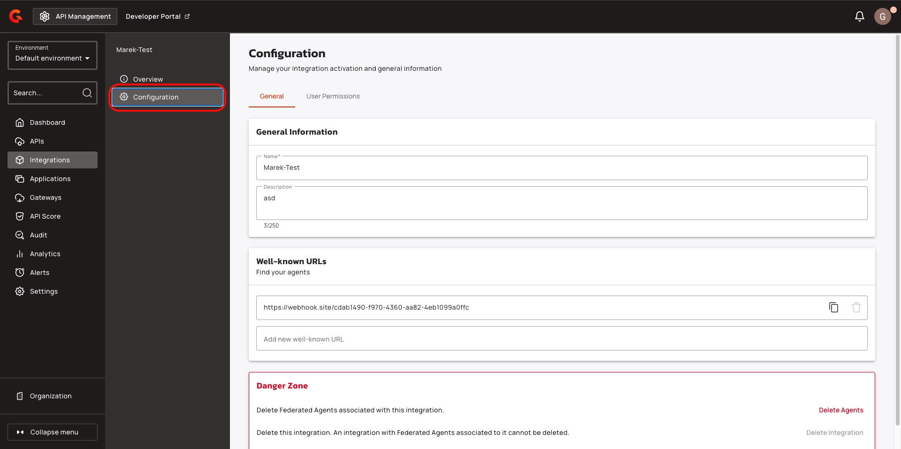
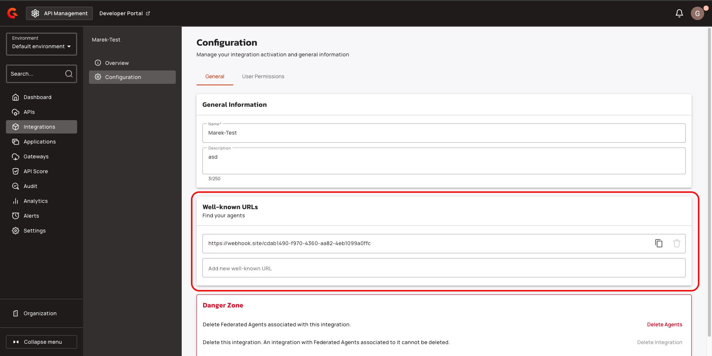
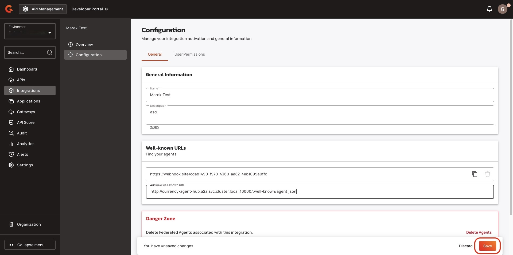
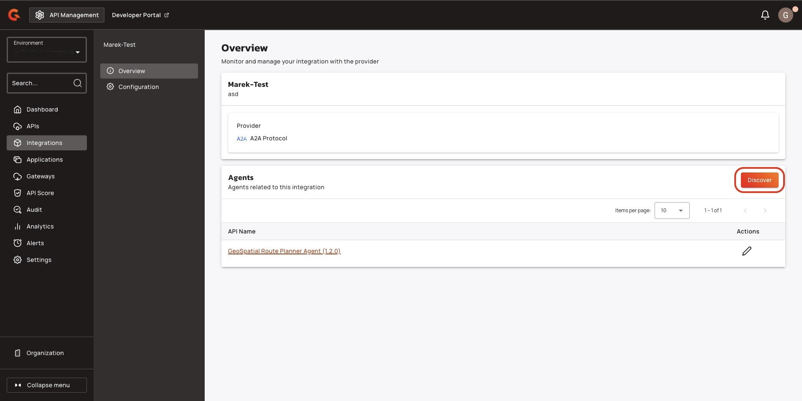

# Add Agents to your Agent Catalog

## Overview

This guide explains how to add an agent to your Agent Catalog.

## Prerequisites

* You must have an Enterprise Edition license. For more information about an Enterprise License, see [enterprise-edition.md](overview/enterprise-edition.md "mention").&#x20;
* You must enable Federation. For more information about enabling Federation, see [federation](governance/federation/ "mention").

## Create an A2A protocol integration&#x20;

1.  From the **Dashboard**, click **Integrations**. \

    <figure><figcaption></figcaption></figure>
2. Click **Create Integration**.&#x20;
3.  Click **A2A Protocol**, and then click **Next**.\

    <figure><figcaption></figcaption></figure>
4. In the **Create Integration** screen, add the following information:
   1. The name of the integration.
   2. (Optional) A description of the integration.&#x20;
   3. The **Well-known URL** for your Agent card.
5.  Click **Create Integration**.\

    <figure><figcaption></figcaption></figure>


Your Integration appears in the **Integrations** screen.


<figure><figcaption></figcaption></figure>

## View your Agent's APIs&#x20;

1.  From the **Integrations page**, click your A2A integration.\

    <figure><figcaption></figcaption></figure>
2.  From the **Overview** screen, navigate to the **Agents** section, and then click the Agent that you want to view. \

    <figure><figcaption></figcaption></figure>


The configuration screen displays the agent card for the Agent.&#x20;


## Add an API to your Agent Catalog&#x20;

1.  From the **Dashboard**, click **Integrations**. \

    <figure><figcaption></figcaption></figure>
2.  From the **Integrations page**, click your A2A integration.\

    <figure><figcaption></figcaption></figure>
3.  Click **Configuration**. \

    <figure><figcaption></figcaption></figure>
4.  Navigate to **Well-known URLs**, and then add your new well-known URL. \

    <figure><figcaption></figcaption></figure>
5.  Click **Save**. \

    <figure><figcaption></figcaption></figure>
6.  Click **Overview**.\

    <figure><figcaption></figcaption></figure>
7.  Click **Discover**. The Agent appears in the **Agents** section.\

    <figure><figcaption></figcaption></figure>
