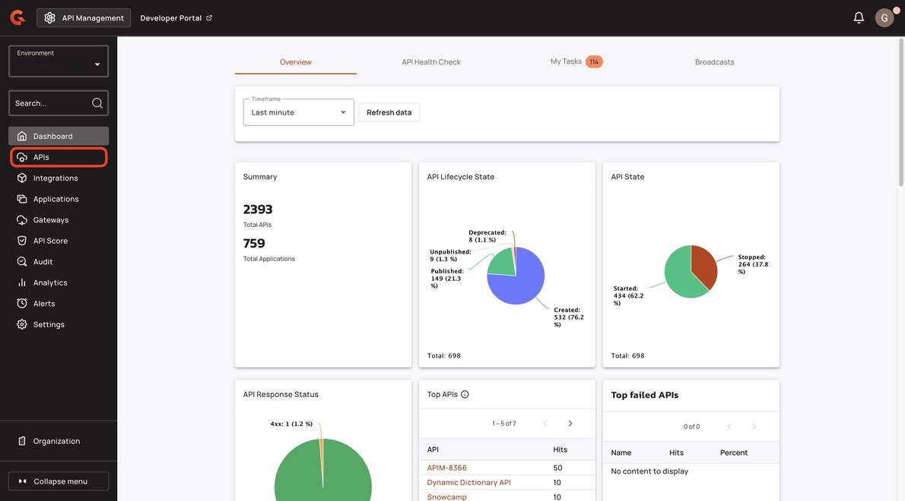
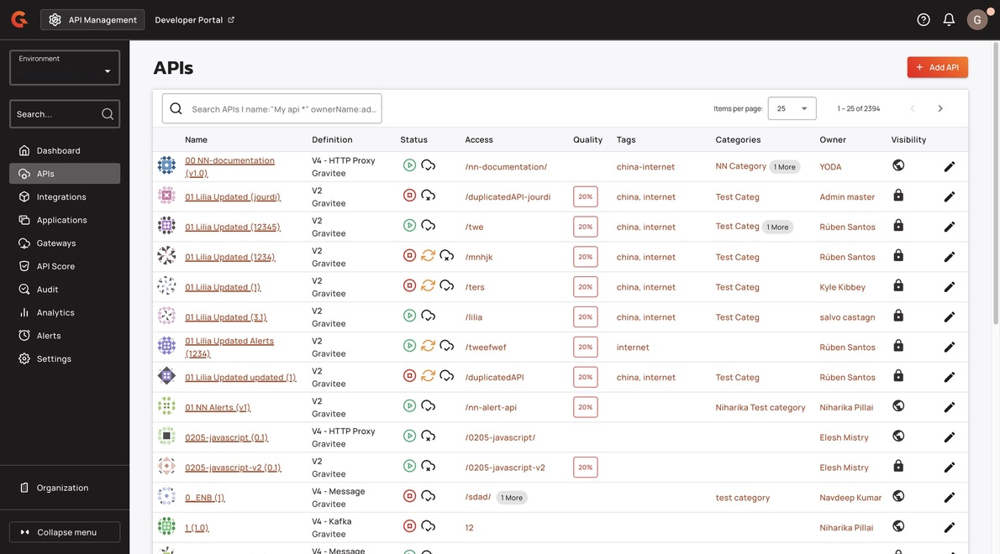
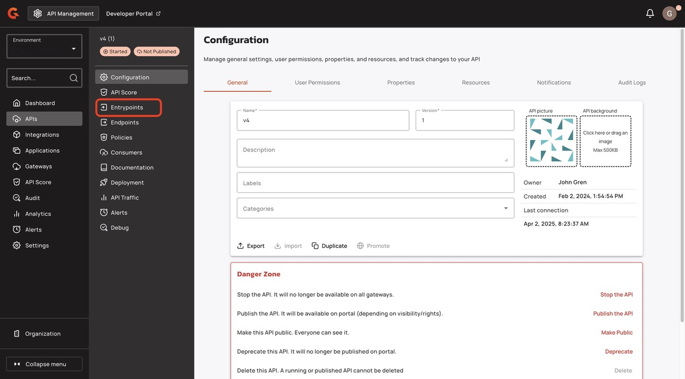
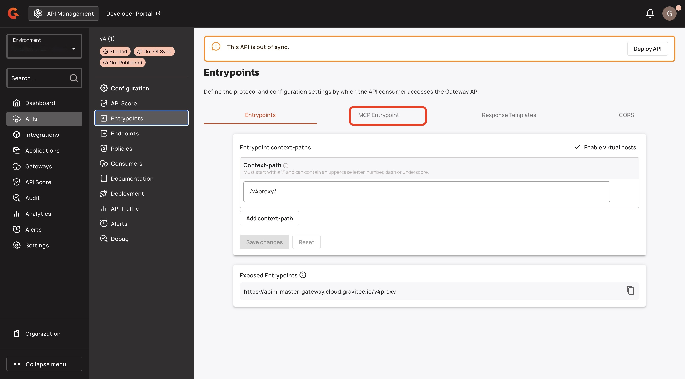
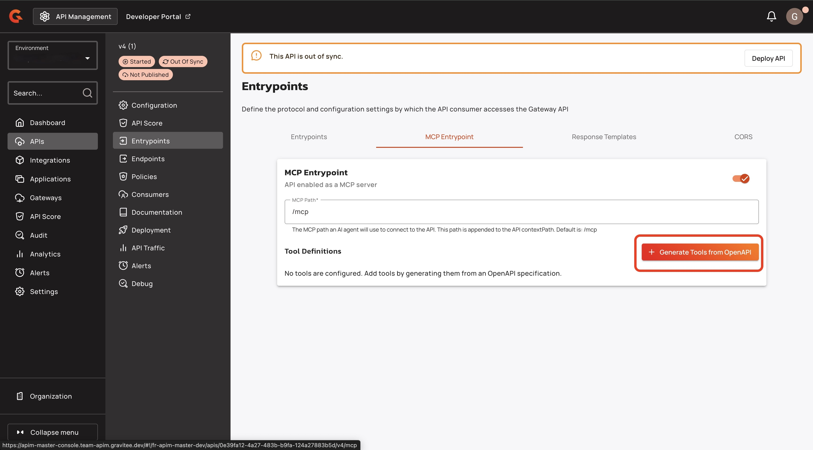
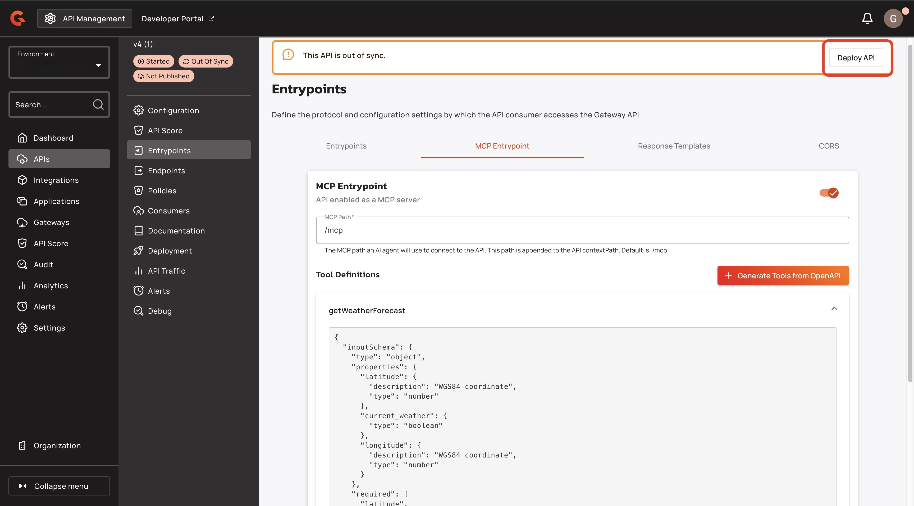

# Add Tools to your MCP Server



## Prerequisites&#x20;

* A v4 proxy API with the MCP server enabled. For more information about how to convert your API to an MCP server, see [convert-your-apis-to-mcp-servers.md](convert-your-apis-to-mcp-servers.md "mention").
* An OpenAPI specification to generate the MCP tools definition.

## Add tools to your MCP server

1.  From the **Dashboard**, click **APIs**.\

    <figure><figcaption></figcaption></figure>
2.  Find the API that you have converted to an MCP Server. \

    <figure><figcaption></figcaption></figure>
3.  Click **Entrypoints**.\

    <figure><figcaption></figcaption></figure>
4.  In the **Entrypoints** screen, click **MCP Entrypoint**. \

    <figure><figcaption></figcaption></figure>
5.  Click **+Generate Tools from OpenAPI**.\

    <figure><figcaption></figcaption></figure>
6.  In the **Generate Tools from OpenAPI** pop-up window, add your OpenAPI specification.\

    <figure><figcaption></figcaption></figure>
7. Click **Regenerate Tools**. The tool appears in the **Tool Definitions** section.&#x20;
8.  Click **Save**.\

    <figure><figcaption></figcaption></figure>
9.  Click **Deploy API**.\

    <figure><figcaption></figcaption></figure>
10. (Optional) In the **Deploy your API** pop-up window, add a deployment label.
11. In the **Deploy your API** pop-up window, click **Deploy**.\

    <figure><figcaption></figcaption></figure>

## Verification&#x20;

The Tool Definition appears in the **Tool Definition** section of the **MCP Entrypoint** screen.

<figure><figcaption></figcaption></figure>
