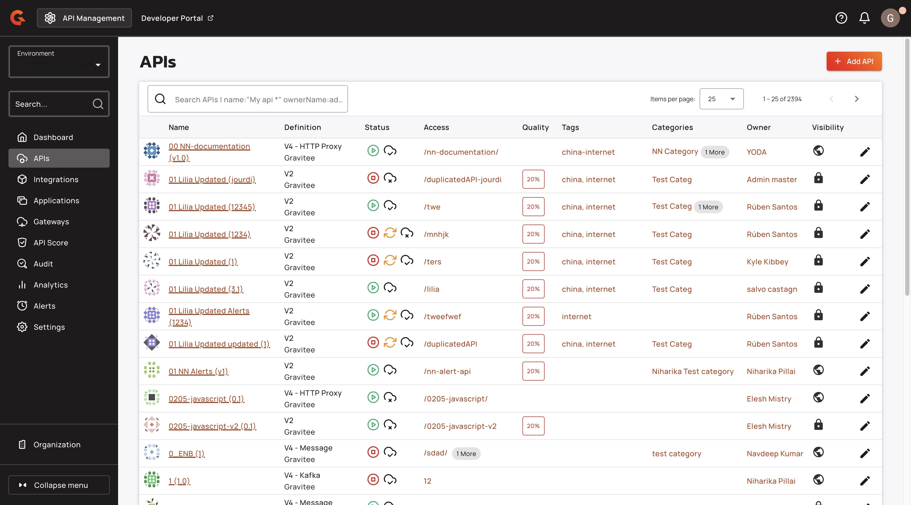
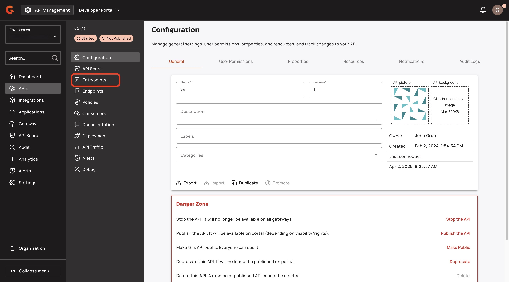
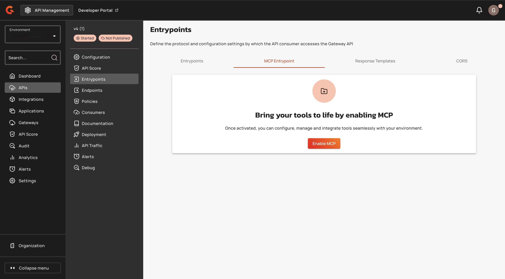
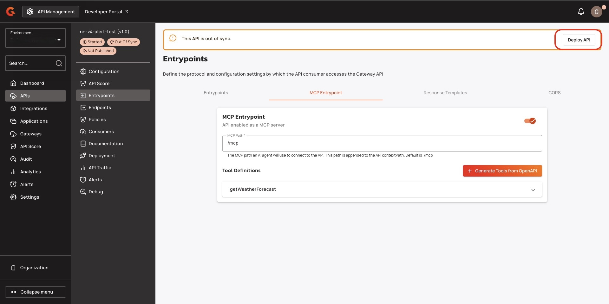
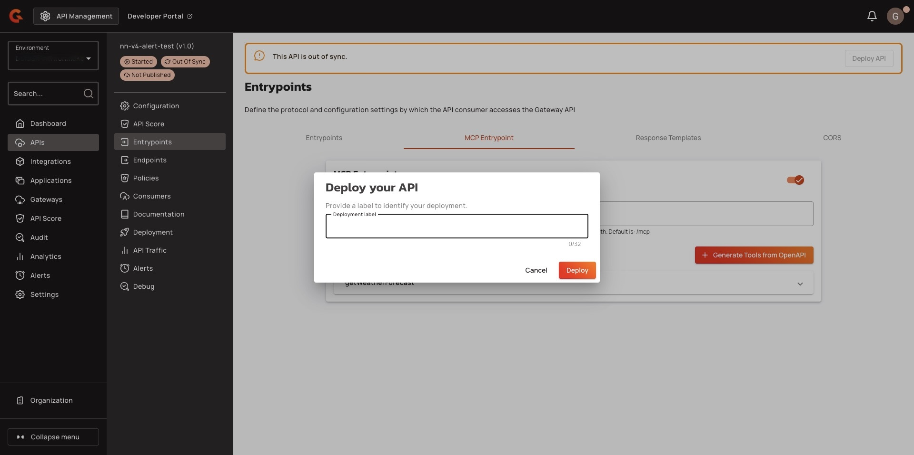

# Convert your APIs to MCP Servers



## Overview

This guide explains how to convert an API into an MCP server.

## Prerequisites

* Create a v4 proxy API. For more information about creating a v4 proxy API, see [v4-api-creation-wizard.md](../create-apis/v4-api-creation-wizard.md "mention").
* An OpenAPI Specification to generate the MCP tools definition.&#x20;

## Deploy your API as an MCP Server

1.  From the **Dashboard**, click **APIs**.  \

    <figure><figcaption></figcaption></figure>
2.  Find the API that you want to convert into an MCP Server. \

    <figure><figcaption></figcaption></figure>
3.  From the API menu, click **Entrypoints**. \

    <figure><figcaption></figcaption></figure>
4. From the **Entrypoints** screen, click **MCP Entrypoint**.
5.  Click **Enable MCP**. \

    <figure><figcaption></figcaption></figure>
6.  Click **+ Generate Tools from OpenAPI**.\

    <figure><figcaption></figcaption></figure>
7.  In the **Generate Tools from OpenAPI** pop-up window, add your OpenAPI specification, and then click **Regenerate Tools**.\

    <figure><figcaption></figcaption></figure>
8.  Click **Create**.\

    <figure><figcaption></figcaption></figure>
9.  Click **Deploy API**.\

    <figure><figcaption></figcaption></figure>
10. (Optional) In the **Deploy your API** pop-up window, enter a deployment label.
11. Click **Deploy**. You receive the message **API successfully deployed**. \

    <figure><figcaption></figcaption></figure>
