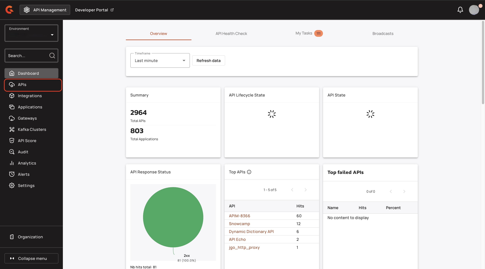
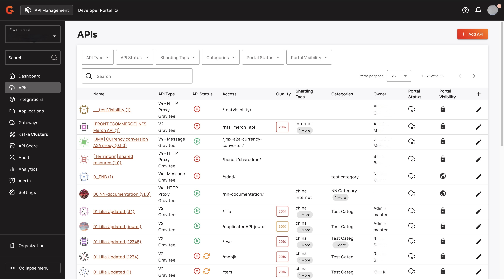
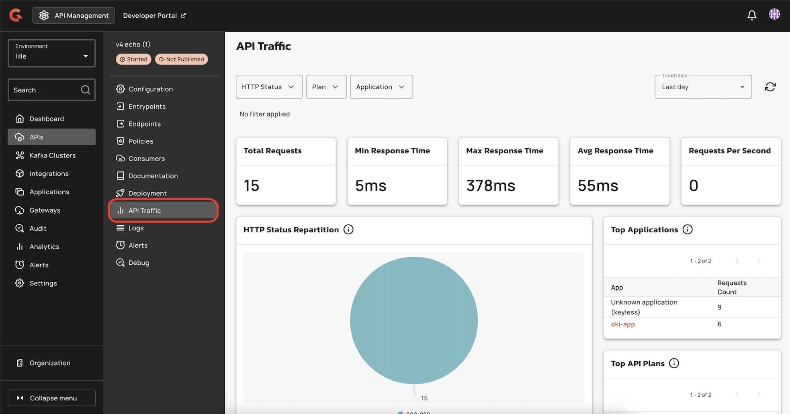
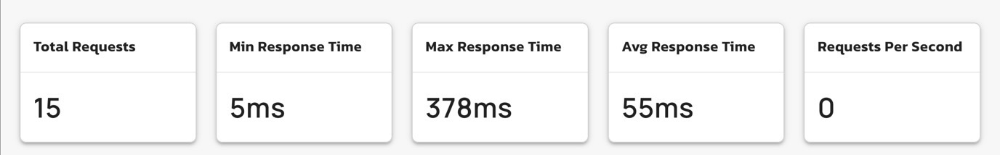
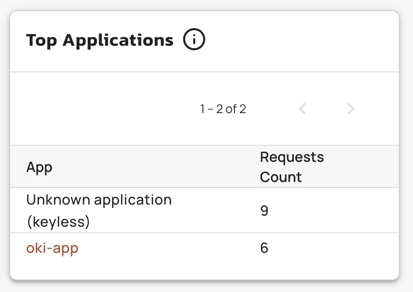
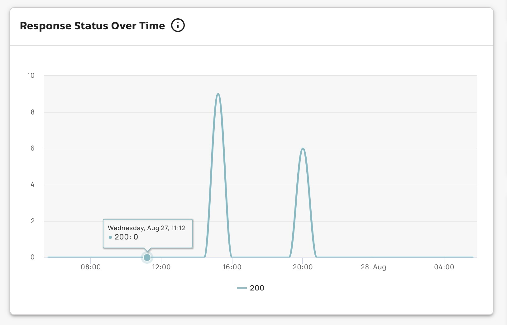

# 4.9 API Proxy Dashboard

## Overview

This guide explains how to access and interpret your API traffic dashboard.


This feature works with only v4 proxy APIs.


## Prerequisites

* You must create a v4 proxy API. For more information about creating a v4 proxy API, see [v4-api-creation-wizard.md](../create-and-configure-apis/create-apis/v4-api-creation-wizard.md "mention").

## Access your API traffic dashboard

1.  From the **Dashboard**, click **APIs**.

    <figure><figcaption></figcaption></figure>
2.  Select your v4 proxy API.

    <figure><figcaption></figcaption></figure>
3.  From the **APIs** menu, click **API Traffic**.

    <figure><figcaption></figcaption></figure>

## Dashboard metrics

You can view the following metrics for your v4 proxy API:

* [#key-metrics](4.9-api-proxy-dashboard.md#key-metrics "mention")
* [#tables-and-graphs](4.9-api-proxy-dashboard.md#tables-and-graphs "mention")

### Key metrics

* **Total Requests.** This is the total number of calls made to your API.
* **Min Response Time.** This is the minimum time taken by your API to respond to a request, in milliseconds.
* **Max Response Time.** This is the maximum time taken by your API to respond to a request, in milliseconds.
* **Avg Response Time.** This is the average time taken by your API to respond to a request, in milliseconds.
*   **Requests Per Second.** This is the number of calls made to your API each second.

    <figure><figcaption></figcaption></figure>

### Tables and graphs

*   **HTTP Status Repartition.** This shows the distribution of the HTTP status codes that your API returned to the user.

    <figure><figcaption></figcaption></figure>
*   **Top Applications.** This shows the applications that call your API, ranked by highest number of calls.

    <figure><figcaption></figcaption></figure>
*   **Response Status Over Time.** This shows the breakdown of the HTTP status codes over time.

    <figure><figcaption></figcaption></figure>
*   **Top API Plans.** This shows the distribution of hits across API plans.

    <figure><figcaption></figcaption></figure>
*   **Response Time Over Time.** This shows the response time between the Gateway and the endpoint over time.

    <figure><figcaption></figcaption></figure>
*   **Top Paths.** This shows which of your API paths have the most hits.

    <figure><figcaption></figcaption></figure>
*   **Hits by Application.** This shows the number of hits on your API by application.

    <figure><figcaption></figcaption></figure>
*   **Top Slow Applications.** This ranks applications by longest average response time.

    <figure><figcaption></figcaption></figure>
*   **Hits by Host (HTTP Header).** This shows the breakdown of calls to you API by host header.\\

    <figure><figcaption></figcaption></figure>
