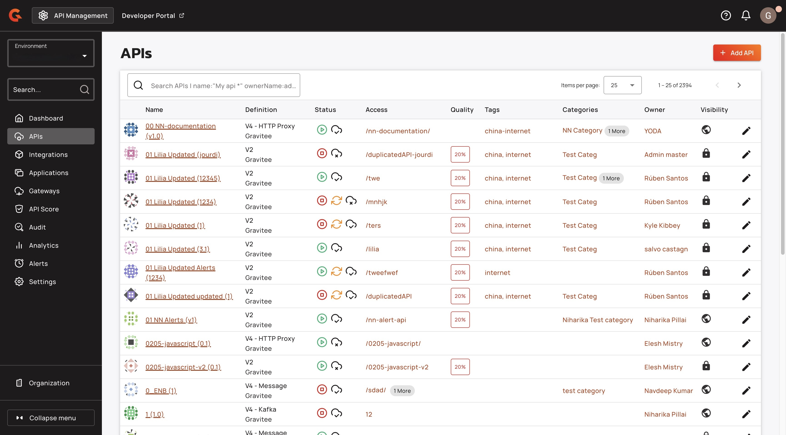

# Convert your APIs to MCP Servers



## Overview

This guide explains how to convert an API into an MCP server.

## Prerequisites

&#x20;Before you convert an API into an MCP server, you must complete the following steps:

* Create a v4 proxy API. For more information about creating a v4 proxy API, see [v4-api-creation-wizard.md](create-apis/v4-api-creation-wizard.md "mention").

### Deploy your API as an MCP Server

1.  From the **Dashboard**, click **APIs**.  \

    <figure><figcaption></figcaption></figure>
2.  Find the API that you want to convert into an MCP Server. \

    <figure><figcaption></figcaption></figure>
3.  From the API menu, click **Entrypoints**. \

    <figure><figcaption></figcaption></figure>
4. From the **Entrypoints** screen, click **MCP Entrypoint**.
5.  Click **Enable MCP**. \

    <figure><figcaption></figcaption></figure>
6.  Click **Create**.\

    <figure><figcaption></figcaption></figure>
7.  Click **Deploy API**.\

    <figure><figcaption></figcaption></figure>
8. (Optional) In the **Deploy your API** pop-up window, enter your deployment label.
9.  Click **Deploy**. You receive a **API successfully deployed** message. \

    <figure><figcaption></figcaption></figure>

## Next Steps

* Add tools to your MCP server. For more information about adding Tools to your MCP server, see [add-tools-to-your-mcp-server.md](add-tools-to-your-mcp-server.md "mention").
