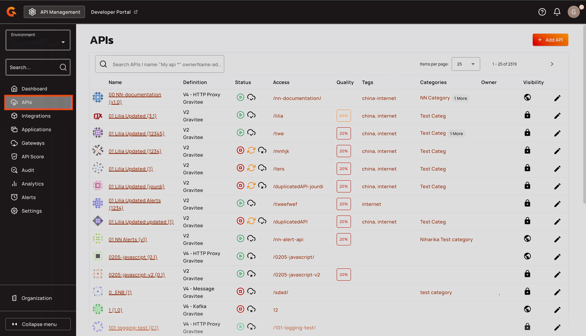
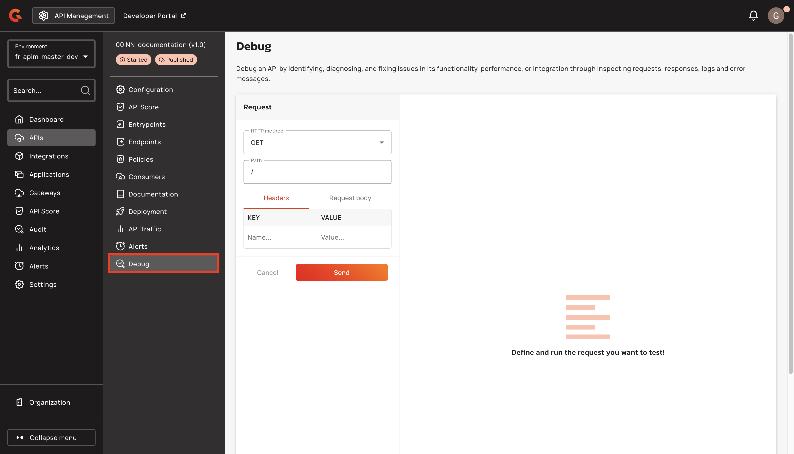
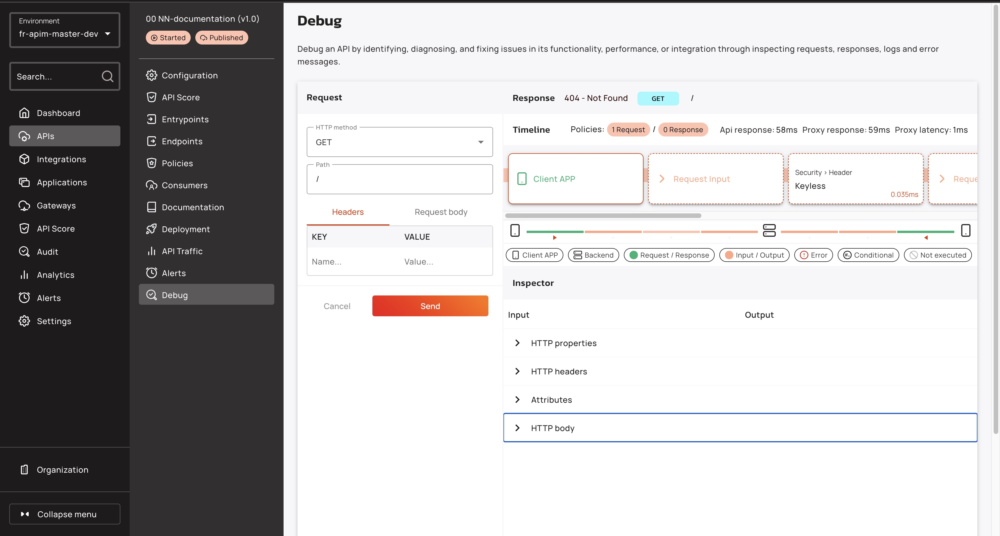

# Debug Mode


Debug mode is an Enterprise-only capability. For more information about Gravitee Enterprise Edition, see [enterprise-edition.md](docs/apim/4.8/readme/enterprise-edition.md "mention").


## Overview


Debug mode is supported by v2 APIs and v4 proxy APIs. You cannot use debug mode with v4 message, TCP, or Native APIs.


Debug mode is a diagnostic tool for v2 and v4 proxy APIs. It provides insights and troubleshooting capabilities so you can complete the following actions:

* Trace specific requests end-to-end.
* Trace transformations and changes to headers, body, and execution context.
* Inspect policy flows, order of execution, and triggering.
* Visualize conditional policy behavior.
* Identify bottlenecks.
* Root-cause errors and optimize performance for faster releases.


Debug mode cannot test the following policies and features:

* Rate Limit policy.
* Cache policy. The in-memory cache is created and destroyed with the API.
* Health-check.
* Virtual hosts. The first host is always selected.
* Encrypted properties. For security, you cannot clear encrypted policies.


## Debug policy flows

1. From the **Dashboard**, select **APIs**.
2.  Select the API to debug.\

    <figure><figcaption></figcaption></figure>
3.  From the **API** menu, select **Debug**.\

    <figure><figcaption></figcaption></figure>
4. From the **HTTP method** drop-down menu, select the HTTP method to test.
5. In the **Path** field, enter the path to test.&#x20;
6. In the **Headers** tab, enter the name and value of the key.
7. In the **Request body** field, enter the request body.
8.  Click **Send**. You are shown a timeline of the order of the flows and policies. \

    <figure><figcaption></figcaption></figure>
9.  Select a step in the timeline to compare its inputs and outputs. \

    <figure><figcaption></figcaption></figure>

### Understand the Debug mode timeline and inspector

Debug mode timeline

The order of the policies in the timeline reflects the exact order that they were executed by the Gateway. Policies may execute in a different order than they were placed during the design phase due to a performance optimization applied on the policy chain at runtime.

The Gateway executes policies that interact with the HTTP header part of the request (onRequest, onResponse) before policies that interact with the body part of the request (onRequestContent, onResponseContent). A policy may appear twice in the timeline if it interacts with both the header and body of the request.

To navigate the timeline:

* Scroll through the list of policies in the timeline, or select a specific policy using the **quick access** timeline.
* Select **Request Input** or **Request Output** to view the global transformation on the request and the difference between what was received by the Gateway and what was sent to the backend.
* Select **Response Input** or **Response Output** to view the global transformation on the response and the difference between what was received from the backend and what was sent back to the client application.

Policy indicators

The status of a policy is represented by one of the following indicators:

* **Executed**: The policy has been executed properly.
* **Skipped:** The policy contains a condition that has not been fulfilled. Refer to the inspector for more information on the evaluation of the condition.
* **Error:** An error occurred during policy execution. Refer to the input/output inspector for more information on the error.

Select a specific policy in the timeline to access additional information regarding the input/output of the policy header, context attributes, and body.

The inspector uses 3 colors to indicate the nature of changes:

* **Green:** Indicates an addition.
* **Orange:** Indicates an edit.
* **Red:** Indicates a deletion.

