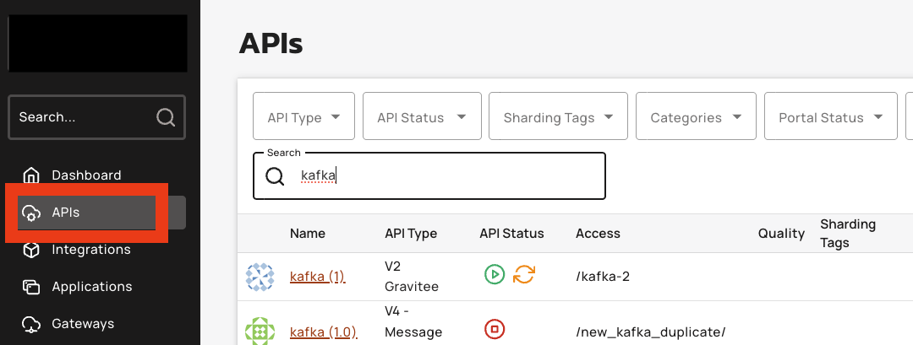
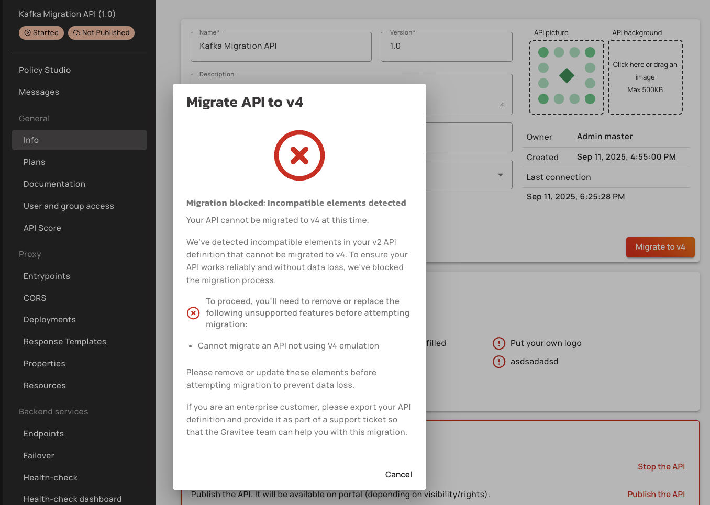
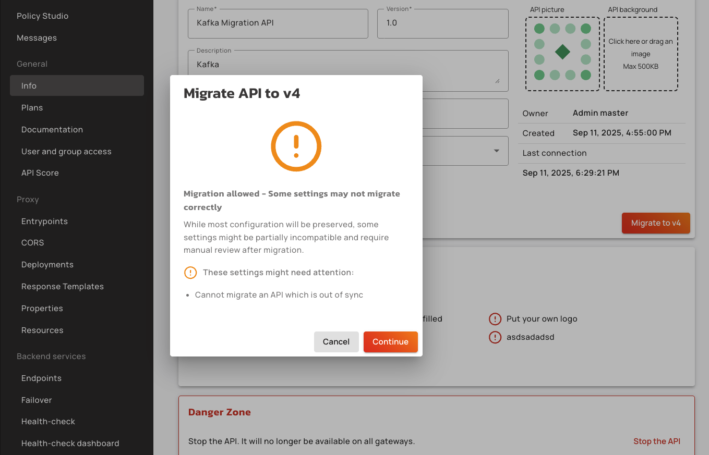

# 4.9 Migrate APIs

## Migrate v2 APIs to V4 APIs

This guide explains how to migrate your existing V2 APIs to V4 APIs using the Migration feature. V4 APIs provide long-term support and access to the latest features.

### Important Notes


**Analytics Data**

* Historical analytics are not available after migration. We are working on providing analytics continuity in future releases.

**Rollback Option**

* Migration is reversible. If the migrated API does not work as expected, you can always roll back to the previous V2 API.


### Prerequisites

Before you migrate your API,  ensure that you complete the following actions:

* You must have access to Gravitee API Management Console.
* You have an existing V2 API that you want to migrate to V4.

### Initiate the Migration

To initiate the migration, complete the following steps:&#x20;

1.  Go to API in the APIM management console\

    <figure><figcaption></figcaption></figure>
2.  Click on **Info** in the APIM management console\

    <figure><figcaption></figcaption></figure>
3.  Click the **Migrate to V4** button.\

    <figure><figcaption></figcaption></figure>

### Review the Compatibility Check Results

The system automatically runs a migration compatibility check to verify compatibility. The check displays one of these results:&#x20;

*   **Not Migratable:** The API cannot be migrated, migration blocked: Incompatible elements detected.

    * This occurs when the "Emulate V4 Engine" toggle is not enabled in your API settings.
    * A message explains the reason and suggests what to fix.

    <figure><figcaption></figcaption></figure>
*   **Partially Migratable:** The API can be migrated, but some settings may not be fully supported or are not recommended.

    * This occurs when the "Emulate V4 Engine" toggle is enabled but the API has not been deployed.
    * You can choose to fix these first or continue with the migration.\

    <figure><figcaption></figcaption></figure>
* **Fully Migratable:** The API is fully compatible with V4. You can proceed directly.
  * This occurs when the "Emulate V4 Engine" toggle is enabled, saved, and the API has been deployed.

<figure><figcaption></figcaption></figure>

### (Optional) Fix Migration Issues&#x20;

If the compatibility check identifies problems, resolve the problems before proceeding with the following steps:

1. Address the issues listed in the compatibility check results
2. Re-run the compatibility check to confirm the fixes

### Perform the Migration

Once validation passes, convert your API with the following steps:&#x20;

1.  Review the migration summary and confirm you are ready to migrate your API to V4.

    <figure><figcaption></figcaption></figure>
2.  Click the **Continue** button. A pop-up box appears showing you details about what you should be aware of before migrating to API V4. \

    <figure><figcaption></figcaption></figure>
3.  Confirm the migration details in the pop-up, and then click **Start Migration** in the confirmation dialog. \

    <figure><figcaption></figcaption></figure>
4. Wait for the conversion process to complete. The migration process takes a few minutes.&#x20;
5. Verify migration completion. When the process is complete, a "Migration Successful" message appears.&#x20;
6.  Your V2 API is now converted to a V4 API

    <figure><figcaption></figcaption></figure>

### Debug and Test the Migrated API

1.  Click on **Debug Mode** to access the debugging interface for your migrated V4 API. \

    <figure><figcaption></figcaption></figure>
2. Test your API thoroughly using debug mode to:
   * Check endpoints, policies, and configuration
   * Identify, diagnose, and fix any issues in functionality, performance, or integration
   * Inspect requests, responses, logs, and error messages
3. Verify proper functionality to ensure the API behaves as expected before deployment to production.
4. Once the API testing is complete, deploy your V4 API. \

## Verification&#x20;

After completing your API migration, follow these verification steps to ensure everything transferred correctly:

1.  Navigate back to the API Management Interface, and then locate your migrated API in the API list.

    <figure><figcaption></figcaption></figure>
2.  Verify the API version update, and then check that your API is now listed as a V4 API in the management interface.&#x20;

    <figure><figcaption></figcaption></figure>
3. **Confirm Configuration Transfer:**&#x20;
   * Click on your migrated API to open its details
   *   Navigate through the different configuration sections (General Settings, Policies, etc.)

       <figure><figcaption></figcaption></figure>
   *   Verify that all configuration settings have been properly transferred from V2 to V4\

       <figure><figcaption></figcaption></figure>

