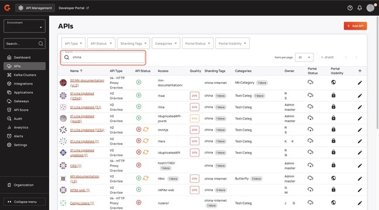
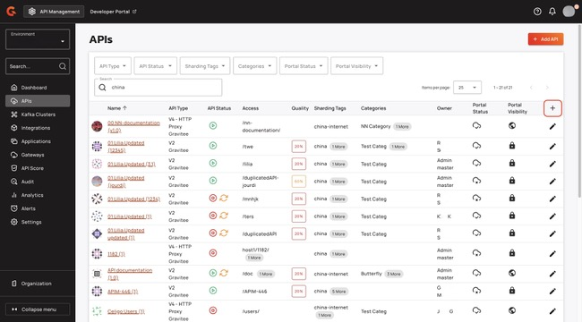

# 4.9 Search for APIs in the Console

## Overview

This guide explains how to filter the APIs that appear in the API Console.

From this page, you can complete the following actions:

* Add APIs. For more information about adding APIs, see [.](./ "mention") and [import-apis.md](import-apis.md "mention").
* [#search-for-apis](4.9-search-for-apis-in-the-console.md#search-for-apis "mention")
* [#filter-apis](4.9-search-for-apis-in-the-console.md#filter-apis "mention")

## Search for APIs

*   In the **Search** field, type the API field that you want to search for. Here is a list of API fields that you can search for:

    * Name
    * API Type
    * API Status
    * Access
    * Sharding Tags
    * Categories
    * Owner 

    <figure><figcaption></figcaption></figure>

### Search examples

Here are some examples of what you can enter into the search bar to filter the results:

* For a label: `labels:NewLabel`
* For an API that matches a given name and a given description: `name:"Butterfly*" & description:"This*"`
* For any API that matches the name or the description: `name:"Butterfly*" description:"*REST*"`
* For all v4 APIs: `definition_version:4.0.0`
* For APIs that have either of the given [sharding tags](../../configure-and-manage-the-platform/gravitee-gateway/sharding-tags.md): `tags:china-internet tags:china`
* For an API name that contains one term but not another: `name:"*Allan*" NOT name:"*Test_"`
* For any APIs that have [health checks](../configure-v4-apis/health-checks.md) configured: `has_health_check:true`


You can create your own queries with the Apache Lucene language. For more information about Apache Lucene, go to [Apache Lucene - Query Parser Syntax](https://lucene.apache.org/core/2_9_4/queryparsersyntax.html).


## Filter APIs

You can filter APIs with the drop-down menus on the **APIs** screen. Here is a list of the filters that you can apply to your API list:

* **API Type.** This is the type of API. For example, V4 - HTTP Proxy.
* **API Status.** This maps to if your API is started or stopped on the Gateway.
* **Sharding Tags.** These are the sharding tags that you set for your environment. For more information about sharding tags, see [sharding-tags.md](../../configure-and-manage-the-platform/gravitee-gateway/sharding-tags.md "mention").
* **Categories.** These are the categories that you create in your Developer Portal's catalog. For more information about categories, see [#categories](../../developer-portal/classic-developer-portal/layout-and-theme.md#categories "mention").
* **Portal Status.** This maps to whether or not your API is published in your Developer Portal.
*   **Portal Visibility.** This maps to if your API is set to public or private in your Developer Portal.

    <figure><figcaption></figcaption></figure>

## Change the visible API details

You can hide or reveal columns to show the API details that you want to see. To change the columns on the **APIs** screen, complete the following steps:

1.  From the **APIs** screen, click the **plus (+)**.

    <figure><figcaption></figcaption></figure>
2. From the drop-down menu, select which columns you want to hide or reveal.
3.  Click **Apply**. The selection is saved in your browser storage. 

    <figure><figcaption></figcaption></figure>
