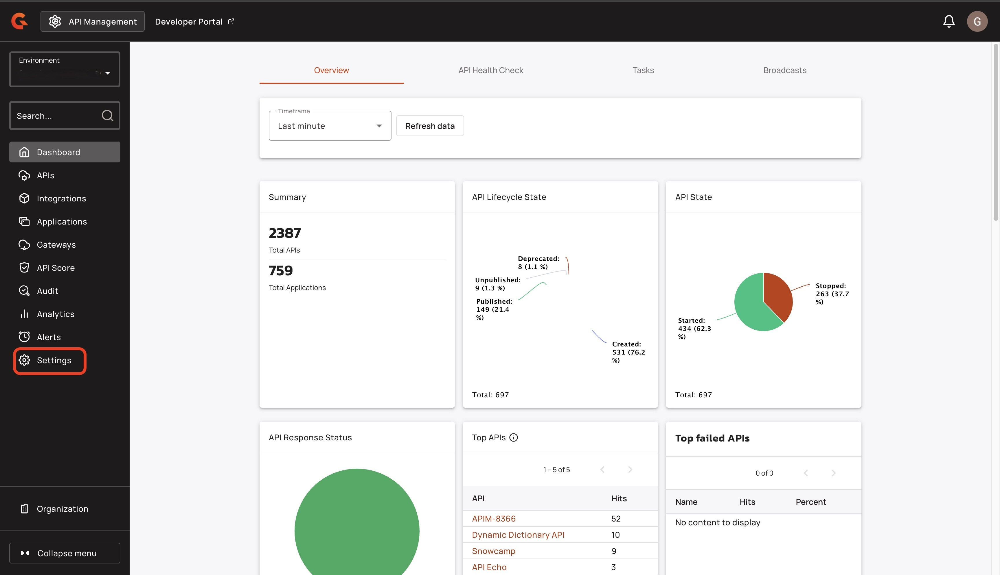
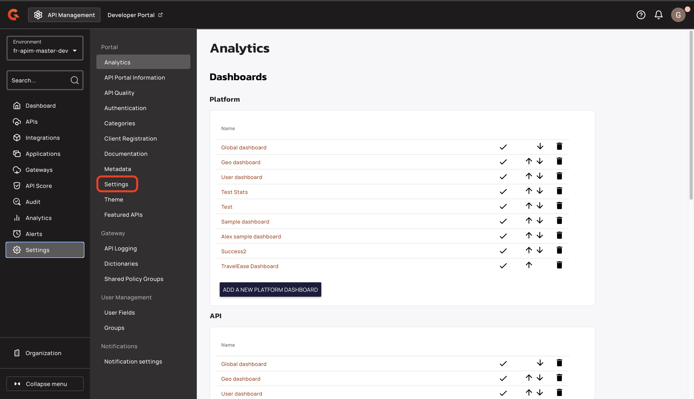
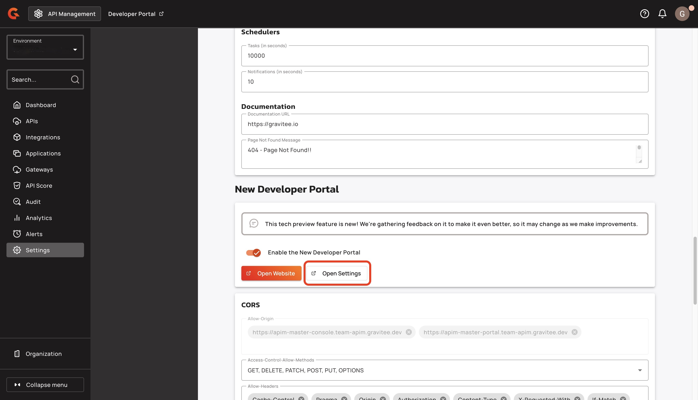
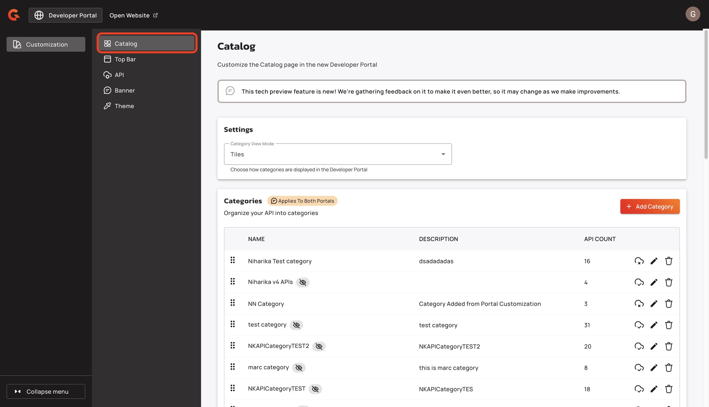
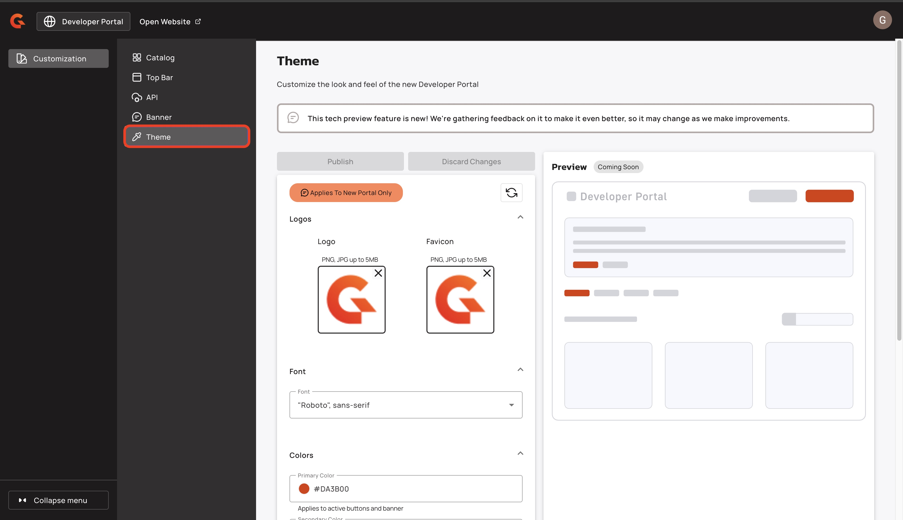
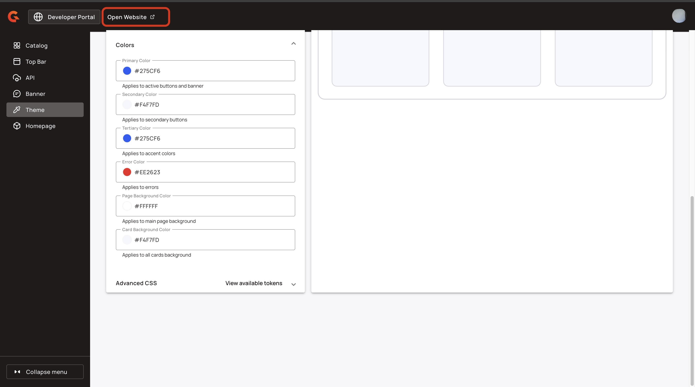

# 4.9 Layout and Theme


This feature is in tech preview.


## Update the Category layout

In the New Developer Portal catalog, you can search for an API based on an associated category. By default, categories are shown as header tabs, but you can elect to view categories as tiles. To change how API categories are displayed, complete the following steps:

1. Sign in to your APIM Console.
2.  From the Dashboard, click **Settings**.

    <figure><figcaption></figcaption></figure>
3.  In the **Settings** menu, navigate to the **Portal** section, and then click **Settings**.

    <figure><figcaption></figcaption></figure>
4.  Navigate to the **New Developer Portal** section of the page, and then click **Open Settings** to open the settings in a new tab.

    <figure><figcaption></figcaption></figure>
5.  In the **Customization** menu, click **Catalog**.

    <figure><figcaption></figcaption></figure>
6.  Use the **Category View Mode** drop-down menu to select **Tabs (Default)** or **Tiles**.

    <figure><figcaption></figcaption></figure>

### Verification

1. In the header navigation bar, click **Open Website**.
2. Click the **Catalog** button. Depending on your selection, your New Developer Portal shows your categories as tabs or tiles.

Here is an example of categories as header tabs:

<figure><figcaption><p>Tabs category view</p></figcaption></figure>

Here is an example of categories as tiles:

<figure><figcaption><p>Tiles category view</p></figcaption></figure>

## Fonts

To select fonts for the New Developer Portal, complete the following steps:

1.  From the Console homepage, click **Settings**.&#x20;

    <figure><figcaption></figcaption></figure>
2.  From the **Settings** menu, click **Settings.**

    <figure><figcaption></figcaption></figure>
3.  Navigate to the **New Developer Portal** section, and then click **Open Settings** to open the settings in a new tab.

    <figure><figcaption></figcaption></figure>
4.  In the **Customization** menu, click **Theme**.

    <figure><figcaption></figcaption></figure>
5. Navigate to the **Font** section of the page.
6.  From the **Font** drop-down menu, select a new font. For a list of available fonts, see [#available-fonts](4.9-layout-and-theme.md#available-fonts "mention").

    <figure><figcaption></figcaption></figure>

### Available Fonts


Each bullet point represents a group of fonts. APIM implements the first font in the list that your system supports. For example, if your system does not support **Times** or **serif** but supports **'Times New Roman'** and **'Liberation Serif'**, APIM implements **'Times New Roman'**.


#### Serif fonts

* Georgia, "DejaVu Serif", Norasi, serif
* Times, 'Times New Roman', 'Liberation Serif', FreeSerif, serif

#### Sans-serif fonts

* Arial, Helvetica, 'Liberation Sans', FreeSans, sans-serif
* "DM Sans", sans-serif
* Impact, Arial Black, sans-serif
* '"Inter", sans-serif
* 'Lucida Sans', 'Lucida Grande', 'Lucida Sans Unicode', 'Luxi Sans', sans-serif
* "Montserrat", sans-serif
* "Roboto", sans-serif
* Tahoma, Geneva, Kalimati, sans-serif
* 'Trebuchet MS', Arial, Helvetica, sans-serif
* Verdana, DejaVu Sans, Bitstream Vera Sans, Geneva, sans-serif

#### Monospace fonts

* Courier, 'Courier New', FreeMono, 'Liberation Mono', monospace
* "DM Mono", monospace
* Monaco, 'DejaVu Sans Mono', 'Lucida Console', 'Andale Mono', monospace'

## Add custom CSS to your theme


Custom CSS overrides the default theme for the Developer Portal.


You can add custom CSS to your Developer Portal's theme with the Advanced CSS editor. To add custom CSS to your Developer Portal's theme, complete the following steps:

1.  From the Dashboard, click **Settings**.

    <figure><figcaption></figcaption></figure>
2.  In the **Settings** menu, navigate to the **Portal** section, and then click **Settings**.

    <figure><figcaption></figcaption></figure>
3.  Navigate to the **New Developer Portal** section, and then click **Open Settings** to open the settings in a new tab.

    <figure><figcaption></figcaption></figure>
4.  In the **Customization** menu, click **Theme**.

    <figure><figcaption></figcaption></figure>
5.  Navigate to the **Advanced CSS** section, and then click **Advanced CSS**.

    <figure><figcaption></figcaption></figure>
6. You can customize the CSS using either of the following options:
   * In the **Advanced CSS box**, enter your CSS code.&#x20;
   *   In the **Advanced CSS box**, enter CCS tokens. For example:\


       ```
       html {
         --gio-app-nav-bar-container-color: red;
       }
       ```


       
       * To view all the available CSS tokens, click **View available tokens** .
       * For a full list of the available CSS tokens that you can use to customize your New Developer Portal, see [#available-css-tokens](4.9-layout-and-theme.md#available-css-tokens "mention").
       

### Verification&#x20;

*   In the header navigation bar, click **Open Website**. Your New Developer Portal shows your custom CSS updates.&#x20;

    <figure><figcaption></figcaption></figure>

## Available CSS tokens

Here are the CSS tokens that you can use to customize the theme of your New Developer Portal. For more information about how to customize the theme of your New Developer Portal with custom CSS, see [#add-custom-css-to-your-theme](4.9-layout-and-theme.md#add-custom-css-to-your-theme "mention").

### Global tokens

<table><thead><tr><th width="334.31121826171875">Token</th><th width="176.66668701171875">Description</th><th>Example CSS</th></tr></thead><tbody><tr><td><code>--gio-app-font-color</code></td><td>Changes the default color of the font. For example, the font color in paragraphs.</td><td><pre><code>body {
  --gio-app-font-color: #333333;
}
</code></pre></td></tr><tr><td><code>--gio-app-font-contrast-color</code></td><td>Changes the contrast color of the font.</td><td><pre><code>body {
  --gio-app-font-contrast-color: #ffffff;
}
</code></pre></td></tr><tr><td><code>--gio-app-font-family</code></td><td>Changes the font family.</td><td><pre><code>body {
  --gio-app-font-family: "Roboto", sans-serif;
}
</code></pre></td></tr><tr><td><code>--gio-app-background-color</code></td><td>The background color of the application</td><td><pre><code>body {
  --gio-app-background-color: #f7f8fd;
}
</code></pre></td></tr><tr><td><p></p><pre><code>--gio-app-primary-main-color
</code></pre></td><td>The primary color of the application</td><td><pre><code>body {
  --gio-app-primary-main-color: #275CF6;
}
</code></pre></td></tr><tr><td><p></p><pre><code>--gio-app-secondary-main-color
</code></pre></td><td>The secondary color of the application</td><td><pre><code>body {
  --gio-app-secondary-main-color: #2051B1;
}
</code></pre></td></tr><tr><td><p></p><pre><code>--gio-app-tertiary-main-color
</code></pre></td><td>The ternary color of the application</td><td><pre><code>body {
  --gio-app-tertiary-main-color: #275CF6;
}
</code></pre></td></tr><tr><td><p></p><pre><code>--gio-app-error-main-color
</code></pre></td><td>The error color of the application</td><td><pre><code>body {
  --gio-app-error-main-color: #EE2623;
}
</code></pre></td></tr></tbody></table>

### Components specific tokens

#### Card tokens

<table><thead><tr><th width="293.18817138671875">Token</th><th>Description</th><th>Example CSS</th></tr></thead><tbody><tr><td><code>--gio-app-card-container-shape</code></td><td>Changes the shape of a card container.</td><td><pre><code>html {
  --gio-app-card-container-shape: 8px;
}
</code></pre></td></tr><tr><td><code>--gio-app-card-outline-width</code></td><td>Changes the border width of the card.</td><td><pre><code>html {
  --gio-app-card-outline-width: 2px;
}
</code></pre></td></tr><tr><td><code>--gio-app-card-outline-color</code></td><td>Changes the card border color.</td><td><pre><code>html {
  --gio-app-card-outline-color: #333333;
}
</code></pre></td></tr><tr><td><code>--gio-app-card-text-color</code></td><td>Changes the color of the card text.</td><td><pre><code>html {
  --gio-app-card-text-color: red;
</code></pre></td></tr><tr><td><kbd>--gio-app-card-elevation</kbd></td><td>Changes box-shadow values for cards.</td><td><pre><code>html {
  --gio-app-card-elevation: 5px 5px 5px 5px red; ;
}
</code></pre></td></tr></tbody></table>

#### Navigation bar tokens

<table><thead><tr><th width="412.0198974609375">Token</th><th width="137.4425048828125">Description</th><th>Example CS</th></tr></thead><tbody><tr><td><code>--gio-app-nav-bar-container-color</code></td><td>Changes the background color of the navigation bar.</td><td><pre><code>html {
  --gio-app-nav-bar-container-color: red;
}
</code></pre></td></tr><tr><td><code>--gio-app-nav-bar-link-padding</code></td><td>Changes the link padding of the navigation bar.</td><td><pre><code>html {
  --gio-app-nav-bar-link-padding: 6px;
}
</code></pre></td></tr><tr><td><code>--gio-app-nav-bar-link-color</code></td><td>Changes the link color of the navigation bar.</td><td><pre><code>html {
  --gio-app-nav-bar-link-color: #333333;
}
</code></pre></td></tr><tr><td><code>--gio-app-nav-bar-link-active-color</code></td><td>Changes the active link color of the navigation bar.</td><td><pre><code>html {
  --gio-app-nav-bar-link-active-color: #333333;
}
</code></pre></td></tr><tr><td><code>--gio-app-nav-bar-link-active-container-color</code></td><td>Changes the active link background color of the navigation bar. By default, the background is a lighter color vs. the text in the link.</td><td><pre><code>html {
  --gio-app-nav-bar-link-active-container-color: red;
}
</code></pre></td></tr><tr><td><code>--gio-app-nav-bar-outline-color</code></td><td>Changes the navigation border color.</td><td><p></p><pre><code>html {
  --gio-app-nav-bar-outline-color: #333333;
}
</code></pre></td></tr><tr><td><code>--gio-app-nav-bar-elevation</code></td><td>Changes box-shadow values for the navigation bar.</td><td><pre><code>html {
  --gio-app-nav-bar-elevation: 5px 5px 5px 5px red; 
}
</code></pre></td></tr></tbody></table>

#### Banner tokens

<table><thead><tr><th>Token</th><th>Description</th><th>Example CSS</th></tr></thead><tbody><tr><td><code>--gio-app-banner-container-color</code></td><td>Changes the banner background color.</td><td><pre><code>html {
  --gio-app-banner-container-color: #333333;
}
</code></pre></td></tr><tr><td><code>--gio-app-banner-text-color</code></td><td>Changes the banner text color.</td><td><pre><code>html {
  --gio-app-banner-text-color: #333333;
}
</code></pre></td></tr></tbody></table>

#### Avatar tokens

<table><thead><tr><th width="338.6640625">Token</th><th>Description</th><th>Example CSS</th></tr></thead><tbody><tr><td><code>--gio-app-user-avatar-height</code></td><td>Changes the height of the avatar.</td><td><pre><code>html {
  --gio-app-user-avatar-height: 32px;
}
</code></pre></td></tr><tr><td><code>--gio-app-user-avatar-container-shape</code></td><td>Changes the container shape of the avatar.</td><td><pre><code>html {
  --gio-app-user-avatar-container-shape: 5px;
}
</code></pre></td></tr><tr><td><code>--gio-app-user-avatar-outline-color</code></td><td>Changes the avatar border color.</td><td><pre><code>html {
  --gio-app-user-avatar-outline-color: #333333;
}
</code></pre></td></tr><tr><td><code>--gio-app-user-avatar-text-color</code></td><td>Changes text color of the avatar.</td><td><pre><code>html {
  --gio-app-user-avatar-text-color: #333333;
}
</code></pre></td></tr><tr><td><code>--gio-app-user-avatar-text-transform</code></td><td>Changes the text of the avatar.</td><td><p></p><pre><code>html {
  --gio-app-user-avatar-text-transform: lowercase;
}
</code></pre></td></tr></tbody></table>

#### Button tokens

<table><thead><tr><th width="377.499267578125">Token</th><th>Description</th><th>Example CSS</th></tr></thead><tbody><tr><td><code>--gio-app-button-outlined-text-transform</code></td><td>Changes the text transform property of outlined buttons.</td><td><pre><code>html {
  --gio-app-button-outlined-text-transform: lowecase;
}
</code></pre></td></tr><tr><td><code>--gio-app-button-outlined-text-color</code></td><td>Changes the text color of outlined buttons.</td><td><pre><code>html {
  --gio-app-button-outlined-text-color: #333333;
}
</code></pre></td></tr><tr><td><code>--gio-app-button-outlined-outline-width</code></td><td>Changes the border width of outlined buttons.</td><td><pre><code>html {
  --gio-app-button-outlined-outline-width: 2px;
}
</code></pre></td></tr><tr><td><code>--gio-app-button-outlined-outline-color</code></td><td>Changes the border color of outlined buttons.</td><td><pre><code>html {
  --gio-app-button-outlined-outline-color: #333333;
}
</code></pre></td></tr><tr><td><code>--gio-app-button-outlined-container-shape</code></td><td>Changes the corner shape of outlined buttons.</td><td><pre><code>html {
  --gio-app-button-outlined-container-shape: 0px;
}
</code></pre></td></tr><tr><td><code>--gio-app-button-filled-container-color</code></td><td>Changes the container color of filled buttons.</td><td><pre><code>html {
  --gio-app-button-filled-container-color: #333333;
}
</code></pre></td></tr><tr><td><code>--gio-app-button-filled-text-transform</code></td><td>Changes the text transform property of filled buttons.</td><td><pre><code>html {
  --gio-app-button-filled-text-transform: uppercase;
}
</code></pre></td></tr><tr><td><code>--gio-app-button-filled-text-color</code></td><td>Changes the text color of filled buttons.</td><td><pre><code>html {
  --gio-app-button-filled-text-color: #333333;
}
</code></pre></td></tr><tr><td><code>--gio-app-button-filled-container-shape</code></td><td>Changes the container shape of filled buttons.</td><td><pre><code>html {
  --gio-app-button-filled-container-shape: 2px;
}
</code></pre></td></tr><tr><td><code>--gio-app-button-text-text-transform</code></td><td>Changes the text transform property of text buttons.</td><td><pre><code>html {
  --gio-app-button-text-text-transform: uppercase;
}
</code></pre></td></tr><tr><td><code>--gio-app-button-text-text-color</code></td><td>Changes the text color of text buttons.</td><td><pre><code>html {
  --gio-app-button-text-text-color: #333333;
}
</code></pre></td></tr><tr><td><code>--gio-app-button-text-container-shape</code></td><td>Changes the container shape of text buttons.</td><td><pre><code>html {
  --gio-app-button-text-container-shape: 10px;
}
</code></pre></td></tr></tbody></table>

#### Search bar tokens

<table><thead><tr><th width="337.71942138671875">Token</th><th>Description</th><th>Example CS</th></tr></thead><tbody><tr><td><code>--gio-app-search-bar-container-shape</code></td><td>Changes the corner shape of the search bar.</td><td><pre><code>html {
  --gio-app-search-bar-container-shape: 20px;
}
</code></pre></td></tr><tr><td><code>--gio-app-search-bar-outline-color</code></td><td>Changes the border color of the search bar.</td><td><pre><code>html {
  --gio-app-search-bar-outline-color: #333333;
}
</code></pre></td></tr><tr><td><code>--gio-app-search-bar-icon-color</code></td><td>Changes the icon color of the search bar.</td><td><pre><code>html {
  --gio-app-search-bar-icon-color: #333333;
}
</code></pre></td></tr><tr><td><code>--gio-app-search-bar-input-text-color</code></td><td>Changes the input text color of the search bar.</td><td><pre><code>html {
  --gio-app-search-bar-input-text-color: #333333;
}
</code></pre></td></tr></tbody></table>

#### Table tokens

<table><thead><tr><th width="342.147705078125">Token</th><th>Description</th><th>Example CSS</th></tr></thead><tbody><tr><td><code>--gio-app-table-outline-color</code></td><td>Changes the border color of the table.</td><td><pre><code>html {
  --gio-app-table-outline-color: #333333;
}
</code></pre></td></tr><tr><td><code>--gio-app-table-container-shape</code></td><td>Changes the corner shape of a table.</td><td><pre><code>html {
  --gio-app-table-container-shape: 8px;
}
</code></pre></td></tr><tr><td><code>--gio-app-table-body-container-color</code></td><td>Changes the background color of the table.</td><td><pre><code>html {
  --gio-app-table-body-container-color: #333333;
}
</code></pre></td></tr><tr><td><code>--gio-app-table-header-container-color</code></td><td>Changes the background color of the header row of a table.</td><td><pre><code>html {
  --gio-app-table-header-container-color: #f5f5f5;
}
</code></pre></td></tr><tr><td><code>--gio-app-table-header-headline-color</code></td><td>Changes the headline color of the table header.</td><td><pre><code>html {
  --gio-app-table-header-headline-color: #333333;
}
</code></pre></td></tr><tr><td></td><td></td><td></td></tr></tbody></table>

#### Chip tokens

<table><thead><tr><th width="424.00933837890625">Token</th><th width="153.62225341796875">Description</th><th>Example CSS</th></tr></thead><tbody><tr><td><code>--gio-app-chip-container-color</code></td><td>Changes the color of UI chips. </td><td><pre><code>html {
  --gio-app-chip-container-color: #e0f7fa;
}
</code></pre></td></tr></tbody></table>
