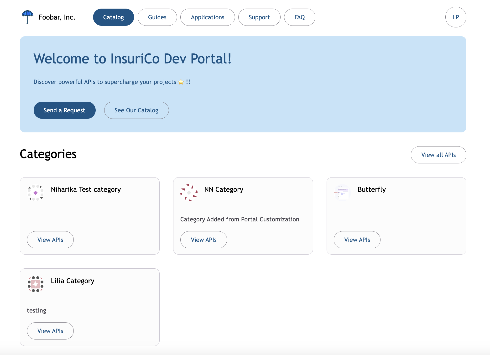
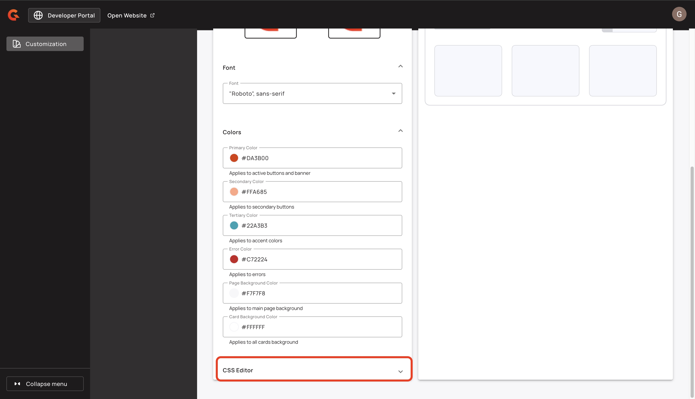
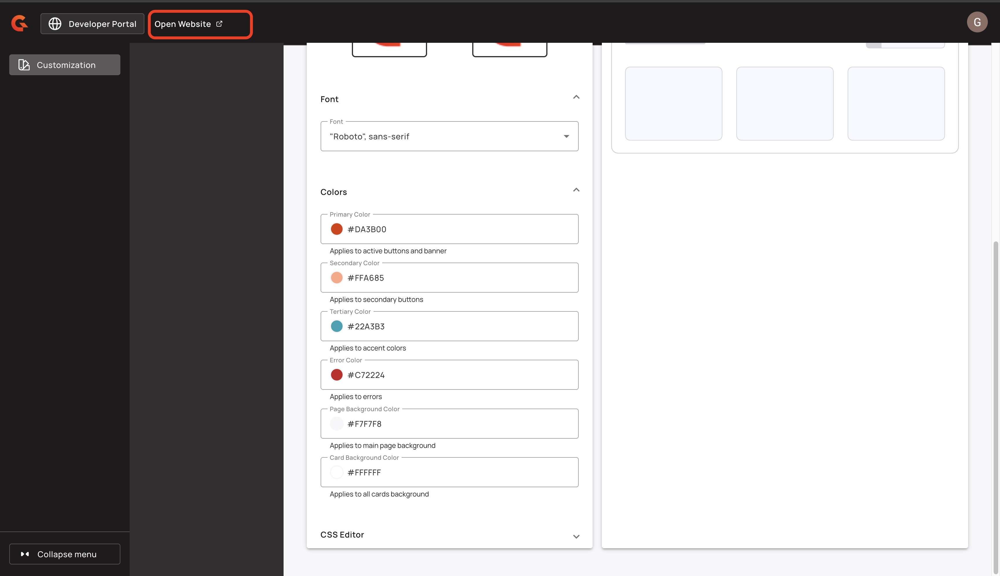

# Layout and Theme


This feature is in tech preview.


## Update the Category layout

In the New Developer Portal catalog, you can search for an API based on an associated category. By default, categories are shown as header tabs, but you can elect to view categories as tiles. To change how API categories are displayed, complete the following steps:

1. Sign in to your APIM Console.
2.  From the homepage, click **Settings**.

    <figure><figcaption></figcaption></figure>
3.  In the **Settings** menu, navigate to the **Portal** section, and then click **Settings**.

    <figure><figcaption></figcaption></figure>
4.  Navigate to the **New Developer Portal** section of the page, and then click **Open Settings** to open the settings in a new tab.

    <figure><figcaption></figcaption></figure>
5.  In the **Customization** menu, click **Catalog**.

    <figure><figcaption></figcaption></figure>
6.  Use the **Category View Mode** drop-down menu to select **Tabs (Default)** or **Tiles**.

    <figure><figcaption></figcaption></figure>

### Verification

1. In the header navigation bar, click **Open Website**.
2. Click the **Catalog** button. Depending on your selection, your New Developer Portal shows your categories as tabs or tiles.

Here is an example of categories as header tabs:

<figure><figcaption><p>Tabs category view</p></figcaption></figure>

Here is an example of categories as tiles:

<figure><figcaption><p>Tiles category view</p></figcaption></figure>

## Fonts

To select fonts for the New Developer Portal, complete the following steps:

1.  From the Console homepage, click **Settings**.

    <figure><figcaption></figcaption></figure>
2.  From the **Settings** menu, click **Settings.**

    <figure><figcaption></figcaption></figure>
3.  Navigate to the **New Developer Portal** section, and then click **Open Settings** to open the settings in a new tab.

    <figure><figcaption></figcaption></figure>
4.  In the **Customization** menu, click **Theme**.

    <figure><figcaption></figcaption></figure>
5. Navigate to the **Font** section of the page.
6.  From the **Font** drop-down menu, select a new font. For a list of available fonts, see [#available-fonts](layout-and-theme.md#available-fonts "mention").

    <figure><figcaption></figcaption></figure>

### Available Fonts


Each bullet point represents a group of fonts. APIM implements the first font in the list that your system supports. For example, if your system does not support **Times** or **serif** but supports **'Times New Roman'** and **'Liberation Serif'**, APIM implements **'Times New Roman'**.


#### Serif fonts

* Georgia, "DejaVu Serif", Norasi, serif
* Times, 'Times New Roman', 'Liberation Serif', FreeSerif, serif

#### Sans-serif fonts

* Arial, Helvetica, 'Liberation Sans', FreeSans, sans-serif
* "DM Sans", sans-serif
* Impact, Arial Black, sans-serif
* '"Inter", sans-serif
* 'Lucida Sans', 'Lucida Grande', 'Lucida Sans Unicode', 'Luxi Sans', sans-serif
* "Montserrat", sans-serif
* "Roboto", sans-serif
* Tahoma, Geneva, Kalimati, sans-serif
* 'Trebuchet MS', Arial, Helvetica, sans-serif
* Verdana, DejaVu Sans, Bitstream Vera Sans, Geneva, sans-serif

#### Monospace fonts

* Courier, 'Courier New', FreeMono, 'Liberation Mono', monospace
* "DM Mono", monospace
* Monaco, 'DejaVu Sans Mono', 'Lucida Console', 'Andale Mono', monospace'

## Add custom CSS to your theme


Custom CSS overrides the default theme for the Developer Portal.


You can add custom CSS to your Developer Portal's theme with the CSS editor. To add custom CSS to your Developer Portal's theme, complete the following steps:

1.  From the homepage, click **Settings**.

    <figure><figcaption></figcaption></figure>
2.  In the **Settings** menu, navigate to the **Portal** section, and then click **Settings**.

    <figure><figcaption></figcaption></figure>
3.  Navigate to the **New Developer Portal** section, and then click **Open Settings** to open the settings in a new tab.

    <figure><figcaption></figcaption></figure>
4.  In the **Customization** menu, click **Theme**.

    <figure><figcaption></figcaption></figure>
5.  Navigate to **CSS Editor** and then click the down arrow.

    <figure><figcaption></figcaption></figure>
6. You can customize the CSS using either of the following options:
   * In the **CSS Editor's box**, enter your CSS code.
   *   In the **CSS Editor's box**, enter CCS tokens. For example:

       ```
       html {
         --gio-app-nav-bar-container-color: red;
       }
       ```

       \{% hint style="info" %\} For a full list of the available CSS tokens that you can use to customize your New Developer Portal, see [#available-css-tokens](layout-and-theme.md#available-css-tokens "mention") \{% endhint %\}### Verification

*   In the header navigation bar, click **Open Website**. Your New Developer Portal shows your custom CSS updates.\\

    <figure><figcaption></figcaption></figure>

### Available CSS tokens

Here are the CSS tokens that you can use to customize the theme of your New Developer Portal. For more information about how to customize the theme of your New Developer Portal with custom CSS, see [#add-custom-css-to-your-theme](layout-and-theme.md#add-custom-css-to-your-theme "mention").

<table><thead><tr><th width="281.12109375">Token</th><th width="192.5703125">Description</th><th>Example CSS</th></tr></thead><tbody><tr><td><code>--gio-app-nav-bar-container-color</code></td><td>Changes the background color of the navigation bar.</td><td><pre class="language-html"><code class="lang-html"><strong>html {
</strong>  --gio-app-nav-bar-container-color: red;
}
</code></pre></td></tr><tr><td><code>--gio-app-card-container-shape</code></td><td>Changes the shape of a card container.</td><td><pre class="language-html"><code class="lang-html">html {
  --gio-app-card-container-shape: 8px;
}
</code></pre></td></tr><tr><td><code>--gio-app-button-container-shape</code></td><td>Changes the corner shape of the buttons.</td><td><pre class="language-html"><code class="lang-html">html {
  --gio-app-button-container-shape: 4px;
}
</code></pre></td></tr><tr><td><code>--gio-app-font-color</code></td><td>Changes the color of the font.</td><td><pre class="language-html"><code class="lang-html">html {
  --gio-app-font-color: #333333;
}
</code></pre></td></tr><tr><td><code>--gio-app-font-contrast-color</code></td><td>Changes the contrast color of the font.</td><td><pre class="language-html"><code class="lang-html">html {
  --gio-app-font-contrast-color: #ffffff;
}
</code></pre></td></tr><tr><td><code>--gio-app-chip-container-color</code></td><td>Changes the color of UI chips.</td><td><pre class="language-html"><code class="lang-html">html {
  --gio-app-chip-container-color: #e0f7fa;
}
</code></pre></td></tr><tr><td><code>--gio-app-table-header-container-color</code></td><td>Changes the background color of the header row of a table.</td><td><pre class="language-html"><code class="lang-html">html {
  --gio-app-table-header-container-color: #f5f5f5;
}
</code></pre></td></tr><tr><td><code>--gio-app-table-container-shape</code></td><td>Changes the corner shape of a table.</td><td><pre class="language-html"><code class="lang-html">html {
  --gio-app-table-container-shape: 8px;
}
</code></pre></td></tr><tr><td><code>--gio-app-search-bar-container-shape</code></td><td>Changes the corner shape of the search bar.</td><td><pre class="language-html"><code class="lang-html">html {
  --gio-app-search-bar-container-shape: 20px;
}
</code></pre></td></tr></tbody></table>
