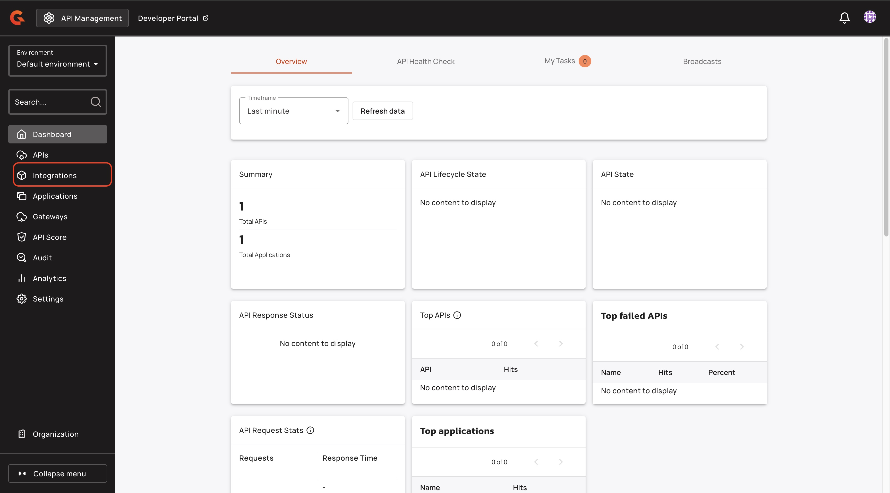
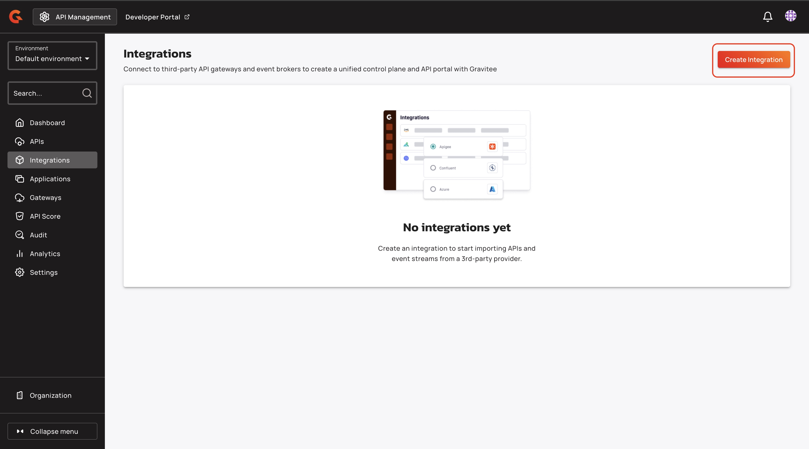
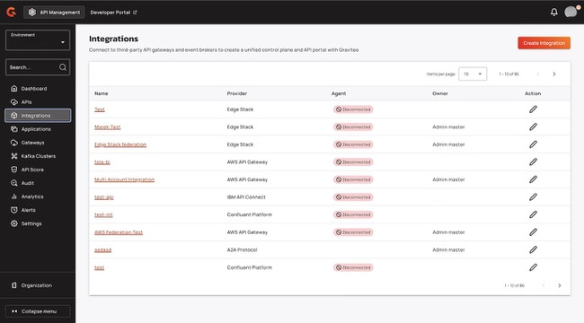
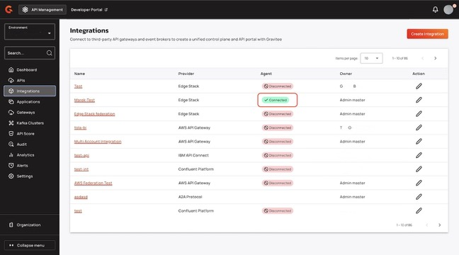

# 4.9 Edge Stack

## Overview

Edge Stack is a cloud native API gateway that runs in Kubernetes.

## Prerequisites

Before you install the Edge stack agent, complete the following steps:

* Install the Edge Stack into the Kubernetes cluster. If it is already installed, you must have access to the Kubernetes cluster where Edge stack is installed.
*   Ensure that you Federation agent meets the following minimum requirements:

    | API Group        | Resource       | Permissions |
    | ---------------- | -------------- | ----------- |
    | getambassador.io | Mappings       | Get, List   |
    | getambassador.io | Filters        | Get, List   |
    | getambassador.io | FilterPolicies | Get, List   |
    |                  | Secrets        | Get, Update |
* Install Gravitee API Management 4.9 or later. For more information about installing Gravitee API Management, see [self-hosted-installation-guides](../../../self-hosted-installation-guides/ "mention") or [hybrid-installation-and-configuration-guides](../../../hybrid-installation-and-configuration-guides/ "mention").
* Ensure that you have an access token. For more information about access tokens, see [federation-agent-service-account.md](../federation-agent-service-account.md "mention").
* If you are installing the Edge Stack agent with Docker, ensure that you have a `kubeconfig` file.

## Install the Edge Stack agent

To install Edge stack agent, you must complete the following steps:

1. [#create-the-edge-stack-agent-integration](4.9-edge-stack.md#create-the-edge-stack-agent-integration "mention")
2. [#configure-and-run-the-edge-stack-agent](4.9-edge-stack.md#configure-and-run-the-edge-stack-agent "mention")

### Create the Edge Stack agent integration

1.  From the APIM console, click **Integrations**.

    <figure><figcaption></figcaption></figure>
2.  Click **Create Integration**.

    <figure><figcaption></figcaption></figure>
3.  Click **Edge Stack**, and then click **Next**.

    <figure><figcaption></figcaption></figure>
4. In the **Create Integration** screen, type the name of the integration.
5. (Optional) Type a description for the integration.
6.  Click **Create** **Integration**.

    <figure><figcaption></figcaption></figure>

#### Verification

The Edge stack integration appears in the **Integrations** screen.

<figure><figcaption></figcaption></figure>

### Configure and run the Edge Stack agent

You can run the Edge Stack using either of the following methods:

* [#configure-and-run-the-edge-stack-agent-locally-with-docker-compose](4.9-edge-stack.md#configure-and-run-the-edge-stack-agent-locally-with-docker-compose "mention")
* [#configure-and-run-the-edge-agent-within-helm](4.9-edge-stack.md#configure-and-run-the-edge-agent-within-helm "mention")

#### Configure and run the Edge Stack agent locally with Docker compose

*   In your `docker-compose.yml` file, navigate to the `services` section, and then add the following configuration:

    ```sh
    services:
      integration-agent:
        image: ${APIM_REGISTRY:-graviteeio}/federation-agent-edge-stack:${AGENT_VERSION:-latest}
        restart: always
        volumes:
          - ${KUBECONFIG_PATH}:/opt/graviteeio-federation-agent/.kube/config
        environment:
          - gravitee_integration_connector_ws_endpoints_0=${WS_ENDPOINTS}
          - gravitee_integration_connector_ws_headers_0_name=Authorization
          - gravitee_integration_connector_ws_headers_0_value=bearer ${WS_AUTH_TOKEN}
          - gravitee_integration_providers_0_integrationId=${INTEGRATION_ID}
          - gravitee_integration_providers_0_configuration_namespace=${NAMESPACE}
          - gravitee_integration_providers_0_configuration_isEmissary=${IS_EMISSARY}
          - gravitee_integration_providers_0_type=edge-stack
          - KUBECONFIG=/opt/graviteeio-federation-agent/.kube/config
          # If you are using Gravitee Next-Gen Cloud, then you need to also include a Cloud Token for Federation Agent
          # - gravitee_cloud_token=${GRAVITEE_CLOUD_TOKEN}

    ```

2.  In your `.env` file, add the following variables:

    ```bash
    ## GRAVITEE PARAMETERS ##

    # Gravitee APIM management API URL, typically suffixed with the path /integration-controller
    WS_ENDPOINTS=https://<your-APIM-management-API-host/integration-controller>

    # Gravitee APIM token to be used by the agent
    WS_AUTH_TOKEN=<your-token>

    # ID of the APIM integration you created for this agent
    INTEGRATION_ID=<your-integration-id>

    # If you are using Gravitee Next-Gen Cloud, then you also need to include a Cloud Token for Federation Agent (https://documentation.gravitee.io/apim/hybrid-installation-and-configuration-guides/next-gen-cloud#cloud-token)
    # GRAVITEE_CLOUD_TOKEN=[your-cloud-token-for-federation-agent]

    # Optionally specify a specific version of the agent, default will be latest
    # AGENT_VERSION=1.1.0

    ## EDGE STACK PARAMETERS ##

    # Kubernetes namespace with the APIs you want to discover
    NAMESPACE=<kubernetes namespace>

    # If you are using the agent to discover APIs for Emissary, set this to true.  Otherwise set it to false.
    IS_EMISSARY=<true | false>

    # The absolute path to the kubeconfig file with the necessary permissions to be used to connect to the 
    # Kubernetes API
    KUBECONFIG_PATH=<path to kubeconfig file>

    ```

* Replace `<your-APIM-management-API-host/integration-controller>` with the Gravitee APIM URL.
* Replace `<your-token>` with the Graviee APIM token that you want the agent to use.
* Replace `<your-integration-id>` with the ID of the APIM integration.
* Replace `<kubernetes namespace>` with the Kubernetes namespace that has the API that you want to discover.
* Replace `<true | false>` with either true of false depending on if you want to discover APIs for Emissary.
* Replace `<path to the kubeconfig file>` with the the absolute path to the kubeconfig file.

3.  Pull the latest docker image with the following command:

    ```
    docker compose -f docker-compose-apim.yml pull
    ```
4.  Start the Edge Stack agent with the following command:

    ```
    docker compose up -d
    ```

#### Configure and run the Edge agent within Helm

1.  In your `values.yaml file`, add the following configuration:

    ```bash
    agent:
      config:
        graviteeYml:
          secrets:
            kubernetes:
              enabled: true
          integration:
            connector:
              ws:
                headers:
                  - name: Authorization
                    value: secret://kubernetes/agent-secret:apimAuthorizationHeader
                endpoints:
                  - https://<your-APIM-management-API-host]/integration-controller>
            providers:
              - integrationId: "<your-integration-id>"
                configuration:
                  namespace: "<namespace>"
                  isEmissary: "<true | false>"
                type: edge-stack

    kubernetes:
      extraObjects:
        - apiVersion: v1
          kind: Secret
          metadata:
            name: agent-secret
          type: Opaque
          data:
            apimAuthorizationHeader: [base64 encoded value]
    ```

    * Replace `<your-APIM-management-API-host/integration-controller>` with the Gravitee APIM URL.
    * Replace `<your-integration-id>` with the ID of the APIM integration.
    * Replace `<namespace>` with the Kubernetes namespace that has the API that you want to discover.
    * Replace `<true | false>` with either true of false depending on if you want to discover APIs for Emissary.
    * Replace `<base64 encoded value>` with
2.  Add the Gravitee Heml Chart repository using the following command:

    ```bash
    helm repo add graviteeio https://helm.gravitee.io
    ```
3.  Install the Edge Stack federation agent using the following command:

    ```
    helm install edge-stack-federation-agent -f es-federation-agent-values.yaml graviteeio/federation-agent-edge-stack
    ```

### Verification

In the **Integrations** screen of the APIM Console, the agent status shows **Connected**.

<figure><figcaption></figcaption></figure>
