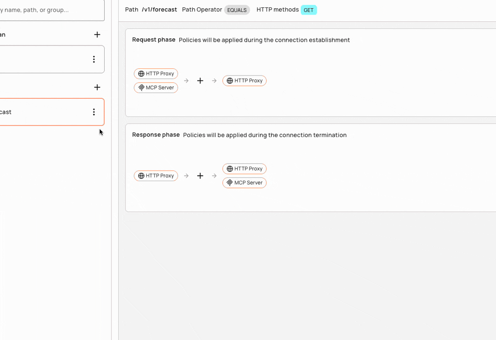
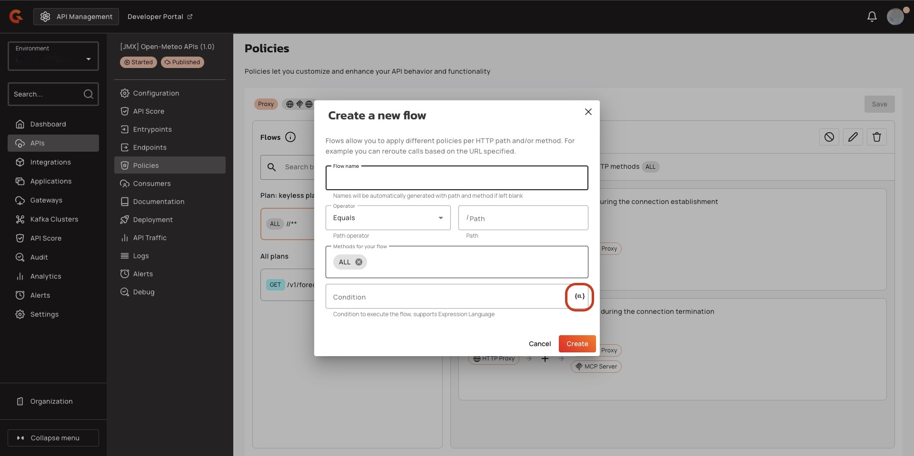

# 4.9: Gravitee Expression Language

## Overview

Gravitee Expression Language (EL) is used to query and manipulate object graphs and dynamically configure various aspects and policies of an API. It allows you to reference values from the current API transaction to use expressions to create dynamic filters, routing rules, and policies that respond to specific conditions or parameters.

EL is an extended version of the Spring Expression Language (SpEL) that augments standard SpEL capabilities by providing additional object properties inside the expression language context. As an extension of SpEL, all capabilities detailed in the SpEL documentation are available in EL. However, Gravitee has implemented customizations that are detailed below.


**Object properties**

Custom properties and attributes have special meanings in the Gravitee ecosystem:

* **Custom Properties:** Defined at the API level and read-only during the Gateway's execution of an API transaction. You can learn more about how to set an API's custom properties here.
* **Attributes:** Scoped to the current API transaction and can be manipulated during the execution phase through the `assign-attributes` policy. Attributes are used to attach additional information to a request or message via a variable that is dropped after the API transaction is completed.


## Basic usage

The information below summarizes:

* Object properties added to the EL context
* How attributes are accessed for v4 and v2 APIs
* Commonly used operators and functions



**Expressions**

Expressions in Gravitee are enclosed in curly braces `{}` and begin with the `#` symbol. Both dot notation and bracket notation are supported for accessing the properties of an object.

Example: `{#context.attributes['user'].email}`


**Dot notation vs bracket notation**

Please note that dot notation will not work with special characters:

`{#request.headers.my-header}` <- **This will result in an error**

Bracket notation should be used for property names that include a space or a hyphen, or start with a number:

`{#request.headers['my-header']}`


**Lists**

Expressions can be used to assign lists, e.g., `{({'admin', 'writer'})}`

1. The outer enclosing brackets start and end the EL expression
2. The parentheses indicates an object is being instantiated
3. The list comprises the inner brackets and enclosed values, e.g., `{'admin', 'writer'}`



EL allows you to reference certain values injected into the EL context as object properties. The available object properties will be further detailed in later sections. EL adds the following root-level object properties:

* `{#api.properties}`: Contains custom properties defined by the API publisher for that Gateway API.
* `{#dictionaries}`: Contains custom dictionaries defined by the API publisher for that Gateway API.
* `{#endpoints}`: Contains information about the Gateway API's respective endpoints.
* `{#request}`: Contains information about the current API request.
* `{#response}`: Contains information about the current API response.
* `{#message}`: Contains information about the current API message.
* `{#node}` : Contains information about the node hosting the instance of the Gateway handling the API transaction.



The `attributes` object property contains attributes that are automatically created by the APIM Gateway during an API transaction or added during the execution phase through the Assign Attributes policy. However, attributes fall into one of two categories based on API type:

* `{#context.attributes}`: Contains attributes associated with v2 APIs or v4 Proxy APIs. A v4 Proxy API is created using the **Proxy upstream protocol** method.
* `{#message.attributes}`: Contains attributes associated with v4 Message APIs. These APIs are created using the **Introspect messages from event-driven backend** method.

See the v4 API creation wizard for more details.



EL supports various operators, such as arithmetic, logical, comparison, and ternary operators. Examples of commonly used operators in Gravitee include:

* Arithmetic operators: `+, -, *, /`
* Logical operators: `&& (logical and), || (logical or), ! (logical not)`
* Comparison operators: `==, !=, <, <=, >, >=`
* Ternary operators: `condition ? expression1 : expression2`



EL provides a variety of built-in functions to manipulate and transform data in expressions. Examples of commonly used functions in Gravitee include:

* String functions: `length(), substring(), replace()`
* `#jsonPath`: Evaluates a `jsonPath` on a specified object. This function invokes `JsonPathUtils.evaluate(…​)`, which delegates to the Jayway JsonPath library. The best way to learn jsonPath syntax is by using the online evaluator.
* `#xpath`: To evaluate an `xpath` on some provided object. For more information regarding XML and XPath, see XML Support - Dealing with XML Payloads in the SpEL documentation.

**`jsonPath` example**

As an example of how `jsonPath` can be used with EL, suppose you have a JSON payload in the request body that contains the following data:

```json
{
  "store": {
    "book": [
      {
        "category": "fiction",
        "author": "Herman Melville",
        "title": "Moby Dick",
        "isbn": "0-553-21311-3",
        "price": 8.99
      },
      {
        "category": "fiction",
        "author": "J. R. R. Tolkien",
        "title": "The Lord of the Rings",
        "isbn": "0-395-19395-8",
        "price": 22.99
      }
    ]
  }
}
```

To extract the value of the `price` property for the book with `title` "The Lord of the Rings," you can use the following expression:

`{#jsonPath(#request.content, "$.store.book[?(@.title=='The Lord of the Rings')].price")}`



## Expression Language Assistant

### Overview&#x20;

The Expression Language (EL) Assistant helps you write the EL expression needed for the field. You provide the Assistant with the prompt for the EL that you want, and then the assistant returns the corresponding EL for the prompt.&#x20;

<figure><figcaption></figcaption></figure>

### Prerequisites&#x20;

* Gravitee Cloud account. To register for Gravitee Cloud, go to [Cloud](https://eu-auth.cloud.gravitee.io/cloud/register?response_type=code\&client_id=fd45d898-e621-4b12-85d8-98e621ab1237\&state=ZWVjRy5pZlpjdk1wZjFabWpPU0VPWEtzVjFDSGUzTXVSRGMzLkRIVEdrSnRC\&redirect_uri=https%3A%2F%2Feu.cloud.gravitee.io\&scope=openid+profile+email+offline_access\&code_challenge=OCLxO6DaZFROGdqhhTQq7nig9WGdFtVHttWGCdpHiPc\&code_challenge_method=S256\&nonce=ZWVjRy5pZlpjdk1wZjFabWpPU0VPWEtzVjFDSGUzTXVSRGMzLkRIVEdrSnRC\&createUser=true\&hubspotutk=640db1914414dc8d82a03c4db2c797de).
* (Self-hosted and Hybrid installations only) Register your installation in Gravitee Cloud. For more information about registering your installation, see Register installations.
* (Self-hosted and Hybrid installations only) Depending on your installation method, add the following configuration:



-   Add the following configuration to the root level of your `gravitee.yaml` file:\


    ```yaml
    newtai:
      elgen:
        enabled: true
    ```



* Add the following line to your `.env` file:

```
gravitee_newtai_elgen_enabled=true
```



*   Add the following configuration to your `values.yaml` file:\


    ```yaml
    newtai:
      elgen:
        enabled: true
    ```



### Generate Expression Language with the EL assistant


Any field that supports Expression Language, supports the AI assistant.&#x20;


1.  In the field that supports expression language, click the **{EL}** icon.\


    <figure><figcaption></figcaption></figure>
2. In the **EL Assistant** pop-up window, type the prompt for the Expression Language that you want the AI assistant to generate. For example, only run this policy if the header equals test.
3.  Click **Ask Newt AI**. The AI assistant generates the Expression Language.\


    <figure><figcaption></figcaption></figure>

### Use case examples

The following use cases provide you with an understanding of how to use the EL Assistant.

#### Add a condition to a policy flow

To add a condition to a policy flow to only run the policy flow when header equals true, type the following prompt in the EL Assistant pop-up window: Only run this policy flow if the header equals test.&#x20;

The EL  Assistant returns the following Expression language to use in your policy flow:

`{#request.headers['Test_Endpoints_header'][0] == 'test'}`

#### Targeting an endpoint&#x20;

To add a Target url for your endpoint that targets `https://jsonplaceholder.typicode.com/` , type the following prompt in the EL Assistant pop-up window: The target URL must target the following URL: https://jsonplaceholder.typicode.com/.&#x20;

The EL assistant returns the following response:&#x20;

`{#context.attributes['https://jsonplaceholder.typicode.com']}`

#### Add an assertion for API Health checks

To add an assertion that only checks the HTTP response, 200, type the following prompt in the  EL Assistant pop-up window: Check only the status of the following HTTP response that equals 200

The EL Assistant returns the following response:

`{#response.status == 200}`

## APIs

Using EL, you can access information about an API transaction through several root-level objects that are injected into the EL context: custom properties, dictionaries, and endpoints.



As an API publisher, you can define custom properties for your API. These properties are automatically injected into the expression language context and can be referenced during an API transaction from the `{#api.properties}` root-level object property.

**Examples**

* Get the value of the property `my-property` defined in an API's custom properties using `{#api.properties['my-property']}`
* Get the value of the property `my-secret` defined and encrypted in an API's custom properties using `{#api.properties['my-secret']}` to pass a secured property to your backend


**Encrypted custom properties**

When accessing an encrypted custom property, Gravitee's Gateway will automatically manage the decryption and provide a plain text value.




Dictionaries work similarly to custom properties, but you need to specify the dictionary ID as well as the dictionary property name. Dictionary properties are simply key-value pairs that can be accessed from the `{#dictionaries}` root-level object property.

**Example**

Get the value of the dictionary property `dict-key` defined in dictionary `my-dictionary-id` using `{#dictionaries['my-dictionary-id']['dict-key']}`.



When you define endpoints for your API, you need to give them a name that is a unique identifier across all endpoints of the API. This identifier can be used to get an endpoint reference (i.e., a URI) from the `{#endpoints}` root-level object property.

**Example**

When you create an API, a default endpoint is created that corresponds to the value you set for the backend property. This endpoint can be retrieved with EL by using the following syntax: `{#endpoints['default']}`.



## Request <a href="#request" id="request"></a>

EL can be used to access request properties and attributes as described below.

### Request object properties

The object properties you can access from the `{#request}` root-level object property and use for API requests are listed below.



<table><thead><tr><th width="172">Object Property</th><th width="157">Description</th><th width="134">Type</th><th>Example</th></tr></thead><tbody><tr><td><a data-footnote-ref href="#user-content-fn-1">content</a></td><td>Body content</td><td>string</td><td>-</td></tr><tr><td>contextPath</td><td>Context path</td><td>string</td><td>/v2/</td></tr><tr><td>headers</td><td>Headers</td><td>key / value</td><td>X-Custom → myvalue</td></tr><tr><td>host</td><td>The host of the request. This is preferable to using the Host header of the request because HTTP2 requests do not provide this header.</td><td>string</td><td>gravitee.example.com</td></tr><tr><td>id</td><td>Identifier</td><td>string</td><td>12345678-90ab-cdef-1234-567890ab</td></tr><tr><td>localAddress</td><td>Local address</td><td>string</td><td>0:0:0:0:0:0:0:1</td></tr><tr><td>method</td><td>HTTP method</td><td>string</td><td>GET</td></tr><tr><td>params</td><td>Query parameters</td><td>key / value</td><td>order → 100</td></tr><tr><td>path</td><td>Path</td><td>string</td><td>/v2/store/MyStore</td></tr><tr><td>pathInfo</td><td>Path info</td><td>string</td><td>/store/MyStore</td></tr><tr><td>pathInfos</td><td>Path info parts</td><td>array of strings</td><td>[,store,MyStore]</td></tr><tr><td>pathParams</td><td>Path parameters</td><td>key / value</td><td>storeId → MyStore (<em>see Warning for details</em>)</td></tr><tr><td>pathParamsRaw</td><td>Path parameters</td><td>string</td><td>/something/:id/**</td></tr><tr><td>paths</td><td>Path parts</td><td>array of strings</td><td>[,v2,store,MyStore]</td></tr><tr><td>remoteAddress</td><td>Remote address</td><td>string</td><td>0:0:0:0:0:0:0:1</td></tr><tr><td>scheme</td><td>The scheme of the request (either <code>http</code> or <code>https</code>)</td><td>string</td><td>http</td></tr><tr><td>host</td><td></td><td>string</td><td></td></tr><tr><td>ssl</td><td>SSL session information</td><td>SSL object</td><td>-</td></tr><tr><td>timestamp</td><td>Timestamp</td><td>long</td><td>1602781000267</td></tr><tr><td>transactionId</td><td>Transaction identifier</td><td>string</td><td>cd123456-7890-abcd-ef12-34567890</td></tr><tr><td>uri</td><td>URI</td><td>string</td><td>/v2/store/MyStore?order=100</td></tr><tr><td>version</td><td>HTTP version</td><td>string</td><td>HTTP_1_1</td></tr></tbody></table>



* Get the value of the `Content-Type` header for an incoming HTTP request using `{#request.headers['content-type']}`
* Get the second part of the request path using `{#request.paths[1]}`



### Request context attributes

When APIM Gateway handles an incoming API request, some object properties are automatically created or added during the execution phase through the Assign Attributes policy. These object properties are known as attributes. Attributes can be accessed from the `{#context.attributes}` root-level object property.

Some policies (e.g., the OAuth2 policy) register other attributes in the request context. For more information, refer to the documentation for individual policies.

Request context attributes and examples are listed below.



<table><thead><tr><th width="170">Object Property</th><th width="190">Description</th><th width="104">Type</th><th>Nullable</th></tr></thead><tbody><tr><td>api</td><td>Called API</td><td>string</td><td>-</td></tr><tr><td>api-key</td><td>The API key used (for an API Key plan)</td><td>string</td><td>X (for no API Key plan)</td></tr><tr><td>application</td><td>The authenticated application making incoming HTTP requests</td><td>string</td><td>X (for Keyless plan)</td></tr><tr><td>context-path</td><td>Context path</td><td>string</td><td>-</td></tr><tr><td>plan</td><td>Plan used to manage incoming HTTP requests</td><td>string</td><td>-</td></tr><tr><td>resolved-path</td><td>The path defined in policies</td><td>string</td><td>-</td></tr><tr><td>user-id</td><td><p>The user identifier of an incoming HTTP request:</p><p>* The subscription ID for an API Key plan</p><p>* The remote IP for a Keyless plan</p></td><td>string</td><td>-</td></tr></tbody></table>



* Get the value of the `user-id` attribute for an incoming HTTP request using `{#context.attributes['user-id']}`
* Get the value of the `plan` attribute for an incoming HTTP request using `{#context.attributes['plan']}`



### SSL object properties <a href="#ssl_object" id="ssl_object"></a>

The object properties you can access in the `ssl` session object from the `{#request.ssl}` root-level object property are listed below.



<table><thead><tr><th width="172">Object Property</th><th width="177">Description</th><th width="169">Type</th><th>Example</th></tr></thead><tbody><tr><td>clientHost</td><td>Host name of the client</td><td>string</td><td>client.domain.com</td></tr><tr><td>clientPort</td><td>Port number of the client</td><td>long</td><td>443</td></tr><tr><td>client</td><td>Client information</td><td>Principal object</td><td>-</td></tr><tr><td>server</td><td>Server information</td><td>Principal object</td><td>-</td></tr></tbody></table>



Get the client HOST from the SSL session using `{#request.ssl.clientHost}`



#### Principal objects <a href="#principal_object" id="principal_object"></a>

The `client` and `server` objects are of type `Principal`. A `Principal` object represents the currently authenticated user who is making the request to the API and provides access to various user attributes such as username, email address, roles, and permissions.

The `Principal` object is typically used with security policies such as OAuth2, JWT, or basic authentication to enforce access control and authorization rules on incoming requests. For example, a policy can check if the current user has a specific role or permission before allowing them to access a protected resource.

If the `Principal` object is not defined, `client` and `server` object values are empty. Otherwise, there are domain name attributes you can access from the `{#request.ssl.client}` and `{#request.ssl.server}` `Principal` objects as shown in the table below:


**Limitation on arrays**

All attributes of the `Principal`object are flattened to be accessed directly with dot or bracket notation. While some of these attributes can be arrays, EL will only return the first item in the array. To retrieve all values of an attribute, use the `attributes` object property shown in the table and examples below.




<table><thead><tr><th width="218">Object Property</th><th width="154">Description</th><th width="102">Type</th><th>Example</th></tr></thead><tbody><tr><td>attributes</td><td>Retrieves all the <code>Principal</code> object's domain name attributes</td><td>key / value</td><td>"ou" → ["Test team", "Dev team"]</td></tr><tr><td>businessCategory</td><td>Business category</td><td>string</td><td>-</td></tr><tr><td>c</td><td>Country code</td><td>string</td><td>FR</td></tr><tr><td>cn</td><td>Common name</td><td>string</td><td>-</td></tr><tr><td>countryOfCitizenship</td><td>RFC 3039 CountryOfCitizenship</td><td>string</td><td>-</td></tr><tr><td>countryOfResidence</td><td>RFC 3039 CountryOfResidence</td><td>string</td><td>-</td></tr><tr><td>dateOfBirth</td><td>RFC 3039 RFC 3039 DateOfBirth</td><td>string</td><td>19830719000000Z</td></tr><tr><td>dc</td><td>Domain component</td><td>string</td><td>-</td></tr><tr><td>defined</td><td>Returns <code>true</code> if the <code>Principal</code> object is defined and contains values. Returns <code>false</code> otherwise.</td><td>boolean</td><td>-</td></tr><tr><td>description</td><td>Description</td><td>string</td><td>-</td></tr><tr><td>dmdName</td><td>RFC 2256 directory management domain</td><td>string</td><td>-</td></tr><tr><td>dn</td><td>Fully qualified domain name</td><td>string</td><td>-</td></tr><tr><td>dnQualifier</td><td>Domain name qualifier</td><td>string</td><td>-</td></tr><tr><td>e</td><td>Email address in Verisign certificates</td><td>string</td><td>-</td></tr><tr><td>emailAddress</td><td>Email address (RSA PKCS#9 extension)</td><td>string</td><td>-</td></tr><tr><td>gender</td><td>RFC 3039 Gender</td><td>string</td><td>"M", "F", "m" or "f"</td></tr><tr><td>generation</td><td>Naming attributes of type X520name</td><td>string</td><td>-</td></tr><tr><td>givenname</td><td>Naming attributes of type X520name</td><td>string</td><td>-</td></tr><tr><td>initials</td><td>Naming attributes of type X520name</td><td>string</td><td>-</td></tr><tr><td>l</td><td>Locality name</td><td>string</td><td>-</td></tr><tr><td>name</td><td>Name</td><td>string</td><td>-</td></tr><tr><td>nameAtBirth</td><td>ISIS-MTT NameAtBirth</td><td>string</td><td>-</td></tr><tr><td>o</td><td>Organization</td><td>string</td><td>-</td></tr><tr><td>organizationIdentifier</td><td>Organization identifier</td><td>string</td><td>-</td></tr><tr><td>ou</td><td>Organization unit name</td><td>string</td><td>-</td></tr><tr><td>placeOfBirth</td><td>RFC 3039 PlaceOfBirth</td><td>string</td><td>-</td></tr><tr><td>postalAddress</td><td>RFC 3039 PostalAddress</td><td>string</td><td>-</td></tr><tr><td>postalCode</td><td>Postal code</td><td>string</td><td>-</td></tr><tr><td>pseudonym</td><td>RFC 3039 Pseudonym</td><td>string</td><td>-</td></tr><tr><td>role</td><td>Role</td><td>string</td><td>-</td></tr><tr><td>serialnumber</td><td>Device serial number name</td><td>string</td><td>-</td></tr><tr><td>st</td><td>State or province name</td><td>string</td><td>-</td></tr><tr><td>street</td><td>Street</td><td>string</td><td>-</td></tr><tr><td>surname</td><td>Naming attributes of type X520name</td><td>string</td><td>-</td></tr><tr><td>t</td><td>Title</td><td>string</td><td>-</td></tr><tr><td>telephoneNumber</td><td>Telephone number</td><td>string</td><td>-</td></tr><tr><td>uid</td><td>LDAP User id</td><td>string</td><td>-</td></tr><tr><td>uniqueIdentifier</td><td>Naming attributes of type X520name</td><td>string</td><td>-</td></tr><tr><td>unstructuredAddress</td><td>Unstructured address (from PKCS#9)</td><td>string</td><td>-</td></tr></tbody></table>



**Standard Object Properties**

* Get the client DN from the SSL session: `{#request.ssl.client.dn}`
* Get the server organization from the SSL session: `{#request.ssl.server.o}`

**Arrays and boolean logic**

* Get all the organization units of the server from the SSL session:
  * `{#request.ssl.server.attributes['ou'][0]}`
  * `{#request.ssl.server.attributes['OU'][1]}`
  * `{#request.ssl.server.attributes['Ou'][2]}`
* Get a custom attribute of the client from the SSL session: `{#request.ssl.client.attributes['1.2.3.4'][0]}`
* Determine if the SSL attributes of the client are set: `{#request.ssl.client.defined}`



## Response

The object properties you can access for API responses from the `{#response}` root-level object property are listed below.



<table><thead><tr><th width="172">Object Property</th><th>Description</th><th width="125">Type</th><th>Example</th></tr></thead><tbody><tr><td>content</td><td>Body content</td><td>string</td><td>-</td></tr><tr><td>headers</td><td>Headers</td><td>key / value</td><td>X-Custom → myvalue</td></tr><tr><td>status</td><td>Status of the HTTP response</td><td>int</td><td>200</td></tr></tbody></table>



Get the status of an HTTP response: `{#response.status}`



## Message

The object properties you can access for API messages from the `{#message}` root-level object property are listed below. A message (either sent or received) may also contain attributes that can be retrieved via `{#message.attributes[key]}`.


The EL used for a message does not change based on phase. EL is executed on the message itself, so whether the message is sent in the subscribe or publish phase is irrelevant.




<table><thead><tr><th width="172">Object Property</th><th>Description</th><th width="125">Type</th><th>Example</th></tr></thead><tbody><tr><td>attributeNames</td><td>The names of the attributes</td><td>list / array</td><td>-</td></tr><tr><td>attributes</td><td>Attributes attached to the message</td><td>key / value</td><td>-</td></tr><tr><td>content</td><td>Content of the message</td><td>string</td><td>-</td></tr><tr><td>contentLength</td><td>Size of the content</td><td>integer</td><td>-</td></tr><tr><td>error</td><td>Flag regarding the error state of the message</td><td>boolean</td><td>-</td></tr><tr><td>headers</td><td>Headers attached to the message</td><td>key / value</td><td>-</td></tr><tr><td>id</td><td>ID of the message</td><td>string</td><td>-</td></tr><tr><td>metadata</td><td>Metadata attached to the message</td><td>key / value</td><td>-</td></tr></tbody></table>



* Get the value of the `Content-Type` header for a message using `{#message.headers['content-type']}`
* Get the size of a message using `{#message.contentLength}`



## Nodes

A node is a component that represents an instance of the Gravitee Gateway. Each node runs a copy of the Gateway that is responsible for handling incoming requests, executing policies, and forwarding requests to the appropriate upstream services. The object properties you can access for nodes from the `{#node}` root-level object property are listed below.



<table><thead><tr><th width="179">Object Property</th><th width="153">Description</th><th width="94">Type</th><th>Example</th></tr></thead><tbody><tr><td>id</td><td>Node ID</td><td>string</td><td>975de338-90ff-41ab-9de3-3890ff41ab62</td></tr><tr><td>shardingTags</td><td>Node sharding tag</td><td>array of string</td><td>[internal,external]</td></tr><tr><td>tenant</td><td>Node tenant</td><td>string</td><td>Europe</td></tr><tr><td>version</td><td>Node version</td><td>string</td><td>3.14.0</td></tr><tr><td>zone</td><td>Zone the node is grouped in</td><td>string</td><td>europe-west-2</td></tr></tbody></table>



Get the version of a node : `{#node.version}`



[^1]: `{#request.content}` is only available for policies bound to an `on-request-content` phase.
