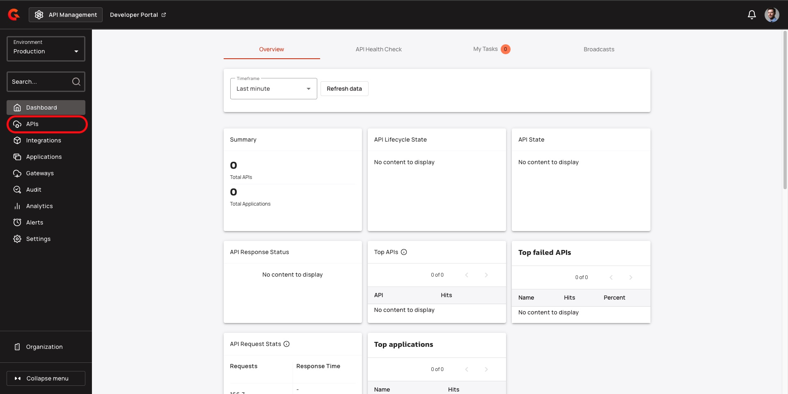
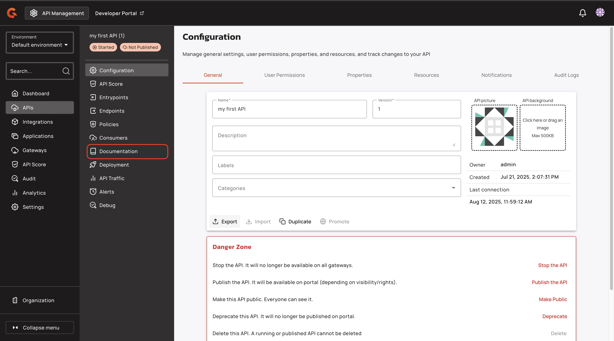

# Add API Documentation

## Overview

This guide explains how to add documentation to your first API.

## Prerequisites

* Complete the steps in [create-an-api.md](create-an-api.md "mention").
* Complete the steps in [add-security.md](add-security.md "mention").
* Complete the steps in [add-a-policy.md](add-a-policy.md "mention").

## Add API documentation

1.  From the dashboard, click **APIs**.

    <figure><figcaption></figcaption></figure>
2.  Click the API that you created in [create-an-api.md](create-an-api.md "mention").

    <figure><figcaption></figcaption></figure>
3.  In your API menu, click **Documentation**. \\

    <figure><figcaption></figcaption></figure>
4.  Click **Documentation Pages**, and then click **Add new page**.

    <figure><figcaption></figcaption></figure>
5.  From the **Add new page** dropdown menu, click Markdown.

    <figure><figcaption></figcaption></figure>
6. In the **Name** field, type the name of your documentation page. For example, My first page.
7.  In the **Visibility** section, Click **Public**, and then click **Next**.

    <figure><figcaption></figcaption></figure>
8.  In the Determine source page, click **Next**.

    <figure><figcaption></figcaption></figure>
9. In the **Page content** section, add the documentation for your API using Markdown.
10. Click **Save and publish**.

    <figure><figcaption></figcaption></figure>

## Verification

Your document page appears in the **Documentation pages** tab of the **Documentation** screen.

<figure><figcaption></figcaption></figure>

## Next steps

Publish your API. For more information about publishing your API, see [publish-your-api.md](publish-your-api.md "mention").
