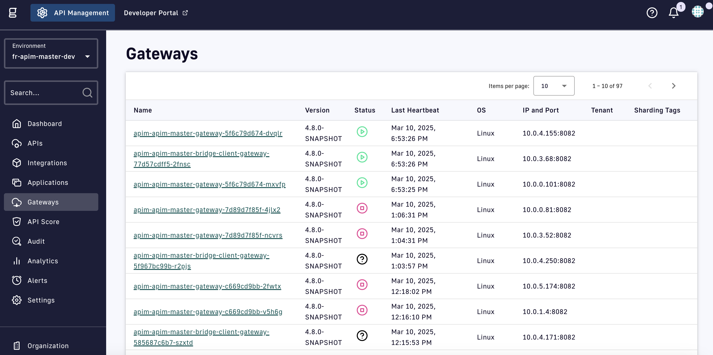
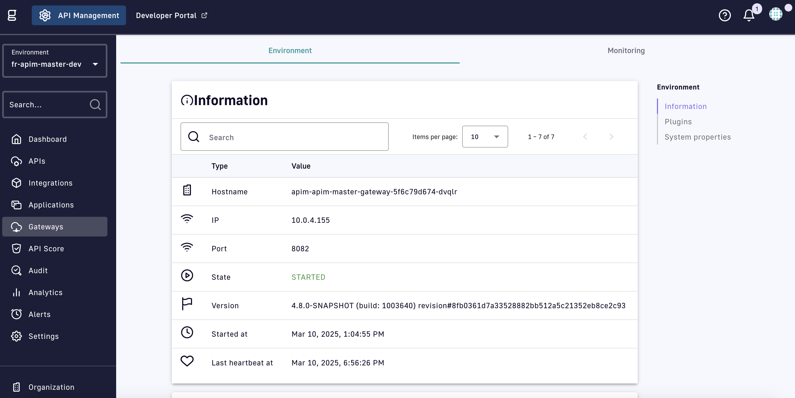
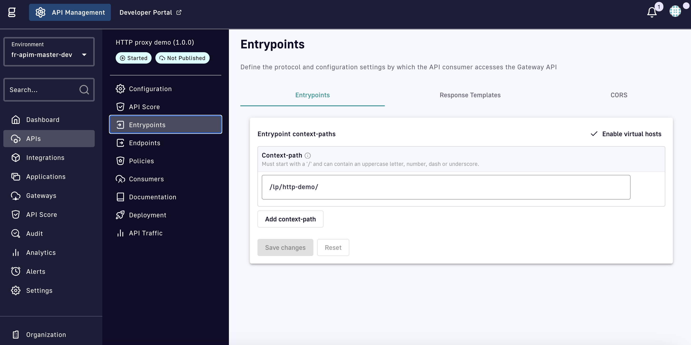

# Create an API

## Use the API Wizard

To create your first API, complete the following steps:

1.  Log in to your APIM Console and select **APIs** from the menu.\

    <figure><figcaption></figcaption></figure>
2.  Click **+ Add API**.\

    <figure><figcaption></figcaption></figure>
3.  In the **Create New API** section, click **Create V4 API**.\

    <figure><figcaption></figcaption></figure>
4.  Enter your API's name and version number and click **Validate my API details**.\

    <figure><figcaption></figcaption></figure>
5.  Select **Proxy Generic Protocol** and click **Select my API architecture**.\

    <figure><figcaption></figcaption></figure>
6.  Select **HTTP Proxy** and click **Select my entrypoints**.\

    <figure><figcaption></figcaption></figure>
7.  Set a unique **Context-path** and click **Validate my entrypoints**.\

    <figure><figcaption></figcaption></figure>
8.  Set the target URL for the HTTP proxy and click **Validate my endpoints**.\

    <figure><figcaption></figcaption></figure>
9. By default, Gravitee adds a **Default keyless plan (UNSECURED)** to your API. Click **Validate my plans**.&#x20;
10. Click **Save & Deploy**.

## Test your API

1.  Select **Gateways** from the APIM Console nav and click on your Gateway.\

    <figure><figcaption></figcaption></figure>
2.  Retrieve your Gateway URL from the **Hostname** field of the **Information** section. You will need this value.\

    <figure><figcaption></figcaption></figure>
3. Select **APIs** from the APIM Console nav and click on your API.
4.  Retrieve your Context-path from your API's **Entrypoints** page. You will need this value.\

    <figure><figcaption></figcaption></figure>
5. In your browser, enter the the URL for your API in the following format: `gateway_url/context_path` . It should return a 200 HTTP response.&#x20;
