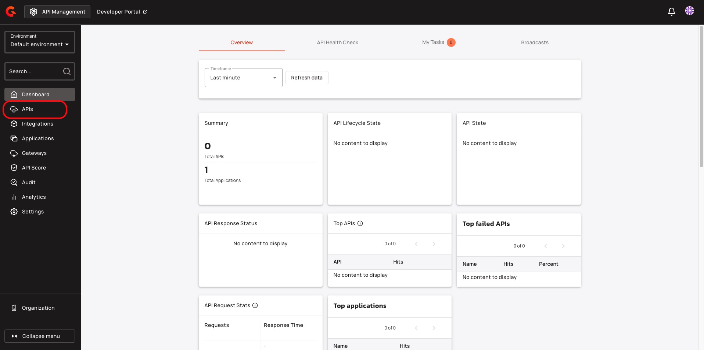
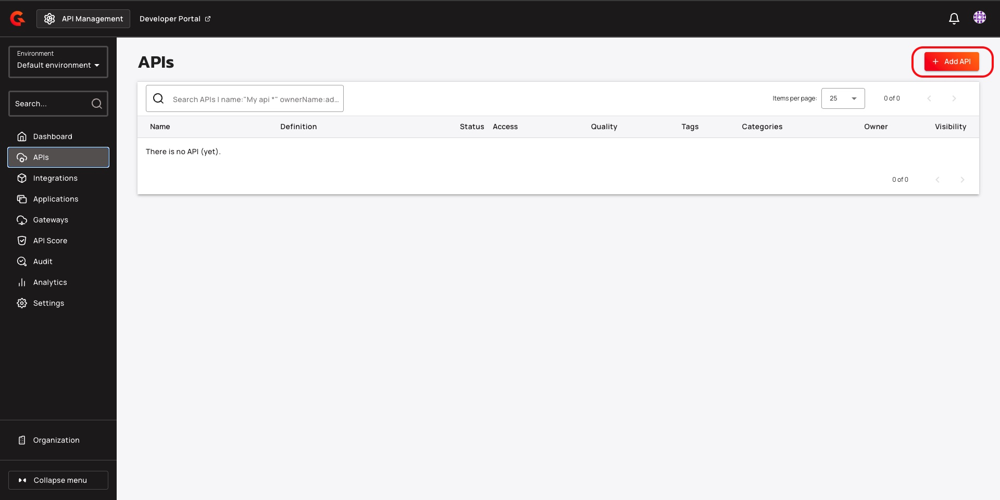
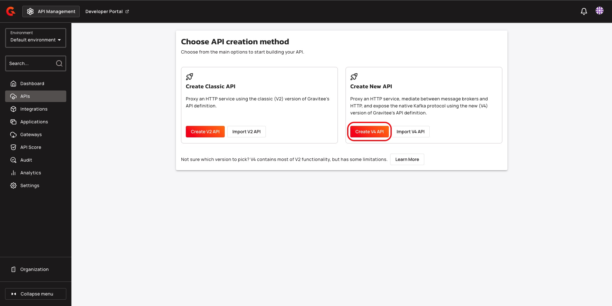
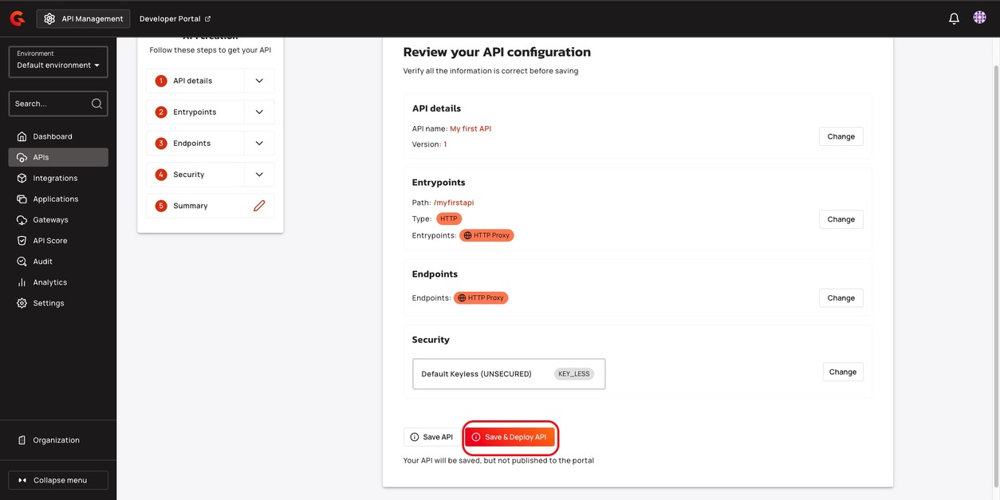

# Create an API

## Overview

This guide explains how to create an API with the Gravitee APIM console.

## Create an API

1.  From the Dashboard, click **APIs**.

    <figure><figcaption></figcaption></figure>
2.  Click **+ Add API**.

    <figure><figcaption></figcaption></figure>
3.  Click **Create V4 API**.

    <figure><figcaption></figcaption></figure>
4.  Enter your API's name and version number, and then click **Validate my API details**. For example, My first API and version 1.

    <figure><figcaption></figcaption></figure>
5.  Select **HTTP Proxy**, and then click **Select my entrypoints**

    <figure><figcaption></figcaption></figure>
6.  Set a unique **Context-path , and** then click **Validate my entrypoints**. For example, /myfirstapi.

    <figure><figcaption></figcaption></figure>
7.  In the **Configure your API endpoints access** screen, set the target URL , and then click **Validate my endpoints**. For example, https://jsonplaceholder.typicode.com

    <figure><figcaption></figcaption></figure>
8.  Click **Validate my plans**. By default, Gravitee adds a **Default keyless plan (UNSECURED)** to your API.

    <figure><figcaption></figcaption></figure>
9.  Click **Save & Deploy API**.

    <figure><figcaption></figcaption></figure>

## Test your API

1. Retrieve the target URL for your API. To retrieve the target URL, complete the following sub-steps:
   1. From the dashboard, click **APIs**.
   2. Click the API that you created.
   3. Click **Endpoints**.
   4. Click the **pencil** icon.
   5. Copy the Target URL from the **target URL** field.
2. Retrieve the context-path for your API. To retrieve the context path, complete the following sub-steps:
   1. From the **Dashboard,** click **APIs**.
   2. Click the API that you created.
   3. Click **Entrypoints**.
   4. Copy the context-path from the **Context-path** field.
3. In your browser, enter the target URL and the context path for your API in the following format: `gateway_URL/context_path` . For example, `https://jsonplaceholder.typicode.com/myfirstapi` . You receive an empty response.

## Next steps

Add security to your API with a plan. For more information about adding security to your API, see [add-security.md](add-security.md "mention").
