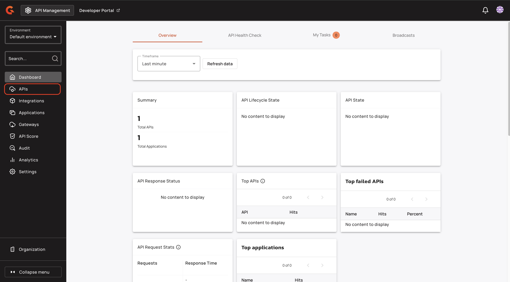
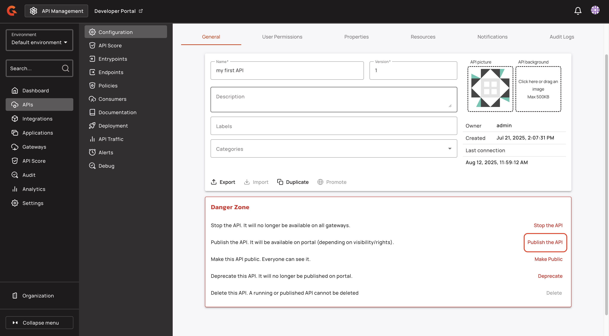
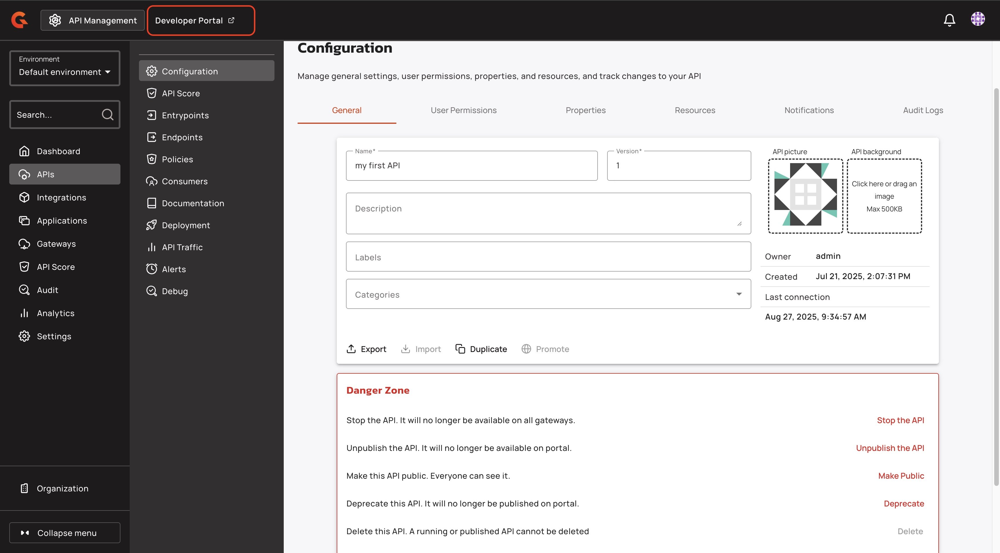
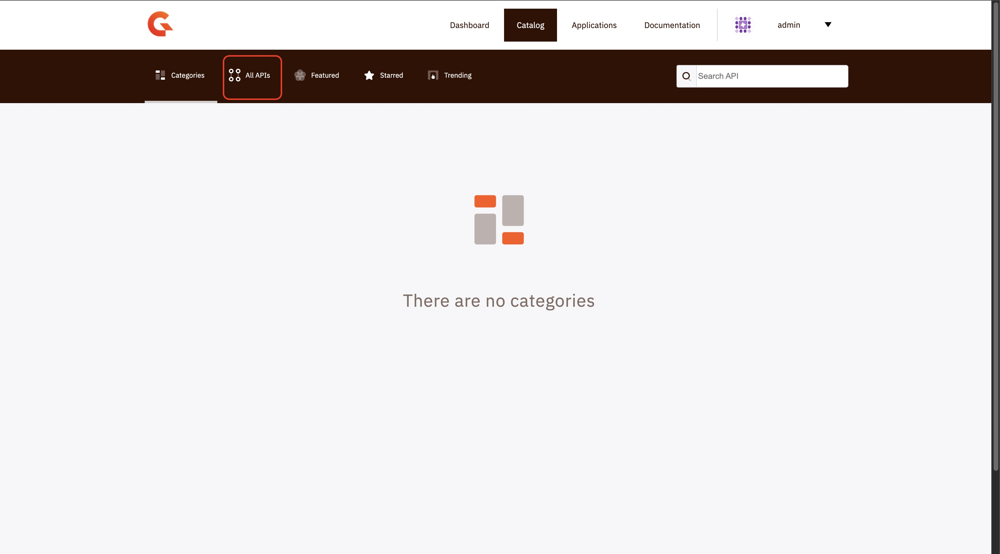

# Publish your API

## Overview

This guide explains how to Publish your API.

## Prerequisites

* Complete the steps in [create-an-api.md](create-an-api.md "mention").
* Complete the steps in [add-security.md](add-security.md "mention").
* Complete the steps in [add-a-policy.md](add-a-policy.md "mention").

## Publish your API

1.  From the dashboard, click **APIs**.

    <figure><figcaption></figcaption></figure>
2.  Click the API that you created in [create-an-api.md](create-an-api.md "mention").

    <figure><figcaption></figcaption></figure>
3.  In the **Danger Zone** section, click **Publish the API**.

    <figure><figcaption></figcaption></figure>
4.  In the **Publish API** pop-up window, click **Publish**. Your API is now published to the Developer Portal.

    <figure><figcaption></figcaption></figure>

## Verification

Your API appears on the Developer Portal. To view your API in the Developer Portal, complete the following steps:

1.  In the console header navigation, click **Developer Portal**.

    <figure><figcaption></figcaption></figure>
2.  In the Developer Portal, click **Explore APIS.**

    <figure><figcaption></figcaption></figure>
3.  In the **Catalog** page, click **All APIs.**

    <figure><figcaption></figcaption></figure>

Your API appears in the **All APIs** section.

<figure><figcaption></figcaption></figure>
