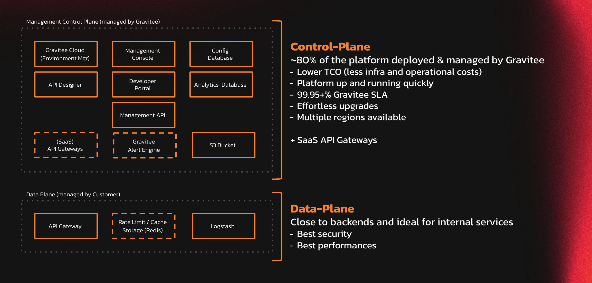
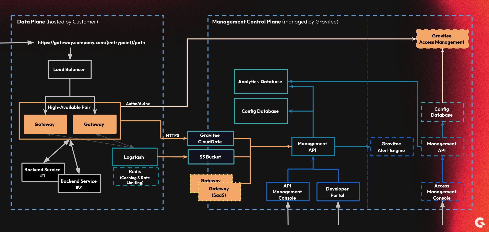

# Classic Cloud

## Deployment methods

Gravitee APIM can be installed using the following technology stacks and deployment methods.



### Docker

* [docker-compose.md](docker/docker-compose.md "mention")
* Docker CLI

### Kubernetes

* Vanilla Kubernetes
* AWS EKS
* Azure AKS
* [gcp-gke.md](kubernetes/gcp-gke.md "mention")
* OpenShift

### Linux

* RPM
* .ZIP

### Windows

* .ZIP

## Gateway and Bridge compatibility versions

The Bridge and APIM Gateway versions used for your hybrid deployment must be compatible per the tables below.

The following table lists the Gateway versions supported by each Bridge version.

| Bridge version | Supported Gateway versions |
| -------------- | -------------------------- |
| 4.5.x          | 4.3.x to 4.5.x             |
| 4.6.x          | 4.3.x to 4.6.x             |
| 4.7.x          | 4.3.x to 4.7.x             |
| 4.8.x          | 4.3.x to 4.8.x             |

The following table lists the Bridge versions supported by each Gateway version.

| Gateway version | Supported Bridge versions |
| --------------- | ------------------------- |
| 4.5.x           | 4.5.x to 4.8.x            |
| 4.6.x           | 4.6.x to 4.8.x            |
| 4.7.x           | 4.7.x to 4.8.x            |
| 4.8.x           | 4.8.x                     |

## Architecture

<figure><figcaption></figcaption></figure>

<figure><figcaption></figcaption></figure>
