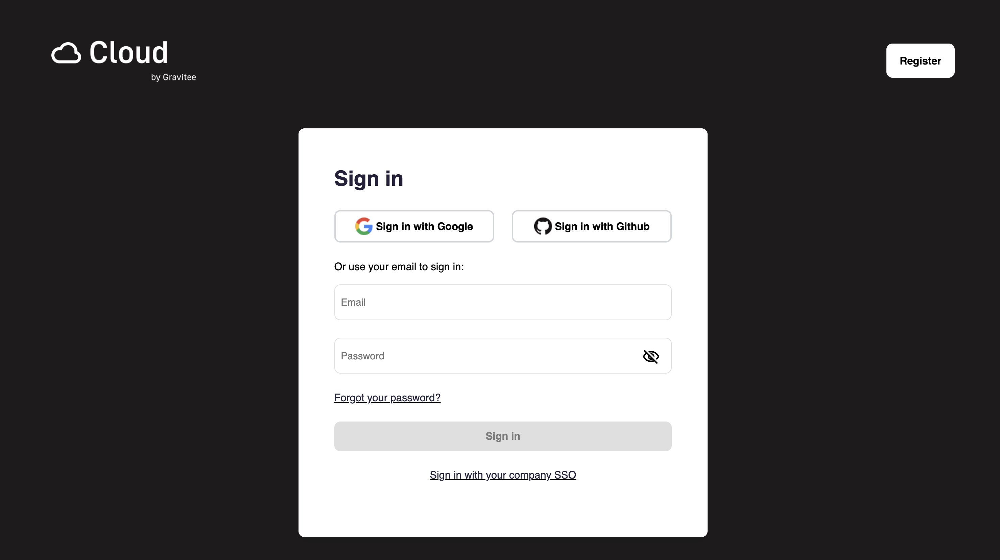
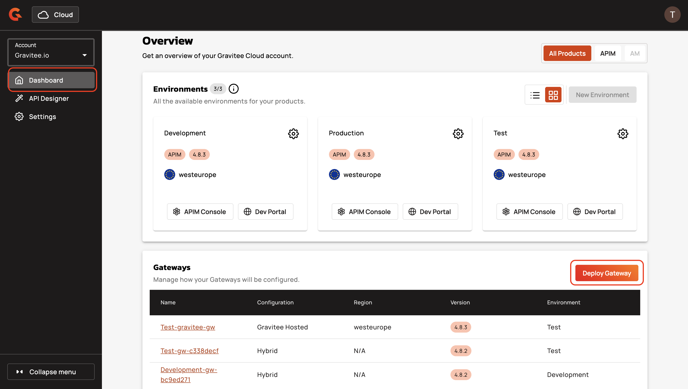
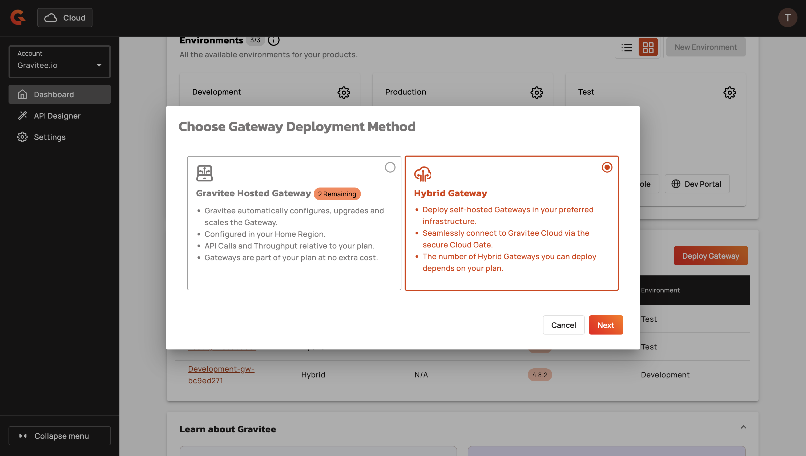
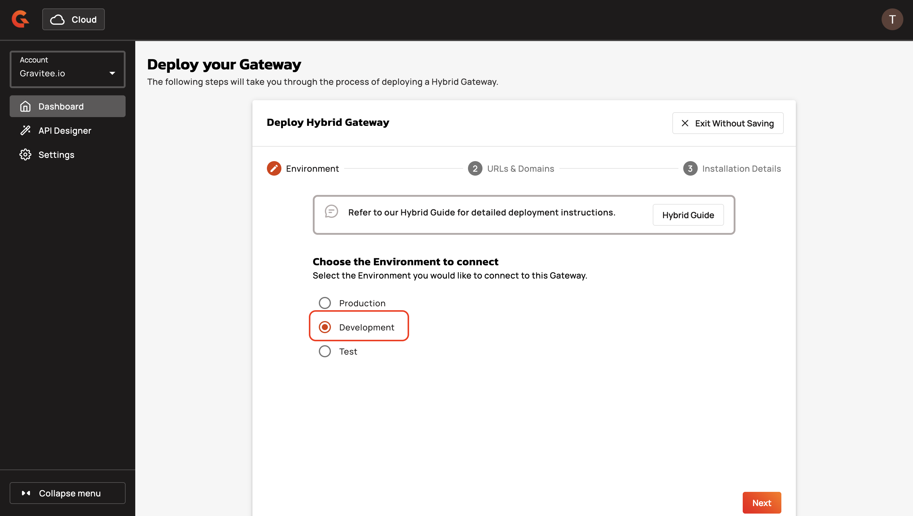
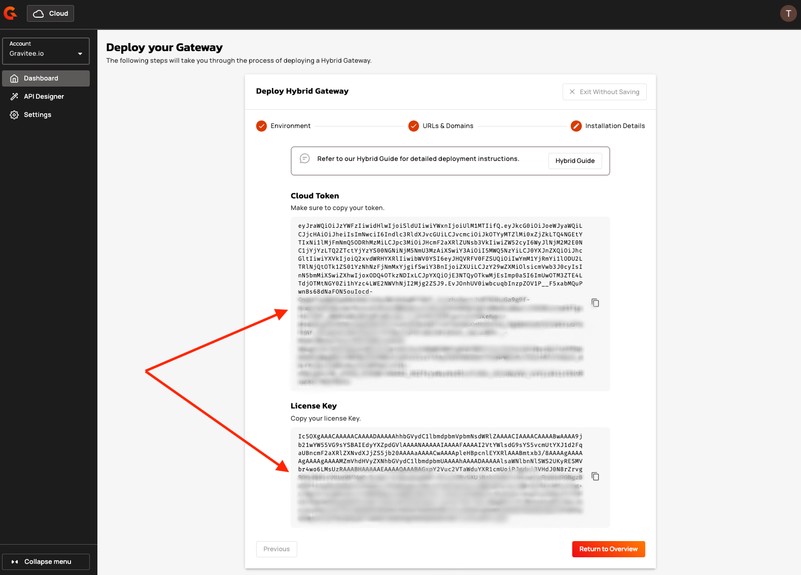

# Next-Gen Cloud

## Overview

The minimum requirements for a Next-Gen Cloud deployment are the Gravitee Gateway and Redis. For more information on Redis, see [#self-hosted-data-plane-components](../#self-hosted-data-plane-components "mention").

## Prepare your installation

The following installation steps are common to all supported deployment methods.&#x20;

1.  Sign in to [Gravitee Cloud](https://cloud.gravitee.io/).\

    <figure><figcaption></figcaption></figure>
2.  Select **Dashboard** from the menu, and then click **Deploy Gateway**.\

    <figure><figcaption></figcaption></figure>
3.  In the **Choose Gateway Deployment Method** modal, select **Hybrid Gateway**.\

    <figure><figcaption></figcaption></figure>
4.  On the **Deploy Hybrid Gateway** screen, select the Environment to which you'd like to deploy the Gateway. For example, **Development**.\

    <figure><figcaption></figcaption></figure>
5.  In **URLs & Domains**, enter the names of the HTTP domains through which you can access your Hybrid Gateway. By default, all URLs enforce HTTPS.\

    
    You must configure these HTTP domains/hostnames in your load balancer or ingress where you run the Gateway.
    

    <figure><figcaption></figcaption></figure>
6.  Click **Generate Installation Details** to generate your Cloud Token and License Key. Copy your Cloud Token and License Key and save them somewhere secure. \

    <figure><figcaption></figcaption></figure>


Your have prepared your installation for deployment.


## Deployment methods

To deploy your Gravitee Gateway, choose from the following technology stacks and deployment methods.


Deployment methods that are not linked to documentation are still fully supported. For more information, contact us.


### Docker

* [Docker Compose](docker/docker-compose.md)
* [Docker CLI](docker/docker-cli.md)

### Kubernetes

* [Vanilla Kubernetes](kubernetes/vanilla-kubernetes.md)
* AWS EKS
* [Azure AKS](kubernetes/azure-aks.md)
* GCP GKE
* [OpenShift](kubernetes/openshift.md)

### Linux

* [RPM](rpm.md)
* [.ZIP](.zip.md)

### Windows

* [.ZIP](.zip.md)

## Architecture

Your hybrid Gateway connects to the Cloud Control Plane through API endpoints exposed by Gravitee's secure Cloud Gate. This connection ensures that your Gateway stays up to date with your configuration. Your Gateway also reports analytics data back to your Cloud environment so that the Gravitee Cloud Control Plane can offer a single unified view of analytics.

Cloud Gate authentication and authorization are secured using your Cloud Token (JWT), which is scoped and signed for your personal Cloud account.

The Cloud Gate is deployed in each data center region of the Control Plane to ensure optimal connectivity and performance. Your hybrid Gateway uses the information contained in your Cloud Token to automatically calculate the region and corresponding Cloud Gate to which it should connect.


Your Gateway needs to connect to the Cloud Gate in the region where your Control Plane is deployed. The traffic is routed over HTTPS/443 to the following Cloud Gate URLs:\
\
US Cloud Gate: [https://us.cloudgate.gravitee.io/](https://us.cloudgate.gravitee.io/)\
EU Cloud Gate: [https://eu.cloudgate.gravitee.io/](https://eu.cloudgate.gravitee.io/)


Analytics are reported to a dedicated Cloud account pipeline. Data is produced to a Kafka topic, ingested in Logstash, and then stored in a dedicated Elastisearch index that is consumed by your Cloud account's API Management Control Plane.

All communication between the hybrid Gateway and the Cloud Gate endpoints uses TLS encryption.

<figure><figcaption>
Overview of a Gravitee Cloud deployment in Azure with a hybrid gateway connecting to the Gravitee Cloud API Management Control Plane using the Cloud Gate and Cloud Tokens.
</figcaption></figure>

### Cloud Gate Endpoints

Here are two key endpoints that your Gateway interacts with:

* **`/sync` Endpoint**: The Data Plane fetches the latest API definitions, policies, and configurations from your Cloud Control Plane.
* **`/reports` Endpoint**: The Data Plane sends analytics and request logs to the Cloud Control Plane for storage in a dedicated index for your account.

### Cloud Token

To connect to the Cloud Gate, your Gateway uses a Cloud Token, which is a signed JSON Web Token (JWT) that contains attributes (claims) related to your Cloud Account. This token provides the necessary authentication and authorization for your Gateway to connect to the Cloud Control Plane.

The Cloud Token contains the following information:

* The Cloud Account ID
* Control Plane Region information
* ID of analytics index
* A signature to verify authenticity

The Cloud Token is used to establish a secure and authenticated connection with the appropriate Cloud Gate endpoint.

### Connection Flow

1. **Generate a Cloud Token.** Before connecting your Gateway, obtain a Cloud Token from your Cloud Control Plane.
2. **Copy your Cloud license.** To start up and read your APIs, mount your license on the Gateway.
3. **Start up the Gateway.** When the Gateway starts, it reads the Cloud Token, and then connects to the targeted Cloud Gate. You can now deploy APIs to the Gateway.
