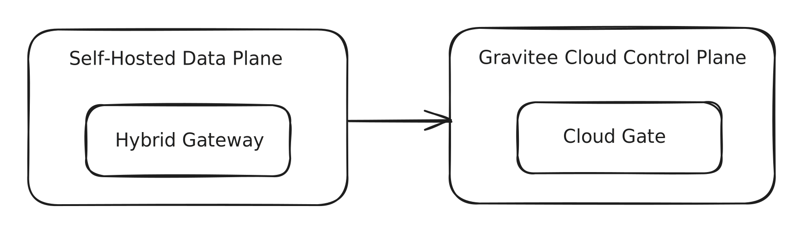
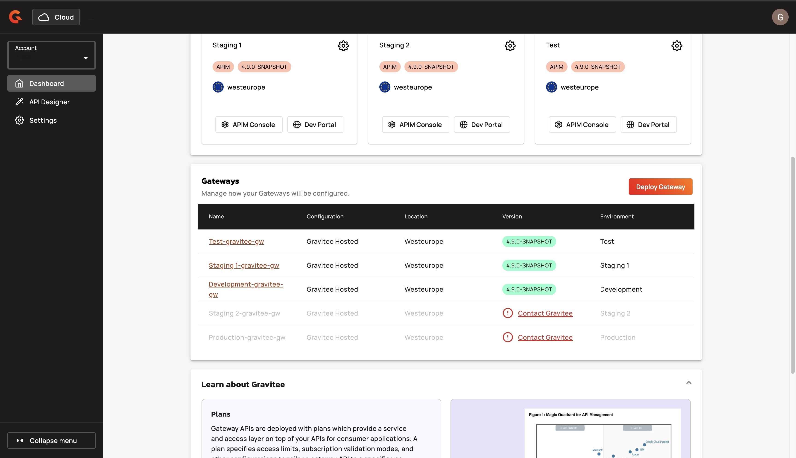

# Docker Compose

## Overview

Gravitee Next Gen Cloud supports hybrid deployments, which provides you with the flexibility to run components within your own infrastructure while Gravitee hosts and manages other components. In a hybrid setup, the platform is split into the following two planes:

* **Control Plane**: Fully managed by Gravitee in the cloud, responsible for API design, publishing, configuration, analytics, and lifecycle management.
* **Data Plane**: Deployed and managed by you, close to your backend services, responsible for executing traffic policies, enforcing security, and routing API traffic.



This guide focuses on installing the Data Plane using Docker Compose. The Data Plane includes core components like the Gateway and Redis.\
\
By the end of this guide, your Gravitee Data Plane will be up and running, ready to enforce API policies and handle traffic according to your Gravitee Cloud configuration.

## Prerequisites

Before you deploy the Data Plane with Docker Compose, complete the following steps:

* Install Docker. You must have access to the default [Docker Hub registry](https://hub.docker.com/) to pull the official Gravitee images.
* Obtain a Gravitee Cloud account. To register for a Gravitee Cloud account, go to [the Gravitee Cloud sign in page](http://cloud.gravitee.io/signup), and then click register.
* [#prepare-your-installation](../#prepare-your-installation "mention") to obtain a Cloud Token and License Key.

## Install Gravitee APIM

This section explains how to run the Gravitee API Management Data Plane (Gateway and Redis) with Docker Compose.

1.  Use the following `docker-compose.yaml` file to deploy the Gateway and Redis. Redis is used for rate limiting.

    ```yaml
    volumes:
        data-redis:

    services:
      gio-apim-hybrid-gateway:
        image: graviteeio/apim-gateway:${APIM_VERSION:-latest}
        container_name: gio_apim_hybrid_gateway
        hostname: apim-gateway
        ports:
          - "8082:8082"
        depends_on:
          gio-apim-hybrid-redis:
            condition: service_healthy
        environment:
          # RATE LIMIT DB - REDIS
          - gravitee_ratelimit_type=redis
          - gravitee_ratelimit_redis_host=redis
          - gravitee_ratelimit_redis_port=6379
          - gravitee_ratelimit_redis_password=${REDIS_PASSWORD}
          # GRAVITEE CLOUD CONTROL PLANE
          - gravitee_cloud_token=${CLOUD_TOKEN}
          - gravitee_license_key=${LICENSE_KEY}
        restart: unless-stopped
      
      gio-apim-hybrid-redis:
        image: redis:${REDIS_VERSION:-latest}
        container_name: gio_apim_hybrid_redis
        hostname: redis
        restart: always
        ports:
          - '6379:6379'
        command: redis-server --requirepass ${REDIS_PASSWORD}
        healthcheck:
          test: ["CMD", "redis-cli", "ping"]
          interval: 1s
          timeout: 3s
          retries: 30
        volumes: 
          - data-redis:/data
    ```
2.  Place the following `.env` file in the same directory as your `docker-compose.yaml` to centralize configuration values:

    ```env
    # The Gateway version must match the Control Plane version to ensure compatibility.
    APIM_VERSION=4.7

    # Use a Redis version that is supported by Gravitee.
    # See the list of supported Redis versions: https://documentation.gravitee.io/apim/configure-apim/repositories/redis#supported-databases
    REDIS_VERSION=7.2-alpine

    # Change this default password before running in any non-local environment.
    REDIS_PASSWORD= <my-defaut-redis-password>

    # Replace with your actual values from Gravitee Cloud.
    CLOUD_TOKEN=<CLOUD_TOKEN>
    LICENSE_KEY=<LICENSE_KEY>
    ```

    * Replace `<my-defaut-redis-password>` with your Redis password.
    * Replace `<CLOUD_TOKEN>` with your Cloud Token.
    * Replace `<LICENSE_KEY>` with your License Key.
3.  From the directory containing `docker-compose.yaml` and the `.env` file, start the Gateway using the following command. This command uses values from `.env` to launch the Gateway and Redis in detached mode.

    ```sh
    docker compose up -d
    ```

## Verification

To confirm that your Hybrid installation is working, complete the following steps:

* [#ensure-that-the-gateway-is-registered-in-gravitee-cloud](docker-compose.md#ensure-that-the-gateway-is-registered-in-gravitee-cloud "mention")
* [#ensure-the-gateway-is-listening-in-your-local-environment](docker-compose.md#ensure-the-gateway-is-listening-in-your-local-environment "mention")

### Ensure that the Gateway is registered in Gravitee Cloud

1.  Sign in to Gravitee Cloud.

    <figure><figcaption></figcaption></figure>
2.  From the **Dashboard**, navigate to the **Gateways** section. Your new Hybrid Gateway appears here.

    <figure><figcaption></figcaption></figure>

If the Gateway does not appear or shows an error state, complete the following checks:

* Ensure that your `.env` file includes a valid `<CLOUD_TOKEN>` and a valid `<LICENSE_KEY>`.
* Ensure that the Gateway container has Internet access to reach Gravitee Cloud.

### **Ensure the Gateway is listening in your local environment**

1.  Open a terminal, and then run the following `curl` command to call the Gateway on its default exposed port:

    ```bash
    curl -i http://localhost:8082/
    ```
2.  Verify that the command output is similar to the following expected response:

    ```http
    HTTP/1.1 404 Not Found
    Content-Length: 40
    Content-Type: text/plain

    No context-path matches the request URI.
    ```


    
    This response confirms that the Gateway has initialized, but no APIs have been deployed. Once APIs are published through the Control Plane, this message is replaced by valid responses routed through the configured context paths.
    

### Stop the Gateway

To shut down the Gateway, choose one of the following options.

*   To stop and remove the containers but preserve the Redis volume (`data-redis`), use the following command:

    ```sh
    docker compose down
    ```
*   To stop the containers and remove both the containers and the Redis volume (`data-redis`), use the following command:

    ```sh
    docker compose down -v
    ```

## View the logs

*   To check the Gateway logs, use the following command:&#x20;

    ```sh
    docker logs -f gio_apim_hybrid_gateway
    ```
