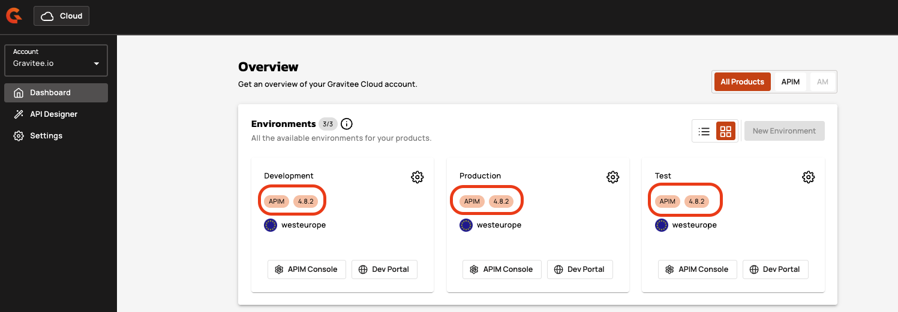

# Azure AKS

## Overview

This guide explains how to install and connect a Hybrid Gateway to Gravitee Cloud using Azure Kubernetes Service.

## Prerequisites

Before you install a Hybrid Gateway, complete the following steps:

* Install [helm](https://helm.sh/docs/intro/install/).
* Install [kubectl](https://kubernetes.io/docs/tasks/tools/).&#x20;
* Install [Azure CLI](https://learn.microsoft.com/en-us/cli/azure/install-azure-cli?view=azure-cli-latest)
* Ensure you have access to [Gravitee Cloud](https://cloud.gravitee.io/), with permissions to install new Gateways.
* Ensure you have access to the AKS cluster where you want to install the Gateway.
* Ensure the self-hosted target environment has outbound Internet connectivity to Gravitee Cloud using HTTPS/443.
* Complete the steps in [#prepare-your-installation](../#prepare-your-installation "mention").

## Install the Gateway

To install the Gravitee Gateway, complete the following steps:

1. [#install-redis](azure-aks.md#install-redis "mention")
2. [#prepare-values.yaml-for-helm](azure-aks.md#prepare-values.yaml-for-helm "mention")
3. [#install-with-helm](azure-aks.md#install-with-helm "mention")

### Install Redis

To support caching and rate-limiting, you must install Redis into your Kubernetes cluster. For more information, see [Bitnami package for Redis®](https://artifacthub.io/packages/helm/bitnami/redis).

1.  Install Redis with Helm using the following command, which also creates a new `gravitee-apim` namespace:&#x20;

    ```bash
    helm install gravitee-apim-redis oci://registry-1.docker.io/bitnamicharts/redis --create-namespace --namespace gravitee-apim
    ```
2.  Extract the Redis hostname from the command output and save it for future use. The following sample output lists `gravitee-apim-redis-master.gravitee-apim.svc.cluster.local` as the Redis hostname:

    ```sh
    Pulled: registry-1.docker.io/bitnamicharts/redis:21.2.1
    Digest: sha256:b667ef7d2da1a073754e0499a93bb9acc6539e57ce971da39ee5fd2c222a4024
    NAME: gravitee-apim-redis
    LAST DEPLOYED: DDD MMM DD HH:MM:SS YYYY
    NAMESPACE: gravitee-apim
    STATUS: deployed
    REVISION: 1
    TEST SUITE: None
    NOTES:
    CHART NAME: redis
    CHART VERSION: 21.2.1
    APP VERSION: 8.0.2

    ** Please be patient while the chart is being deployed **

    Redis can be accessed on the following DNS names from within your cluster:

        gravitee-apim-redis-master.gravitee-apim.svc.cluster.local for read/write operations (port 6379)
        gravitee-apim-redis-replicas.gravitee-apim.svc.cluster.local for read-only operations (port 6379)

    To get your password run:
        export REDIS_PASSWORD=$(kubectl get secret --namespace gravitee-apim gravitee-apim-redis -o jsonpath="{.data.redis-password}" | base64 -d)
    ```
3.  Use the following command to output the Redis password. Save this password for future use.

    ```bash
    kubectl get secret --namespace gravitee-apim gravitee-apim-redis -o jsonpath="{.data.redis-password}" | base64 -d
    ```
4.  To verify that your Redis deployment succeeded, check pod status using the following command:\


    ```
    kubectl get pods -n gravitee-apim -l app.kubernetes.io/instance=gravitee-apim-redis
    ```

    \
    The command generates the following output: \


    ```bash
        NAME                          READY   STATUS    RESTARTS   AGE
        gravitee-apim-redis-master-0  1/1     Running   0          2m
        gravitee-apim-redis-replicas-0 1/1    Running   0          2m
        gravitee-apim-redis-replicas-1 1/1    Running   0          2m
        gravitee-apim-redis-replicas-2 1/1    Running   0          2m
    ```

### Prepare `values.yaml` for Helm

To prepare your Gravitee `values.yaml` file for Helm, complete the following steps:

1.  Copy the following Gravitee `values.yaml` file. This is the base configuration for your new hybrid Gateway.

    ```yaml
    #This is the license key provided in your Gravitee Cloud account 
    #example: Ic5OXgAAACAAAAACAAAADAAAAAhhbGVydC1lbmdpbmVpbmNsdWRlZAAAABsAAAACAAAABwAAAAhjb21wYW55R3Jhdml0ZWUAAAAxAAAAAgAAAAUAAAAgZW1haWxwbGF0Zm9ybS10ZWFtQGdyYXZpdGVlc291cmNlLmNvbQAAABoAAAALAAAACmV4cGlyeURhdGUAAAGhUXU7/wAAACAAAAACAAAACAAAAAxmZWF0dXJlc2FsZXJ0LWVuZ2luZQAAACEAAAAMAAAACWxpY2Vuc2VJZJTWw5qIQT4bEYqYFx9wSH4AAAEcAAAAAQAAABAAAAEAbGljZW5zZVNpZ25hdHVyZULCHNcIqMuFwEMkSCgE4Q/42YSVluW/vvMtaHZWJ5Xoh3rsWEjCMg8Ku2cTKuSP7FzR/b8GVedDJqxf+o2n8B/LV+WwzZjOAi09EBfLmTLOzzXFNp1KRDk3G4rrKznJ1Kqz9EXjyNAiT/c7en3om6Lx0A4BscZtu6k6i1pAnfHhotJkHMIdNkDqSU4fkyAH6FS+NYcLEcudaeeRr2Th/Dvyn0py7xOUNicgXdBjEXJXMF2vxyNkm0kML4ADG12++dZyG2kgGYg5+A8UdABGxCvIfNsl9uVuP2F5ACr8Uc73HytKpIaZqz71RMxQDuJtRzmkkGxHajJJeZWQZXtLdBoAAAARAAAAAgAAAAUAAAAAcGFja3MAAAAiAAAAAgAAAA8AAAAHc2lnbmF0dXJhfgzanZXN0U0hBLTI1NgAAABgAAAACAAAABAAAAAh0aWVydW5pdmVyc2U=
    license:
        key: "<license key>"
    #This section controls the Management API component deployment of Gravitee. 
    #It is disabled for a hybrid gateway installation
    api:
        enabled: false
    #This section controls the Developer Portal API component deployment of Gravitee. 
    #It is disabled for a hybrid gateway installation
    portal:
        enabled: false
    #This section controls the API Management Console component deployment of Gravitee. 
    #It is disabled for a hybrid gateway installation
    ui:
        enabled: false
    #This section controls the Alert Engine component deployment of Gravitee. 
    #It is disabled for a hybrid gateway installation
    alerts:
        enabled: false
    #This section controls the Analytics Database component deployment of Gravitee based on ElasticSearch. 
    #It is disabled for a hybrid gateway installation
    es:
        enabled: false
        
    #This section has multiple parameters to configure the API Gateway deployment  
    gateway:
        replicaCount: 1 #number of replicas of the pod
        image:
            repository: graviteeio/apim-gateway
            #The gateway version to install. 
            #It has to align with the control plane of your Gravitee Cloud
            #use it if you need to force the version of the gateway
            # tag: 4.7.6 
            pullPolicy: IfNotPresent
        autoscaling:
            enabled: false
        podAnnotations:
            prometheus.io/path: /_node/metrics/prometheus
            prometheus.io/port: "18082"
            prometheus.io/scrape: "true"
        #Sets environment variables.  
        env:
            #Gravitee Cloud Token. 
            #This is the value gathered in your Gravitee Cloud Account when you install a new Hybrid Gateway.
            #example: eyJraWQiOiJzYWFzIiwidHlwIjoiSldUIiwiYWxnIjoiUlM1MTIifQ.eyJkcG0iOiJoeWJyaWQiLCJjcHAiOiJheiIsImNwciI6Indlc3RldXJvcGUiLCJvcmciOiJjZmJkYTcwYy02ZjA2LTRjMjctYmRhNy0wYzZmMDYyYzI3NWUiLCJpc3MiOiJHcmF2aXRlZUNsb3VkIiwiZW52cyI6WyIzNzUxYTk4Mi0zN2VkLTQ5YjYtOTFhOS04MjM3ZWQyOWI2M2YiXSwiY3AiOiJmY2FkZTAiLCJ0YXJnZXQiOiJhcGltIiwiYXVkIjoiQ2xvdWRHYXRlIiwibWV0YSI6eyJHQVRFV0FZSUQiOiI5OGM1OTI4NS0zYTU0LTQ5NjctODVmYS1jZjZhZmJmNTU1MTMifSwiY3BnIjoiZXUiLCJzY29wZXMiOlsic3luYyIsInJlcG9ydHMiXSwiZXhwIjoxODQ0MzMzOTMwLCJpYXQiOjE3NDk2Mzk1MzAsImp0aSI6ImIzYzM5ZjczLWUwYTMtNDAxYS1hMWUzLWU1NTg2MzA5MzQ2MyJ9.Iv1NFP7hSKKovmUPSFrp1CiX2F6QJ-dG-nX3YveohX0SOU3M1Y8OTYV_w_zBoLxQuAshLI8rMVUXyUEaUQn24Tep1oKn96f1Uz2ImjntNZcUBbE2LciP0d9t4kTqAy-o0haBShYzZlKnq27e3MJ1oMwCF5uoyEMNjHsu3lblLScD1lEDmTH5l6ryZ9Ze0JXcLQXXPvKPTppqpJOk9FZm6X-JbSOQM8wAtGtSeB_pmr6PAxzOdeCNe7S2NnYAftmPxBvT0YTrAWnlHNegTkbFYktAvWHQ6A4QNsd5bKUicAoioW0m8Q9s7sLkpfzkueSI8jr07KPWnpiP1lcl83ZxRdcNSOrwUKMlfEIkZYMEb0BF_FTF-4ZD0fy-gASV7osF1beW8TwLS8btz6zqEIEgp2eFB0P7B5jUcQVokTMBrzwB341PQ5EEGceWYfghebtsKQWngdrwHgajndQCJcP8XQDHFzPHuKJiKYcqk1WtMveIx9JnMMZfCayXktLhoCsxGp4daMaBeZejFEMAqY0BlwRWVxXfvZYzAbk7Rj0Q-2t2DmY094n9EezDT9xIq54509XOnuZKbx8R4K9s1fURfwtDfnEGEm6c9GDP-M22y3fHsxbiHDNIqmwfljakflmfjkmlakjfmlakjfmlaCYqBTGOeWI4bU9ATNHPO8sXlFOqK5mVX_atyBBc
            - name: gravitee_cloud_token
              value: "<gravitee cloud token>"
        
        #Configure the API Gateway internal API. 
        services:
            #The following sections enables the exposure of metrics to Prometheus. 
            metrics:
                enabled: true
                prometheus:
                    enabled: true

            #This enables the Gravitee APIM Gateway internal API for monitoring and retrieving technical information about the component.
            core:
                http:
                    enabled: true
            sync:
                kubernetes:
                    enabled: false
            #disables bridge mode. unnecessary for a hybrid gateway.
            bridge:
                enabled: false

        # service:
        #     type: LoadBalancer
        #     externalPort: 8082
        #     #The IP address to use for the LoadBalancer service.
        #     #This is only used if the service type is LoadBalancer.
        #     #If you are using a cloud provider, you can set this to the IP address assigned by the cloud provider.
        #     #If you are using a local Kubernetes cluster, you can set this to a local IP address.
        #     loadBalancerIP: 51.8.240.92
        #ingress setup
        #This will setup the ingress rule for the gateway
        ingress:
          enabled: true
          pathType: Prefix
          path: /
          # update this with your ingress ClassName
          ingressClassName: ""
          # Used to create an Ingress record.
          # Multiple hostnames supported
          # - hosts:
          #     - chart-example.local
          #     - chart-example2.local
          #the hosts setting should match at least one of the hosts you setup in Gravitee Cloud for the gateway you are deploying
          #example: apigw.aks.example.com
          hosts:
            - <hosts>
          annotations:
            kubernetes.io/ingress.class: nginx
            # nginx.ingress.kubernetes.io/ssl-redirect: "false"
            # nginx.ingress.kubernetes.io/configuration-snippet: "etag on;\nproxy_pass_header ETag;\nproxy_set_header if-match \"\";\n"
            # kubernetes.io/tls-acme: "true"
          #tls:
            # Secrets must be manually created in the namespace.
          #  - hosts:
          #      - apim.example.com
          #    secretName: api-custom-cert
        resources:
            limits:
                cpu: 500m
                memory: 1024Mi
            requests:
                cpu: 200m
                memory: 512Mi
        deployment:
            revisionHistoryLimit: 1
            strategy:
                type: RollingUpdate
                rollingUpdate:
                    maxUnavailable: 0
        #Reporter configuration section.
        #no additional reporter enabled for the hybrid gateway outside of the default Cloud Gateway reporter
        reporters:
            file:
                enabled: false
        terminationGracePeriod: 50
        gracefulShutdown:
            delay: 20
            unit: SECONDS
        ratelimit:
            #redis setup for the rate limit database
            redis:
                host: "<redis host>"
                port: 6379
                password: "<redis password>"
                ssl: false
            
    ratelimit:
        type: redis
            
    # Auto-download the Gravitee Redis plugin
    redis:
        download: true
    ```
2. Make the following modifications to your `values.yaml` file:
   * Replace `<cloud_token>` with your Cloud Token.
   * Replace `<license_key>` with your License Key.
   * Replace `<redis_hostname>` with your extracted Redis hostname.
   * Replace `<redis_password>` with your extracted Redis password.
   * Replace `<hosts>` with the host information you entered in the Gravitee \
     Cloud Gateway setup.
   *   Set the `tag` field in the Gateway image section to the value displayed in the Overview section of your Gravitee Cloud Dashboard.\


       <figure><figcaption></figcaption></figure>


The `tag` field specifies the version of your Gravitee Gateway. Your Gateway version must match your Gravitee Cloud Control Plane version to ensure compatibility between your hybrid Gateway and the Cloud Management platform.


3. Save your Gravitee `values.yaml` file in your working directory.

<details>

<summary>Explanations of key predefined <code>values.yaml</code> parameter settings</summary>

#### **Service configuration**&#x20;

This uses Azure's native load balancing through the ingress controller, providing SSL termination, path-based routing.&#x20;

**Ingress configuration**&#x20;

The ingress is enabled with `NGINX` as the controller class, creating an external endpoint through Azure's load balancer. The hosts field must match at least one of the hosts configured in your Gravitee Cloud setup, and multiple hostnames are supported for multi-domain deployments.

**Gateway version**&#x20;

The `tag` field is commented out by default, allowing the Helm chart to use its default version. You can uncomment and specify a version when you need to ensure compatibility with a specific Gravitee Cloud control plane version or when performing controlled upgrades.

**Resource allocation**&#x20;

The configured limits prevent excessive cluster resource consumption while ensuring adequate performance for API processing. You can adjust these based on your expected load patterns and available node pool capacity.

**Deployment strategy**&#x20;

The `RollingUpdate` strategy with `maxUnavailable` set to 0 ensures zero-downtime updates during configuration changes or version upgrades.&#x20;

</details>

### Install with Helm

To install your Gravitee Gateway with Helm, complete the following steps:

1.  From your working directory, add the Gravitee Helm chart repository to your Kubernetes environment using the following command:&#x20;

    ```bash
    helm repo add graviteeio https://helm.gravitee.io
    ```
2.  Install the Helm chart with the Gravitee `values.yaml` file into a dedicated namespace using the following command:&#x20;

    ```bash
    helm install graviteeio-apim-gateway graviteeio/apim --namespace gravitee-apim -f ./values.yaml
    ```
3.  Verify the installation was successful. The command output should be similar to the following:&#x20;

    ```bash
    NAME: graviteeio-apim-gateway
    LAST DEPLOYED: DDD MMM DD HH:MM:SS YYYY
    NAMESPACE: gravitee-apim
    STATUS: deployed
    REVISION: 1
    TEST SUITE: None
    NOTES:
    1. Watch all containers come up.
      $ kubectl get pods --namespace=gravitee-apim -l app.kubernetes.io/instance=graviteeio-apim-gateway -w
    ```
4.  Verify the installation by checking pod status:\


    ```bash
    kubectl get pods --namespace=gravitee-apim -l app.kubernetes.io/instance=graviteeio-apim-gateway
    ```

    \
    The command generates the following output:\


    ```bash
    NAME                                              READY   STATUS    RESTARTS   AGE
    graviteeio-apim-gateway-gateway-b6fd75949-rjsr4   1/1     Running   0          2m15s
    ```


To uninstall the Gravitee hybrid Gateway, use the following command:

```bash
helm uninstall graviteeio-apim-gateway --namespace gravitee-apim
```


## Verification

Your Gateway appears in the Gateways section of your Gravitee Cloud Dashboard.

<figure><figcaption></figcaption></figure>

To verify that your Gateway is up and running, complete the following steps:

1. [#validate-the-pods](azure-aks.md#validate-the-pods "mention")
2. [#validate-the-gateway-logs](azure-aks.md#validate-the-gateway-logs "mention")
3. [#validate-the-ingress-configuration](azure-aks.md#validate-the-ingress-configuration "mention")
4. [#validate-the-gateway-url](azure-aks.md#validate-the-gateway-url "mention")

### Validate the pods

A healthy Gateway pod displays the `Running` status with `1/1` ready containers and zero or minimal restart counts. The pod startup process includes license validation, Cloud Token authentication, and Redis connectivity verification.

To validate your pods, complete the following steps:

1.  Use the following command to query the pod status:&#x20;

    ```bash
    kubectl get pods --namespace=gravitee-apim -l app.kubernetes.io/instance=graviteeio-apim-gateway
    ```
2.  Verify that the deployment was successful. The output should show that a Gravitee Gateway is ready and running with no restarts.&#x20;

    ```sh
    NAME                                               READY   STATUS    RESTARTS   AGE
    graviteeio-apim-gateway-gateway-6b77d4dd96-8k5l9   1/1     Running   0          6m17s
    ```

### Validate the Gateway logs

To validate the Gateway logs, complete the following steps:

1.  To list all the pods in your deployment, use the following command:&#x20;

    ```bash
    kubectl get pods --namespace=gravitee-apim -l app.kubernetes.io/instance=graviteeio-apim-gateway
    ```
2.  In the output, find the name of the pod from which to obtain logs. For example, `graviteeio-apim-gateway-gateway-6b77d4dd96-8k5l9`.&#x20;

    ```sh
    NAME                                               READY   STATUS    RESTARTS   AGE
    graviteeio-apim-gateway-gateway-6b77d4dd96-8k5l9   1/1     Running   0          6m17s
    ```
3.  To obtain the logs from this specific pod, use the following command. Replace `<NAME_OF_THE_POD>` with your pod name.

    ```bash
    kubectl logs --namespace=gravitee-apim <NAME_OF_THE_POD>
    ```
4.  Review the log file. The following example output shows the important log entries.&#x20;

    ```sh
    =========================================================================
      Gravitee.IO Standalone Runtime Bootstrap Environment
      GRAVITEE_HOME: /opt/graviteeio-gateway
      GRAVITEE_OPTS: 
      JAVA: /opt/java/openjdk/bin/java
      JAVA_OPTS:  -Xms256m -Xmx256m -Djava.awt.headless=true -XX:+HeapDumpOnOutOfMemoryError -XX:+DisableExplicitGC -Dfile.encoding=UTF-8
      CLASSPATH: /opt/graviteeio-gateway/lib/gravitee-apim-gateway-standalone-bootstrap-<version>.jar
    =========================================================================
    14:01:39.318 [graviteeio-node] [] INFO  i.g.n.c.spring.SpringBasedContainer - Starting Boot phase.
    ...
    14:01:43.140 [graviteeio-node] [] INFO  i.g.n.license.LicenseLoaderService - License information: 
    	expiryDate: YYYY-MM-DD HH:MM:SS.mmm
    	features: alert-engine
    	tier: universe
    	alert-engine: included
    	company: Gravitee
    	signatureDigest: SHA-256
    	licenseId: [redacted]
    	packs: 
    	email: [redacted]
    	licenseSignature: [redacted]
    14:01:43.215 [graviteeio-node] [] INFO  i.g.common.service.AbstractService - Initializing service io.gravitee.plugin.core.internal.BootPluginEventListener
    14:01:43.338 [graviteeio-node] [] INFO  i.g.p.c.internal.PluginRegistryImpl - Loading plugins from /opt/graviteeio-gateway/plugins
    ...
    14:01:53.322 [graviteeio-node] [] INFO  i.g.node.container.AbstractContainer - Starting Gravitee.io - API Gateway...
    14:01:53.323 [graviteeio-node] [] INFO  i.g.node.container.AbstractNode - Gravitee.io - API Gateway is now starting...
    ...
    14:02:03.816 [graviteeio-node] [] INFO  i.g.node.container.AbstractNode - Gravitee.io - API Gateway id[95cb1eb8-ba65-42ad-8b1e-b8ba65b2adf7] version[4.7.6] pid[1] build[1093365#b33db62e676fad748d3ad09e3cbc139394b6da7a] jvm[Eclipse Adoptium/OpenJDK 64-Bit Server VM/21.0.7+6-LTS] started in 10400 ms.
    ...
    14:02:03.923 [vert.x-eventloop-thread-0] [] INFO  i.g.g.r.s.vertx.HttpProtocolVerticle - HTTP server [http] ready to accept requests on port 8082
    ...
    14:02:04.324 [gio.sync-deployer-0] [] INFO  i.g.g.p.o.m.DefaultOrganizationManager - Register organization ReactableOrganization(definition=Organization{id='[redacted]', name='Organization'}, enabled=true, deployedAt=Sat Oct 19 17:08:22 GMT 2024)
    ```

### Validate the ingress configuration

1.  Check the ingress configuration

    ```bash
    kubectl get ingress -n gravitee-apim
    ```

    \
    The output will show your configured host and the ingress controller's address

    ```bash
    NAME                              CLASS   HOSTS                           ADDRESS         PORTS   AGE
    graviteeio-apim-gateway-gateway   nginx   xxxxxxx.xxx.xxx.xxx.xxx    xxx.xxx.xxx.xxx      80      24m
    ```


2.  Get the external IP of your ingress controller:&#x20;

    ```bash
    kubectl get service -n ingress-nginx
    ```

### Validate the ingress configuration

1.  Check the ingress configuration:&#x20;

    ```bash
    kubectl get ingress -n gravitee-apim
    ```
2.  Get the external IP of your ingress controller:&#x20;

    ```bash
    kubectl get service -n ingress-nginx
    ```

### Validate the Gateway URL

Your Gateway URL is determined by the networking settings you specify in the `service` section of your `values.yaml` file.

To validate the Gateway URL, complete the following steps:

1.  Make a GET request to the URL on which you have published the Gateway:

    ```bash
    curl http://{my_gateway_url:port}/
    ```
2.  Confirm that the Gateway replies with `No context-path matches the request URI.` This message informs you that an API isn't yet deployed for this URL.

    ```sh
    No context-path matches the request URI.
    ```


You can now create and deploy APIs to your hybrid Gateway.


## Next steps

* Access your API Management Console. To access your Console, complete the following steps:
  1. Log in to your [Gravitee Cloud](https://cloud.gravitee.io/).
  2. From the Dashboard, navigate to the Environment where you created your Gateway.
  3. Click on **APIM Console** to open the user interface where you can create and manage your APIs.
* Create your first API. For more information about creating your first API, see [create-and-publish-your-first-api](../../../how-to-guides/create-and-publish-your-first-api/ "mention").
* Add native Kafka capabilities. For more information about adding native Kafka capabilities, see [configure-the-kafka-client-and-gateway.md](../../../kafka-gateway/configure-the-kafka-client-and-gateway.md "mention").


To access your Gravitee Gateway from outside of your Kubernetes cluster, you must implement a load balancer or ingress.

