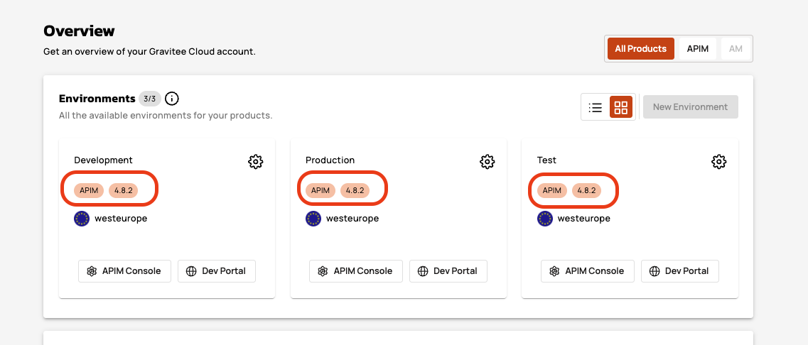

# Vanilla Kubernetes

## Overview

This guide explains how to install and connect a Hybrid Gateway to Gravitee Cloud using Kubernetes.

A hybrid gateway architecture uses a mix of self-hosted and cloud components. The Control Plane (hosted by Gravitee Cloud) provides centralized management and monitoring, while the Data Plane (your self-hosted gateway) processes API traffic locally within your infrastructure. This approach combines the security and control of on-premises deployment with the operational convenience of cloud-based management.

By completing this guide, you will deploy a Redis cache for performance optimization, configure a hybrid gateway that maintains secure connectivity with Gravitee Cloud, and validate that your installation correctly. You will understand how Kubernetes services, load balancers, and network configuration work together to create a robust API gateway foundation that can scale to handle enterprise workloads.

## Prerequisites

Before you install a Hybrid Gateway, complete the following steps:

* Install [helm](https://helm.sh/docs/intro/install/)
* Install [kubectl](https://kubernetes.io/docs/tasks/tools/#kubectl)
* Ensure you have access to [Gravitee Cloud](https://cloud.gravitee.io/), with permissions to install new Gateways
* Ensure you have access to the self-hosted Kubernetes cluster where you want to install the Gateway
* Ensure the self-hosted target environment has outbound Internet connectivity to Gravitee Cloud using HTTPS/443
* Complete the steps in [#prepare-your-installation](../#prepare-your-installation "mention").
* No prior Kubernetes experience required, concepts will be explained as introduced

## Install the Gateway

To install the Gravitee Gateway, complete the following steps:

1. [#install-redis](vanilla-kubernetes.md#install-redis "mention")
2. [#prepare-your-gravitee-values.yaml-file-for-helm](vanilla-kubernetes.md#prepare-your-gravitee-values.yaml-file-for-helm "mention")
3. [#install-with-helm](vanilla-kubernetes.md#install-with-helm "mention")

### Install Redis

Redis provides caching and rate limiting capabilities that enable your gateway to perform efficiently under load while maintaining state consistency across multiple gateway instances. Redis serves as the high-performance, in-memory data store that enables your gateway to track rate limiting counters, cache frequently accessed data, and maintain session information across multiple requests. This distributed cache infrastructure supports the horizontal scaling required for enterprise deployments, which ensures consistent performance.

1.  Install Redis with Helm using the following command, which also creates a new `gravitee-apim` namespace:

    ```bash
    helm install gravitee-apim-redis oci://registry-1.docker.io/bitnamicharts/redis --create-namespace --namespace gravitee-apim
    ```

For more information about Redis installation options, see [Bitnami package for Redis®](https://artifacthub.io/packages/helm/bitnami/redis)

2.  Extract the Redis hostname from the command output, and then save it. The following example output lists `gravitee-apim-redis-master.gravitee-apim.svc.cluster.local` as the Redis hostname:\


    ```sh
    Pulled: registry-1.docker.io/bitnamicharts/redis:21.2.1
    Digest: sha256:b667ef7d2da1a073754e0499a93bb9acc6539e57ce971da39ee5fd2c222a4024
    NAME: gravitee-apim-redis
    LAST DEPLOYED: DDD MMM DD HH:MM:SS YYYY
    NAMESPACE: gravitee-apim
    STATUS: deployed
    REVISION: 1
    TEST SUITE: None
    NOTES:
    CHART NAME: redis
    CHART VERSION: 21.2.1
    APP VERSION: 8.0.2

    ** Please be patient while the chart is being deployed **

    Redis can be accessed on the following DNS names from within your cluster:

        gravitee-apim-redis-master.gravitee-apim.svc.cluster.local for read/write operations (port 6379)
        gravitee-apim-redis-replicas.gravitee-apim.svc.cluster.local for read-only operations (port 6379)

    To get your password run:
        export REDIS_PASSWORD=$(kubectl get secret --namespace gravitee-apim gravitee-apim-redis -o jsonpath="{.data.redis-password}" | base64 -d)
    ```
3.  Output the Redis password using the following command, and then save the password:\


    ```bash
    kubectl get secret --namespace gravitee-apim gravitee-apim-redis -o jsonpath="{.data.redis-password}" | base64 -d
    ```
4.  Verify that your Redis deployment succeeded by checking pod status using the following command:\


    ```sh
    kubectl get pods -n gravitee-apim -l app.kubernetes.io/instance=gravitee-apim-redis
    ```

The command generates the following output:&#x20;

```sh
NAME                            READY   STATUS    RESTARTS   AGE
gravitee-apim-redis-master-0    1/1     Running   0          2m
gravitee-apim-redis-replicas-0  1/1     Running   0          2m
gravitee-apim-redis-replicas-1  1/1     Running   0          2m
```

### Prepare your Gravitee `values.yaml` file for Helm

The `values.yaml` configuration file serves as the bridge between your local Kubernetes infrastructure and Gravitee Cloud, containing all parameters that define how your hybrid gateway operates.&#x20;

1.  Copy the following Gravitee `values.yaml` file. This is the base configuration for your new Hybrid Gateway. The `values.yaml` configuration file contains all parameters that define how your hybrid gateway operates, connects to Gravitee Cloud, and integrates with supporting services like Redis. The following configuration file represents the bridge between your local Kubernetes infrastructure and the cloud-based management platform: \


    
    ```yaml
    #This is the license key provided in your Gravitee Cloud account 
    #example: Ic5OXgAAACAAAAACAAAADAAAAAhhbGVydC1lbmdpbmVpbmNsdWRlZAAAABsAAAACAAAABwAAAAhjb21wYW55R3Jhdml0ZWUAAAAxAAAAAgAAAAUAAAAgZW1haWxwbGF0Zm9ybS10ZWFtQGdyYXZpdGVlc291cmNlLmNvbQAAABoAAAALAAAACmV4cGlyeURhdGUAAAGhUXU7/wAAACAAAAACAAAACAAAAAxmZWF0dXJlc2FsZXJ0LWVuZ2luZQAAACEAAAAMAAAACWxpY2Vuc2VJZJTWw5qIQT4bEYqYFx9wSH4AAAEcAAAAAQAAABAAAAEAbGljZW5zZVNpZ25hdHVyZULCHNcIqMuFwEMkSCgE4Q/42YSVluW/vvMtaHZWJ5Xoh3rsWEjCMg8Ku2cTKuSP7FzR/b8GVedDJqxf+o2n8B/LV+WwzZjOAi09EBfLmTLOzzXFNp1KRDk3G4rrKznJ1Kqz9EXjyNAiT/c7en3om6Lx0A4BscZtu6k6i1pAnfHhotJkHMIdNkDqSU4fkyAH6FS+NYcLEcudaeeRr2Th/Dvyn0py7xOUNicgXdBjEXJXMF2vxyNkm0kML4ADG12++dZyG2kgGYg5+A8UdABGxCvIfNsl9uVuP2F5ACr8Uc73HytKpIaZqz71RMxQDuJtRzmkkGxHajJJeZWQZXtLdBoAAAARAAAAAgAAAAUAAAAAcGFja3MAAAAiAAAAAgAAAA8AAAAHc2lnbmF0dXJhfgzanZXN0U0hBLTI1NgAAABgAAAACAAAABAAAAAh0aWVydW5pdmVyc2U=
    license:
        key: "<license_key>"
    #This section controls the Management API component deployment of Gravitee. 
    #It is disabled for a hybrid gateway installation
    api:
        enabled: false
    #This section controls the Developer Portal API component deployment of Gravitee. 
    #It is disabled for a hybrid gateway installation
    portal:
        enabled: false
    #This section controls the API Management Console component deployment of Gravitee. 
    #It is disabled for a hybrid gateway installation
    ui:
        enabled: false
    #This section controls the Alert Engine component deployment of Gravitee. 
    #It is disabled for a hybrid gateway installation
    alerts:
        enabled: false
    #This section controls the Analytics Database component deployment of Gravitee based on ElasticSearch. 
    #It is disabled for a hybrid gateway installation
    es:
        enabled: false
        
    #This section has multiple parameters to configure the API Gateway deployment  
    gateway:
        replicaCount: 1 #number of replicas of the pod
        image:
            repository: graviteeio/apim-gateway
            # tag: 4.7.6 #The gateway version to install. It has to align with the control plane of your Gravitee Cloud
            pullPolicy: IfNotPresent
        autoscaling:
            enabled: false
        podAnnotations:
            prometheus.io/path: /_node/metrics/prometheus
            prometheus.io/port: "18082"
            prometheus.io/scrape: "true"
        #Sets environment variables.  
        env:
            #Gravitee Cloud Token. This is the value gathered in your Gravitee Cloud Account when you install a new Hybrid Gateway.
            - name: gravitee_cloud_token
              value: "<cloud_token>"
        
        #Configure the API Gateway internal API. 
        services:
            #The following sections enables the exposure of metrics to Prometheus. 
            metrics:
                enabled: true
                prometheus:
                    enabled: true

            #This enables the Gravitee APIM Gateway internal API for monitoring and retrieving technical information about the component.
            core:
                http:
                    enabled: true
            sync:
                kubernetes:
                    enabled: false
            #disables bridge mode. unnecessary for a hybrid gateway.
            bridge:
                enabled: false
        service:
            type: LoadBalancer
            externalPort: 8082
            loadBalancerIP: 127.0.0.1
        ingress:
            enabled: false
        resources:
            limits:
                cpu: 500m
                memory: 1024Mi
            requests:
                cpu: 200m
                memory: 512Mi
        deployment:
            revisionHistoryLimit: 1
            strategy:
                type: RollingUpdate
                rollingUpdate:
                    maxUnavailable: 0
        #Reporter configuration section.
        #no additional reporter enabled for the hybrid gateway outside of the default Cloud Gateway reporter
        reporters:
            file:
                enabled: false
        terminationGracePeriod: 50
        gracefulShutdown:
            delay: 20
            unit: SECONDS
        ratelimit:
            redis:
                host: "<redis_hostname>"
                port: 6379
                password: "<redis_password>"
                ssl: false
            
    ratelimit:
        type: redis
            
    # Auto-download the Gravitee Redis plugin
    redis:
        download: true
    ```
    
2.  Make the following modifications to your `values.yaml` file:

    * Replace `<cloud_token>` with your cloud token generated  when you completed the steps in [#prepare-your-installation](../#prepare-your-installation "mention").
    * Replace `<license_key>` with your license key generated  when you completed the steps in [#prepare-your-installation](../#prepare-your-installation "mention").  &#x20;
    * Replace `<redis_hostname>` with your extracted Redis hostname. Replace with `gravitee-apim-redis-master.gravitee-apim.svc.cluster.local`
    * Replace `<redis_password>` with your extracted Redis password gotten from the Redis installation.&#x20;

    
    Redis Connection Errors: If you see `URISyntaxException: Malformed escape pair` errors, your Redis password likely contains special characters like `%`, `@`, or `#`. URL-encode these characters (e.g., `%` becomes `%25` , `@` becomes `%40` ,`#` becomes `%23` , `&` becomes `%26` , `+` becomes `%28` )   in your `values.yaml` file.
    


    *   Specify the gateway version: Uncomment and set the `tag` field in the `image` section to match your Gravitee Cloud control plane version. You can find your control plane version by logging into your Gravitee Cloud dashboard and checking the version displayed in the platform overview section. For example, if your Gravitee Cloud shows version `4.8.2`, update the configuration from `# tag: 4.7.6` to `tag: 4.8.2`. This ensures compatibility between your hybrid gateway and the cloud management platform.\


        <figure><figcaption></figcaption></figure>


    * The service configuration uses LoadBalancer type with loadBalancerIP set to `127.0.0.1`, which creates a local endpoint accessible at `localhost:8082`. This configuration enables testing and development which provides a foundation that you can adapt for production deployments with external load balancers, ingress controllers, or service mesh integration.
    * Resource allocation: The configured limits prevent excessive cluster resource consumption while ensuring adequate performance for API processing. These values support moderate traffic volumes and can be adjusted based on your expected load patterns and available cluster capacity.
    * Deployment strategy: The RollingUpdate strategy with `maxUnavailable` set to 0 ensures zero-downtime updates during configuration changes or version upgrades.
3. Save your Gravitee `values.yaml` file in the same directory where you run the Helm installation command.

### Install with Helm

The Helm installation process converts your configuration into running Kubernetes resources that provide API gateway functionality, which maintains secure connectivity with Gravitee Cloud.

1.  Add the Gravitee Helm chart repository to your Kubernetes environment using the following command:

    ```bash
    helm repo add graviteeio https://helm.gravitee.io
    ```
2.  Install the Helm chart with the Gravitee `values.yaml` file into a dedicated namespace using the following command:

    ```bash
    helm install graviteeio-apim-gateway graviteeio/apim --namespace gravitee-apim -f ./values.yaml
    ```

This command creates all Kubernetes resources for your gateway deployment, which includes the following resources:

* Deployment objects that manage your gateway pods
* Service objects that provide network connectivity
* ConfigMap objects that store non-sensitive configuration data
* Secret objects that securely store authentication credentials
* ServiceAccount objects that provide appropriate cluster permissions

3. Verify the installation was successful. The command output should be similar to the following:

```sh
NAME: graviteeio-apim-gateway
LAST DEPLOYED: DDD MMM DD HH:MM:SS YYYY
NAMESPACE: gravitee-apim
STATUS: deployed
REVISION: 1
TEST SUITE: None
NOTES:
1. Watch all containers come up.
  $ kubectl get pods --namespace=gravitee-apim -l app.kubernetes.io/instance=graviteeio-apim-gateway -w
```


To uninstall the Gravitee Hybrid Gateway, use the following command:

```bash
helm uninstall graviteeio-apim-gateway --namespace gravitee-apim
```


## Verification

From the Gravitee Cloud Dashboard, your gateway appears in the **Gateways** section of the **Dashboard**.\


To verify that your Gateway is up and running, complete the following steps:

1. [#validate-the-pods](vanilla-kubernetes.md#validate-the-pods "mention")
2. [#validate-the-gateway-logs](vanilla-kubernetes.md#validate-the-gateway-logs "mention")
3. [#validate-the-gateway-url](vanilla-kubernetes.md#validate-the-gateway-url "mention")

### Validate the pods

1.  To query the pod status, use the following command:

    ```bash
    kubectl get pods --namespace=gravitee-apim -l app.kubernetes.io/instance=graviteeio-apim-gateway
    ```

A healthy gateway pod displays `Running` status with `1/1` ready containers and zero or minimal restart counts. The pod startup process includes license validation, cloud token authentication, and Redis connectivity verification.

2.  Verify that the deployment was successful. The output should show that a Gravitee Gateway is ready and running with no restarts. \


    ```sh
    NAME                                               READY   STATUS    RESTARTS   AGE
    graviteeio-apim-gateway-gateway-6b77d4dd96-8k5l9   1/1     Running   0          6m17s
    ```

### Validate the Gateway logs

1.  List all the pods in your deployment using the following command:

    ```bash
    kubectl get pods --namespace=gravitee-apim -l app.kubernetes.io/instance=graviteeio-apim-gateway
    ```
2.  In the output, navigate to the pod that you want to obtain logs for. For example, `graviteeio-apim-gateway-gateway-6b77d4dd96-8k5l9`.&#x20;

    ```sh
    NAME                                               READY   STATUS    RESTARTS   AGE
    graviteeio-apim-gateway-gateway-6b77d4dd96-8k5l9   1/1     Running   0          6m17s
    ```
3.  To obtain the logs from a specific pod, use the following command:\


    ```bash
    kubectl logs --namespace=gravitee-apim <NAME_OF_THE_POD>
    ```

    * Replace `<NAME_OF_THE_POD>` with the name of the pod from step 2.
4.  Review the log file. The following example output shows the important log entries:&#x20;

    ```sh
    =========================================================================
      Gravitee.IO Standalone Runtime Bootstrap Environment
      GRAVITEE_HOME: /opt/graviteeio-gateway
      GRAVITEE_OPTS: 
      JAVA: /opt/java/openjdk/bin/java
      JAVA_OPTS:  -Xms256m -Xmx256m -Djava.awt.headless=true -XX:+HeapDumpOnOutOfMemoryError -XX:+DisableExplicitGC -Dfile.encoding=UTF-8
      CLASSPATH: /opt/graviteeio-gateway/lib/gravitee-apim-gateway-standalone-bootstrap-<version>.jar
    =========================================================================
    14:01:39.318 [graviteeio-node] [] INFO  i.g.n.c.spring.SpringBasedContainer - Starting Boot phase.
    ...
    14:01:43.140 [graviteeio-node] [] INFO  i.g.n.license.LicenseLoaderService - License information: 
    	expiryDate: YYYY-MM-DD HH:MM:SS.mmm
    	features: alert-engine
    	tier: universe
    	alert-engine: included
    	company: Gravitee
    	signatureDigest: SHA-256
    	licenseId: [redacted]
    	packs: 
    	email: [redacted]
    	licenseSignature: [redacted]
    14:01:43.215 [graviteeio-node] [] INFO  i.g.common.service.AbstractService - Initializing service io.gravitee.plugin.core.internal.BootPluginEventListener
    14:01:43.338 [graviteeio-node] [] INFO  i.g.p.c.internal.PluginRegistryImpl - Loading plugins from /opt/graviteeio-gateway/plugins
    ...
    14:01:53.322 [graviteeio-node] [] INFO  i.g.node.container.AbstractContainer - Starting Gravitee.io - API Gateway...
    14:01:53.323 [graviteeio-node] [] INFO  i.g.node.container.AbstractNode - Gravitee.io - API Gateway is now starting...
    ...
    14:02:03.816 [graviteeio-node] [] INFO  i.g.node.container.AbstractNode - Gravitee.io - API Gateway id[95cb1eb8-ba65-42ad-8b1e-b8ba65b2adf7] version[4.7.6] pid[1] build[1093365#b33db62e676fad748d3ad09e3cbc139394b6da7a] jvm[Eclipse Adoptium/OpenJDK 64-Bit Server VM/21.0.7+6-LTS] started in 10400 ms.
    ...
    14:02:03.923 [vert.x-eventloop-thread-0] [] INFO  i.g.g.r.s.vertx.HttpProtocolVerticle - HTTP server [http] ready to accept requests on port 8082
    ...
    14:02:04.324 [gio.sync-deployer-0] [] INFO  i.g.g.p.o.m.DefaultOrganizationManager - Register organization ReactableOrganization(definition=Organization{id='[redacted]', name='Organization'}, enabled=true, deployedAt=Sat Oct 19 17:08:22 GMT 2024)
    ```
5.  Verify service configuration:

    ```bash
    kubectl get services -n gravitee-apim
    ```

In the output, your service should show TYPE `LoadBalancer` with EXTERNAL-IP `localhost` and PORT `8082`.

```bash
NAME                              TYPE           CLUSTER-IP      EXTERNAL-IP   PORT(S)          AGE
gravitee-apim-redis-headless      ClusterIP      None            <none>        6379/TCP         20m
gravitee-apim-redis-master        ClusterIP      10.110.172.36   <none>        6379/TCP         20m
gravitee-apim-redis-replicas      ClusterIP      10.96.207.194   <none>        6379/TCP         20m
graviteeio-apim-gateway-gateway   LoadBalancer   10.107.188.66   localhost     8082:32738/TCP   5m
```

### Validate the Gateway URL

1.  To validate the Gateway URL, make a GET request to the URL where you published the Gateway:

    ```bash
    curl http://{my_gateway_url:port}/
    ```
2.  Confirm that the Gateway replies with `No context-path matches the request URI.` This message informs you that an API isn't yet deployed for this URL.

    ```sh
    No context-path matches the request URI.
    ```

In your hybrid gateway setup, the gateway URL is determined by your LoadBalancer service configuration. When you configured your `values.yaml` file, you specified these particular networking settings:

```
service:
    type: LoadBalancer
    externalPort: 8082
    loadBalancerIP: 127.0.0.1
```

This configuration creates a LoadBalancer service that exposes your gateway on your local machine at IP address 127.0.0.1, which is the same as localhost, on port 8082. This means your gateway URL becomes `http://localhost:8082/` or equivalently `http://127.0.0.1:8082/`.

For this specific installation, test the gateway URL using either of these commands:

```
curl http://localhost:8082/
```

Or&#x20;

```
curl http://127.0.0.1:8082/
```


You can now create and deploy APIs to your Hybrid Gateway.


### Conclusion

In this guide, you have successfully deployed a Gravitee Hybrid Gateway on Kubernetes with Redis caching support. Your gateway now maintains secure connectivity with Gravitee Cloud while processing API traffic locally.

You configured a complete Kubernetes application using Helm charts, learned about pods, services, and namespaces, and established the foundation for enterprise API management

## Next steps

* Create your first API. For more information about creating your first API, see [create-and-publish-your-first-api](../../../how-to-guides/create-and-publish-your-first-api/ "mention").
* Add native Kafka capabilities. For more information about adding native Kafka capabilities, see [configure-the-kafka-client-and-gateway.md](../../../kafka-gateway/configure-the-kafka-client-and-gateway.md "mention").


To access your Gravitee Gateway from outside of your Kubernetes cluster, you must implement a load balancer or ingress.

