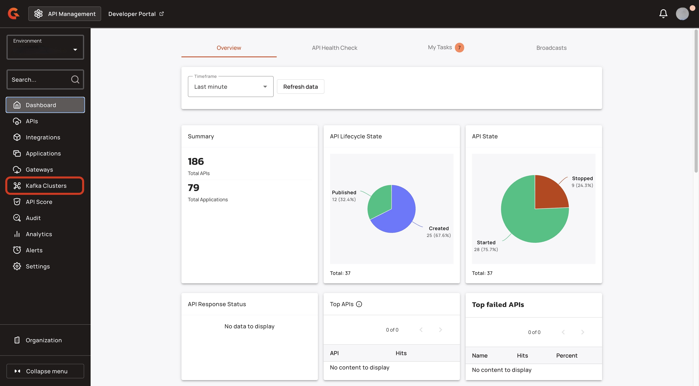
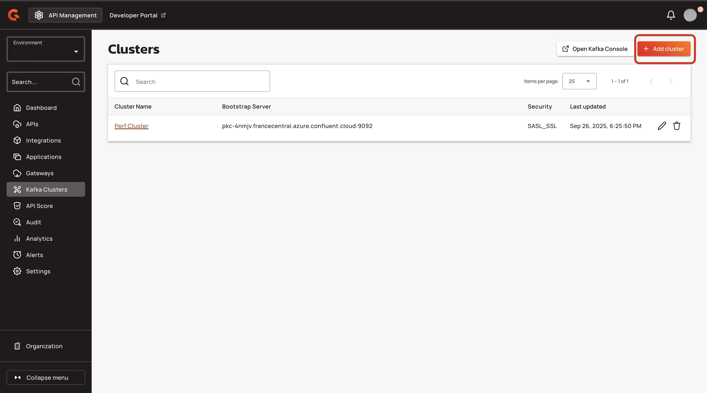
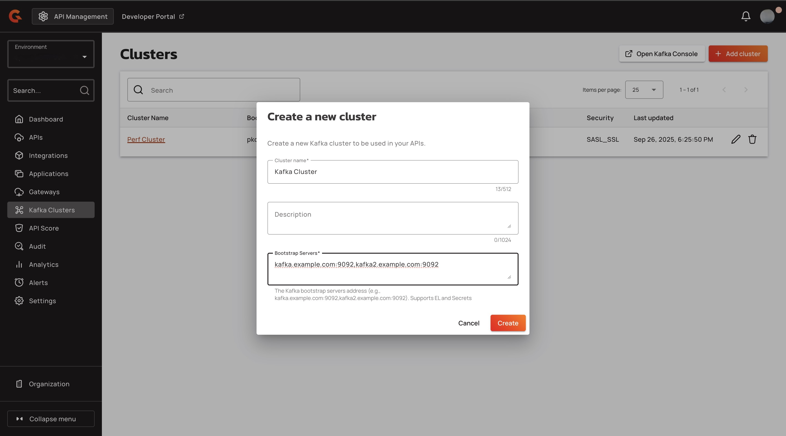
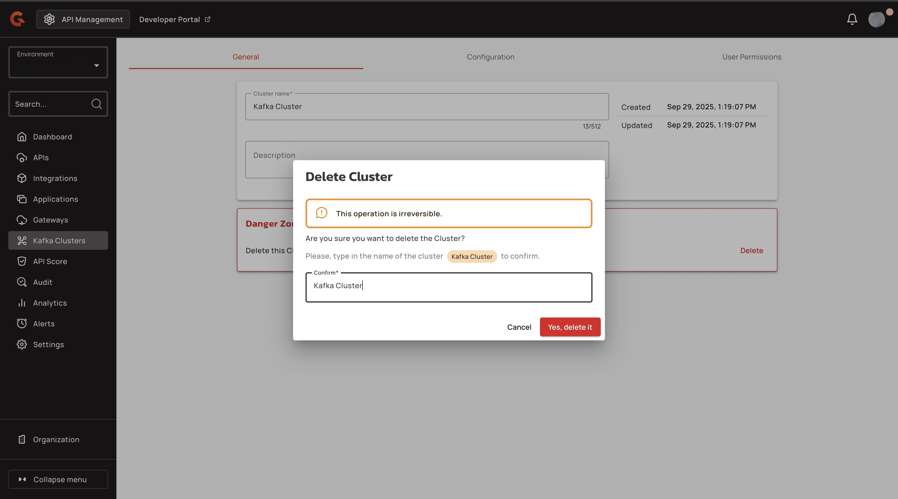
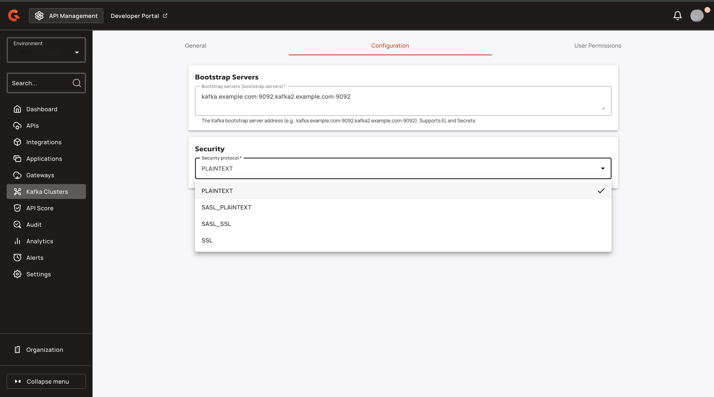

# 4.9: Create and Configure Kafka Clusters

## Overview

The Kafka UI is accessible from the APIM Console. It is the user interface from which you can create and manage Kafka clusters, configure cluster connection information, and manage user access and permissions.

## Prerequisites

* You must have an Enterprise License with the apim-cluster feature. For more information about Gravitee Enterprise Edition, see [enterprise-edition.md](../readme/enterprise-edition.md "mention").

## Create a Kafka Cluster

1. Sign in to the APIM Console.
2.  From the Dashboard, click **Kafka Cluster**.

    <figure><figcaption></figcaption></figure>
3.  Click **+ Add cluster**.

    <figure><figcaption></figcaption></figure>
4. In the **Create a new cluster** pop-up window, complete the following sub-steps:
   1. In the **Cluster name** field, enter a name for your cluster.
   2. (Optional) In the description field, enter a description for your cluster.
   3. In the **Bootstrap Servers** field, enter the bootstrap servers for your cluster.
   4.  Click **Create**. You are brought to the cluster's configuration screen.

       <figure><figcaption></figcaption></figure>

## Configure your Kafka cluster

The configuration for your Kafka cluster is divided into the following sections:

* General
* Configuration
* User Permissions

### General

In the **General** tab, you can perform the following actions:

* View or edit the name of the cluster.
* View or edit the description of the cluster.
* View the day and time that the cluster was created.
* View the day and time that the cluster was last updated.

To delete the cluster, complete the following steps:


Once you delete a cluster, this action cannot be undone.


1. Navigate to the **Danger Zone** section, and then click **Delete**.
2. In the **Delete Cluster** pop-up window, enter the name of the Kafka cluster.
3.  Click **Yes, delete it.**

    <figure><figcaption></figcaption></figure>

### Configuration

In the **Configuration** tab, you can configure the following elements of the cluster:

* The Bootstrap Servers.
* Security. By Default, the security protocol is set to **PLAINTEXT**. You can choose from the following security protocols for your cluster:
  * SASL\_PLAINTEXT
  * SASL\_SSL
  *   SSL

      <figure><figcaption></figcaption></figure>

### User permissions

In the **User Permissions** tab, you can configure the following elements related to users:

* Manage groups
* Transfer ownership
* Add members

#### Manage groups

To add a group to your Kafka cluster, complete the following steps:

1. From the **User Permissions** tab, click **Manage groups**.
2. In the **Manage groups** pop-up window, click the **Groups** drop-down menu, and then select the group or groups that you want to add to your cluster.
3.  Click **Save**.

    <figure><figcaption></figcaption></figure>

#### Transfer ownership

To transfer ownership of your Kafka cluster to another user, complete the following steps:


Once you transfer ownership of a cluster, this action cannot be undone.


1. From the **User Permissions** tab, click **Transfer ownership**.
2. Under **Choose a new Primary Owner**, click either **Cluster member** or **Other user**.
3. Specify the new primary owner.
   1. If you clicked **Cluster member**, use the drop-down menu to select another member of the cluster as the primary owner.
   2. If you clicked **Other user**, use the search field to find the user you want to set as the primary owner.
4. Use the **New role for current Primary Owner** drop-down menu to select either **User** or **Owner** as the new cluster role for the current primary owner.
5.  Click **Transfer**.

    <figure><figcaption></figcaption></figure>

#### Add members

To add members to your Kafka cluster, complete the following steps:

1. From the **User Permissions** tab, click **+ Add members**.
2. In the **Select users** pop-up window, search for users by name or email. You can add multiple users at a time.
3.  Click **Select**.

    <figure><figcaption></figcaption></figure>
