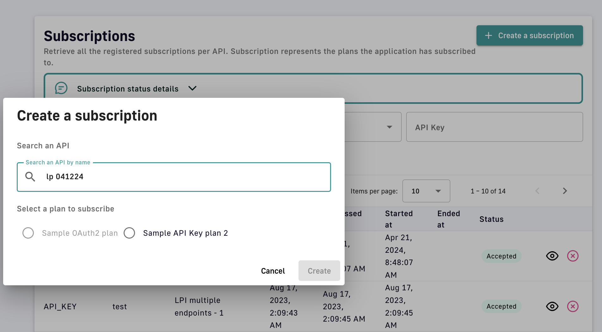

# Subscription Requests

## Overview

From a configuration perspective, a subscription is a successful contract between an API publisher and an API consumer. A subscription is created when an API consumer uses a registered application to make a subscription request to a published plan and an API publisher either manually or automatically validates the subscription.


**Keyless plan subscriptions**

APIs with Keyless plans do not require the API consumer to create an application or submit a subscription request because no authorization is required to access the backend API.


## Configure subscriptions

API consumers can subscribe to APIs with published plans during the application creation process, or after the application is created, through the APIM Console or Developer Portal.


Whether an application has an associated `client_id` depends on how it was configured. To subscribe to OAuth2 or JWT plans, the application must have a `client_id`.


To subscribe to an API via the APIM Console:

1. Log in to your APIM Console
2. Select **Applications** from the left nav
3. Select **Subscriptions** from the inner left nav
4.  Click the **+ Create a subscription** button

    <figure><figcaption>
Create a subscription
</figcaption></figure>
5. Search for the API you want to subscribe to. To be searchable the API consumer must have access to the API, i.e., the API must be public or the API consumer must be a member of it.
6.  Select the plan you would like to request a subscription to

    <figure><figcaption>
Select the subscription plan
</figcaption></figure>
7. Click **Create** to see the subscription details
