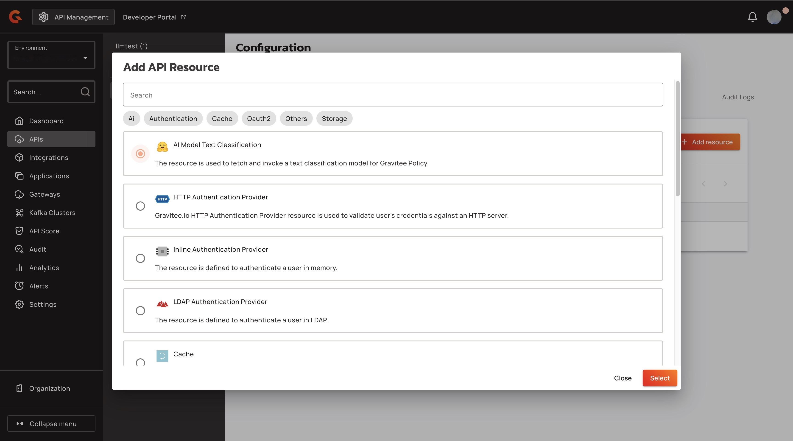

# Add the Guard Rails policy to your LLM proxy

## Overview&#x20;

You can use the Guard Rails policy to create an AI-powered text classification model to evaluate user prompts for potentially inappropriate or malicious content. It can detect a wide range of violations, such as profanity, sexually explicit language, harmful intent, and jailbreak prompt injections, which are adversarial inputs crafted to bypass AI safety mechanisms.


You might receive an error when you use this policy using the Gravitee's docker image. This happens because the default images are based on Alpine Linux, which does not support the ONNX Runtime. To resolve this issue, you must use the Gravitee's docker image based on Debian. To download the correct image, use `graviteeio/apim-gateway:4.8.0-debian`.


## Prerequisites&#x20;

* Access to one of the following LLM providers: OpenAI API, Gemini, or Bedrock, and an OpenAI-compatible LLM.
* A fully Self-Hosted Installation of APIM or a Hybrid Installation of APIM. For more information about installing APIM, see [self-hosted-installation-guides](../../self-hosted-installation-guides/ "mention") and [hybrid-installation-and-configuration-guides](../../hybrid-installation-and-configuration-guides/ "mention").
* An Enterprise License. For more information about obtaining an Enterprise license, see [enterprise-edition.md](../../readme/enterprise-edition.md "mention").
* Complete the steps in [proxy-your-llms.md](proxy-your-llms.md "mention").

## Add Guard Rails policy to your LLM proxy

To add the Guard Rails policy to your LLM proxy, complete the following steps:&#x20;

* [#create-a-resource-for-the-guard-rails-policy](add-the-guard-rails-policy-to-your-llm-proxy.md#create-a-resource-for-the-guard-rails-policy "mention")
* [#add-the-guard-rails-policy-to-your-llm-proxy](add-the-guard-rails-policy-to-your-llm-proxy.md#add-the-guard-rails-policy-to-your-llm-proxy "mention")

### Create a resource for the Guard Rails policy&#x20;

1.  From the **Dashboard**, click **APIs**. <br>

    <figure><figcaption></figcaption></figure>
2.  In the **APIs** screen, click your LLM proxy. <br>

    <figure><figcaption></figcaption></figure>
3.  From the **Configuration** screen, click **Resources**. <br>

    <figure><figcaption></figcaption></figure>
4.  Click **+ Add resource**. <br>

    <figure><figcaption></figcaption></figure>
5.  In the **Add API Resource** pop-up window, select **AI Model Text Classification** menu, and then click **Select**.<br>

    <figure><figcaption></figcaption></figure>
6. In the **Configure AI Model Text Classification resource**, complete the following sub-steps
   1. In the **Name** field, type the name of the resource.&#x20;
   2. In the **Select model** dropdown menu, select the resource model. For example, `minuva/MiniLMv2-toxic-jigsaw-onnx` .
   3.  Click **Save**. <br>

       <figure><figcaption></figcaption></figure>

#### Verification

The resource appears in the **Resources** section of the **Configuration** screen.

<figure><figcaption></figcaption></figure>

### Add the Guard Rails policy to your LLM proxy

1.  In the **API's menu**, click **Policies**.<br>

    <figure><figcaption></figcaption></figure>
2. Navigate to the **Flows** section, and select a flow that you want to add the Guard Rails policy to. For example, `POST/chat/completions`.
3.  In the **Request phase** section, click **the plus.**<br>

    <figure><figcaption></figcaption></figure>
4.  In the **Policies for Request phase** pop-up window, navigate to **AI - Prompt Guard Rails**, and then click **Select**.<br>

    <figure><figcaption></figcaption></figure>
5. In the **Policies for Request phase** pop-up window, complete the following sub-steps:&#x20;
   1. In the **Resource Name** field, type the name of the resource that you created in the [#create-a-resource-for-the-guard-rails-policy](add-the-guard-rails-policy-to-your-llm-proxy.md#create-a-resource-for-the-guard-rails-policy "mention")section.&#x20;
   2. In the **Prompt location** field, type the location of the prompt in the JSON request. For example, `{#request.jsonContent.messages[1].content}`.&#x20;
   3. In the **Content Checks** field, type the model labels in a delimited list. For example, for the `minuva/MiniLMv2-toxic-jigsaw-onnx` model, you can enter `identity_hate, insult, obscene, severe_toxic, threat, toxic` . For a list of labels that you can use for each supported model, go to [gravitee-resource-ai-model-text-classification](https://github.com/gravitee-io/gravitee-resource-ai-model-text-classification?tab=readme-ov-file).
6.  Click **Add policy**.<br>

    <figure><figcaption></figcaption></figure>
7.  Click **Save**.<br>

    <figure><figcaption></figcaption></figure>
8.  In the **This API is out of sync.** pop-up window, click **Deploy API**.<br>

    <figure><figcaption></figcaption></figure>
9. (Optional) In the **Deploy your API** pop-up window, type a deployment label to your deployment.&#x20;
10. In the **Deploy your API** pop-up window, click **Deploy**.<br>

    <figure><figcaption></figcaption></figure>

## Verification&#x20;

*   Call your LLM proxy with a `POST` request that contains a offensive or toxic message using the following command: <br>

    ```bash
    curl -X POST \
      https://<GATEWAY_URL>/<CONTEXT_PATH>/chat/completions \
      -H "Content-Type: application/json" \
      -d '{
        "messages": [
          {
            "role": "system",
            "content": "<SYSTEM_INSTRUCTIONS>"
          },
          {
            "role": "user",
            "content": "<USER_MESSAGE>"
          }
        ],
        "model": "<MODEL_ID>"
      }'

    ```

    * Replace `<GATEWAY_URL>` with your Gateway URL.
    * Replace `<CONTEXT_PATH>` with the context path for LLM Proxy. For example, llmtest.
    * Replace `<SYSTEM_INSTRUCTIONS>` with the instructions for the model's behavior.
    * Replace `<USER_MESSAGE>` with the user's input text.
    * Replace `<MODEL_ID>` with your model ID. For example, `llmtest:gpt-5-mini` .

You receive the following response:&#x20;

```bash
{"message":"AI prompt validation detected. Reason: [toxic]","http_status_code":400}
```
