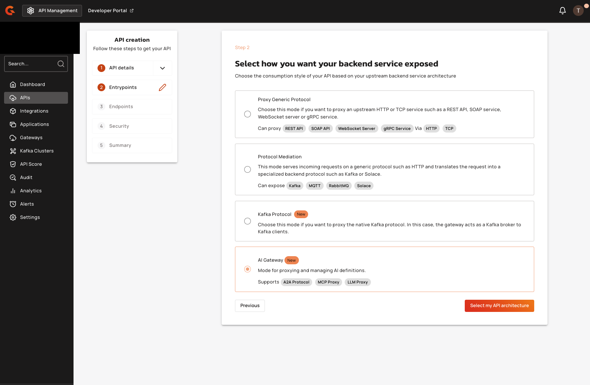
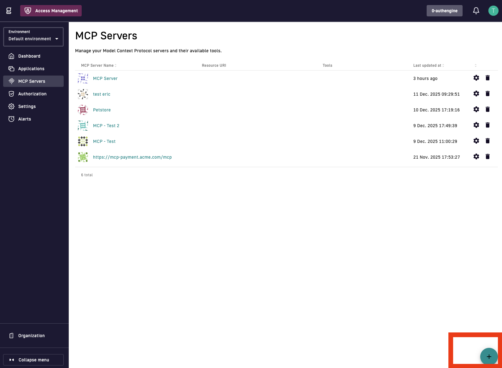
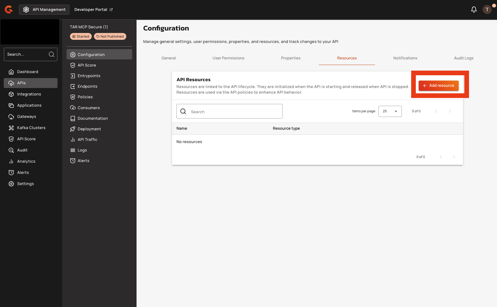
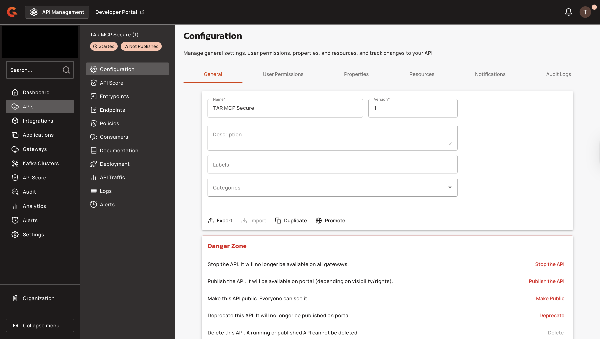

# Secure MCP Proxy with OAuth2

## Overview

This guide explains how to secure an MCP proxy API using Gravitee API Management (APIM) with an OAuth2 plan and Gravitee Access Management (AM).

### Why secure your MCP proxy?

Model Context Protocol (MCP) servers provide AI applications with access to tools, data sources, and system capabilities. In production environments, unsecured MCP endpoints create significant risks:

* **Unauthorized access:** Without authentication, any client can connect to your MCP server and invoke tools or access sensitive data.
* **Resource abuse:** Uncontrolled access can lead to excessive API calls, increased costs, and degraded performance.
* **Compliance violations:** Many industries require authenticated and auditable access to systems that handle sensitive data.
* **Multi-tenant exposure:** In shared environments, unsecured endpoints can expose one tenant's resources to another.

Securing your MCP proxy with OAuth2 ensures that only authenticated and authorized clients can access your MCP server through the Gravitee Gateway.

### Use cases

This solution is designed for the following scenarios:

* **Enterprise AI deployments:** Organizations deploying AI assistants that need controlled access to internal tools and data sources.
* **Multi-tenant platforms:** SaaS providers offering MCP-based integrations where each customer's access must be isolated and authenticated.
* **Regulated environments:** Industries such as finance, healthcare, or government, where audit trails and access controls are mandatory.
* **Development teams:** Teams using MCP-enabled IDEs (such as VSCode or Cursor) that require secure connections to shared development resources.

### How it works

Gravitee provides end-to-end security for MCP traffic by combining API Management and Access Management:

1. **Gravitee APIM** acts as a gateway, proxying requests to your MCP server and enforcing security policies.
2. **Gravitee AM** serves as the OAuth2 authorization server, handling client authentication and token issuance.
3. **Dynamic Client Registration (DCR)** allows MCP clients to register automatically with AM, simplifying client onboarding.
4. **OAuth2 plans** in APIM verify tokens and control access to the MCP proxy API.

When an MCP client connects, it authenticates through AM, receives an access token, and uses that token to communicate with the MCP server through the Gravitee Gateway.

### Components

This guide uses three separate Gravitee components:

* **MCP Server**: Your upstream Model Context Protocol server, the service being secured.&#x20;
* **Gravitee APIM**: The API gateway that proxies requests to your MCP server.&#x20;
* **Gravitee AM**: The OAuth2 authorization server that handles authentication.&#x20;
* **MCP Client:** The application that connects to your MCP server through the Gravitee Gateway. For example: VSCode, Cursor, or Native SDK. &#x20;

## Prerequisites&#x20;

* A Gravitee Access Management (AM) domain with configuration rights and the Gateway URL. For example: `https://am-gateway.example.com` For more information on getting started with AM Console, see [how to access AM Console. ](https://documentation.gravitee.io/am/getting-started/tutorial-getting-started-with-am/login-to-am-console)
* An MCP client that supports OAuth2 authentication with Dynamic Client Registration (DCR). For example, VSCode with MCP support.&#x20;
* An unsecured MCP server to proxy.&#x20;

## **Configuration Workflow**

To secure your MCP proxy, complete the following steps:

1. [#create-the-mcp-proxy-api-in-apim](secure-mcp-proxy-with-oauth2.md#create-the-mcp-proxy-api-in-apim "mention")
2. [#register-the-mcp-server-in-am](secure-mcp-proxy-with-oauth2.md#register-the-mcp-server-in-am "mention")
3. [#enable-dynamic-client-registration-in-am](secure-mcp-proxy-with-oauth2.md#enable-dynamic-client-registration-in-am "mention")
4. [#optional-enable-user-registration-in-am](secure-mcp-proxy-with-oauth2.md#optional-enable-user-registration-in-am "mention")
5. [#configure-the-0auth2-plan-in-apim](secure-mcp-proxy-with-oauth2.md#configure-the-0auth2-plan-in-apim "mention")
6. [#verification-1](secure-mcp-proxy-with-oauth2.md#verification-1 "mention")
7. [#connect-mcp-client](secure-mcp-proxy-with-oauth2.md#connect-mcp-client "mention")

## Create the MCP Proxy API in APIM

1.  From the **Dashboard**, click **APIs.**&#x20;

    <figure><figcaption></figcaption></figure>
2.  Click **+ Add API.**&#x20;

    <figure><figcaption></figcaption></figure>
3.  Click **Create V4 API.**&#x20;

    <figure><figcaption></figcaption></figure>
4. Configure the API. To configure the API, complete the following steps:
   1. **Name**: Enter a name. For example, `My MCP Secure API`
   2. **Version**: Enter a version. For example, `1`.
   3. **(Optional) Description**: Enter a description.
5.  Click **Validate my API details.** 

    <figure><figcaption></figcaption></figure>
6.  Select AI **Gateway**, and then click **Select my API architecture.**&#x20;

    <figure><figcaption></figcaption></figure>
7.  Select MCP Proxy, and then click **Select my entrypoints.**&#x20;

    <figure><figcaption></figcaption></figure>
8.  Enter the `context-path` . For example: `/my-mcp-secure-api` , and then click **Validate my entrypoints.**  

    <figure><figcaption></figcaption></figure>
9.  Enter your MCP server URL in the **MCP Server Backend URL field**. For example: [`http://localhost:3001/mcp`](http://localhost:3001/mcp) , and then click **Validate my endpoints.**  

    <figure><figcaption></figcaption></figure>
10. Click **Validate my plans.**

    <figure><figcaption></figcaption></figure>
11. Click **Save & Deploy API**.

    <figure><figcaption></figcaption></figure>

### Verification&#x20;

The API appears in your API management console with your configuration. 

<figure><figcaption></figcaption></figure>

## Register the MCP Server in AM&#x20;

1.  From the AM dashboard, click **MCP Servers.**&#x20;

    <figure><figcaption></figcaption></figure>
2.  Click the **+ (plus)** icon to create a new MCP server.

    <figure><figcaption></figcaption></figure>
3. Configure your MCP server. To configure your MCP server, complete the following steps:
   1. **Name:** Enter a name. For example, `My MCP Server`.
   2. **MCP Resource Identifier:** Enter the APIM API entrypoint URL from [Step 9 above](secure-mcp-proxy-with-oauth2.md#create-the-mcp-proxy-api-in-apim) in  [#create-the-mcp-proxy-api-in-apim](secure-mcp-proxy-with-oauth2.md#create-the-mcp-proxy-api-in-apim "mention") section. For example, `https://apim-gateway.example.com/mcp-proxy`.&#x20;
   3.  (Optional) **Description:** Enter a description. 

       <figure><figcaption></figcaption></figure>
   4. **Client ID:** Enter your Client ID
   5. **Client Secret:** Enter your Client secret.
4.  Click **Create.**

    <figure><figcaption></figcaption></figure>
5. In the **copy your client secret** pop-up box, copy the **Client Secret** and store the credentials securely.&#x20;


The Client Secret is displayed only once. Copy and store it securely before closing the pop-up box.&#x20;


<figure><figcaption></figcaption></figure>

## Enable Dynamic Client Registration in AM

Dynamic Client Registration (DCR) allows MCP clients to automatically register with AM without manual configuration.


If DCR is not enabled, manually create an Application in AM for the MCP client and configure the redirect URLs accordingly. Also, configure the MCP client with the Client ID and Client Secret. For more information, see [Applications](https://documentation.gravitee.io/am/guides/applications)


To enable DCR, complete the following steps:&#x20;

1.  In the AM Console, navigate to Settings.

    <figure><figcaption></figcaption></figure>
2.  &#x20;Click **Client Registration**.

    <figure><figcaption></figcaption></figure>
3.  Turn on the **Enable Dynamic Client Registration** toggle.

    <figure><figcaption></figcaption></figure>
4. Configure the settings. To configure settings, complete the following steps:
   * **Allow localhost redirect URIs:** (Optional) Enable for local development and testing.
   *   **Allow custom redirect URIs:** (Optional) Enable for production clients with custom redirect configurations.

       <figure><figcaption></figcaption></figure>
5. Click **Save**.&#x20;

## (Optional) Enable user registration in AM&#x20;

User registration allows new users to create accounts during authentication.


User registration is not required to secure an MCP API with OAuth2. Enable this feature only if you want to allow new users to self-register during authentication. This is useful for demonstration or development environments.


Complete the following steps to enable user registration:

1.  In the AM Console, navigate to **Settings** 

    <figure><figcaption></figcaption></figure>
2.  Click **Login**.

    <figure><figcaption></figcaption></figure>
3.  Turn on the **Enable user registration** toggle.

    <figure><figcaption></figcaption></figure>
4.  Click **Save**.

    <figure><figcaption></figcaption></figure>

## Configure the OAuth2 Plan in APIM

Now that you have configured AM, you need to add an OAuth2 resource in APIM. This resource establishes the connection between APIM and your OAuth2 provider (AM), enabling the Gateway to do the following:

* Verify and secure connections from MCP clients
* Allow the MCP Server to discover the API's security requirements through the WWW-Authenticate header

For more information on protected resource metadata discovery, see the [MCP specification](https://modelcontextprotocol.io/specification/draft/basic/authorization#protected-resource-metadata-discovery-requirements).

1.  In the API Console, navigate to your MCP proxy API.

    <figure><figcaption></figcaption></figure>
2.  Click **Resources**. 

    <figure><figcaption></figcaption></figure>
3.  Click **+ Add Resource**.

    <figure><figcaption></figcaption></figure>
4.  In the Add API Resource screen, click **Oauth2**, select **Gravitee.io AM Authorization Server**, and then click **Select**.

    <figure><figcaption></figcaption></figure>
5.  Configure the resource to establish the connection to your AM instance by providing the following values:

    * **Name:** Enter a name. For example, `AM OAuth2 Resource`
    * **Server URL:** Enter the AM Gateway URL. For example, `https://am-gateway.example.com`&#x20;
    * **Security Domain:** Enter the AM security domain name.
    * **Client ID:** Enter the Client ID from [Step 3](secure-mcp-proxy-with-oauth2.md#register-the-mcp-server-in-am) in the [#register-the-mcp-server-in-am](secure-mcp-proxy-with-oauth2.md#register-the-mcp-server-in-am "mention") section.&#x20;
    * **Client Secret:** Enter the Client Secret from [Step 3](secure-mcp-proxy-with-oauth2.md#register-the-mcp-server-in-am) in the [#register-the-mcp-server-in-am](secure-mcp-proxy-with-oauth2.md#register-the-mcp-server-in-am "mention")section.&#x20;

    <figure><figcaption></figcaption></figure>
6.  Click **Save**.

    <figure><figcaption></figcaption></figure>
7.  Click **Consumers** in the API menu.

    <figure><figcaption></figcaption></figure>
8.  Locate the Keyless plan, and then click the **close icon**. 

    

This operation is irreversible. You cannot reopen a closed plan. 

    <figure><figcaption></figcaption></figure>

*   In the confirmation pop-up box, enter the Keyless plan name, then click **Close this plan**.

    <figure><figcaption></figcaption></figure>

9.  Click **+ Add plan.**

    <figure><figcaption></figcaption></figure>
10. Select **OAuth2**. 

    <figure><figcaption></figcaption></figure>
11. Configure the plan by providing the following values:

    1. **Name**: Enter a name. For example, `OAuth2 Plan`
    2. **(Optional) Description**: Enter a description
    3. Click **Next**.

    <figure><figcaption></figcaption></figure>
12. Configure the OAuth2 settings:

    1.  **OAuth2 resource**: Select the AM resource you created in [step 5](secure-mcp-proxy-with-oauth2.md#configure-the-0auth2-plan-in-apim)

        

(Required for MCP clients only) Turn on the <strong>Add WWW-Authenticate header</strong> toggle.

    2. Click **Next**.

    <figure><figcaption></figcaption></figure>
13. Click **Create**.

    <figure><figcaption></figcaption></figure>
14. Click **Publish the plan**.

    <figure><figcaption></figcaption></figure>
15. Click the **Deploy API** pop-up box.&#x20;

    <figure><figcaption></figcaption></figure>

The MCP client uses the OAuth2 server configured in APIM upon connection.

## Verification&#x20;

Verify your configuration in both the APIM Console and AM Console.



### APIM Console

1.  Navigate to your MCP proxy API. 

    <figure><figcaption></figcaption></figure>
2.  Click **Consumers**, and then verify the OAuth2 plan is published.&#x20;

    <figure><figcaption></figcaption></figure>
3.  Click **Deployments** and confirm the latest deployment is successful and in use.&#x20;

    <figure><figcaption></figcaption></figure>



1.  Navigate to your AM domain. 

    <figure><figcaption></figcaption></figure>
2.  Click **MCP Servers**.

    <figure><figcaption></figcaption></figure>
3.  &#x20;Verify your MCP server resource is configured. 

    <figure><figcaption></figcaption></figure>



### Verify the OAuth2 Protection&#x20;

Replace `<apim-gateway-url>` with your APIM Gateway URL and `<context-path>` with your configured context path, then run the following command:

<pre class="language-bash"><code class="lang-bash"><strong>curl -i -X GET https://&#x3C;apim-gateway-url>&#x3C;context-path>
</strong></code></pre>

The output shows the expected response:

* HTTP 401 Unauthorized
* `WWW-Authenticate` header present in the response

This confirms the API requires OAuth2 authentication.&#x20;

## Connect MCP Client

Your MCP proxy API is secured with OAuth2. To connect an MCP client to your secured API:

1. Configure your MCP client with the APIM Gateway URL and context path
2. The client handles OAuth2 authentication automatically through (DCR) Dynamic Client Registration.&#x20;

For client-specific configuration instructions, refer to your MCP client's documentation. For example, For VSCode MCP, see the [MCP servers in VS code documentation](https://code.visualstudio.com/docs/copilot/customization/mcp-servers) , For Native language SDKs see the [MCP SDK documentation](https://modelcontextprotocol.io/docs/develop/connect-remote-servers)

The MCP client uses the OAuth2 server configured in APIM to authenticate upon connection.
