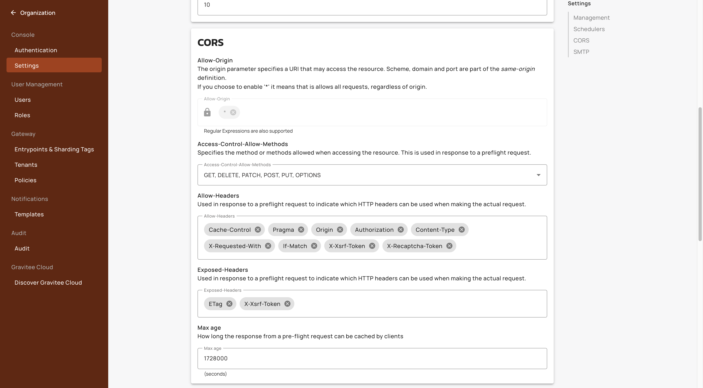

# V4 API analytics dashboard

## Overview


This dashboard displays metrics for v4 proxy APIs only.&#x20;


The V4 API analytics dashboard provides you with clear visibility into the API performance and traffic patterns for all of your V4 APIs at the environment level. These metrics include request volumes, error rates, response times, and application usage.&#x20;

## Access the V4 Dashboard

1.  From the **Dashboard**, click **Analytics**. 

    <figure><figcaption></figcaption></figure>
2.  Click the **V4 Dashboard** tab. 

    <figure><figcaption></figcaption></figure>

## Dashboard metrics

You can view the following metrics for your V4 APIs:

* [#key-metrics](v4-api-analytics-dashboard.md#key-metrics "mention")
* [#tables-and-graphs](v4-api-analytics-dashboard.md#tables-and-graphs "mention")

### Key Metrics

* **Requests**. This metric is the total number of calls made to your v4 APIs.
* **Error Rate.** This metric is the total number of errors for your v4 APIs displayed in a percentage.
* **Average latency**. This metric is the average latency of your Gateway displayed in milliseconds.&#x20;
*   **Average response time of the Gateway.** This is the average response time of the Gateway in milliseconds. 

    <figure><figcaption></figcaption></figure>

### Tables and graphs

*   **HTTP Statuses.** This graph shows the number of each HTTP status returned by the Gateway. 

    <figure><figcaption></figcaption></figure>
*   **Response time**. This graph shows the average response time of the endpoint and the Gateway. 

    <figure><figcaption></figcaption></figure>
*   **Response Statuses.** This graph shows the number of response statuses over a period of time. 

    <figure><figcaption></figcaption></figure>
*   **Top 5 Applications**. This graph shows the top five applications by HTTP requests. 

    <figure><figcaption></figcaption></figure>
